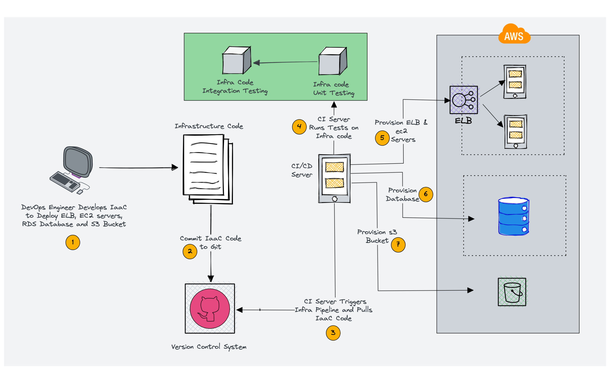
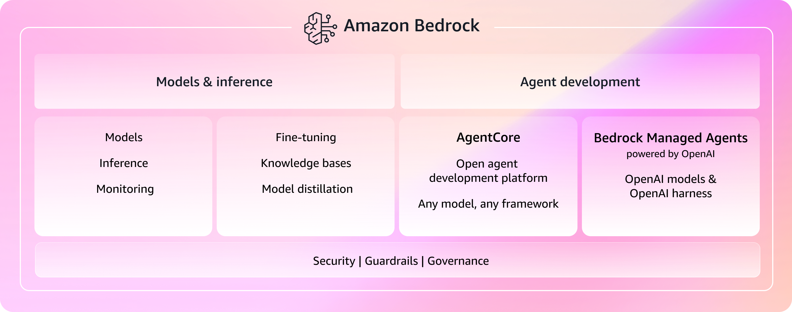

---
---
# Module 0: Setup, orientation and intro

**Duration:** ~20 minutes

## What you'll learn

- What Infrastructure as Code, Pulumi, Pulumi Cloud, Amazon Bedrock, and AgentCore are
- What the Strands SDK and Pulumi ESC are, and how all the pieces connect
- How to store AWS credentials securely in a Pulumi ESC environment

## Intro: the basics in five minutes

New to any of these tools? Here's the speed-run. The [Glossary](glossary.md) lists every acronym used in the workshop if you'd rather skim definitions.

**[Infrastructure as Code](https://www.pulumi.com/what-is/what-is-infrastructure-as-code/)** is the practice of defining your cloud resources, like servers, databases, networks, and IAM (Identity and Access Management) roles, in source files instead of clicking through a web console. You write the desired state in code, commit it to git, and a tool reconciles your cloud account to match. The payoff: infrastructure you can review in a pull request and rebuild the same way every time.



**[Pulumi](https://www.pulumi.com/)** is the Infrastructure as Code tool we use here. The twist: you write infrastructure in real programming languages like TypeScript, Python, or Go instead of a bespoke config format. That means loops, functions, types, and autocomplete from your editor. You can pick either TypeScript or Python for this workshop; the solution folders have both. You describe what you want (an S3 (Simple Storage Service) bucket, an ECR (Elastic Container Registry) repository, an AgentCore runtime), run `pulumi up`, and Pulumi works out what to create, update, or delete to get there.

**[Pulumi Cloud](https://app.pulumi.com)** is the managed backend behind the [Pulumi CLI](https://www.pulumi.com/docs/install/) (command-line interface). It stores the *state* of your infrastructure (the record of what Pulumi has deployed), shows deployment history, and hosts **[Pulumi ESC](https://www.pulumi.com/docs/esc/)** (Environments, Secrets, and Configuration), a centralized store for secrets and config. You'll use ESC to hold your AWS credentials encrypted so they never live in a `.env` file or your shell history. A free account is all you need.

**[Amazon Bedrock](https://aws.amazon.com/bedrock/)** is AWS's managed service for foundation models. A single API (application programming interface) reaches a range of large language models (LLMs) such as Anthropic Claude and Amazon Nova, so you're not provisioning GPUs or hosting models yourself. Your agents call Bedrock to do the actual "thinking."



**[Amazon Bedrock AgentCore](https://aws.amazon.com/bedrock/agentcore/)** is the newer, agent-focused layer on top. It's a managed runtime for AI agents: you hand it your agent code - packaged as a `.zip` file or a container image - and it handles hosting, scaling, and invocation. Think "Lambda for agents": no servers to manage, just deploy your code and call it. Throughout the workshop, Pulumi provisions the AgentCore runtimes (and everything around them), and your agents run on AgentCore while calling Bedrock models.


That's the whole stack: **Pulumi** (in TypeScript or Python) deploys infrastructure, **Pulumi Cloud + ESC** store state and secrets, and your **[Strands](https://strandsagents.com/)**-based agents run on **AgentCore** and call **Bedrock** models. The next section shows how they wire together.

## The big picture

The intro covered the tools on their own. Here's how they fit together when you actually deploy.

One piece the intro skipped: the **[Strands SDK](https://strandsagents.com/)** (software development kit), the Python framework you'll write agents with. You define a system prompt, attach tools, and Strands runs the conversation loop with the LLM for you. Its built-in `BedrockAgentCoreApp` class wraps your agent as an HTTP (Hypertext Transfer Protocol) service that AgentCore Runtime knows how to invoke. That's the bridge between the code you write and the runtime Pulumi provisions.

Here's the flow:

```
You write agent code (Python/Strands)
    ↓
Run it locally to see it work (Module 1)
    ↓
Pulumi packages your code and deploys the infrastructure (Module 2)
    ↓
ESC provides AWS credentials (encrypted secrets)
    ↓
AgentCore Runtime runs your agent
```

## Step 1: Log into Pulumi Cloud

If you haven't already, create a free Pulumi account.

### Codespaces Users and Optionally Local Terminal Users

Go to the Pulumi Cloud UI and click on your user account.

Select `Personal access tokens` and create an access token.

Then log in from the terminal:

```bash
export PULUMI_ACCESS_TOKEN=pul-xxxxxx
pulumi login
```

Verify it worked:

```bash
pulumi whoami
```

You should see your username.

### Local Terminal Users

Log in from the terminal:

```bash
pulumi login
```

This opens a browser window. Sign in (or create an account), then return to the terminal.

Verify it worked:

```bash
pulumi whoami
```

You should see your username.

## Tips for success

1. **Follow the modules sequentially** - each one builds on concepts from the previous module
2. **Core path vs. stretch goal** - Modules 0-3 and 5 are the core path that fits the workshop slot. Module 4 is a stretch goal for anyone who finishes early. It's its own Pulumi stack, so skipping it is fine; pick it up later
3. **Complete the verification steps** at the end of each section to catch issues early
4. **Ask your instructors for help** - we're here to keep you moving
5. **Experiment** - once a module works, try modifying the agent prompt or tools to see what happens

## Getting started

### Option 1: GitHub Codespaces (recommended)

Click the badge below to launch a pre-configured development environment:

[](https://codespaces.new/dirien/pulumi-ai-aws-bedrock-workshop?quickstart=1)

Wait for the devcontainer to build (takes a couple of minutes). All tools (Pulumi CLI, Node.js, Python, uv) are pre-installed.

### Option 2: Local development

1. Clone the repository:

   ```bash
   git clone https://github.com/dirien/pulumi-ai-aws-bedrock-workshop.git
   cd pulumi-ai-aws-bedrock-workshop
   ```

2. Install the [Pulumi CLI](https://www.pulumi.com/docs/install/)
3. Install Node.js 18+ and Python 3.11+
4. Install [uv](https://docs.astral.sh/uv/) for Python dependency management
5. Install test dependencies: `pip install boto3`
6. Run `pulumi login` to authenticate with Pulumi Cloud

## Step 2: Create your ESC environment for AWS credentials

Your instructor has set up a credential sharing page with the AWS credentials for this workshop. You will get the URL from your instructor.

Open the credential page in your browser and copy the **AWS Access Key ID** and **AWS Secret Access Key** values.

Now create a Pulumi ESC environment to store these credentials securely:

1. Navigate to [Pulumi Cloud](https://app.pulumi.com) > **Environments** in the left sidebar
2. Click **Create environment**
3. Set the project name to `aws-bedrock-workshop` and the environment name to `dev`
4. Paste the following YAML configuration, replacing the placeholder values with the credentials you copied:

   ```yaml
   values:
     aws-creds:
       accessKeyId:
         fn::secret: <YOUR_AWS_ACCESS_KEY_ID>
       secretAccessKey:
         fn::secret: <YOUR_AWS_SECRET_ACCESS_KEY>
     environmentVariables:
       AWS_ACCESS_KEY_ID: ${aws-creds.accessKeyId}
       AWS_SECRET_ACCESS_KEY: ${aws-creds.secretAccessKey}
     pulumiConfig:
       aws:region: us-east-1
   ```

5. Click **Save**

The `fn::secret` function encrypts each credential at rest in Pulumi Cloud. When you run `pulumi up`, ESC decrypts them and injects them as environment variables automatically.

Verify the environment works:

```bash
pulumi env open aws-bedrock-workshop/dev
```

You should see the AWS credentials and the `aws:region` config. If you see an error, double-check that the project name is `aws-bedrock-workshop` and the environment name is `dev`.

## Step 3: Verify your setup

Let's make sure everything works end-to-end. Create a throwaway Pulumi project:

<div class="lang-tabs" markdown="1">

<div class="lang-tab" data-lang="typescript" markdown="1">

```bash
mkdir /tmp/verify-setup && cd /tmp/verify-setup
pulumi new aws-typescript --name verify-setup --yes
```

</div>

<div class="lang-tab" data-lang="python" markdown="1">

```bash
mkdir /tmp/verify-setup && cd /tmp/verify-setup
pulumi new aws-python --name verify-setup --yes
```

</div>

</div>

Add the ESC environment reference to `Pulumi.dev.yaml`:

```bash
cat >> Pulumi.dev.yaml <<'EOF'
environment:
  - aws-bedrock-workshop/dev
EOF
```

Deploy it:

```bash
pulumi up
```

Pulumi shows you the plan, asks for confirmation, then creates the resources:

```text
Previewing update (dev)

View in Browser (Ctrl+O): https://app.pulumi.com/dirie/verify-setup/dev/previews/23db9393-5f12-4953-85b7-e81b647446cb

     Type                 Name              Plan
 +   pulumi:pulumi:Stack  verify-setup-dev  create
 +   └─ aws:s3:Bucket     my-bucket         create

Outputs:
    bucketName: [unknown]

Resources:
    + 2 to create

Do you want to perform this update? yes
Updating (dev)

View in Browser (Ctrl+O): https://app.pulumi.com/dirie/verify-setup/dev/updates/1

     Type                 Name              Status
 +   pulumi:pulumi:Stack  verify-setup-dev  created (7s)
 +   └─ aws:s3:Bucket     my-bucket         created (2s)

Outputs:
    bucketName: "my-bucket-697106d"

Resources:
    + 2 created

Duration: 9s
```

That one command exercised the whole chain: Pulumi pulled your AWS credentials from
the ESC environment, called AWS, and created a real S3 bucket, then printed the
bucket's generated name as a stack output. If you got that far, your setup works and
you're ready for Module 1.

Now tear the test project back down:

```bash
# Destroy the resources
pulumi destroy --yes
# Delete the stack (and state file)
pulumi stack rm
# Clean up the directory
cd -
rm -rf /tmp/verify-setup
```

## Step 4: Pick your unique identifier

From Module 2 onward, each module creates AWS resources (IAM roles, S3 buckets, AgentCore runtimes) that need unique names within the AWS account. If multiple participants share the same account and use the same default names, you'll get conflicts. (Module 1 runs entirely on your laptop, so it creates nothing.)

Pick a short identifier now - your initials, a nickname, anything 2-5 characters. You'll use it from Module 2 onward as your `stackName` prefix.

For example, if your identifier is `ed`:

```
Module 2: agentcore-basic-ed
Module 3: agentcore-multi-ed
Module 4: agentcore-weather-ed   (stretch goal)
```

You set this at the start of each module with:

```bash
pulumi config set stackName agentcore-basic-ed
```

Keep this identifier consistent across all modules. Write it down.

## Step 5: Familiarize yourself with the workshop structure

Each module has a markdown file with instructions (what you're reading now) and a solution folder with the complete working code if you get stuck. From Module 2 onward the solutions come in both languages (e.g., `02-solution/typescript/` and `02-solution/python/`).

The core path runs 0 → 1 → 2 → 3 → 5. You start by running an agent locally (Module 1), deploy it to AgentCore (Module 2), and by the end you'll have an orchestrator that delegates to a specialist agent (Module 3). Module 4 is a stretch goal for anyone who finishes early: a multi-tool weather agent with Browser, Code Interpreter, and Memory.

## What you learned

- Infrastructure as Code defines cloud resources in source files; Pulumi does it in real languages (TypeScript or Python here)
- Pulumi Cloud stores your stack state and hosts ESC; Bedrock serves the LLMs and AgentCore runs your agent containers
- Strands SDK is the Python framework for writing agent logic
- Pulumi ESC stores AWS credentials encrypted and injects them into every deployment automatically
- Your local setup can authenticate with AWS and deploy real resources with `pulumi up`

Next up: [Module 1: Hello, agent! Run locally](01-hello-agent.md)
