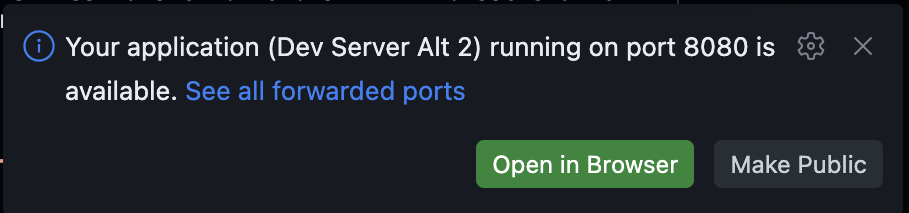

---
---
# Module 1: Hello, agent! Run locally

**Duration:** ~30 minutes

## What you'll learn

- How to write a minimal Strands agent
- What the `BedrockAgentCoreApp` wrapper does and why it matters
- How to run an agent on your own machine and call it over HTTP
- The request contract (`/invocations` and `/ping`) that AgentCore expects

## Why start local?

In the next module you'll deploy an agent to AWS. Deploying something you've never
seen run is a bad time: when it breaks, you can't tell whether the bug is in your
code or your infrastructure.

So we start small. Here you write an agent and run it on your laptop. No Pulumi, no
AWS resources, nothing to tear down. Once you've watched it answer a question
locally, Module 2 is just "ship this exact file to the cloud."

## Key concept: the agent is an HTTP service

A Strands agent is plain Python. To run it on AgentCore, you wrap it with
`BedrockAgentCoreApp`, which turns your agent into a small HTTP service with two
routes:

- `POST /invocations` - run the agent on a request payload
- `GET /ping` - a health check AgentCore uses to know your agent is alive

The important part: this is the same wrapper locally and in the cloud. Run the file
on your laptop and it serves those two routes on `localhost:8080`. When AgentCore
runs it later, it calls the same routes. Your agent code doesn't change between
"local" and "deployed" - only where it runs does.

## Step 1: Create the agent

Make a working directory and an agent file:

```bash
mkdir 01-hello-agent && cd 01-hello-agent
```

Create a `basic_agent.py` file in your IDE and copy the content in:

```python
from strands import Agent
from bedrock_agentcore.runtime import BedrockAgentCoreApp

app = BedrockAgentCoreApp()


def create_basic_agent() -> Agent:
    """Create a basic agent with a simple system prompt."""
    system_prompt = "You are a helpful assistant. Answer questions clearly and concisely."
    return Agent(system_prompt=system_prompt, name="BasicAgent")


@app.entrypoint
async def invoke(payload=None):
    """Entrypoint AgentCore calls for every invocation."""
    try:
        query = (
            payload.get("prompt", "Hello, how are you?")
            if payload
            else "Hello, how are you?"
        )

        agent = create_basic_agent()
        response = agent(query)

        return {"status": "success", "response": response.message["content"][0]["text"]}

    except Exception as e:
        return {"status": "error", "error": str(e)}


if __name__ == "__main__":
    app.run()
```

Three things to notice:

- `BedrockAgentCoreApp()` is the wrapper that exposes `/invocations` and `/ping`.
- `@app.entrypoint` marks the function that runs on each request. The payload is a
  dict - here we read a `"prompt"` key.
- `app.run()` starts the local HTTP server when you run the file directly.

## Step 2: Install dependencies

Create a `requirements.txt` file in your IDE and copy the content in:

```text
strands-agents
bedrock-agentcore
boto3
```

Install them (a virtual environment keeps things tidy):

```bash
python -m venv .venv && source .venv/bin/activate
pip install -r requirements.txt
```

## Step 3: Run the agent

The agent needs AWS credentials to call Bedrock. Inject them from your ESC
environment so you don't have to export anything by hand:

```bash
pulumi env run aws-bedrock-workshop/dev -- python basic_agent.py
```

You should see the server start up and begin listening on `http://localhost:8080`.
Leave it running. The terminal will look idle. That's the server waiting for
requests, not a hang.

In GitHub Codespaces you'll also get a popup saying port 8080 is available:



Click **Make Public** on that popup. Don't bother opening it in a browser, though.
The agent only answers on `POST /invocations` and `GET /ping`, so the root URL shows
nothing. You'll call it from a second terminal in the next step.

## Step 4: Call it

Open a second terminal and send the agent a prompt. Piping through `jq` keeps the
JSON readable instead of one long line (it's pre-installed in Codespaces; locally,
drop the `| jq` if you don't have it):

```bash
curl -s -X POST http://localhost:8080/invocations \
  -H 'Content-Type: application/json' \
  -d '{"prompt": "What is Amazon Bedrock AgentCore?"}' | jq
```

You'll get back a JSON object like:

```json
{
  "status": "success",
  "response": "Amazon Bedrock AgentCore is ..."
}
```

That answer came from a real Bedrock model, called by your agent, on your own
machine.

Check the health endpoint too - it's the same one AgentCore polls:

```bash
curl -s http://localhost:8080/ping | jq
```

When you're done, stop the server with `Ctrl+C` in the first terminal.

## Try it yourself

- **Change the personality.** Edit `system_prompt` to make the agent a pirate, a
  haiku poet, or a terse senior engineer. Restart and curl it again.
- **Send different prompts.** Swap the `"prompt"` value in the curl command.
- **Break it on purpose.** Stop the server and curl `/invocations` again - watch the
  connection refuse. Worth seeing now: when a deployed agent goes unreachable later,
  it usually means the runtime isn't healthy.

## What you learned

- A Strands agent is ordinary Python; `BedrockAgentCoreApp` wraps it as an HTTP service
- That service exposes `POST /invocations` and `GET /ping` - locally and in the cloud
- You ran an agent end to end without provisioning a single AWS resource
- Even a "local" agent calls Bedrock, so it needs AWS credentials (provided via ESC)

Next up: [Module 2: Your first agent on AgentCore](02-your-first-agent.md). You'll
take this exact `basic_agent.py` and deploy it.
