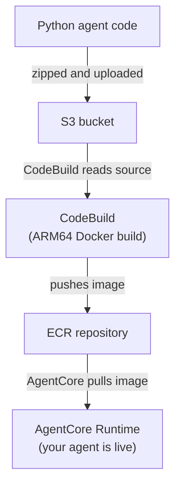

---
---
# Module 1: Your first agent on AgentCore

**Duration:** ~30 minutes

## What you'll learn

- How the AgentCore deployment pipeline works (source code to running agent)
- How to write a Strands agent in Python
- How to define the infrastructure in Pulumi (TypeScript or Python)
- How to deploy, invoke, and tear down an agent

## Key concepts

Before you start coding, let's cover the two core technologies this module uses.

### Amazon Bedrock AgentCore

[Amazon Bedrock AgentCore](https://docs.aws.amazon.com/bedrock-agentcore/latest/devguide/what-is-bedrock-agentcore.html) is a managed service for hosting, securing, and scaling AI agents. Instead of running agents on EC2 instances or ECS tasks and managing scaling yourself, you package your agent as a Docker container and hand it to AgentCore. It handles the rest: pulling your image, running it on ARM64 infrastructure, routing invocations, and managing the lifecycle.

An [AgentCore Runtime](https://docs.aws.amazon.com/bedrock-agentcore/latest/devguide/agents-tools-runtime.html) is the core resource. It's a containerized service that AgentCore runs for you. You point it at a Docker image in ECR, give it an IAM execution role, and AgentCore takes care of networking, health checks, and invocation routing.

### Strands Agents SDK

[Strands Agents](https://strandsagents.com/) is an open-source Python SDK for building AI agents. It provides a simple programming model: you create an `Agent` with a system prompt and optional tools, then call it with a user query. Under the hood, it manages the LLM conversation loop, tool calling, and response handling.

The [BedrockAgentCoreApp](https://github.com/strands-agents/sdk-python) wrapper from the `bedrock-agentcore` package turns your Strands agent into an HTTP service that AgentCore knows how to invoke. The `@app.entrypoint` decorator marks the function that receives incoming requests.

- [Strands Agents SDK on GitHub](https://github.com/strands-agents/sdk-python)
- [Amazon Bedrock AgentCore product page](https://aws.amazon.com/bedrock/agentcore/)
- [AgentCore Developer Guide](https://docs.aws.amazon.com/bedrock-agentcore/latest/devguide/what-is-bedrock-agentcore.html)

## How agents get deployed on AgentCore

Before you start coding, it helps to understand what actually happens when you run `pulumi up` for an agent. There are several moving parts, and they run in a specific order.

Here's the pipeline:



Why not just build the Docker image locally and push it? Two reasons. First, AgentCore runs ARM64 containers, and building ARM64 images on an x86 laptop is slow and finicky. CodeBuild runs on native ARM64 hardware, so the build is fast and reliable. Second, CodeBuild runs inside your AWS account with the right permissions - no need to configure Docker credentials locally.

The Lambda function in the middle is a glue piece. Pulumi triggers it during deployment, and it starts the CodeBuild job and polls until the build finishes. This way Pulumi waits for the image to be ready before creating the AgentCore Runtime.

The agent execution IAM role is the identity your agent runs under. It has a trust relationship with `bedrock-agentcore.amazonaws.com`, which means only AgentCore can assume it. The role gets permissions for ECR (pulling images), CloudWatch (logging), X-Ray (tracing), and Bedrock (calling LLMs).

## Step 1: Create a new Pulumi project

<div class="lang-tabs" markdown="1">

<div class="lang-tab" data-lang="typescript" markdown="1">

```bash
mkdir 01-my-first-agent && cd 01-my-first-agent
pulumi new aws-typescript --name my-first-agent --yes
```

</div>

<div class="lang-tab" data-lang="python" markdown="1">

```bash
mkdir 01-my-first-agent && cd 01-my-first-agent
pulumi new aws-python --name my-first-agent --runtime-options toolchain=uv --yes
```

</div>

</div>

Add the ESC environment for AWS credentials. Open `Pulumi.dev.yaml` and set:

```yaml
environment:
  - aws-bedrock-workshop/dev
```

The `pulumi new` template already includes the AWS provider. Pin it to the version this workshop uses:

<div class="lang-tabs" markdown="1">

<div class="lang-tab" data-lang="typescript" markdown="1">

```bash
npm install @pulumi/aws@7.23.0
```

</div>

<div class="lang-tab" data-lang="python" markdown="1">

```bash
uv add pulumi-aws>=7.23.0
```

</div>

</div>

Set your unique stack name (replace `<id>` with the identifier you picked in Module 0):

```bash
pulumi config set stackName agentcore-basic-<id>
```

## Step 2: Write the agent code

Create the agent source directory:

```bash
mkdir -p agent-code
```

Create `agent-code/basic_agent.py`:

```python
from strands import Agent
from bedrock_agentcore.runtime import BedrockAgentCoreApp

app = BedrockAgentCoreApp()


def create_basic_agent() -> Agent:
    """Create a basic agent with simple functionality"""
    system_prompt = (
        """You are a helpful assistant. Answer questions clearly and concisely."""
    )

    return Agent(system_prompt=system_prompt, name="BasicAgent")


@app.entrypoint
async def invoke(payload=None):
    """Main entrypoint for the agent"""
    try:
        # Get the query from payload
        query = (
            payload.get("prompt", "Hello, how are you?")
            if payload
            else "Hello, how are you?"
        )

        # Create and use the agent
        agent = create_basic_agent()
        response = agent(query)

        return {"status": "success", "response": response.message["content"][0]["text"]}

    except Exception as e:
        return {"status": "error", "error": str(e)}


if __name__ == "__main__":
    app.run()
```

A few things to notice here. `BedrockAgentCoreApp` wraps your agent as an HTTP service that AgentCore knows how to call. The `@app.entrypoint` decorator marks the function that gets called when someone invokes your agent. The payload comes in as a dict with a `"prompt"` key.

Create `agent-code/requirements.txt`:

```text
strands-agents
boto3
bedrock-agentcore
```

Create `agent-code/Dockerfile`:

```dockerfile
FROM public.ecr.aws/docker/library/python:3.11-slim

WORKDIR /app

COPY requirements.txt requirements.txt
RUN pip install --no-cache-dir -r requirements.txt && \
    pip install --no-cache-dir aws-opentelemetry-distro==0.10.1

# Create non-root user
RUN useradd -m -u 1000 bedrock_agentcore
USER bedrock_agentcore

EXPOSE 8080
EXPOSE 8000

COPY . .

HEALTHCHECK --interval=30s --timeout=3s --start-period=5s --retries=3 \
  CMD curl -f http://localhost:8080/ping || exit 1

CMD ["opentelemetry-instrument", "python", "-m", "basic_agent"]
```

The container runs as a non-root user (`bedrock_agentcore`) because AgentCore requires it. Port 8080 is the main agent endpoint and 8000 is for health checks. The OpenTelemetry instrumentation gives you free distributed tracing.

## Step 3: Create the build trigger Lambda

This Lambda function starts a CodeBuild job and polls until it completes. Pulumi calls it during deployment.

```bash
mkdir -p lambda/build-trigger
```

Create `lambda/build-trigger/index.py`:

```python
import json
import logging
import time

import boto3


LOGGER = logging.getLogger()
LOGGER.setLevel(logging.INFO)


def handler(event, _context):
    LOGGER.info("Received event: %s", json.dumps(event))

    project_name = event["projectName"]
    region = event.get("region")
    poll_interval_seconds = int(event.get("pollIntervalSeconds", 15))

    codebuild = boto3.client("codebuild", region_name=region)
    response = codebuild.start_build(projectName=project_name)
    build_id = response["build"]["id"]
    LOGGER.info("Started build %s for project %s", build_id, project_name)

    while True:
        build_response = codebuild.batch_get_builds(ids=[build_id])
        build = build_response["builds"][0]
        status = build["buildStatus"]

        if status == "SUCCEEDED":
            LOGGER.info("Build %s succeeded", build_id)
            return {
                "buildId": build_id,
                "status": status,
                "imageDigest": build.get("resolvedSourceVersion"),
            }

        if status in {"FAILED", "FAULT", "STOPPED", "TIMED_OUT"}:
            LOGGER.error("Build %s failed with status %s", build_id, status)
            raise RuntimeError(f"CodeBuild {build_id} failed with status {status}")

        LOGGER.info("Build %s status: %s", build_id, status)
        time.sleep(poll_interval_seconds)
```

## Step 4: Create the buildspec

Create `01-my-first-agent/buildspec.yml` in the project root:

```yaml
version: 0.2

phases:
  pre_build:
    commands:
      - echo Source code already extracted by CodeBuild
      - cd $CODEBUILD_SRC_DIR
      - echo Logging in to Amazon ECR
      - aws ecr get-login-password --region $AWS_DEFAULT_REGION | docker login --username AWS --password-stdin $AWS_ACCOUNT_ID.dkr.ecr.$AWS_DEFAULT_REGION.amazonaws.com

  build:
    commands:
      - echo Build started on `date`
      - echo Building the Docker image for the basic agent ARM64 image
      - docker build -t $IMAGE_REPO_NAME:$IMAGE_TAG .
      - docker tag $IMAGE_REPO_NAME:$IMAGE_TAG $AWS_ACCOUNT_ID.dkr.ecr.$AWS_DEFAULT_REGION.amazonaws.com/$IMAGE_REPO_NAME:$IMAGE_TAG

  post_build:
    commands:
      - echo Build completed on `date`
      - echo Pushing the Docker image
      - docker push $AWS_ACCOUNT_ID.dkr.ecr.$AWS_DEFAULT_REGION.amazonaws.com/$IMAGE_REPO_NAME:$IMAGE_TAG
      - echo ARM64 Docker image pushed successfully
```

## Step 5: Write the Pulumi infrastructure

Now the big part. We'll build the infrastructure file step by step. Each section adds resources that depend on what came before.

### Configuration and data sources

<details>
<summary><strong>Want to know more?</strong> - Pulumi Registry</summary>
<p><a href="https://www.pulumi.com/docs/concepts/config/">pulumi.Config</a></p>
</details>

<div class="lang-tabs" markdown="1">

#### Typescript Pulumi Project

<div class="lang-tab" data-lang="typescript" markdown="1">

```bash
01-my-first-agent/index.ts
```

```typescript
import * as pulumi from "@pulumi/pulumi";
import * as aws from "@pulumi/aws";
import { createHash } from "crypto";
import * as fs from "fs";
import * as path from "path";

const config = new pulumi.Config();
const agentName = config.get("agentName") || "BasicAgent";
const networkMode = config.get("networkMode") || "PUBLIC";
const imageTag = config.get("imageTag") || "latest";
const stackName = config.get("stackName") || "agentcore-basic";
const description =
  config.get("description") ||
  "Basic AgentCore runtime with a simple Strands agent";
const environmentVariables =
  config.getObject<Record<string, string>>("environmentVariables") || {};
const ecrRepositoryName = config.get("ecrRepositoryName") || "basic-agent";

// Get the AWS region from the provider configuration
const awsConfig = new pulumi.Config("aws");
const awsRegion = awsConfig.require("region");

const currentIdentity = aws.getCallerIdentityOutput({});
const currentRegion = aws.getRegionOutput({});
```

</div>

#### Python Pulumi Project

<div class="lang-tab" data-lang="python" markdown="1">

```bash
01-my-first-agent/__main__.py
```

```python
import hashlib
import json
import os

import pulumi
import pulumi_aws as aws

config = pulumi.Config()
agent_name = config.get("agentName") or "BasicAgent"
network_mode = config.get("networkMode") or "PUBLIC"
image_tag = config.get("imageTag") or "latest"
stack_name = config.get("stackName") or "agentcore-basic"
description = (
    config.get("description")
    or "Basic AgentCore runtime with a simple Strands agent"
)
environment_variables = config.get_object("environmentVariables") or {}
ecr_repository_name = config.get("ecrRepositoryName") or "basic-agent"

aws_config = pulumi.Config("aws")
aws_region = aws_config.require("region")

current_identity = aws.get_caller_identity_output()
current_region = aws.get_region_output()
```

</div>

</div>

The config values let you customize the deployment without touching code. `getCallerIdentityOutput` and `getRegionOutput` fetch your AWS account ID and region at deploy time - we'll use these in IAM policy ARNs.

### S3 bucket for agent source code

The agent code gets zipped and uploaded to S3 so CodeBuild can read it.

<details>
<summary><strong>Want to know more?</strong> - Pulumi Registry</summary>
<p><a href="https://www.pulumi.com/registry/packages/aws/api-docs/s3/bucket/">aws.s3.Bucket</a> &middot; <a href="https://www.pulumi.com/registry/packages/aws/api-docs/s3/bucketpublicaccessblock/">aws.s3.BucketPublicAccessBlock</a> &middot; <a href="https://www.pulumi.com/registry/packages/aws/api-docs/s3/bucketversioning/">aws.s3.BucketVersioning</a> &middot; <a href="https://www.pulumi.com/registry/packages/aws/api-docs/s3/bucketobjectv2/">aws.s3.BucketObjectv2</a></p>
</details>

<div class="lang-tabs" markdown="1">

<div class="lang-tab" data-lang="typescript" markdown="1">

```typescript
const agentSourceBucket = new aws.s3.Bucket("agent_source", {
  bucketPrefix: `${stackName}-source-`,
  forceDestroy: true,
  tags: {
    Name: `${stackName}-agent-source`,
    Purpose: "Store agent source code for CodeBuild",
  },
});

new aws.s3.BucketPublicAccessBlock(
  "agent_source",
  {
    bucket: agentSourceBucket.id,
    blockPublicAcls: true,
    blockPublicPolicy: true,
    ignorePublicAcls: true,
    restrictPublicBuckets: true,
  },
);

new aws.s3.BucketVersioning(
  "agent_source",
  {
    bucket: agentSourceBucket.id,
    versioningConfiguration: {
      status: "Enabled",
    },
  },
);

const agentSourceObject = new aws.s3.BucketObjectv2("agent_source", {
  bucket: agentSourceBucket.id,
  key: "agent-code.zip",
  source: new pulumi.asset.FileArchive(path.resolve(__dirname, "agent-code")),
  tags: {
    Name: "agent-source-code",
  },
});
```

</div>

<div class="lang-tab" data-lang="python" markdown="1">

```python
agent_source_bucket = aws.s3.Bucket(
    "agent_source",
    bucket_prefix=f"{stack_name}-source-",
    force_destroy=True,
    tags={
        "Name": f"{stack_name}-agent-source",
        "Purpose": "Store agent source code for CodeBuild",
    },
)

aws.s3.BucketPublicAccessBlock(
    "agent_source",
    bucket=agent_source_bucket.id,
    block_public_acls=True,
    block_public_policy=True,
    ignore_public_acls=True,
    restrict_public_buckets=True,
)

aws.s3.BucketVersioning(
    "agent_source",
    bucket=agent_source_bucket.id,
    versioning_configuration={"status": "Enabled"},
)

agent_source_object = aws.s3.BucketObjectv2(
    "agent_source",
    bucket=agent_source_bucket.id,
    key="agent-code.zip",
    source=pulumi.FileArchive(os.path.join(os.path.dirname(__file__), "agent-code")),
    tags={"Name": "agent-source-code"},
)
```

</div>

</div>

The `FileArchive` automatically zips the `agent-code/` directory. Versioning is enabled so Pulumi can detect when the source changes and trigger a rebuild.

### ECR repository

The ECR repository stores the Docker image that CodeBuild produces.

<details>
<summary><strong>Want to know more?</strong> - Pulumi Registry</summary>
<p><a href="https://www.pulumi.com/registry/packages/aws/api-docs/ecr/repository/">aws.ecr.Repository</a> &middot; <a href="https://www.pulumi.com/registry/packages/aws/api-docs/ecr/repositorypolicy/">aws.ecr.RepositoryPolicy</a> &middot; <a href="https://www.pulumi.com/registry/packages/aws/api-docs/ecr/lifecyclepolicy/">aws.ecr.LifecyclePolicy</a></p>
</details>

<div class="lang-tabs" markdown="1">

<div class="lang-tab" data-lang="typescript" markdown="1">

```typescript
const agentEcr = new aws.ecr.Repository("agent_ecr", {
  name: `${stackName}-${ecrRepositoryName}`,
  imageTagMutability: "MUTABLE",
  imageScanningConfiguration: {
    scanOnPush: true,
  },
  forceDelete: true,
  tags: {
    Name: `${stackName}-ecr-repository`,
    Module: "ECR",
  },
});

new aws.ecr.RepositoryPolicy("agent_ecr", {
  repository: agentEcr.name,
  policy: pulumi.jsonStringify({
    Version: "2012-10-17",
    Statement: [
      {
        Sid: "AllowPullFromAccount",
        Effect: "Allow",
        Principal: {
          AWS: currentIdentity.apply(
            (id) => `arn:aws:iam::${id.accountId}:root`,
          ),
        },
        Action: ["ecr:BatchGetImage", "ecr:GetDownloadUrlForLayer"],
      },
    ],
  }),
});

new aws.ecr.LifecyclePolicy("agent_ecr", {
  repository: agentEcr.name,
  policy: JSON.stringify({
    rules: [
      {
        rulePriority: 1,
        description: "Keep last 5 images",
        selection: {
          tagStatus: "any",
          countType: "imageCountMoreThan",
          countNumber: 5,
        },
        action: {
          type: "expire",
        },
      },
    ],
  }),
});
```

</div>

<div class="lang-tab" data-lang="python" markdown="1">

```python
agent_ecr = aws.ecr.Repository(
    "agent_ecr",
    name=f"{stack_name}-{ecr_repository_name}",
    image_tag_mutability="MUTABLE",
    image_scanning_configuration={"scan_on_push": True},
    force_delete=True,
    tags={
        "Name": f"{stack_name}-ecr-repository",
        "Module": "ECR",
    },
)

aws.ecr.RepositoryPolicy(
    "agent_ecr",
    repository=agent_ecr.name,
    policy=pulumi.Output.json_dumps(
        {
            "Version": "2012-10-17",
            "Statement": [
                {
                    "Sid": "AllowPullFromAccount",
                    "Effect": "Allow",
                    "Principal": {
                        "AWS": current_identity.apply(
                            lambda id: f"arn:aws:iam::{id.account_id}:root"
                        ),
                    },
                    "Action": ["ecr:BatchGetImage", "ecr:GetDownloadUrlForLayer"],
                }
            ],
        }
    ),
)

aws.ecr.LifecyclePolicy(
    "agent_ecr",
    repository=agent_ecr.name,
    policy=json.dumps(
        {
            "rules": [
                {
                    "rulePriority": 1,
                    "description": "Keep last 5 images",
                    "selection": {
                        "tagStatus": "any",
                        "countType": "imageCountMoreThan",
                        "countNumber": 5,
                    },
                    "action": {"type": "expire"},
                }
            ]
        }
    ),
)
```

</div>

</div>

The repository policy restricts image pulls to your AWS account. The lifecycle policy keeps only the last 5 images to avoid accumulating old builds. `scanOnPush` enables automatic vulnerability scanning.

### Agent execution role

This IAM role is the identity your running agent uses to call AWS services. The trust policy only allows AgentCore to assume it.

<details>
<summary><strong>Want to know more?</strong> - Pulumi Registry</summary>
<p><a href="https://www.pulumi.com/registry/packages/aws/api-docs/iam/role/">aws.iam.Role</a> &middot; <a href="https://www.pulumi.com/registry/packages/aws/api-docs/iam/rolepolicyattachment/">aws.iam.RolePolicyAttachment</a> &middot; <a href="https://www.pulumi.com/registry/packages/aws/api-docs/iam/rolepolicy/">aws.iam.RolePolicy</a></p>
</details>

<div class="lang-tabs" markdown="1">

<div class="lang-tab" data-lang="typescript" markdown="1">

```typescript
const agentExecution = new aws.iam.Role("agent_execution", {
  name: `${stackName}-agent-execution-role`,
  assumeRolePolicy: pulumi.jsonStringify({
    Version: "2012-10-17",
    Statement: [
      {
        Sid: "AssumeRolePolicy",
        Effect: "Allow",
        Principal: {
          Service: "bedrock-agentcore.amazonaws.com",
        },
        Action: "sts:AssumeRole",
        Condition: {
          StringEquals: {
            "aws:SourceAccount": currentIdentity.apply((id) => id.accountId),
          },
          ArnLike: {
            "aws:SourceArn": pulumi
              .all([currentRegion, currentIdentity])
              .apply(
                ([region, identity]) =>
                  `arn:aws:bedrock-agentcore:${region.region}:${identity.accountId}:*`,
              ),
          },
        },
      },
    ],
  }),
  tags: {
    Name: `${stackName}-agent-execution-role`,
    Module: "IAM",
  },
});

const agentExecutionManaged = new aws.iam.RolePolicyAttachment(
  "agent_execution_managed",
  {
    role: agentExecution.name,
    policyArn: "arn:aws:iam::aws:policy/BedrockAgentCoreFullAccess",
  },
);
```

</div>

<div class="lang-tab" data-lang="python" markdown="1">

```python
agent_execution = aws.iam.Role(
    "agent_execution",
    name=f"{stack_name}-agent-execution-role",
    assume_role_policy=pulumi.Output.json_dumps(
        {
            "Version": "2012-10-17",
            "Statement": [
                {
                    "Sid": "AssumeRolePolicy",
                    "Effect": "Allow",
                    "Principal": {"Service": "bedrock-agentcore.amazonaws.com"},
                    "Action": "sts:AssumeRole",
                    "Condition": {
                        "StringEquals": {
                            "aws:SourceAccount": current_identity.apply(
                                lambda id: id.account_id
                            ),
                        },
                        "ArnLike": {
                            "aws:SourceArn": pulumi.Output.all(
                                current_region, current_identity
                            ).apply(
                                lambda args: f"arn:aws:bedrock-agentcore:{args[0].region}:{args[1].account_id}:*"
                            ),
                        },
                    },
                }
            ],
        }
    ),
    tags={
        "Name": f"{stack_name}-agent-execution-role",
        "Module": "IAM",
    },
)

agent_execution_managed = aws.iam.RolePolicyAttachment(
    "agent_execution_managed",
    role=agent_execution.name,
    policy_arn="arn:aws:iam::aws:policy/BedrockAgentCoreFullAccess",
)
```

</div>

</div>

The `BedrockAgentCoreFullAccess` managed policy gives your agent the baseline permissions AgentCore needs. Next, add a custom inline policy for the specific services your agent uses:

<div class="lang-tabs" markdown="1">

<div class="lang-tab" data-lang="typescript" markdown="1">

```typescript
const agentExecutionRolePolicy = new aws.iam.RolePolicy("agent_execution", {
  name: "AgentCoreExecutionPolicy",
  role: agentExecution.id,
  policy: pulumi.jsonStringify({
    Version: "2012-10-17",
    Statement: [
      {
        Sid: "ECRImageAccess",
        Effect: "Allow",
        Action: [
          "ecr:BatchGetImage",
          "ecr:GetDownloadUrlForLayer",
          "ecr:BatchCheckLayerAvailability",
        ],
        Resource: agentEcr.arn,
      },
      {
        Sid: "ECRTokenAccess",
        Effect: "Allow",
        Action: ["ecr:GetAuthorizationToken"],
        Resource: "*",
      },
      {
        Sid: "CloudWatchLogs",
        Effect: "Allow",
        Action: [
          "logs:DescribeLogStreams",
          "logs:CreateLogGroup",
          "logs:DescribeLogGroups",
          "logs:CreateLogStream",
          "logs:PutLogEvents",
        ],
        Resource: pulumi
          .all([currentRegion, currentIdentity])
          .apply(
            ([region, identity]) =>
              `arn:aws:logs:${region.region}:${identity.accountId}:log-group:/aws/bedrock-agentcore/runtimes/*`,
          ),
      },
      {
        Sid: "XRayTracing",
        Effect: "Allow",
        Action: [
          "xray:PutTraceSegments",
          "xray:PutTelemetryRecords",
          "xray:GetSamplingRules",
          "xray:GetSamplingTargets",
        ],
        Resource: "*",
      },
      {
        Sid: "CloudWatchMetrics",
        Effect: "Allow",
        Action: ["cloudwatch:PutMetricData"],
        Resource: "*",
        Condition: {
          StringEquals: {
            "cloudwatch:namespace": "bedrock-agentcore",
          },
        },
      },
      {
        Sid: "BedrockModelInvocation",
        Effect: "Allow",
        Action: [
          "bedrock:InvokeModel",
          "bedrock:InvokeModelWithResponseStream",
        ],
        Resource: "*",
      },
      {
        Sid: "GetAgentAccessToken",
        Effect: "Allow",
        Action: [
          "bedrock-agentcore:GetWorkloadAccessToken",
          "bedrock-agentcore:GetWorkloadAccessTokenForJWT",
          "bedrock-agentcore:GetWorkloadAccessTokenForUserId",
        ],
        Resource: [
          pulumi
            .all([currentRegion, currentIdentity])
            .apply(
              ([region, identity]) =>
                `arn:aws:bedrock-agentcore:${region.region}:${identity.accountId}:workload-identity-directory/default`,
            ),
          pulumi
            .all([currentRegion, currentIdentity])
            .apply(
              ([region, identity]) =>
                `arn:aws:bedrock-agentcore:${region.region}:${identity.accountId}:workload-identity-directory/default/workload-identity/*`,
            ),
        ],
      },
    ],
  }),
});
```

</div>

<div class="lang-tab" data-lang="python" markdown="1">

```python
agent_execution_role_policy = aws.iam.RolePolicy(
    "agent_execution",
    name="AgentCoreExecutionPolicy",
    role=agent_execution.id,
    policy=pulumi.Output.json_dumps(
        {
            "Version": "2012-10-17",
            "Statement": [
                {
                    "Sid": "ECRImageAccess",
                    "Effect": "Allow",
                    "Action": [
                        "ecr:BatchGetImage",
                        "ecr:GetDownloadUrlForLayer",
                        "ecr:BatchCheckLayerAvailability",
                    ],
                    "Resource": agent_ecr.arn,
                },
                {
                    "Sid": "ECRTokenAccess",
                    "Effect": "Allow",
                    "Action": ["ecr:GetAuthorizationToken"],
                    "Resource": "*",
                },
                {
                    "Sid": "CloudWatchLogs",
                    "Effect": "Allow",
                    "Action": [
                        "logs:DescribeLogStreams",
                        "logs:CreateLogGroup",
                        "logs:DescribeLogGroups",
                        "logs:CreateLogStream",
                        "logs:PutLogEvents",
                    ],
                    "Resource": pulumi.Output.all(
                        current_region, current_identity
                    ).apply(
                        lambda args: f"arn:aws:logs:{args[0].region}:{args[1].account_id}:log-group:/aws/bedrock-agentcore/runtimes/*"
                    ),
                },
                {
                    "Sid": "XRayTracing",
                    "Effect": "Allow",
                    "Action": [
                        "xray:PutTraceSegments",
                        "xray:PutTelemetryRecords",
                        "xray:GetSamplingRules",
                        "xray:GetSamplingTargets",
                    ],
                    "Resource": "*",
                },
                {
                    "Sid": "CloudWatchMetrics",
                    "Effect": "Allow",
                    "Action": ["cloudwatch:PutMetricData"],
                    "Resource": "*",
                    "Condition": {
                        "StringEquals": {"cloudwatch:namespace": "bedrock-agentcore"}
                    },
                },
                {
                    "Sid": "BedrockModelInvocation",
                    "Effect": "Allow",
                    "Action": [
                        "bedrock:InvokeModel",
                        "bedrock:InvokeModelWithResponseStream",
                    ],
                    "Resource": "*",
                },
                {
                    "Sid": "GetAgentAccessToken",
                    "Effect": "Allow",
                    "Action": [
                        "bedrock-agentcore:GetWorkloadAccessToken",
                        "bedrock-agentcore:GetWorkloadAccessTokenForJWT",
                        "bedrock-agentcore:GetWorkloadAccessTokenForUserId",
                    ],
                    "Resource": [
                        pulumi.Output.all(current_region, current_identity).apply(
                            lambda args: f"arn:aws:bedrock-agentcore:{args[0].region}:{args[1].account_id}:workload-identity-directory/default"
                        ),
                        pulumi.Output.all(current_region, current_identity).apply(
                            lambda args: f"arn:aws:bedrock-agentcore:{args[0].region}:{args[1].account_id}:workload-identity-directory/default/workload-identity/*"
                        ),
                    ],
                },
            ],
        }
    ),
)
```

</div>

</div>

This policy gives the agent seven categories of permissions: ECR image access (pulling the container), ECR auth tokens, CloudWatch logging, X-Ray tracing, CloudWatch metrics, Bedrock model invocation (so the agent can call LLMs), and AgentCore workload identity tokens.

### CodeBuild service role

CodeBuild needs its own IAM role with permissions to read from S3, push to ECR, and write build logs.

<details>
<summary><strong>Want to know more?</strong> - Pulumi Registry</summary>
<p><a href="https://www.pulumi.com/registry/packages/aws/api-docs/iam/role/">aws.iam.Role</a> &middot; <a href="https://www.pulumi.com/registry/packages/aws/api-docs/iam/rolepolicy/">aws.iam.RolePolicy</a></p>
</details>

<div class="lang-tabs" markdown="1">

<div class="lang-tab" data-lang="typescript" markdown="1">

```typescript
const codebuildRole = new aws.iam.Role("codebuild", {
  name: `${stackName}-codebuild-role`,
  assumeRolePolicy: JSON.stringify({
    Version: "2012-10-17",
    Statement: [
      {
        Effect: "Allow",
        Principal: {
          Service: "codebuild.amazonaws.com",
        },
        Action: "sts:AssumeRole",
      },
    ],
  }),
  tags: {
    Name: `${stackName}-codebuild-role`,
    Module: "IAM",
  },
});

const codebuildRolePolicy = new aws.iam.RolePolicy("codebuild", {
  name: "CodeBuildPolicy",
  role: codebuildRole.id,
  policy: pulumi.jsonStringify({
    Version: "2012-10-17",
    Statement: [
      {
        Sid: "CloudWatchLogs",
        Effect: "Allow",
        Action: [
          "logs:CreateLogGroup",
          "logs:CreateLogStream",
          "logs:PutLogEvents",
        ],
        Resource: pulumi
          .all([currentRegion, currentIdentity])
          .apply(
            ([region, identity]) =>
              `arn:aws:logs:${region.region}:${identity.accountId}:log-group:/aws/codebuild/*`,
          ),
      },
      {
        Sid: "ECRAccess",
        Effect: "Allow",
        Action: [
          "ecr:BatchCheckLayerAvailability",
          "ecr:GetDownloadUrlForLayer",
          "ecr:BatchGetImage",
          "ecr:GetAuthorizationToken",
          "ecr:PutImage",
          "ecr:InitiateLayerUpload",
          "ecr:UploadLayerPart",
          "ecr:CompleteLayerUpload",
        ],
        Resource: [agentEcr.arn, "*"],
      },
      {
        Sid: "S3SourceAccess",
        Effect: "Allow",
        Action: ["s3:GetObject", "s3:GetObjectVersion"],
        Resource: pulumi.interpolate`${agentSourceBucket.arn}/*`,
      },
      {
        Sid: "S3BucketAccess",
        Effect: "Allow",
        Action: ["s3:ListBucket", "s3:GetBucketLocation"],
        Resource: agentSourceBucket.arn,
      },
    ],
  }),
});
```

</div>

<div class="lang-tab" data-lang="python" markdown="1">

```python
codebuild_role = aws.iam.Role(
    "codebuild",
    name=f"{stack_name}-codebuild-role",
    assume_role_policy=json.dumps(
        {
            "Version": "2012-10-17",
            "Statement": [
                {
                    "Effect": "Allow",
                    "Principal": {"Service": "codebuild.amazonaws.com"},
                    "Action": "sts:AssumeRole",
                }
            ],
        }
    ),
    tags={
        "Name": f"{stack_name}-codebuild-role",
        "Module": "IAM",
    },
)

codebuild_role_policy = aws.iam.RolePolicy(
    "codebuild",
    name="CodeBuildPolicy",
    role=codebuild_role.id,
    policy=pulumi.Output.json_dumps(
        {
            "Version": "2012-10-17",
            "Statement": [
                {
                    "Sid": "CloudWatchLogs",
                    "Effect": "Allow",
                    "Action": [
                        "logs:CreateLogGroup",
                        "logs:CreateLogStream",
                        "logs:PutLogEvents",
                    ],
                    "Resource": pulumi.Output.all(
                        current_region, current_identity
                    ).apply(
                        lambda args: f"arn:aws:logs:{args[0].region}:{args[1].account_id}:log-group:/aws/codebuild/*"
                    ),
                },
                {
                    "Sid": "ECRAccess",
                    "Effect": "Allow",
                    "Action": [
                        "ecr:BatchCheckLayerAvailability",
                        "ecr:GetDownloadUrlForLayer",
                        "ecr:BatchGetImage",
                        "ecr:GetAuthorizationToken",
                        "ecr:PutImage",
                        "ecr:InitiateLayerUpload",
                        "ecr:UploadLayerPart",
                        "ecr:CompleteLayerUpload",
                    ],
                    "Resource": [agent_ecr.arn, "*"],
                },
                {
                    "Sid": "S3SourceAccess",
                    "Effect": "Allow",
                    "Action": ["s3:GetObject", "s3:GetObjectVersion"],
                    "Resource": pulumi.Output.concat(
                        agent_source_bucket.arn, "/*"
                    ),
                },
                {
                    "Sid": "S3BucketAccess",
                    "Effect": "Allow",
                    "Action": ["s3:ListBucket", "s3:GetBucketLocation"],
                    "Resource": agent_source_bucket.arn,
                },
            ],
        }
    ),
)
```

</div>

</div>

### Build trigger Lambda

The Lambda function that bridges Pulumi and CodeBuild. It starts a build and polls until completion, so Pulumi knows when the image is ready.

<details>
<summary><strong>Want to know more?</strong> - Pulumi Registry</summary>
<p><a href="https://www.pulumi.com/registry/packages/aws/api-docs/iam/role/">aws.iam.Role</a> &middot; <a href="https://www.pulumi.com/registry/packages/aws/api-docs/iam/rolepolicyattachment/">aws.iam.RolePolicyAttachment</a> &middot; <a href="https://www.pulumi.com/registry/packages/aws/api-docs/lambda/function/">aws.lambda.Function</a></p>
</details>

<div class="lang-tabs" markdown="1">

<div class="lang-tab" data-lang="typescript" markdown="1">

```typescript
const agentImageProjectName = `${stackName}-basic-agent-build`;

const buildTriggerRole = new aws.iam.Role("build_trigger", {
  name: `${stackName}-build-trigger-role`,
  assumeRolePolicy: pulumi.jsonStringify({
    Version: "2012-10-17",
    Statement: [
      {
        Effect: "Allow",
        Principal: {
          Service: "lambda.amazonaws.com",
        },
        Action: "sts:AssumeRole",
      },
    ],
  }),
  inlinePolicies: [
    {
      name: "BuildTriggerPolicy",
      policy: pulumi
        .all([currentRegion, currentIdentity])
        .apply(([region, identity]) =>
          JSON.stringify({
            Version: "2012-10-17",
            Statement: [
              {
                Sid: "ManageBuild",
                Effect: "Allow",
                Action: ["codebuild:StartBuild", "codebuild:BatchGetBuilds"],
                Resource: `arn:aws:codebuild:${region.region}:${identity.accountId}:project/${agentImageProjectName}`,
              },
            ],
          }),
        ),
    },
  ],
  tags: {
    Name: `${stackName}-build-trigger-role`,
    Module: "Lambda",
  },
});

const buildTriggerBasicExecution = new aws.iam.RolePolicyAttachment(
  "build_trigger_basic_execution",
  {
    role: buildTriggerRole.name,
    policyArn: "arn:aws:iam::aws:policy/service-role/AWSLambdaBasicExecutionRole",
  },
);

const buildTriggerFunction = new aws.lambda.Function("build_trigger", {
  name: `${stackName}-build-trigger`,
  role: buildTriggerRole.arn,
  runtime: aws.lambda.Runtime.Python3d12,
  handler: "index.handler",
  timeout: 900,
  code: new pulumi.asset.FileArchive(
    path.resolve(__dirname, "lambda/build-trigger"),
  ),
  tags: {
    Name: `${stackName}-build-trigger`,
    Module: "Lambda",
  },
});
```

</div>

<div class="lang-tab" data-lang="python" markdown="1">

```python
agent_image_project_name = f"{stack_name}-basic-agent-build"

build_trigger_role = aws.iam.Role(
    "build_trigger",
    name=f"{stack_name}-build-trigger-role",
    assume_role_policy=pulumi.Output.json_dumps(
        {
            "Version": "2012-10-17",
            "Statement": [
                {
                    "Effect": "Allow",
                    "Principal": {"Service": "lambda.amazonaws.com"},
                    "Action": "sts:AssumeRole",
                }
            ],
        }
    ),
    inline_policies=[
        aws.iam.RoleInlinePolicyArgs(
            name="BuildTriggerPolicy",
            policy=pulumi.Output.all(current_region, current_identity).apply(
                lambda args: json.dumps(
                    {
                        "Version": "2012-10-17",
                        "Statement": [
                            {
                                "Sid": "ManageBuild",
                                "Effect": "Allow",
                                "Action": [
                                    "codebuild:StartBuild",
                                    "codebuild:BatchGetBuilds",
                                ],
                                "Resource": f"arn:aws:codebuild:{args[0].region}:{args[1].account_id}:project/{agent_image_project_name}",
                            }
                        ],
                    }
                )
            ),
        )
    ],
    tags={
        "Name": f"{stack_name}-build-trigger-role",
        "Module": "Lambda",
    },
)

build_trigger_basic_execution = aws.iam.RolePolicyAttachment(
    "build_trigger_basic_execution",
    role=build_trigger_role.name,
    policy_arn="arn:aws:iam::aws:policy/service-role/AWSLambdaBasicExecutionRole",
)

build_trigger_function = aws.lambda_.Function(
    "build_trigger",
    name=f"{stack_name}-build-trigger",
    role=build_trigger_role.arn,
    runtime=aws.lambda_.Runtime.PYTHON3D12,
    handler="index.handler",
    timeout=900,
    code=pulumi.FileArchive(
        os.path.join(os.path.dirname(__file__), "lambda/build-trigger")
    ),
    tags={
        "Name": f"{stack_name}-build-trigger",
        "Module": "Lambda",
    },
)
```

</div>

</div>

The timeout is set to 900 seconds (15 minutes) because CodeBuild can take a while for the first build. The inline policy scopes the Lambda's permissions to only the specific CodeBuild project.

### CodeBuild project

The CodeBuild project defines how the Docker image gets built. It reads source from S3, runs the buildspec on ARM64 hardware, and pushes the image to ECR.

<details>
<summary><strong>Want to know more?</strong> - Pulumi Registry</summary>
<p><a href="https://www.pulumi.com/registry/packages/aws/api-docs/codebuild/project/">aws.codebuild.Project</a></p>
</details>

<div class="lang-tabs" markdown="1">

<div class="lang-tab" data-lang="typescript" markdown="1">

```typescript
const buildspecContent = fs.readFileSync(
  path.resolve(__dirname, "buildspec.yml"),
  "utf-8",
);
const buildspecFingerprint = createHash("sha256")
  .update(buildspecContent)
  .digest("hex");

const agentImage = new aws.codebuild.Project("agent_image", {
  name: agentImageProjectName,
  description: `Build basic agent Docker image for ${stackName}`,
  serviceRole: codebuildRole.arn,
  buildTimeout: 60,
  artifacts: {
    type: "NO_ARTIFACTS",
  },
  environment: {
    computeType: "BUILD_GENERAL1_LARGE",
    image: "aws/codebuild/amazonlinux2-aarch64-standard:3.0",
    type: "ARM_CONTAINER",
    privilegedMode: true,
    imagePullCredentialsType: "CODEBUILD",
    environmentVariables: [
      {
        name: "AWS_DEFAULT_REGION",
        value: currentRegion.apply((r) => r.region),
      },
      {
        name: "AWS_ACCOUNT_ID",
        value: currentIdentity.apply((id) => id.accountId),
      },
      {
        name: "IMAGE_REPO_NAME",
        value: agentEcr.name,
      },
      {
        name: "IMAGE_TAG",
        value: imageTag,
      },
      {
        name: "STACK_NAME",
        value: stackName,
      },
    ],
  },
  source: {
    type: "S3",
    location: pulumi.interpolate`${agentSourceBucket.id}/${agentSourceObject.key}`,
    buildspec: buildspecContent,
  },
  logsConfig: {
    cloudwatchLogs: {
      groupName: `/aws/codebuild/${stackName}-basic-agent-build`,
    },
  },
  tags: {
    Name: `${stackName}-basic-agent-build`,
    Module: "CodeBuild",
  },
});
```

</div>

<div class="lang-tab" data-lang="python" markdown="1">

```python
buildspec_path = os.path.join(os.path.dirname(__file__), "buildspec.yml")
with open(buildspec_path) as f:
    buildspec_content = f.read()
buildspec_fingerprint = hashlib.sha256(buildspec_content.encode()).hexdigest()

agent_image = aws.codebuild.Project(
    "agent_image",
    name=agent_image_project_name,
    description=f"Build basic agent Docker image for {stack_name}",
    service_role=codebuild_role.arn,
    build_timeout=60,
    artifacts={"type": "NO_ARTIFACTS"},
    environment={
        "compute_type": "BUILD_GENERAL1_LARGE",
        "image": "aws/codebuild/amazonlinux2-aarch64-standard:3.0",
        "type": "ARM_CONTAINER",
        "privileged_mode": True,
        "image_pull_credentials_type": "CODEBUILD",
        "environment_variables": [
            {
                "name": "AWS_DEFAULT_REGION",
                "value": current_region.apply(lambda r: r.region),
            },
            {
                "name": "AWS_ACCOUNT_ID",
                "value": current_identity.apply(lambda id: id.account_id),
            },
            {"name": "IMAGE_REPO_NAME", "value": agent_ecr.name},
            {"name": "IMAGE_TAG", "value": image_tag},
            {"name": "STACK_NAME", "value": stack_name},
        ],
    },
    source={
        "type": "S3",
        "location": pulumi.Output.concat(
            agent_source_bucket.id, "/", agent_source_object.key
        ),
        "buildspec": buildspec_content,
    },
    logs_config={
        "cloudwatch_logs": {
            "group_name": f"/aws/codebuild/{stack_name}-basic-agent-build",
        }
    },
    tags={
        "Name": f"{stack_name}-basic-agent-build",
        "Module": "CodeBuild",
    },
)
```

</div>

</div>

Key details: `ARM_CONTAINER` with the `aarch64` image ensures native ARM64 builds. `privilegedMode` is required for Docker-in-Docker builds. The buildspec fingerprint is used later to detect when the build configuration changes.

### Trigger the build

This invocation calls the Lambda function during `pulumi up` to start CodeBuild and wait for the image to be ready.

<details>
<summary><strong>Want to know more?</strong> - Pulumi Registry</summary>
<p><a href="https://www.pulumi.com/registry/packages/aws/api-docs/lambda/invocation/">aws.lambda.Invocation</a></p>
</details>

<div class="lang-tabs" markdown="1">

<div class="lang-tab" data-lang="typescript" markdown="1">

```typescript
const buildTriggerInvocationInput = pulumi
  .all([agentImage.name, currentRegion])
  .apply(([projectName, region]) =>
    JSON.stringify({
      projectName,
      region: region.region,
      pollIntervalSeconds: 15,
    }),
  );

const triggerBuild = new aws.lambda.Invocation(
  "trigger_build",
  {
    functionName: buildTriggerFunction.name,
    input: buildTriggerInvocationInput,
    triggers: {
      sourceVersion: agentSourceObject.versionId,
      imageTag,
      buildspecSha256: buildspecFingerprint,
    },
  },
  {
    dependsOn: [
      agentImage,
      agentEcr,
      codebuildRolePolicy,
      agentSourceObject,
      buildTriggerBasicExecution,
      buildTriggerFunction,
    ],
  },
);
```

</div>

<div class="lang-tab" data-lang="python" markdown="1">

```python
build_trigger_invocation_input = pulumi.Output.all(
    agent_image.name, current_region
).apply(
    lambda args: json.dumps(
        {
            "projectName": args[0],
            "region": args[1].region,
            "pollIntervalSeconds": 15,
        }
    )
)

trigger_build = aws.lambda_.Invocation(
    "trigger_build",
    function_name=build_trigger_function.name,
    input=build_trigger_invocation_input,
    triggers={
        "sourceVersion": agent_source_object.version_id,
        "imageTag": image_tag,
        "buildspecSha256": buildspec_fingerprint,
    },
    opts=pulumi.ResourceOptions(
        depends_on=[
            agent_image,
            agent_ecr,
            codebuild_role_policy,
            agent_source_object,
            build_trigger_basic_execution,
            build_trigger_function,
        ]
    ),
)
```

</div>

</div>

The `triggers` map controls when the build re-runs. If the source code version, image tag, or buildspec changes, Pulumi triggers a new build. The `dependsOn` list ensures all prerequisites are ready before the build starts.

### AgentCore Runtime

Finally, the actual agent resource. This is what makes your agent callable through AgentCore.

<details>
<summary><strong>Want to know more?</strong> - Pulumi Registry</summary>
<p><a href="https://www.pulumi.com/registry/packages/aws/api-docs/bedrock/agentcoreagentruntime/">aws.bedrock.AgentcoreAgentRuntime</a></p>
</details>

<div class="lang-tabs" markdown="1">

<div class="lang-tab" data-lang="typescript" markdown="1">

```typescript
const runtimeName = `${stackName}_${agentName}`.replace(/-/g, "_");

const sourceHash = agentSourceObject.versionId.apply((v) => v ?? "initial");

const mergedEnvVars: Record<string, string> = {
  AWS_REGION: awsRegion,
  AWS_DEFAULT_REGION: awsRegion,
  ...environmentVariables,
};

const basicAgent = new aws.bedrock.AgentcoreAgentRuntime(
  "basic_agent",
  {
    agentRuntimeName: runtimeName,
    description: description,
    roleArn: agentExecution.arn,
    agentRuntimeArtifact: {
      containerConfiguration: {
        containerUri: pulumi.interpolate`${agentEcr.repositoryUrl}:${imageTag}`,
      },
    },
    networkConfiguration: {
      networkMode: networkMode,
    },
    environmentVariables: {
      ...mergedEnvVars,
      SOURCE_VERSION: sourceHash,
    },
  },
  {
    dependsOn: [triggerBuild, agentExecutionRolePolicy, agentExecutionManaged],
  },
);
```

</div>

<div class="lang-tab" data-lang="python" markdown="1">

```python
runtime_name = f"{stack_name}_{agent_name}".replace("-", "_")

source_hash = agent_source_object.version_id.apply(lambda v: v if v else "initial")

merged_env_vars = {
    "AWS_REGION": aws_region,
    "AWS_DEFAULT_REGION": aws_region,
    **environment_variables,
}

basic_agent = aws.bedrock.AgentcoreAgentRuntime(
    "basic_agent",
    agent_runtime_name=runtime_name,
    description=description,
    role_arn=agent_execution.arn,
    agent_runtime_artifact={
        "container_configuration": {
            "container_uri": pulumi.Output.concat(
                agent_ecr.repository_url, ":", image_tag
            ),
        }
    },
    network_configuration={"network_mode": network_mode},
    environment_variables={
        **merged_env_vars,
        "SOURCE_VERSION": source_hash,
    },
    opts=pulumi.ResourceOptions(
        depends_on=[trigger_build, agent_execution_role_policy, agent_execution_managed]
    ),
)
```

</div>

</div>

The `dependsOn` is critical. It makes sure the Docker image is built and pushed to ECR before Pulumi tries to create the runtime. The `SOURCE_VERSION` environment variable forces AgentCore to redeploy when the source code changes - without it, AgentCore would keep running the old container even after CodeBuild pushes a new image to the same `:latest` tag.

### Outputs

Export the key resource identifiers so you can reference them from the CLI.

<div class="lang-tabs" markdown="1">

<div class="lang-tab" data-lang="typescript" markdown="1">

```typescript
export const agentRuntimeId = basicAgent.agentRuntimeId;
export const agentRuntimeArn = basicAgent.agentRuntimeArn;
export const agentRuntimeVersion = basicAgent.agentRuntimeVersion;
export const ecrRepositoryUrl = agentEcr.repositoryUrl;
export const ecrRepositoryArn = agentEcr.arn;
export const agentExecutionRoleArn = agentExecution.arn;
export const codebuildProjectName = agentImage.name;
export const codebuildProjectArn = agentImage.arn;
export const sourceBucketName = agentSourceBucket.id;
export const sourceBucketArn = agentSourceBucket.arn;
export const sourceObjectKey = agentSourceObject.key;
```

</div>

<div class="lang-tab" data-lang="python" markdown="1">

```python
pulumi.export("agentRuntimeId", basic_agent.agent_runtime_id)
pulumi.export("agentRuntimeArn", basic_agent.agent_runtime_arn)
pulumi.export("agentRuntimeVersion", basic_agent.agent_runtime_version)
pulumi.export("ecrRepositoryUrl", agent_ecr.repository_url)
pulumi.export("ecrRepositoryArn", agent_ecr.arn)
pulumi.export("agentExecutionRoleArn", agent_execution.arn)
pulumi.export("codebuildProjectName", agent_image.name)
pulumi.export("codebuildProjectArn", agent_image.arn)
pulumi.export("sourceBucketName", agent_source_bucket.id)
pulumi.export("sourceBucketArn", agent_source_bucket.arn)
pulumi.export("sourceObjectKey", agent_source_object.key)
```

</div>

</div>

## Step 6: Deploy

```bash
pulumi up
```

This will take 5-10 minutes on the first run. Most of that time is CodeBuild building and pushing the Docker image. You'll see the resources being created in order: S3 bucket, ECR repo, IAM roles, CodeBuild project, Lambda trigger, and finally the AgentCore Runtime.

Watch the Pulumi output for the `agentRuntimeArn` at the end.

## Step 7: Invoke your agent

Once deployed, test it with the provided test script. First, grab the ARN from the stack output:

```bash
export AGENT_ARN=$(pulumi stack output agentRuntimeArn)
```

Create `01-my-first-agent/test_basic_agent.py` (or copy from the solution folder)

Install boto3 dependency `uv add boto3`

```python
#!/usr/bin/env python3
import boto3
import json
import sys

def main():
    if len(sys.argv) < 2:
        print("Usage: python test_basic_agent.py <agent_runtime_arn>")
        sys.exit(1)

    agent_arn = sys.argv[1]
    region = agent_arn.split(":")[3]

    client = boto3.client("bedrock-agentcore", region_name=region)

    print("Invoking agent...")
    response = client.invoke_agent_runtime(
        agentRuntimeArn=agent_arn,
        qualifier="DEFAULT",
        payload=json.dumps({"prompt": "What is Amazon Bedrock AgentCore?"}),
    )

    content = []
    for chunk in response.get("response", []):
        content.append(chunk.decode("utf-8"))

    result = json.loads("".join(content))
    print(f"\nStatus: {result.get('status')}")
    print(f"Response: {result.get('response', result.get('error'))}")

if __name__ == "__main__":
    main()
```

Run it:

```bash
# Use Pulumi ESC to set the AWS credentials needed by the test script.
pulumi env run aws-bedrock-workshop/dev -- uv run python test_basic_agent.py $AGENT_ARN
```

You should see a response from your agent.

## Try it yourself

Your agent is running. Here are some things worth experimenting with before you move on.

**Change the system prompt.** Open `agent-code/basic_agent.py` and rewrite the `system_prompt` string. Make it a pirate, a haiku poet, or a sarcastic code reviewer. Then redeploy with `pulumi up` - CodeBuild will rebuild the image and AgentCore will pick it up. Try a few prompts against the new personality.

**Send your own prompts.** You don't need the test script. Here's a one-liner you can modify:

```bash
python3 -c "
import boto3, json
client = boto3.client('bedrock-agentcore', region_name='us-east-1')
r = client.invoke_agent_runtime(
    agentRuntimeArn='$(pulumi stack output agentRuntimeArn)',
    qualifier='DEFAULT',
    payload=json.dumps({'prompt': 'Write a limerick about Pulumi infrastructure as code'}),
)
print(json.loads(r['response'].read().decode())['response'])
"
```

**Pass environment variables.** The infrastructure already supports custom env vars via config. Try:

```bash
pulumi config set --path 'environmentVariables.AGENT_MODE' 'verbose'
```

Then read `os.getenv("AGENT_MODE")` in your Python code and change the agent's behavior based on it. Redeploy with `pulumi up`.

## Step 8: Clean up

Module 2 is a separate stack.
Tear down the resources before moving on:

```bash
pulumi destroy --yes
```

## What you learned

- AgentCore deploys agents as containerized services running on ARM64
- The deployment pipeline goes: S3 (source) → CodeBuild (Docker build) → ECR (image registry) → AgentCore Runtime
- A Lambda function bridges Pulumi and CodeBuild, triggering builds and waiting for completion
- The agent execution role uses a trust relationship with `bedrock-agentcore.amazonaws.com`
- Strands' `BedrockAgentCoreApp` wraps your Python agent as an HTTP-callable service
- `pulumi up` orchestrates the entire pipeline in the right order using `dependsOn`

Next up: [Module 2 - Hosting an MCP server behind an AgentCore Gateway](02-mcp-server-jwt-auth.md)
