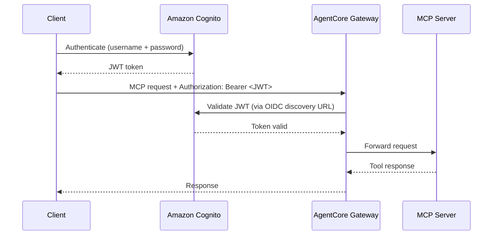
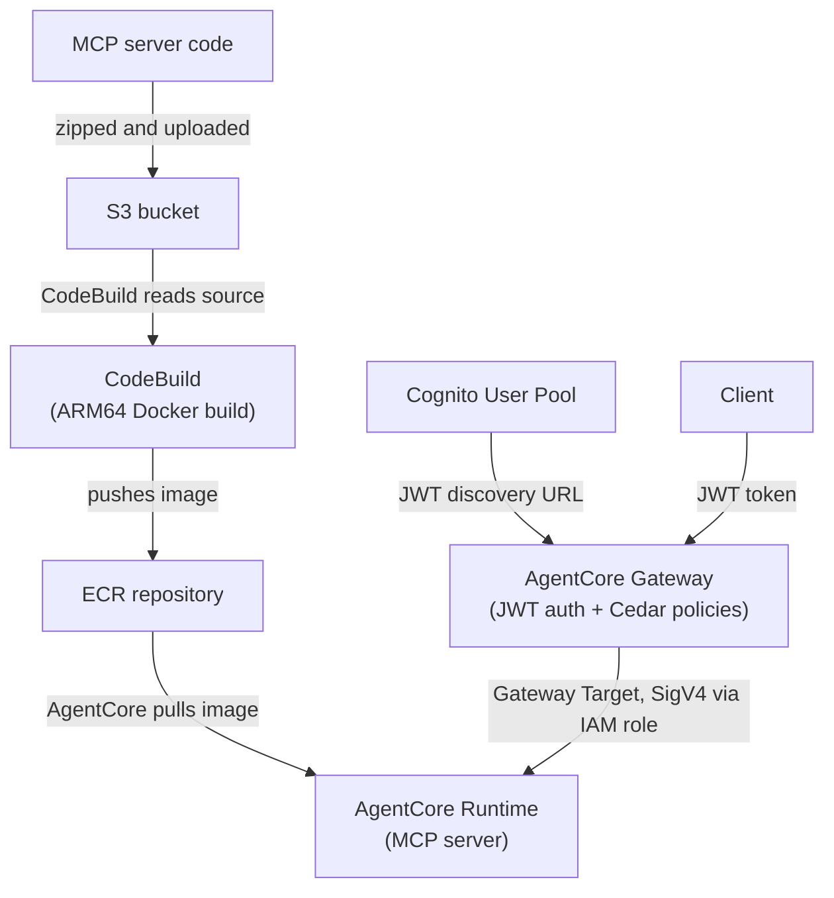
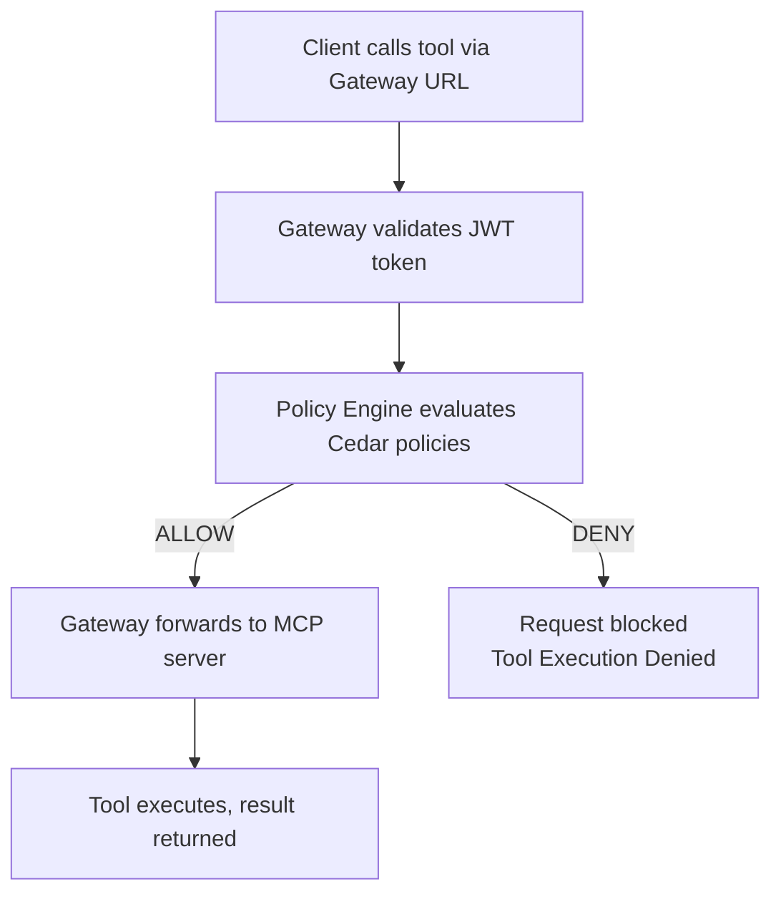

---
---
# Module 2: Hosting an MCP server behind an AgentCore Gateway

**Duration:** ~45 minutes

## What you'll learn

- What the Model Context Protocol (MCP) is and why it matters for agent-tool communication
- How to build an MCP server with FastMCP in Python
- How to deploy an AgentCore Gateway that secures your MCP server with JWT tokens from Cognito
- How to use Pulumi secrets for sensitive config
- How AgentCore's Policy Engine enforces fine-grained access control using Cedar policies
- How to combine `pulumi-aws` and `pulumi-aws-native` in one program when a resource only ships in one of them

## Key concepts

Before you start coding, let's cover the core technologies this module uses.

### Model Context Protocol (MCP)

[The Model Context Protocol](https://modelcontextprotocol.io/) is an open standard for how agents discover and call tools. Without MCP, every agent framework invents its own way to connect to tools. With MCP, a tool exposes a standard HTTP endpoint, and any MCP-compatible agent can list the available tools and call them.

[AgentCore Gateway](https://docs.aws.amazon.com/bedrock-agentcore/latest/devguide/gateway.html) supports MCP natively. When you set `serverProtocol: "MCP"` on a runtime, AgentCore knows your container speaks MCP and routes requests accordingly.

The transport we use here is Stateless Streamable HTTP. Each request is independent (no persistent WebSocket connection), and the server identifies sessions via an `MCP-Session-Id` header. This makes the server easy to scale since there's no session state to track.

### AgentCore Gateway

The [AgentCore Gateway](https://docs.aws.amazon.com/bedrock-agentcore/latest/devguide/gateway.html) is the front door for clients calling your MCP tools. It handles JWT token validation, routes requests to the correct backend, and enforces Cedar access policies - all before your server code sees a single request. Your MCP server never deals with auth; the Gateway handles it.

A [Gateway Target](https://docs.aws.amazon.com/bedrock-agentcore/latest/devguide/gateway-add-target-api-target-config.html) connects the Gateway to a backend - in our case, an AgentCore-hosted MCP server runtime. The Gateway uses its IAM role to call the runtime via SigV4-signed requests.

The [AgentCore Runtime](https://docs.aws.amazon.com/bedrock-agentcore/latest/devguide/agents-tools-runtime.html) is the containerized service that runs your MCP server. Like Module 1, you point it at a Docker image in ECR and AgentCore manages the rest. The runtime itself has no auth - that's the Gateway's job.

### JWT authentication with Cognito

If you deploy an MCP server without authentication, anyone who knows the URL can call your tools. That's fine for local development, but not for production.

We'll use Amazon Cognito as the identity provider. Cognito issues JWT tokens, and AgentCore validates them at the gateway before forwarding requests to your MCP server. The flow looks like this:



The `authorizerConfiguration` on the AgentCore Gateway ties your Cognito User Pool to the request flow. Only tokens issued for your specific app client are accepted.

### Architecture

The deployment pipeline is the same as Module 1 for the MCP server container. The new pieces are the Cognito User Pool, the AgentCore Gateway, and the Gateway Target that connects them.



## Step 1: Create a new Pulumi project

<div class="lang-tabs" markdown="1">

<div class="lang-tab" data-lang="typescript" markdown="1">

```bash
mkdir 02-mcp-server && cd 02-mcp-server
pulumi new aws-typescript --name mcp-server --yes
```

</div>

<div class="lang-tab" data-lang="python" markdown="1">

```bash
mkdir 02-mcp-server && cd 02-mcp-server
pulumi new aws-python --name mcp-server --yes
```

</div>

</div>

Add the ESC environment to `Pulumi.dev.yaml`:

```yaml
environment:
  - aws-bedrock-workshop/dev
```

The `pulumi new` template already includes the AWS classic provider. This module also uses the AWS Native (CloudControl-backed) provider for the Gateway, the Command provider for one boto3 fallback, and the community `pulumiverse-time` provider for an IAM-eventual-consistency wait we'll need in the Cedar chapter (more on each of these as they come up). Install all four up front so the solution code in `02-solution/` runs as-is:

<div class="lang-tabs" markdown="1">

<div class="lang-tab" data-lang="typescript" markdown="1">

```bash
npm install @pulumi/aws@7.23.0 @pulumi/aws-native@1.63.0 @pulumi/command@1.0.0 @pulumiverse/time@0.1.0
```

</div>

<div class="lang-tab" data-lang="python" markdown="1">

```bash
uv add 'pulumi-aws>=7.23.0' 'pulumi-aws-native>=1.63.0' 'pulumi-command>=1.0.0' 'pulumiverse-time>=0.1.0'
```

</div>

</div>

**Why two AWS providers?** The classic `pulumi-aws` provider covers most of the resources here (Cognito, ECR, S3, IAM, Lambda, CodeBuild, AgentCore Runtime). The `policyEngineConfiguration` field on the Gateway and the Cedar Policy resources we'll add later only exist in `pulumi-aws-native`, which generates resources from the AWS CloudFormation registry. Pulumi happily mixes both in a single program; they share AWS credentials from your ESC environment.

`pulumiverse-time` is a community provider that mirrors Terraform's `hashicorp/time`. We use its `time.Sleep` resource in the Cedar chapter to ride out IAM propagation. If you skip the Cedar chapter entirely it's a harmless extra dependency.

Set your unique stack name and store the test password in the shared ESC environment:

```bash
pulumi config set stackName agentcore-mcp-<id>
pulumi env set aws-bedrock-workshop/dev 'pulumiConfig.mcp-server:testPassword' 'TestPassword123' --secret
```

## Step 2: Write the MCP server

Create the server source directory:

```bash
mkdir -p mcp-server-code
```

Create `mcp-server-code/mcp_server.py`:

```python
from mcp.server.fastmcp import FastMCP

mcp = FastMCP(host="0.0.0.0", stateless_http=True)


@mcp.tool()
def add_numbers(a: int, b: int) -> int:
    """Add two numbers together"""
    return a + b


@mcp.tool()
def multiply_numbers(a: int, b: int) -> int:
    """Multiply two numbers together"""
    return a * b


@mcp.tool()
def greet_user(name: str) -> str:
    """Greet a user by name"""
    return f"Hello, {name}! Nice to meet you."


if __name__ == "__main__":
    mcp.run(transport="streamable-http")
```

That's the entire MCP server. Three tools, about 20 lines. The `@mcp.tool()` decorator registers each function as an MCP-callable tool. `stateless_http=True` tells FastMCP to use the Streamable HTTP transport.

Create `mcp-server-code/requirements.txt`:

```text
mcp>=1.10.0
boto3
bedrock-agentcore
```

Create `mcp-server-code/Dockerfile`:

```dockerfile
FROM public.ecr.aws/docker/library/python:3.11-slim
WORKDIR /app

COPY requirements.txt requirements.txt
RUN pip install -r requirements.txt

# Create non-root user
RUN useradd -m -u 1000 bedrock_agentcore
USER bedrock_agentcore

EXPOSE 8000

COPY . .

CMD ["python", "-m", "mcp_server"]
```

This Dockerfile is simpler than the agent one from Module 1. No OpenTelemetry, and it only exposes port 8000 (the MCP HTTP endpoint). The MCP server doesn't need the agent runtime wrapper since it speaks HTTP directly.

## Step 3: Create the Cognito password setter Lambda

Cognito doesn't let you set a permanent password during user creation. A small Lambda function calls `AdminSetUserPassword` after the user is created. Create the directory and the handler:

```bash
mkdir -p lambda/cognito-password-setter
```

Create `lambda/cognito-password-setter/index.py`:

```python
import json
import logging

import boto3


LOGGER = logging.getLogger()
LOGGER.setLevel(logging.INFO)


def handler(event, _context):
    LOGGER.info("Received event: %s", json.dumps(event))

    user_pool_id = event["userPoolId"]
    username = event["username"]
    password = event["password"]
    region = event.get("region")

    cognito = boto3.client("cognito-idp", region_name=region)
    cognito.admin_set_user_password(
        UserPoolId=user_pool_id,
        Username=username,
        Password=password,
        Permanent=True,
    )

    LOGGER.info("Password set successfully for user: %s", username)
    return {"status": "SUCCESS", "username": username}
```

## Step 4: Create the build trigger Lambda

This is identical to Module 1. The Lambda starts a CodeBuild job and polls until it completes. Pulumi calls it during deployment.

```bash
mkdir -p lambda/build-trigger
```

Create `lambda/build-trigger/index.py`:

```python
import json
import logging
import time

import boto3


LOGGER = logging.getLogger()
LOGGER.setLevel(logging.INFO)


def handler(event, _context):
    LOGGER.info("Received event: %s", json.dumps(event))

    project_name = event["projectName"]
    region = event.get("region")
    poll_interval_seconds = int(event.get("pollIntervalSeconds", 15))

    codebuild = boto3.client("codebuild", region_name=region)
    response = codebuild.start_build(projectName=project_name)
    build_id = response["build"]["id"]
    LOGGER.info("Started build %s for project %s", build_id, project_name)

    while True:
        build_response = codebuild.batch_get_builds(ids=[build_id])
        build = build_response["builds"][0]
        status = build["buildStatus"]

        if status == "SUCCEEDED":
            LOGGER.info("Build %s succeeded", build_id)
            return {
                "buildId": build_id,
                "status": status,
                "imageDigest": build.get("resolvedSourceVersion"),
            }

        if status in {"FAILED", "FAULT", "STOPPED", "TIMED_OUT"}:
            LOGGER.error("Build %s failed with status %s", build_id, status)
            raise RuntimeError(f"CodeBuild {build_id} failed with status {status}")

        LOGGER.info("Build %s status: %s", build_id, status)
        time.sleep(poll_interval_seconds)
```

## Step 5: Create the buildspec

Create `buildspec.yml` in the project root:

```yaml
version: 0.2

phases:
  pre_build:
    commands:
      - echo Source code already extracted by CodeBuild
      - cd $CODEBUILD_SRC_DIR
      - echo Logging in to Amazon ECR
      - aws ecr get-login-password --region $AWS_DEFAULT_REGION | docker login --username AWS --password-stdin $AWS_ACCOUNT_ID.dkr.ecr.$AWS_DEFAULT_REGION.amazonaws.com

  build:
    commands:
      - echo Build started on `date`
      - echo Building the Docker image for the basic agent ARM64 image
      - docker build -t $IMAGE_REPO_NAME:$IMAGE_TAG .
      - docker tag $IMAGE_REPO_NAME:$IMAGE_TAG $AWS_ACCOUNT_ID.dkr.ecr.$AWS_DEFAULT_REGION.amazonaws.com/$IMAGE_REPO_NAME:$IMAGE_TAG

  post_build:
    commands:
      - echo Build completed on `date`
      - echo Pushing the Docker image
      - docker push $AWS_ACCOUNT_ID.dkr.ecr.$AWS_DEFAULT_REGION.amazonaws.com/$IMAGE_REPO_NAME:$IMAGE_TAG
      - echo ARM64 Docker image pushed successfully
```

## Step 6: Write the Pulumi infrastructure

Now the infrastructure file. We'll build it step by step. Each section adds resources that depend on what came before.

### Configuration and data sources

<details>
<summary><strong>Want to know more?</strong> - Pulumi Registry</summary>
<p><a href="https://www.pulumi.com/docs/concepts/config/">pulumi.Config</a></p>
</details>

<div class="lang-tabs" markdown="1">

<div class="lang-tab" data-lang="typescript" markdown="1">

```typescript
import * as pulumi from "@pulumi/pulumi";
import * as aws from "@pulumi/aws";
import * as awsNative from "@pulumi/aws-native";
import * as command from "@pulumi/command";
import * as time from "@pulumiverse/time";
import { createHash } from "crypto";
import * as fs from "fs";
import * as path from "path";

const config = new pulumi.Config();
const agentName = config.get("agentName") || "MCPServerAgent";
const networkMode = config.get("networkMode") || "PUBLIC";
const imageTag = config.get("imageTag") || "latest";
const stackName = config.get("stackName") || "agentcore-mcp-server";
const description =
  config.get("description") || "MCP server runtime with JWT authentication";
const environmentVariables =
  config.getObject<Record<string, string>>("environmentVariables") || {};
const ecrRepositoryName = config.get("ecrRepositoryName") || "mcp-server";
const testUserName = config.get("testUsername") || "testuser";
const testUserPassword = config.requireSecret("testPassword");

const awsConfig = new pulumi.Config("aws");
const awsRegion = awsConfig.require("region");

const currentIdentity = aws.getCallerIdentityOutput({});
const currentRegion = aws.getRegionOutput({});
```

</div>

<div class="lang-tab" data-lang="python" markdown="1">

```python
import hashlib
import json
import os
import urllib.parse

import pulumi
import pulumi_aws as aws
import pulumi_aws_native as aws_native
import pulumi_command as command
import pulumiverse_time as time

config = pulumi.Config()
agent_name = config.get("agentName") or "MCPServerAgent"
network_mode = config.get("networkMode") or "PUBLIC"
image_tag = config.get("imageTag") or "latest"
stack_name = config.get("stackName") or "agentcore-mcp-server"
description = (
    config.get("description")
    or "MCP server runtime with JWT authentication"
)
environment_variables = config.get_object("environmentVariables") or {}
ecr_repository_name = config.get("ecrRepositoryName") or "mcp-server"
test_user_name = config.get("testUsername") or "testuser"
test_user_password = config.require_secret("testPassword")

aws_config = pulumi.Config("aws")
aws_region = aws_config.require("region")

current_identity = aws.get_caller_identity_output()
current_region = aws.get_region_output()
```

</div>

</div>

`config.requireSecret("testPassword")` marks the value as a Pulumi secret. Pulumi encrypts it in the state file and masks it in terminal output. The password never appears in plaintext in logs or `pulumi stack output`.

### S3 bucket for MCP server source code

The server code gets zipped and uploaded to S3 so CodeBuild can read it.

<details>
<summary><strong>Want to know more?</strong> - Pulumi Registry</summary>
<p><a href="https://www.pulumi.com/registry/packages/aws/api-docs/s3/bucket/">aws.s3.Bucket</a> &middot; <a href="https://www.pulumi.com/registry/packages/aws/api-docs/s3/bucketpublicaccessblock/">aws.s3.BucketPublicAccessBlock</a> &middot; <a href="https://www.pulumi.com/registry/packages/aws/api-docs/s3/bucketversioning/">aws.s3.BucketVersioning</a> &middot; <a href="https://www.pulumi.com/registry/packages/aws/api-docs/s3/bucketobjectv2/">aws.s3.BucketObjectv2</a></p>
</details>

<div class="lang-tabs" markdown="1">

<div class="lang-tab" data-lang="typescript" markdown="1">

```typescript
const agentSourceBucket = new aws.s3.Bucket("agent_source", {
  bucketPrefix: `${stackName}-source-`,
  forceDestroy: true,
  tags: {
    Name: `${stackName}-mcp-server-source`,
    Purpose: "Store MCP server source code for CodeBuild",
  },
});

new aws.s3.BucketPublicAccessBlock("agent_source", {
  bucket: agentSourceBucket.id,
  blockPublicAcls: true,
  blockPublicPolicy: true,
  ignorePublicAcls: true,
  restrictPublicBuckets: true,
});

new aws.s3.BucketVersioning("agent_source", {
  bucket: agentSourceBucket.id,
  versioningConfiguration: {
    status: "Enabled",
  },
});

const agentSourceObject = new aws.s3.BucketObjectv2("agent_source", {
  bucket: agentSourceBucket.id,
  key: "mcp-server-code.zip",
  source: new pulumi.asset.FileArchive(
    path.resolve(__dirname, "mcp-server-code"),
  ),
  tags: {
    Name: "mcp-server-source-code",
  },
});
```

</div>

<div class="lang-tab" data-lang="python" markdown="1">

```python
agent_source_bucket = aws.s3.Bucket(
    "agent_source",
    bucket_prefix=f"{stack_name}-source-",
    force_destroy=True,
    tags={
        "Name": f"{stack_name}-mcp-server-source",
        "Purpose": "Store MCP server source code for CodeBuild",
    },
)

aws.s3.BucketPublicAccessBlock(
    "agent_source",
    bucket=agent_source_bucket.id,
    block_public_acls=True,
    block_public_policy=True,
    ignore_public_acls=True,
    restrict_public_buckets=True,
)

aws.s3.BucketVersioning(
    "agent_source",
    bucket=agent_source_bucket.id,
    versioning_configuration={"status": "Enabled"},
)

agent_source_object = aws.s3.BucketObjectv2(
    "agent_source",
    bucket=agent_source_bucket.id,
    key="mcp-server-code.zip",
    source=pulumi.FileArchive(
        os.path.join(os.path.dirname(__file__), "mcp-server-code")
    ),
    tags={"Name": "mcp-server-source-code"},
)
```

</div>

</div>

The `FileArchive` automatically zips the `mcp-server-code/` directory. Versioning is enabled so Pulumi can detect when the source changes and trigger a rebuild.

### Cognito User Pool

The User Pool is the identity store. It issues JWT tokens that AgentCore validates.

<details>
<summary><strong>Want to know more?</strong> - Pulumi Registry</summary>
<p><a href="https://www.pulumi.com/registry/packages/aws/api-docs/cognito/userpool/">aws.cognito.UserPool</a></p>
</details>

<div class="lang-tabs" markdown="1">

<div class="lang-tab" data-lang="typescript" markdown="1">

```typescript
const mcpUserPool = new aws.cognito.UserPool("mcp_user_pool", {
  name: `${stackName}-user-pool`,
  passwordPolicy: {
    minimumLength: 8,
    requireUppercase: false,
    requireLowercase: false,
    requireNumbers: false,
    requireSymbols: false,
  },
  schemas: [
    {
      name: "email",
      attributeDataType: "String",
      required: false,
      mutable: true,
    },
  ],
  tags: {
    Name: `${stackName}-user-pool`,
    StackName: stackName,
    Module: "Cognito",
  },
});
```

</div>

<div class="lang-tab" data-lang="python" markdown="1">

```python
mcp_user_pool = aws.cognito.UserPool(
    "mcp_user_pool",
    name=f"{stack_name}-user-pool",
    password_policy={
        "minimum_length": 8,
        "require_uppercase": False,
        "require_lowercase": False,
        "require_numbers": False,
        "require_symbols": False,
    },
    schemas=[
        {
            "name": "email",
            "attribute_data_type": "String",
            "required": False,
            "mutable": True,
        }
    ],
    tags={
        "Name": f"{stack_name}-user-pool",
        "StackName": stack_name,
        "Module": "Cognito",
    },
)
```

</div>

</div>

The relaxed password policy is for the workshop only - in production you'd want stricter requirements. The `email` schema attribute is optional but useful for identifying users.

### Cognito User Pool Client

The app client is what the MCP client presents when requesting tokens. AgentCore's authorizer restricts access to tokens issued for this specific client ID.

<details>
<summary><strong>Want to know more?</strong> - Pulumi Registry</summary>
<p><a href="https://www.pulumi.com/registry/packages/aws/api-docs/cognito/userpoolclient/">aws.cognito.UserPoolClient</a></p>
</details>

<div class="lang-tabs" markdown="1">

<div class="lang-tab" data-lang="typescript" markdown="1">

```typescript
const mcpClient = new aws.cognito.UserPoolClient("mcp_client", {
  name: `${stackName}-client`,
  userPoolId: mcpUserPool.id,
  explicitAuthFlows: ["ALLOW_USER_PASSWORD_AUTH", "ALLOW_REFRESH_TOKEN_AUTH"],
  generateSecret: false,
  preventUserExistenceErrors: "ENABLED",
});
```

</div>

<div class="lang-tab" data-lang="python" markdown="1">

```python
mcp_client = aws.cognito.UserPoolClient(
    "mcp_client",
    name=f"{stack_name}-client",
    user_pool_id=mcp_user_pool.id,
    explicit_auth_flows=["ALLOW_USER_PASSWORD_AUTH", "ALLOW_REFRESH_TOKEN_AUTH"],
    generate_secret=False,
    prevent_user_existence_errors="ENABLED",
)
```

</div>

</div>

`ALLOW_USER_PASSWORD_AUTH` enables the username/password flow used by the `get_token.py` helper script. `preventUserExistenceErrors` prevents attackers from enumerating valid usernames through error messages.

### Test user

This creates a test user in the pool. The user is created in `FORCE_CHANGE_PASSWORD` state - the Lambda in the next step sets a permanent password.

<details>
<summary><strong>Want to know more?</strong> - Pulumi Registry</summary>
<p><a href="https://www.pulumi.com/registry/packages/aws/api-docs/cognito/user/">aws.cognito.User</a></p>
</details>

<div class="lang-tabs" markdown="1">

<div class="lang-tab" data-lang="typescript" markdown="1">

```typescript
const testUser = new aws.cognito.User("test_user", {
  userPoolId: mcpUserPool.id,
  username: testUserName,
  messageAction: "SUPPRESS",
});
```

</div>

<div class="lang-tab" data-lang="python" markdown="1">

```python
test_user = aws.cognito.User(
    "test_user",
    user_pool_id=mcp_user_pool.id,
    username=test_user_name,
    message_action="SUPPRESS",
)
```

</div>

</div>

`messageAction: "SUPPRESS"` prevents Cognito from sending a welcome email - useful for programmatically created test users.

### Cognito password setter Lambda

This follows the same pattern as the build trigger Lambda from Module 1, adapted for the Cognito use case. A Lambda function with its own IAM role calls `AdminSetUserPassword` to set the user's permanent password from the Pulumi secret.

<details>
<summary><strong>Want to know more?</strong> - Pulumi Registry</summary>
<p><a href="https://www.pulumi.com/registry/packages/aws/api-docs/iam/role/">aws.iam.Role</a> &middot; <a href="https://www.pulumi.com/registry/packages/aws/api-docs/iam/rolepolicyattachment/">aws.iam.RolePolicyAttachment</a> &middot; <a href="https://www.pulumi.com/registry/packages/aws/api-docs/lambda/function/">aws.lambda.Function</a> &middot; <a href="https://www.pulumi.com/registry/packages/aws/api-docs/lambda/invocation/">aws.lambda.Invocation</a></p>
</details>

<div class="lang-tabs" markdown="1">

<div class="lang-tab" data-lang="typescript" markdown="1">

```typescript
const cognitoPasswordSetterRole = new aws.iam.Role("cognito_password_setter", {
  name: `${stackName}-cognito-pw-setter-role`,
  assumeRolePolicy: pulumi.jsonStringify({
    Version: "2012-10-17",
    Statement: [
      {
        Effect: "Allow",
        Principal: {
          Service: "lambda.amazonaws.com",
        },
        Action: "sts:AssumeRole",
      },
    ],
  }),
  inlinePolicies: [
    {
      name: "CognitoSetPasswordPolicy",
      policy: pulumi.jsonStringify({
        Version: "2012-10-17",
        Statement: [
          {
            Sid: "SetUserPassword",
            Effect: "Allow",
            Action: ["cognito-idp:AdminSetUserPassword"],
            Resource: mcpUserPool.arn,
          },
        ],
      }),
    },
  ],
  tags: {
    Name: `${stackName}-cognito-pw-setter-role`,
    Module: "Lambda",
  },
});

const cognitoPasswordSetterBasicExecution = new aws.iam.RolePolicyAttachment(
  "cognito_password_setter_basic_execution",
  {
    role: cognitoPasswordSetterRole.name,
    policyArn:
      "arn:aws:iam::aws:policy/service-role/AWSLambdaBasicExecutionRole",
  },
);

const cognitoPasswordSetterFunction = new aws.lambda.Function(
  "cognito_password_setter",
  {
    name: `${stackName}-cognito-pw-setter`,
    role: cognitoPasswordSetterRole.arn,
    runtime: aws.lambda.Runtime.Python3d12,
    handler: "index.handler",
    timeout: 60,
    code: new pulumi.asset.FileArchive(
      path.resolve(__dirname, "lambda/cognito-password-setter"),
    ),
    tags: {
      Name: `${stackName}-cognito-pw-setter`,
      Module: "Lambda",
    },
  },
);

const setCognitoPassword = new aws.lambda.Invocation(
  "set_cognito_password",
  {
    functionName: cognitoPasswordSetterFunction.name,
    input: pulumi
      .all([mcpUserPool.id, currentRegion, testUserPassword])
      .apply(([userPoolId, region, password]) =>
        JSON.stringify({
          userPoolId,
          username: testUserName,
          password,
          region: region.region,
        }),
      ),
  },
  {
    dependsOn: [
      testUser,
      cognitoPasswordSetterBasicExecution,
      cognitoPasswordSetterFunction,
    ],
  },
);
```

</div>

<div class="lang-tab" data-lang="python" markdown="1">

```python
cognito_password_setter_role = aws.iam.Role(
    "cognito_password_setter",
    name=f"{stack_name}-cognito-pw-setter-role",
    assume_role_policy=pulumi.Output.json_dumps(
        {
            "Version": "2012-10-17",
            "Statement": [
                {
                    "Effect": "Allow",
                    "Principal": {"Service": "lambda.amazonaws.com"},
                    "Action": "sts:AssumeRole",
                }
            ],
        }
    ),
    inline_policies=[
        aws.iam.RoleInlinePolicyArgs(
            name="CognitoSetPasswordPolicy",
            policy=pulumi.Output.json_dumps(
                {
                    "Version": "2012-10-17",
                    "Statement": [
                        {
                            "Sid": "SetUserPassword",
                            "Effect": "Allow",
                            "Action": ["cognito-idp:AdminSetUserPassword"],
                            "Resource": mcp_user_pool.arn,
                        }
                    ],
                }
            ),
        )
    ],
    tags={
        "Name": f"{stack_name}-cognito-pw-setter-role",
        "Module": "Lambda",
    },
)

cognito_password_setter_basic_execution = aws.iam.RolePolicyAttachment(
    "cognito_password_setter_basic_execution",
    role=cognito_password_setter_role.name,
    policy_arn="arn:aws:iam::aws:policy/service-role/AWSLambdaBasicExecutionRole",
)

cognito_password_setter_function = aws.lambda_.Function(
    "cognito_password_setter",
    name=f"{stack_name}-cognito-pw-setter",
    role=cognito_password_setter_role.arn,
    runtime=aws.lambda_.Runtime.PYTHON3D12,
    handler="index.handler",
    timeout=60,
    code=pulumi.FileArchive(
        os.path.join(os.path.dirname(__file__), "lambda/cognito-password-setter")
    ),
    tags={
        "Name": f"{stack_name}-cognito-pw-setter",
        "Module": "Lambda",
    },
)

set_cognito_password = aws.lambda_.Invocation(
    "set_cognito_password",
    function_name=cognito_password_setter_function.name,
    input=pulumi.Output.all(
        mcp_user_pool.id, current_region, test_user_password
    ).apply(
        lambda args: json.dumps(
            {
                "userPoolId": args[0],
                "username": test_user_name,
                "password": args[2],
                "region": args[1].region,
            }
        )
    ),
    opts=pulumi.ResourceOptions(
        depends_on=[
            test_user,
            cognito_password_setter_basic_execution,
            cognito_password_setter_function,
        ]
    ),
)
```

</div>

</div>

The `dependsOn` list ensures the user exists and the Lambda function is deployed before Pulumi invokes it. The secret value flows through `pulumi.all` / `pulumi.Output.all` so it's never exposed in plaintext in the state.

### ECR repository

The ECR repository stores the Docker image that CodeBuild produces.

<details>
<summary><strong>Want to know more?</strong> - Pulumi Registry</summary>
<p><a href="https://www.pulumi.com/registry/packages/aws/api-docs/ecr/repository/">aws.ecr.Repository</a> &middot; <a href="https://www.pulumi.com/registry/packages/aws/api-docs/ecr/repositorypolicy/">aws.ecr.RepositoryPolicy</a> &middot; <a href="https://www.pulumi.com/registry/packages/aws/api-docs/ecr/lifecyclepolicy/">aws.ecr.LifecyclePolicy</a></p>
</details>

<div class="lang-tabs" markdown="1">

<div class="lang-tab" data-lang="typescript" markdown="1">

```typescript
const serverEcr = new aws.ecr.Repository("server_ecr", {
  name: `${stackName}-${ecrRepositoryName}`,
  imageTagMutability: "MUTABLE",
  imageScanningConfiguration: {
    scanOnPush: true,
  },
  forceDelete: true,
  tags: {
    Name: `${stackName}-ecr-repository`,
    Module: "ECR",
  },
});

new aws.ecr.RepositoryPolicy("server_ecr", {
  repository: serverEcr.name,
  policy: pulumi.jsonStringify({
    Version: "2012-10-17",
    Statement: [
      {
        Sid: "AllowPullFromAccount",
        Effect: "Allow",
        Principal: {
          AWS: currentIdentity.apply(
            (id) => `arn:aws:iam::${id.accountId}:root`,
          ),
        },
        Action: ["ecr:BatchGetImage", "ecr:GetDownloadUrlForLayer"],
      },
    ],
  }),
});

new aws.ecr.LifecyclePolicy("server_ecr", {
  repository: serverEcr.name,
  policy: JSON.stringify({
    rules: [
      {
        rulePriority: 1,
        description: "Keep last 5 images",
        selection: {
          tagStatus: "any",
          countType: "imageCountMoreThan",
          countNumber: 5,
        },
        action: {
          type: "expire",
        },
      },
    ],
  }),
});
```

</div>

<div class="lang-tab" data-lang="python" markdown="1">

```python
server_ecr = aws.ecr.Repository(
    "server_ecr",
    name=f"{stack_name}-{ecr_repository_name}",
    image_tag_mutability="MUTABLE",
    image_scanning_configuration={"scan_on_push": True},
    force_delete=True,
    tags={
        "Name": f"{stack_name}-ecr-repository",
        "Module": "ECR",
    },
)

aws.ecr.RepositoryPolicy(
    "server_ecr",
    repository=server_ecr.name,
    policy=pulumi.Output.json_dumps(
        {
            "Version": "2012-10-17",
            "Statement": [
                {
                    "Sid": "AllowPullFromAccount",
                    "Effect": "Allow",
                    "Principal": {
                        "AWS": current_identity.apply(
                            lambda id: f"arn:aws:iam::{id.account_id}:root"
                        ),
                    },
                    "Action": ["ecr:BatchGetImage", "ecr:GetDownloadUrlForLayer"],
                }
            ],
        }
    ),
)

aws.ecr.LifecyclePolicy(
    "server_ecr",
    repository=server_ecr.name,
    policy=json.dumps(
        {
            "rules": [
                {
                    "rulePriority": 1,
                    "description": "Keep last 5 images",
                    "selection": {
                        "tagStatus": "any",
                        "countType": "imageCountMoreThan",
                        "countNumber": 5,
                    },
                    "action": {"type": "expire"},
                }
            ]
        }
    ),
)
```

</div>

</div>

The repository policy restricts image pulls to your AWS account. The lifecycle policy keeps only the last 5 images to avoid accumulating old builds. `scanOnPush` enables automatic vulnerability scanning.

### Agent execution role

This IAM role is the identity your running MCP server uses. The trust policy only allows AgentCore to assume it, scoped to your account and region.

This follows the same pattern as Module 1, adapted for the MCP server (the inline policy references `serverEcr` instead of `agentEcr`).

<details>
<summary><strong>Want to know more?</strong> - Pulumi Registry</summary>
<p><a href="https://www.pulumi.com/registry/packages/aws/api-docs/iam/role/">aws.iam.Role</a> &middot; <a href="https://www.pulumi.com/registry/packages/aws/api-docs/iam/rolepolicyattachment/">aws.iam.RolePolicyAttachment</a> &middot; <a href="https://www.pulumi.com/registry/packages/aws/api-docs/iam/rolepolicy/">aws.iam.RolePolicy</a></p>
</details>

<div class="lang-tabs" markdown="1">

<div class="lang-tab" data-lang="typescript" markdown="1">

```typescript
const agentExecution = new aws.iam.Role("agent_execution", {
  name: `${stackName}-agent-execution-role`,
  assumeRolePolicy: pulumi.jsonStringify({
    Version: "2012-10-17",
    Statement: [
      {
        Sid: "AssumeRolePolicy",
        Effect: "Allow",
        Principal: {
          Service: "bedrock-agentcore.amazonaws.com",
        },
        Action: "sts:AssumeRole",
        Condition: {
          StringEquals: {
            "aws:SourceAccount": currentIdentity.apply((id) => id.accountId),
          },
          ArnLike: {
            "aws:SourceArn": pulumi
              .all([currentRegion, currentIdentity])
              .apply(
                ([region, identity]) =>
                  `arn:aws:bedrock-agentcore:${region.region}:${identity.accountId}:*`,
              ),
          },
        },
      },
    ],
  }),
  tags: {
    Name: `${stackName}-agent-execution-role`,
    Module: "IAM",
  },
});

const agentExecutionManaged = new aws.iam.RolePolicyAttachment(
  "agent_execution_managed",
  {
    role: agentExecution.name,
    policyArn: "arn:aws:iam::aws:policy/BedrockAgentCoreFullAccess",
  },
);

const agentExecutionRolePolicy = new aws.iam.RolePolicy("agent_execution", {
  name: "AgentCoreExecutionPolicy",
  role: agentExecution.id,
  policy: pulumi.jsonStringify({
    Version: "2012-10-17",
    Statement: [
      {
        Sid: "ECRImageAccess",
        Effect: "Allow",
        Action: [
          "ecr:BatchGetImage",
          "ecr:GetDownloadUrlForLayer",
          "ecr:BatchCheckLayerAvailability",
        ],
        Resource: serverEcr.arn,
      },
      {
        Sid: "ECRTokenAccess",
        Effect: "Allow",
        Action: ["ecr:GetAuthorizationToken"],
        Resource: "*",
      },
      {
        Sid: "CloudWatchLogs",
        Effect: "Allow",
        Action: [
          "logs:DescribeLogStreams",
          "logs:CreateLogGroup",
          "logs:DescribeLogGroups",
          "logs:CreateLogStream",
          "logs:PutLogEvents",
        ],
        Resource: pulumi
          .all([currentRegion, currentIdentity])
          .apply(
            ([region, identity]) =>
              `arn:aws:logs:${region.region}:${identity.accountId}:log-group:/aws/bedrock-agentcore/runtimes/*`,
          ),
      },
      {
        Sid: "XRayTracing",
        Effect: "Allow",
        Action: [
          "xray:PutTraceSegments",
          "xray:PutTelemetryRecords",
          "xray:GetSamplingRules",
          "xray:GetSamplingTargets",
        ],
        Resource: "*",
      },
      {
        Sid: "CloudWatchMetrics",
        Effect: "Allow",
        Action: ["cloudwatch:PutMetricData"],
        Resource: "*",
        Condition: {
          StringEquals: {
            "cloudwatch:namespace": "bedrock-agentcore",
          },
        },
      },
      {
        Sid: "BedrockModelInvocation",
        Effect: "Allow",
        Action: [
          "bedrock:InvokeModel",
          "bedrock:InvokeModelWithResponseStream",
        ],
        Resource: "*",
      },
      {
        Sid: "GetAgentAccessToken",
        Effect: "Allow",
        Action: [
          "bedrock-agentcore:GetWorkloadAccessToken",
          "bedrock-agentcore:GetWorkloadAccessTokenForJWT",
          "bedrock-agentcore:GetWorkloadAccessTokenForUserId",
        ],
        Resource: [
          pulumi
            .all([currentRegion, currentIdentity])
            .apply(
              ([region, identity]) =>
                `arn:aws:bedrock-agentcore:${region.region}:${identity.accountId}:workload-identity-directory/default`,
            ),
          pulumi
            .all([currentRegion, currentIdentity])
            .apply(
              ([region, identity]) =>
                `arn:aws:bedrock-agentcore:${region.region}:${identity.accountId}:workload-identity-directory/default/workload-identity/*`,
            ),
        ],
      },
    ],
  }),
});
```

</div>

<div class="lang-tab" data-lang="python" markdown="1">

```python
agent_execution = aws.iam.Role(
    "agent_execution",
    name=f"{stack_name}-agent-execution-role",
    assume_role_policy=pulumi.Output.json_dumps(
        {
            "Version": "2012-10-17",
            "Statement": [
                {
                    "Sid": "AssumeRolePolicy",
                    "Effect": "Allow",
                    "Principal": {"Service": "bedrock-agentcore.amazonaws.com"},
                    "Action": "sts:AssumeRole",
                    "Condition": {
                        "StringEquals": {
                            "aws:SourceAccount": current_identity.apply(
                                lambda id: id.account_id
                            ),
                        },
                        "ArnLike": {
                            "aws:SourceArn": pulumi.Output.all(
                                current_region, current_identity
                            ).apply(
                                lambda args: f"arn:aws:bedrock-agentcore:{args[0].region}:{args[1].account_id}:*"
                            ),
                        },
                    },
                }
            ],
        }
    ),
    tags={
        "Name": f"{stack_name}-agent-execution-role",
        "Module": "IAM",
    },
)

agent_execution_managed = aws.iam.RolePolicyAttachment(
    "agent_execution_managed",
    role=agent_execution.name,
    policy_arn="arn:aws:iam::aws:policy/BedrockAgentCoreFullAccess",
)

agent_execution_role_policy = aws.iam.RolePolicy(
    "agent_execution",
    name="AgentCoreExecutionPolicy",
    role=agent_execution.id,
    policy=pulumi.Output.json_dumps(
        {
            "Version": "2012-10-17",
            "Statement": [
                {
                    "Sid": "ECRImageAccess",
                    "Effect": "Allow",
                    "Action": [
                        "ecr:BatchGetImage",
                        "ecr:GetDownloadUrlForLayer",
                        "ecr:BatchCheckLayerAvailability",
                    ],
                    "Resource": server_ecr.arn,
                },
                {
                    "Sid": "ECRTokenAccess",
                    "Effect": "Allow",
                    "Action": ["ecr:GetAuthorizationToken"],
                    "Resource": "*",
                },
                {
                    "Sid": "CloudWatchLogs",
                    "Effect": "Allow",
                    "Action": [
                        "logs:DescribeLogStreams",
                        "logs:CreateLogGroup",
                        "logs:DescribeLogGroups",
                        "logs:CreateLogStream",
                        "logs:PutLogEvents",
                    ],
                    "Resource": pulumi.Output.all(
                        current_region, current_identity
                    ).apply(
                        lambda args: f"arn:aws:logs:{args[0].region}:{args[1].account_id}:log-group:/aws/bedrock-agentcore/runtimes/*"
                    ),
                },
                {
                    "Sid": "XRayTracing",
                    "Effect": "Allow",
                    "Action": [
                        "xray:PutTraceSegments",
                        "xray:PutTelemetryRecords",
                        "xray:GetSamplingRules",
                        "xray:GetSamplingTargets",
                    ],
                    "Resource": "*",
                },
                {
                    "Sid": "CloudWatchMetrics",
                    "Effect": "Allow",
                    "Action": ["cloudwatch:PutMetricData"],
                    "Resource": "*",
                    "Condition": {
                        "StringEquals": {"cloudwatch:namespace": "bedrock-agentcore"}
                    },
                },
                {
                    "Sid": "BedrockModelInvocation",
                    "Effect": "Allow",
                    "Action": [
                        "bedrock:InvokeModel",
                        "bedrock:InvokeModelWithResponseStream",
                    ],
                    "Resource": "*",
                },
                {
                    "Sid": "GetAgentAccessToken",
                    "Effect": "Allow",
                    "Action": [
                        "bedrock-agentcore:GetWorkloadAccessToken",
                        "bedrock-agentcore:GetWorkloadAccessTokenForJWT",
                        "bedrock-agentcore:GetWorkloadAccessTokenForUserId",
                    ],
                    "Resource": [
                        pulumi.Output.all(current_region, current_identity).apply(
                            lambda args: f"arn:aws:bedrock-agentcore:{args[0].region}:{args[1].account_id}:workload-identity-directory/default"
                        ),
                        pulumi.Output.all(current_region, current_identity).apply(
                            lambda args: f"arn:aws:bedrock-agentcore:{args[0].region}:{args[1].account_id}:workload-identity-directory/default/workload-identity/*"
                        ),
                    ],
                },
            ],
        }
    ),
)
```

</div>

</div>

The `ECRImageAccess` statement references `serverEcr.arn` / `server_ecr.arn` - specific to this module's ECR repository. Everything else is identical to Module 1.

### CodeBuild service role

CodeBuild needs its own IAM role with permissions to read from S3, push to ECR, and write build logs.

This follows the same pattern as Module 1, adapted for the MCP server (ECR references use `serverEcr` / `server_ecr`).

<details>
<summary><strong>Want to know more?</strong> - Pulumi Registry</summary>
<p><a href="https://www.pulumi.com/registry/packages/aws/api-docs/iam/role/">aws.iam.Role</a> &middot; <a href="https://www.pulumi.com/registry/packages/aws/api-docs/iam/rolepolicy/">aws.iam.RolePolicy</a></p>
</details>

<div class="lang-tabs" markdown="1">

<div class="lang-tab" data-lang="typescript" markdown="1">

```typescript
const codebuildRole = new aws.iam.Role("codebuild", {
  name: `${stackName}-codebuild-role`,
  assumeRolePolicy: JSON.stringify({
    Version: "2012-10-17",
    Statement: [
      {
        Effect: "Allow",
        Principal: {
          Service: "codebuild.amazonaws.com",
        },
        Action: "sts:AssumeRole",
      },
    ],
  }),
  tags: {
    Name: `${stackName}-codebuild-role`,
    Module: "IAM",
  },
});

const codebuildRolePolicy = new aws.iam.RolePolicy("codebuild", {
  name: "CodeBuildPolicy",
  role: codebuildRole.id,
  policy: pulumi.jsonStringify({
    Version: "2012-10-17",
    Statement: [
      {
        Sid: "CloudWatchLogs",
        Effect: "Allow",
        Action: [
          "logs:CreateLogGroup",
          "logs:CreateLogStream",
          "logs:PutLogEvents",
        ],
        Resource: pulumi
          .all([currentRegion, currentIdentity])
          .apply(
            ([region, identity]) =>
              `arn:aws:logs:${region.region}:${identity.accountId}:log-group:/aws/codebuild/*`,
          ),
      },
      {
        Sid: "ECRAccess",
        Effect: "Allow",
        Action: [
          "ecr:BatchCheckLayerAvailability",
          "ecr:GetDownloadUrlForLayer",
          "ecr:BatchGetImage",
          "ecr:GetAuthorizationToken",
          "ecr:PutImage",
          "ecr:InitiateLayerUpload",
          "ecr:UploadLayerPart",
          "ecr:CompleteLayerUpload",
        ],
        Resource: [serverEcr.arn, "*"],
      },
      {
        Sid: "S3SourceAccess",
        Effect: "Allow",
        Action: ["s3:GetObject", "s3:GetObjectVersion"],
        Resource: pulumi.interpolate`${agentSourceBucket.arn}/*`,
      },
      {
        Sid: "S3BucketAccess",
        Effect: "Allow",
        Action: ["s3:ListBucket", "s3:GetBucketLocation"],
        Resource: agentSourceBucket.arn,
      },
    ],
  }),
});
```

</div>

<div class="lang-tab" data-lang="python" markdown="1">

```python
agent_image_project_name = f"{stack_name}-mcp-server-build"

codebuild_role = aws.iam.Role(
    "codebuild",
    name=f"{stack_name}-codebuild-role",
    assume_role_policy=json.dumps(
        {
            "Version": "2012-10-17",
            "Statement": [
                {
                    "Effect": "Allow",
                    "Principal": {"Service": "codebuild.amazonaws.com"},
                    "Action": "sts:AssumeRole",
                }
            ],
        }
    ),
    tags={
        "Name": f"{stack_name}-codebuild-role",
        "Module": "IAM",
    },
)

codebuild_role_policy = aws.iam.RolePolicy(
    "codebuild",
    name="CodeBuildPolicy",
    role=codebuild_role.id,
    policy=pulumi.Output.json_dumps(
        {
            "Version": "2012-10-17",
            "Statement": [
                {
                    "Sid": "CloudWatchLogs",
                    "Effect": "Allow",
                    "Action": [
                        "logs:CreateLogGroup",
                        "logs:CreateLogStream",
                        "logs:PutLogEvents",
                    ],
                    "Resource": pulumi.Output.all(
                        current_region, current_identity
                    ).apply(
                        lambda args: f"arn:aws:logs:{args[0].region}:{args[1].account_id}:log-group:/aws/codebuild/*"
                    ),
                },
                {
                    "Sid": "ECRAccess",
                    "Effect": "Allow",
                    "Action": [
                        "ecr:BatchCheckLayerAvailability",
                        "ecr:GetDownloadUrlForLayer",
                        "ecr:BatchGetImage",
                        "ecr:GetAuthorizationToken",
                        "ecr:PutImage",
                        "ecr:InitiateLayerUpload",
                        "ecr:UploadLayerPart",
                        "ecr:CompleteLayerUpload",
                    ],
                    "Resource": [server_ecr.arn, "*"],
                },
                {
                    "Sid": "S3SourceAccess",
                    "Effect": "Allow",
                    "Action": ["s3:GetObject", "s3:GetObjectVersion"],
                    "Resource": pulumi.Output.concat(
                        agent_source_bucket.arn, "/*"
                    ),
                },
                {
                    "Sid": "S3BucketAccess",
                    "Effect": "Allow",
                    "Action": ["s3:ListBucket", "s3:GetBucketLocation"],
                    "Resource": agent_source_bucket.arn,
                },
            ],
        }
    ),
)
```

</div>

</div>

### Build trigger Lambda

The Lambda function that bridges Pulumi and CodeBuild. It starts a build and polls until completion, so Pulumi knows when the MCP server image is ready.

This follows the same pattern as Module 1, adapted for the MCP server. The project name is `${stackName}-mcp-server-build`.

<details>
<summary><strong>Want to know more?</strong> - Pulumi Registry</summary>
<p><a href="https://www.pulumi.com/registry/packages/aws/api-docs/iam/role/">aws.iam.Role</a> &middot; <a href="https://www.pulumi.com/registry/packages/aws/api-docs/iam/rolepolicyattachment/">aws.iam.RolePolicyAttachment</a> &middot; <a href="https://www.pulumi.com/registry/packages/aws/api-docs/lambda/function/">aws.lambda.Function</a></p>
</details>

<div class="lang-tabs" markdown="1">

<div class="lang-tab" data-lang="typescript" markdown="1">

```typescript
const agentImageProjectName = `${stackName}-mcp-server-build`;

const buildTriggerRole = new aws.iam.Role("build_trigger", {
  name: `${stackName}-build-trigger-role`,
  assumeRolePolicy: pulumi.jsonStringify({
    Version: "2012-10-17",
    Statement: [
      {
        Effect: "Allow",
        Principal: {
          Service: "lambda.amazonaws.com",
        },
        Action: "sts:AssumeRole",
      },
    ],
  }),
  inlinePolicies: [
    {
      name: "BuildTriggerPolicy",
      policy: pulumi
        .all([currentRegion, currentIdentity])
        .apply(([region, identity]) =>
          JSON.stringify({
            Version: "2012-10-17",
            Statement: [
              {
                Sid: "ManageBuild",
                Effect: "Allow",
                Action: ["codebuild:StartBuild", "codebuild:BatchGetBuilds"],
                Resource: `arn:aws:codebuild:${region.region}:${identity.accountId}:project/${agentImageProjectName}`,
              },
            ],
          }),
        ),
    },
  ],
  tags: {
    Name: `${stackName}-build-trigger-role`,
    Module: "Lambda",
  },
});

const buildTriggerBasicExecution = new aws.iam.RolePolicyAttachment(
  "build_trigger_basic_execution",
  {
    role: buildTriggerRole.name,
    policyArn:
      "arn:aws:iam::aws:policy/service-role/AWSLambdaBasicExecutionRole",
  },
);

const buildTriggerFunction = new aws.lambda.Function("build_trigger", {
  name: `${stackName}-build-trigger`,
  role: buildTriggerRole.arn,
  runtime: aws.lambda.Runtime.Python3d12,
  handler: "index.handler",
  timeout: 900,
  code: new pulumi.asset.FileArchive(
    path.resolve(__dirname, "lambda/build-trigger"),
  ),
  tags: {
    Name: `${stackName}-build-trigger`,
    Module: "Lambda",
  },
});
```

</div>

<div class="lang-tab" data-lang="python" markdown="1">

```python
build_trigger_role = aws.iam.Role(
    "build_trigger",
    name=f"{stack_name}-build-trigger-role",
    assume_role_policy=pulumi.Output.json_dumps(
        {
            "Version": "2012-10-17",
            "Statement": [
                {
                    "Effect": "Allow",
                    "Principal": {"Service": "lambda.amazonaws.com"},
                    "Action": "sts:AssumeRole",
                }
            ],
        }
    ),
    inline_policies=[
        aws.iam.RoleInlinePolicyArgs(
            name="BuildTriggerPolicy",
            policy=pulumi.Output.all(current_region, current_identity).apply(
                lambda args: json.dumps(
                    {
                        "Version": "2012-10-17",
                        "Statement": [
                            {
                                "Sid": "ManageBuild",
                                "Effect": "Allow",
                                "Action": [
                                    "codebuild:StartBuild",
                                    "codebuild:BatchGetBuilds",
                                ],
                                "Resource": f"arn:aws:codebuild:{args[0].region}:{args[1].account_id}:project/{agent_image_project_name}",
                            }
                        ],
                    }
                )
            ),
        )
    ],
    tags={
        "Name": f"{stack_name}-build-trigger-role",
        "Module": "Lambda",
    },
)

build_trigger_basic_execution = aws.iam.RolePolicyAttachment(
    "build_trigger_basic_execution",
    role=build_trigger_role.name,
    policy_arn="arn:aws:iam::aws:policy/service-role/AWSLambdaBasicExecutionRole",
)

build_trigger_function = aws.lambda_.Function(
    "build_trigger",
    name=f"{stack_name}-build-trigger",
    role=build_trigger_role.arn,
    runtime=aws.lambda_.Runtime.PYTHON3D12,
    handler="index.handler",
    timeout=900,
    code=pulumi.FileArchive(
        os.path.join(os.path.dirname(__file__), "lambda/build-trigger")
    ),
    tags={
        "Name": f"{stack_name}-build-trigger",
        "Module": "Lambda",
    },
)
```

</div>

</div>

The timeout is set to 900 seconds (15 minutes) because CodeBuild can take a while for the first build. The inline policy scopes the Lambda's permissions to only the specific CodeBuild project name.

### CodeBuild project

The CodeBuild project defines how the Docker image gets built. It reads source from S3, runs the buildspec on ARM64 hardware, and pushes the image to ECR.

<details>
<summary><strong>Want to know more?</strong> - Pulumi Registry</summary>
<p><a href="https://www.pulumi.com/registry/packages/aws/api-docs/codebuild/project/">aws.codebuild.Project</a></p>
</details>

<div class="lang-tabs" markdown="1">

<div class="lang-tab" data-lang="typescript" markdown="1">

```typescript
const buildspecContent = fs.readFileSync(
  path.resolve(__dirname, "buildspec.yml"),
  "utf-8",
);
const buildspecFingerprint = createHash("sha256")
  .update(buildspecContent)
  .digest("hex");

const agentImage = new aws.codebuild.Project("agent_image", {
  name: agentImageProjectName,
  description: `Build MCP server Docker image for ${stackName}`,
  serviceRole: codebuildRole.arn,
  buildTimeout: 60,
  artifacts: {
    type: "NO_ARTIFACTS",
  },
  environment: {
    computeType: "BUILD_GENERAL1_LARGE",
    image: "aws/codebuild/amazonlinux2-aarch64-standard:3.0",
    type: "ARM_CONTAINER",
    privilegedMode: true,
    imagePullCredentialsType: "CODEBUILD",
    environmentVariables: [
      {
        name: "AWS_DEFAULT_REGION",
        value: currentRegion.apply((r) => r.region),
      },
      {
        name: "AWS_ACCOUNT_ID",
        value: currentIdentity.apply((id) => id.accountId),
      },
      {
        name: "IMAGE_REPO_NAME",
        value: serverEcr.name,
      },
      {
        name: "IMAGE_TAG",
        value: imageTag,
      },
      {
        name: "STACK_NAME",
        value: stackName,
      },
    ],
  },
  source: {
    type: "S3",
    location: pulumi.interpolate`${agentSourceBucket.id}/${agentSourceObject.key}`,
    buildspec: buildspecContent,
  },
  logsConfig: {
    cloudwatchLogs: {
      groupName: `/aws/codebuild/${agentImageProjectName}`,
    },
  },
  tags: {
    Name: agentImageProjectName,
    Module: "CodeBuild",
  },
});
```

</div>

<div class="lang-tab" data-lang="python" markdown="1">

```python
buildspec_path = os.path.join(os.path.dirname(__file__), "buildspec.yml")
with open(buildspec_path) as f:
    buildspec_content = f.read()
buildspec_fingerprint = hashlib.sha256(buildspec_content.encode()).hexdigest()

agent_image = aws.codebuild.Project(
    "agent_image",
    name=agent_image_project_name,
    description=f"Build MCP server Docker image for {stack_name}",
    service_role=codebuild_role.arn,
    build_timeout=60,
    artifacts={"type": "NO_ARTIFACTS"},
    environment={
        "compute_type": "BUILD_GENERAL1_LARGE",
        "image": "aws/codebuild/amazonlinux2-aarch64-standard:3.0",
        "type": "ARM_CONTAINER",
        "privileged_mode": True,
        "image_pull_credentials_type": "CODEBUILD",
        "environment_variables": [
            {
                "name": "AWS_DEFAULT_REGION",
                "value": current_region.apply(lambda r: r.region),
            },
            {
                "name": "AWS_ACCOUNT_ID",
                "value": current_identity.apply(lambda id: id.account_id),
            },
            {"name": "IMAGE_REPO_NAME", "value": server_ecr.name},
            {"name": "IMAGE_TAG", "value": image_tag},
            {"name": "STACK_NAME", "value": stack_name},
        ],
    },
    source={
        "type": "S3",
        "location": pulumi.Output.concat(
            agent_source_bucket.id, "/", agent_source_object.key
        ),
        "buildspec": buildspec_content,
    },
    logs_config={
        "cloudwatch_logs": {
            "group_name": f"/aws/codebuild/{agent_image_project_name}",
        }
    },
    tags={
        "Name": agent_image_project_name,
        "Module": "CodeBuild",
    },
)
```

</div>

</div>

`ARM_CONTAINER` with the `aarch64` image ensures native ARM64 builds. `privilegedMode` is required for Docker-in-Docker builds. `IMAGE_REPO_NAME` points to `serverEcr.name` / `server_ecr.name`.

### Trigger the build

This invocation calls the Lambda function during `pulumi up` to start CodeBuild and wait for the MCP server image to be ready.

<details>
<summary><strong>Want to know more?</strong> - Pulumi Registry</summary>
<p><a href="https://www.pulumi.com/registry/packages/aws/api-docs/lambda/invocation/">aws.lambda.Invocation</a></p>
</details>

<div class="lang-tabs" markdown="1">

<div class="lang-tab" data-lang="typescript" markdown="1">

```typescript
const buildTriggerInvocationInput = pulumi
  .all([agentImage.name, currentRegion])
  .apply(([projectName, region]) =>
    JSON.stringify({
      projectName,
      region: region.region,
      pollIntervalSeconds: 15,
    }),
  );

const triggerBuild = new aws.lambda.Invocation(
  "trigger_build",
  {
    functionName: buildTriggerFunction.name,
    input: buildTriggerInvocationInput,
    triggers: {
      sourceVersion: agentSourceObject.versionId,
      imageTag,
      buildspecSha256: buildspecFingerprint,
    },
  },
  {
    dependsOn: [
      agentImage,
      serverEcr,
      codebuildRolePolicy,
      agentSourceObject,
      buildTriggerBasicExecution,
      buildTriggerFunction,
    ],
  },
);
```

</div>

<div class="lang-tab" data-lang="python" markdown="1">

```python
build_trigger_invocation_input = pulumi.Output.all(
    agent_image.name, current_region
).apply(
    lambda args: json.dumps(
        {
            "projectName": args[0],
            "region": args[1].region,
            "pollIntervalSeconds": 15,
        }
    )
)

trigger_build = aws.lambda_.Invocation(
    "trigger_build",
    function_name=build_trigger_function.name,
    input=build_trigger_invocation_input,
    triggers={
        "sourceVersion": agent_source_object.version_id,
        "imageTag": image_tag,
        "buildspecSha256": buildspec_fingerprint,
    },
    opts=pulumi.ResourceOptions(
        depends_on=[
            agent_image,
            server_ecr,
            codebuild_role_policy,
            agent_source_object,
            build_trigger_basic_execution,
            build_trigger_function,
        ]
    ),
)
```

</div>

</div>

The `triggers` map controls when the build re-runs. If the source code version, image tag, or buildspec changes, Pulumi triggers a new build. The `dependsOn` list includes `serverEcr` / `server_ecr` to ensure the repository exists before the build tries to push.

### MCP server runtime

The runtime is similar to Module 1, with one addition: `protocolConfiguration` declares this is an MCP server. Note that there is **no** `authorizerConfiguration` here - JWT auth is handled by the Gateway (next section), not the runtime.

<details>
<summary><strong>Want to know more?</strong> - Pulumi Registry</summary>
<p><a href="https://www.pulumi.com/registry/packages/aws/api-docs/bedrock/agentcoreagentruntime/">aws.bedrock.AgentcoreAgentRuntime</a></p>
</details>

<div class="lang-tabs" markdown="1">

<div class="lang-tab" data-lang="typescript" markdown="1">

```typescript
const runtimeName = `${stackName}_${agentName}`.replace(/-/g, "_");

const sourceHash = agentSourceObject.versionId.apply((v) => v ?? "initial");

const mergedEnvVars: Record<string, string> = {
  AWS_REGION: awsRegion,
  AWS_DEFAULT_REGION: awsRegion,
  ...environmentVariables,
};

const mcpServer = new aws.bedrock.AgentcoreAgentRuntime(
  "mcp_server",
  {
    agentRuntimeName: runtimeName,
    description: description,
    roleArn: agentExecution.arn,
    agentRuntimeArtifact: {
      containerConfiguration: {
        containerUri: pulumi.interpolate`${serverEcr.repositoryUrl}:${imageTag}`,
      },
    },
    networkConfiguration: {
      networkMode: networkMode,
    },
    protocolConfiguration: {
      serverProtocol: "MCP",
    },
    environmentVariables: {
      ...mergedEnvVars,
      SOURCE_VERSION: sourceHash,
    },
  },
  {
    dependsOn: [
      triggerBuild,
      agentExecutionRolePolicy,
      agentExecutionManaged,
    ],
  },
);
```

</div>

<div class="lang-tab" data-lang="python" markdown="1">

```python
runtime_name = f"{stack_name}_{agent_name}".replace("-", "_")

source_hash = agent_source_object.version_id.apply(lambda v: v if v else "initial")

merged_env_vars = {
    "AWS_REGION": aws_region,
    "AWS_DEFAULT_REGION": aws_region,
    **environment_variables,
}

mcp_server = aws.bedrock.AgentcoreAgentRuntime(
    "mcp_server",
    agent_runtime_name=runtime_name,
    description=description,
    role_arn=agent_execution.arn,
    agent_runtime_artifact={
        "container_configuration": {
            "container_uri": pulumi.Output.concat(
                server_ecr.repository_url, ":", image_tag
            ),
        }
    },
    network_configuration={"network_mode": network_mode},
    protocol_configuration={"server_protocol": "MCP"},
    environment_variables={
        **merged_env_vars,
        "SOURCE_VERSION": source_hash,
    },
    opts=pulumi.ResourceOptions(
        depends_on=[
            trigger_build,
            agent_execution_role_policy,
            agent_execution_managed,
        ]
    ),
)
```

</div>

</div>

`protocolConfiguration.serverProtocol: "MCP"` tells AgentCore this container speaks MCP, not the regular agent invocation protocol.

### AgentCore Gateway

The [Gateway](https://docs.aws.amazon.com/bedrock-agentcore/latest/devguide/gateway.html) is the front door for clients. It validates JWT tokens from Cognito before forwarding requests to the MCP server. Your MCP server code never has to deal with auth - the Gateway handles it.

We use `pulumi-aws-native` here because the classic provider doesn't yet expose `policyEngineConfiguration`, which the Cedar chapter will need. Declaring the Gateway with the native provider now means we can attach the Policy Engine in place later without a destructive recreate.

<details>
<summary><strong>Want to know more?</strong> - Pulumi Registry</summary>
<p><a href="https://www.pulumi.com/registry/packages/aws-native/api-docs/bedrockagentcore/gateway/">aws-native.bedrockagentcore.Gateway</a></p>
</details>

<div class="lang-tabs" markdown="1">

<div class="lang-tab" data-lang="typescript" markdown="1">

```typescript
const cognitoDiscoveryUrlInput = pulumi
  .all([currentRegion, mcpUserPool.id])
  .apply(
    ([region, userPoolId]) =>
      `https://cognito-idp.${region.region}.amazonaws.com/${userPoolId}/.well-known/openid-configuration`,
  );

const mcpGateway = new awsNative.bedrockagentcore.Gateway(
  "mcp_gateway",
  {
    name: `${stackName}-mcp-gateway`,
    description: `MCP Gateway with JWT auth for ${stackName}`,
    protocolType: awsNative.bedrockagentcore.GatewayProtocolType.Mcp,
    roleArn: agentExecution.arn,
    authorizerType: awsNative.bedrockagentcore.GatewayAuthorizerType.CustomJwt,
    authorizerConfiguration: {
      customJwtAuthorizer: {
        allowedClients: [mcpClient.id],
        discoveryUrl: cognitoDiscoveryUrlInput,
      },
    },
    tags: {
      Name: `${stackName}-mcp-gateway`,
      Module: "Gateway",
    },
  },
);
```

</div>

<div class="lang-tab" data-lang="python" markdown="1">

```python
cognito_discovery_url = pulumi.Output.all(current_region, mcp_user_pool.id).apply(
    lambda args: f"https://cognito-idp.{args[0].region}.amazonaws.com/{args[1]}/.well-known/openid-configuration"
)

mcp_gateway = aws_native.bedrockagentcore.Gateway(
    "mcp_gateway",
    name=f"{stack_name}-mcp-gateway",
    description=f"MCP Gateway with JWT auth for {stack_name}",
    protocol_type=aws_native.bedrockagentcore.GatewayProtocolType.MCP,
    role_arn=agent_execution.arn,
    authorizer_type=aws_native.bedrockagentcore.GatewayAuthorizerType.CUSTOM_JWT,
    authorizer_configuration={
        "custom_jwt_authorizer": {
            "allowed_clients": [mcp_client.id],
            "discovery_url": cognito_discovery_url,
        },
    },
    tags={
        "Name": f"{stack_name}-mcp-gateway",
        "Module": "Gateway",
    },
)
```

</div>

</div>

The `authorizerConfiguration.customJwtAuthorizer` ties the Gateway to your Cognito User Pool. `discoveryUrl` is the OIDC discovery endpoint and `allowedClients` restricts access to tokens issued for your app client ID. The Gateway exposes a URL (`gatewayUrl`) that clients use instead of calling the runtime directly.

### Gateway Target

The Gateway also needs a **Target** that points it at the MCP runtime's invocation endpoint. AgentCore-hosted MCP runtimes need a `GATEWAY_IAM_ROLE` credential provider with an `iamCredentialProvider` sub-object so the Gateway can sign requests to the runtime with SigV4.

That sub-object is the one piece this module can't yet declare with a typed Pulumi resource: the published CloudFormation schema for `AWS::BedrockAgentCore::GatewayTarget` doesn't list `IamCredentialProvider` in its credential-provider union. The underlying AgentCore API accepts the field, and a direct `aws cloudcontrol create-resource` call goes through, but `pulumi-aws-native`'s typed bridge filters the unknown variant out before it reaches CloudControl. Until the CFN schema gains the variant, we shell out to boto3 from a `command.local.Command` - the rest of the program stays declarative.

<details>
<summary><strong>Want to know more?</strong> - Pulumi Registry</summary>
<p><a href="https://www.pulumi.com/registry/packages/command/api-docs/local/command/">command.local.Command</a></p>
</details>

<div class="lang-tabs" markdown="1">

<div class="lang-tab" data-lang="typescript" markdown="1">

```typescript
const mcpTargetName = "mcp-server-target";

const runtimeInvocationEndpoint = pulumi
  .all([currentRegion, mcpServer.agentRuntimeArn])
  .apply(
    ([region, arn]) =>
      `https://bedrock-agentcore.${region.region}.amazonaws.com/runtimes/${encodeURIComponent(arn)}/invocations?qualifier=DEFAULT`,
  );

const gatewayTargetUpsertScript = `pip install boto3 -q
python3 <<'PYEOF'
import boto3, hashlib, os, sys, time
client = boto3.client('bedrock-agentcore-control', region_name=os.environ['REGION'])
target_id = None
existing_endpoint = None
existing_description = None
source_stamp = hashlib.sha1(os.environ['SOURCE_VERSION'].encode()).hexdigest()[:10]
description = f'Target for AgentCore-hosted MCP server [{source_stamp}]'
for t in client.list_gateway_targets(gatewayIdentifier=os.environ['GATEWAY_ID']).get('items', []):
    if t['name'] == os.environ['TARGET_NAME']:
        target_id = t['targetId']
        existing_endpoint = (
            t.get('targetConfiguration', {}).get('mcp', {}).get('mcpServer', {}).get('endpoint')
        )
        existing_description = t.get('description')
        break
if target_id is None:
    r = client.create_gateway_target(
        gatewayIdentifier=os.environ['GATEWAY_ID'],
        name=os.environ['TARGET_NAME'],
        description=description,
        targetConfiguration={'mcp': {'mcpServer': {'endpoint': os.environ['ENDPOINT']}}},
        credentialProviderConfigurations=[{
            'credentialProviderType': 'GATEWAY_IAM_ROLE',
            'credentialProvider': {'iamCredentialProvider': {'service': 'bedrock-agentcore'}},
        }],
    )
    target_id = r['targetId']
elif existing_endpoint != os.environ['ENDPOINT'] or existing_description != description:
    client.update_gateway_target(
        gatewayIdentifier=os.environ['GATEWAY_ID'],
        targetId=target_id,
        name=os.environ['TARGET_NAME'],
        description=description,
        targetConfiguration={'mcp': {'mcpServer': {'endpoint': os.environ['ENDPOINT']}}},
        credentialProviderConfigurations=[{
            'credentialProviderType': 'GATEWAY_IAM_ROLE',
            'credentialProvider': {'iamCredentialProvider': {'service': 'bedrock-agentcore'}},
        }],
    )
for _ in range(60):
    g = client.get_gateway_target(gatewayIdentifier=os.environ['GATEWAY_ID'], targetId=target_id)
    status = g.get('status')
    if status == 'READY':
        break
    if status in ('FAILED', 'DELETING'):
        sys.stderr.write(f'target failed: status={status} reasons={g.get("statusReasons")}\\n')
        sys.exit(1)
    time.sleep(5)
print(target_id)
PYEOF
`;

const gatewayTargetDeleteScript = `pip install boto3 -q
python3 <<'PYEOF'
import boto3, hashlib, os
client = boto3.client('bedrock-agentcore-control', region_name=os.environ['REGION'])
source_stamp = hashlib.sha1(os.environ['SOURCE_VERSION'].encode()).hexdigest()[:10]
expected_description = f'Target for AgentCore-hosted MCP server [{source_stamp}]'
try:
    targets = client.list_gateway_targets(gatewayIdentifier=os.environ['GATEWAY_ID']).get('items', [])
except client.exceptions.ResourceNotFoundException:
    targets = []
for t in targets:
    if t['name'] == os.environ['TARGET_NAME'] and t.get('description') == expected_description:
        client.delete_gateway_target(gatewayIdentifier=os.environ['GATEWAY_ID'], targetId=t['targetId'])
        break
PYEOF
`;

const mcpGatewayTarget = new command.local.Command("mcp_gateway_target", {
  create: gatewayTargetUpsertScript,
  update: gatewayTargetUpsertScript,
  delete: gatewayTargetDeleteScript,
  environment: {
    REGION: currentRegion.apply((r) => r.region),
    GATEWAY_ID: mcpGateway.gatewayIdentifier,
    TARGET_NAME: mcpTargetName,
    ENDPOINT: runtimeInvocationEndpoint,
    // Include the source version so that when MCP code changes, Pulumi runs
    // the update script (not a replace) so the delete path is never triggered.
    SOURCE_VERSION: agentSourceObject.versionId.apply((v) => v ?? "initial"),
  },
});

const mcpGatewayTargetId = mcpGatewayTarget.stdout.apply((s) => s.trim());
```

</div>

<div class="lang-tab" data-lang="python" markdown="1">

```python
mcp_target_name = "mcp-server-target"

runtime_invocation_endpoint = pulumi.Output.all(
    current_region, mcp_server.agent_runtime_arn
).apply(
    lambda args: (
        f"https://bedrock-agentcore.{args[0].region}.amazonaws.com/runtimes/"
        f"{urllib.parse.quote(args[1], safe='')}/invocations?qualifier=DEFAULT"
    )
)

_GATEWAY_TARGET_UPSERT_SCRIPT = r"""pip install boto3 -q
python3 <<'PYEOF'
import boto3, hashlib, os, sys, time
client = boto3.client('bedrock-agentcore-control', region_name=os.environ['REGION'])
target_id = None
existing_endpoint = None
existing_description = None
source_stamp = hashlib.sha1(os.environ['SOURCE_VERSION'].encode()).hexdigest()[:10]
description = f'Target for AgentCore-hosted MCP server [{source_stamp}]'
for t in client.list_gateway_targets(gatewayIdentifier=os.environ['GATEWAY_ID']).get('items', []):
    if t['name'] == os.environ['TARGET_NAME']:
        target_id = t['targetId']
        existing_endpoint = (
            t.get('targetConfiguration', {}).get('mcp', {}).get('mcpServer', {}).get('endpoint')
        )
        existing_description = t.get('description')
        break
if target_id is None:
    r = client.create_gateway_target(
        gatewayIdentifier=os.environ['GATEWAY_ID'],
        name=os.environ['TARGET_NAME'],
        description=description,
        targetConfiguration={'mcp': {'mcpServer': {'endpoint': os.environ['ENDPOINT']}}},
        credentialProviderConfigurations=[{
            'credentialProviderType': 'GATEWAY_IAM_ROLE',
            'credentialProvider': {'iamCredentialProvider': {'service': 'bedrock-agentcore'}},
        }],
    )
    target_id = r['targetId']
elif existing_endpoint != os.environ['ENDPOINT'] or existing_description != description:
    client.update_gateway_target(
        gatewayIdentifier=os.environ['GATEWAY_ID'],
        targetId=target_id,
        name=os.environ['TARGET_NAME'],
        description=description,
        targetConfiguration={'mcp': {'mcpServer': {'endpoint': os.environ['ENDPOINT']}}},
        credentialProviderConfigurations=[{
            'credentialProviderType': 'GATEWAY_IAM_ROLE',
            'credentialProvider': {'iamCredentialProvider': {'service': 'bedrock-agentcore'}},
        }],
    )
for _ in range(60):
    g = client.get_gateway_target(gatewayIdentifier=os.environ['GATEWAY_ID'], targetId=target_id)
    status = g.get('status')
    if status == 'READY':
        break
    if status in ('FAILED', 'DELETING'):
        sys.stderr.write(f'target failed: status={status} reasons={g.get("statusReasons")}\n')
        sys.exit(1)
    time.sleep(5)
print(target_id)
PYEOF
"""

_GATEWAY_TARGET_DELETE_SCRIPT = r"""pip install boto3 -q
python3 <<'PYEOF'
import boto3, hashlib, os
client = boto3.client('bedrock-agentcore-control', region_name=os.environ['REGION'])
source_stamp = hashlib.sha1(os.environ['SOURCE_VERSION'].encode()).hexdigest()[:10]
expected_description = f'Target for AgentCore-hosted MCP server [{source_stamp}]'
try:
    targets = client.list_gateway_targets(gatewayIdentifier=os.environ['GATEWAY_ID']).get('items', [])
except client.exceptions.ResourceNotFoundException:
    targets = []
for t in targets:
    if t['name'] == os.environ['TARGET_NAME'] and t.get('description') == expected_description:
        client.delete_gateway_target(gatewayIdentifier=os.environ['GATEWAY_ID'], targetId=t['targetId'])
        break
PYEOF
"""

mcp_gateway_target = command.local.Command(
    "mcp_gateway_target",
    create=_GATEWAY_TARGET_UPSERT_SCRIPT,
    update=_GATEWAY_TARGET_UPSERT_SCRIPT,
    delete=_GATEWAY_TARGET_DELETE_SCRIPT,
    environment={
        "REGION": current_region.apply(lambda r: r.region),
        "GATEWAY_ID": mcp_gateway.gateway_identifier,
        "TARGET_NAME": mcp_target_name,
        "ENDPOINT": runtime_invocation_endpoint,
        "SOURCE_VERSION": agent_source_object.version_id.apply(
            lambda v: v if v else "initial"
        ),
    },
)

mcp_gateway_target_id = mcp_gateway_target.stdout.apply(lambda s: s.strip())
```

</div>

</div>

The create script is idempotent (it looks up the target by name first) so reruns are safe, and it polls until status is `READY` before returning. The Cedar chapter at the end of this module relies on this readiness check so the Policy Engine knows the target's tool actions before any Cedar policy is evaluated against them.

### Outputs

<div class="lang-tabs" markdown="1">

<div class="lang-tab" data-lang="typescript" markdown="1">

```typescript
export const agentRuntimeId = mcpServer.agentRuntimeId;
export const agentRuntimeArn = mcpServer.agentRuntimeArn;
export const agentRuntimeVersion = mcpServer.agentRuntimeVersion;
export const ecrRepositoryUrl = serverEcr.repositoryUrl;
export const ecrRepositoryArn = serverEcr.arn;
export const agentExecutionRoleArn = agentExecution.arn;
export const codebuildProjectName = agentImage.name;
export const codebuildProjectArn = agentImage.arn;
export const sourceBucketName = agentSourceBucket.id;
export const sourceBucketArn = agentSourceBucket.arn;
export const sourceObjectKey = agentSourceObject.key;
export const cognitoUserPoolId = mcpUserPool.id;
export const cognitoUserPoolArn = mcpUserPool.arn;
export const cognitoUserPoolClientId = mcpClient.id;
export const cognitoDiscoveryUrl = pulumi
  .all([currentRegion, mcpUserPool.id])
  .apply(
    ([region, userPoolId]) =>
      `https://cognito-idp.${region.region}.amazonaws.com/${userPoolId}/.well-known/openid-configuration`,
  );
export const testUsername = testUserName;
export const testPassword = testUserPassword;
export const getTokenCommand = pulumi
  .all([mcpClient.id, currentRegion, testUserPassword])
  .apply(
    ([clientId, region, password]) =>
      `python get_token.py ${clientId} ${testUserName} '${password}' ${region.region}`,
  );
export const gatewayId = mcpGateway.gatewayIdentifier;
export const gatewayArn = mcpGateway.gatewayArn;
export const gatewayUrl = mcpGateway.gatewayUrl;
export const gatewayTargetId = mcpGatewayTargetId;
```

</div>

<div class="lang-tab" data-lang="python" markdown="1">

```python
pulumi.export("agentRuntimeId", mcp_server.agent_runtime_id)
pulumi.export("agentRuntimeArn", mcp_server.agent_runtime_arn)
pulumi.export("agentRuntimeVersion", mcp_server.agent_runtime_version)
pulumi.export("ecrRepositoryUrl", server_ecr.repository_url)
pulumi.export("ecrRepositoryArn", server_ecr.arn)
pulumi.export("agentExecutionRoleArn", agent_execution.arn)
pulumi.export("codebuildProjectName", agent_image.name)
pulumi.export("codebuildProjectArn", agent_image.arn)
pulumi.export("sourceBucketName", agent_source_bucket.id)
pulumi.export("sourceBucketArn", agent_source_bucket.arn)
pulumi.export("sourceObjectKey", agent_source_object.key)
pulumi.export("cognitoUserPoolId", mcp_user_pool.id)
pulumi.export("cognitoUserPoolArn", mcp_user_pool.arn)
pulumi.export("cognitoUserPoolClientId", mcp_client.id)
pulumi.export(
    "cognitoDiscoveryUrl",
    pulumi.Output.all(current_region, mcp_user_pool.id).apply(
        lambda args: f"https://cognito-idp.{args[0].region}.amazonaws.com/{args[1]}/.well-known/openid-configuration"
    ),
)
pulumi.export("testUsername", test_user_name)
pulumi.export("testPassword", test_user_password)
pulumi.export(
    "getTokenCommand",
    pulumi.Output.all(mcp_client.id, current_region, test_user_password).apply(
        lambda args: f"python get_token.py {args[0]} {test_user_name} '{args[2]}' {args[1].region}"
    ),
)
pulumi.export("gatewayId", mcp_gateway.gateway_identifier)
pulumi.export("gatewayArn", mcp_gateway.gateway_arn)
pulumi.export("gatewayUrl", mcp_gateway.gateway_url)
pulumi.export("gatewayTargetId", mcp_gateway_target_id)
```

</div>

</div>

`testPassword` is a secret output - Pulumi will mask it in terminal output. Use `pulumi stack output testPassword --show-secrets` to reveal it. The `getTokenCommand` output gives you a ready-to-run command for getting a JWT token.

## Step 7: Deploy

```bash
pulumi up
```

Same 5-10 minute wait for CodeBuild. At the end, Pulumi outputs the runtime ARN, gateway URL, Cognito client ID, the Gateway Target ID, and a handy `getTokenCommand`. The Gateway Target is already in place - no follow-up CLI calls needed.

## Step 8: Get a JWT token and test

First, get a token from Cognito. Pulumi outputs a ready-to-run command:

```bash
pulumi stack output getTokenCommand --show-secrets
```

Copy and run the printed command. It calls `get_token.py` (copy from the solution folder) and prints a JWT token. Export it:

```bash
export JWT_TOKEN="<paste the token here>"
```

Now test the MCP server through the Gateway. Copy `test_mcp_server.py` from the solution folder and run:

```bash
export GATEWAY_URL=$(pulumi stack output gatewayUrl)
python test_mcp_server.py $GATEWAY_URL $JWT_TOKEN
```

You should see all three tools listed (prefixed with the target name) and their results:

- `mcp-server-target___add_numbers(5, 3)` returns `8`
- `mcp-server-target___multiply_numbers(4, 7)` returns `28`
- `mcp-server-target___greet_user('Alice')` returns `Hello, Alice! Nice to meet you.`

Try calling without the token (or with a fake one) and you'll get an authorization error. The Gateway's JWT authorizer is doing its job - any caller with a valid token can run any tool. The Cedar chapter below adds the second layer.

## Try it yourself

**Add a new tool.** Open `mcp-server-code/mcp_server.py` and add a fourth tool. Something like:

```python
@mcp.tool()
def reverse_string(text: str) -> str:
    """Reverse a string"""
    return text[::-1]
```

Redeploy with `pulumi up`, get a fresh token, and call your new tool with the test script. MCP auto-discovers tools, so the client picks it up without any config changes.

**Break the auth on purpose.** Grab a token, wait for it to expire (1 hour), and try again. Or tamper with the token by changing a character in the middle. See what error AgentCore returns. Understanding the failure modes helps when debugging real deployments.

## Adding Cedar policy enforcement

JWT auth gates *who* can call your tools. The next layer is *what* they can call. AgentCore's [Policy Engine](https://docs.aws.amazon.com/bedrock-agentcore/latest/devguide/policy.html) sits inside the Gateway and evaluates every tool call against a set of [Cedar](https://www.cedarpolicy.com/) policies. Cedar is open-source, default-deny: a request is blocked unless a policy explicitly permits it.



A Cedar policy has three components:

- **Principal** - who is making the request. `AgentCore::OAuthUser` matches any JWT-authenticated user.
- **Action** - which tool is being called, e.g. `AgentCore::Action::"mcp-server-target___add_numbers"`. The Gateway prefixes tool names with the target name and three underscores.
- **Resource** - which Gateway the request targets, e.g. `AgentCore::Gateway::"<GATEWAY_ARN>"`.

We'll add three resources to lock the Gateway down: a Policy Engine, a small `time.Sleep` to let IAM catch up, and a Cedar Policy. Then we'll attach the Engine to the existing Gateway in `ENFORCE` mode.

### Step 9: Import the time provider

[`pulumiverse-time`](https://github.com/pulumiverse/pulumi-time) was already installed in Step 1 alongside the other providers. Import it where you keep the rest of your imports - we'll use its `time.Sleep` resource in the next step. The Cedar `Policy` and `PolicyEngine` resources come from `pulumi-aws-native`, which is also already imported.

<div class="lang-tabs" markdown="1">

<div class="lang-tab" data-lang="typescript" markdown="1">

```typescript
import * as time from "@pulumiverse/time";
```

</div>

<div class="lang-tab" data-lang="python" markdown="1">

```python
import pulumiverse_time as time
```

</div>

</div>

If you skipped ahead and didn't run the Step 1 install, do it now:

<div class="lang-tabs" markdown="1">

<div class="lang-tab" data-lang="typescript" markdown="1">

```bash
npm install @pulumiverse/time@0.1.0
```

</div>

<div class="lang-tab" data-lang="python" markdown="1">

```bash
uv add 'pulumiverse-time>=0.1.0'
```

</div>

</div>

### Step 10: Create the Policy Engine

The Policy Engine holds the Cedar policies. By itself it does nothing - the Gateway has to be told to use it.

<details>
<summary><strong>Want to know more?</strong> - Pulumi Registry</summary>
<p><a href="https://www.pulumi.com/registry/packages/aws-native/api-docs/bedrockagentcore/policyengine/">aws-native.bedrockagentcore.PolicyEngine</a></p>
</details>

<div class="lang-tabs" markdown="1">

<div class="lang-tab" data-lang="typescript" markdown="1">

```typescript
const mcpPolicyEngine = new awsNative.bedrockagentcore.PolicyEngine(
  "mcp_policy_engine",
  {
    name: `${stackName}_policy_engine`.replace(/-/g, "_"),
    description: `Policy engine for ${stackName}`,
    tags: [
      { key: "Name", value: `${stackName}-policy-engine` },
      { key: "Module", value: "PolicyEngine" },
    ],
  },
);
```

</div>

<div class="lang-tab" data-lang="python" markdown="1">

```python
mcp_policy_engine = aws_native.bedrockagentcore.PolicyEngine(
    "mcp_policy_engine",
    name=f"{stack_name}_policy_engine".replace("-", "_"),
    description=f"Policy engine for {stack_name}",
    tags=[
        {"key": "Name", "value": f"{stack_name}-policy-engine"},
        {"key": "Module", "value": "PolicyEngine"},
    ],
)
```

</div>

</div>

### Step 11: Add the IAM propagation guard

When the Gateway attaches a Policy Engine, AgentCore validates that its IAM role can be assumed by the Gateway service. IAM is eventually consistent across AWS services, so on a fresh deploy that check sometimes fails on the first try - the role's trust policy hasn't propagated to STS yet.

This is the same problem Terraform users solve with [`hashicorp/time`'s `time_sleep` resource](https://registry.terraform.io/providers/hashicorp/time/latest/docs/resources/sleep). The community-maintained [`pulumiverse-time` provider](https://github.com/pulumiverse/pulumi-time) gives us the same primitive in Pulumi. Thirty seconds is conservative; ten to fifteen usually does it.

If you're walking through this module across multiple `pulumi up` runs (Chapter 1 first, Cedar second), the wait isn't strictly needed because IAM has had plenty of time to propagate between deploys. We add it anyway so the solution code in `02-solution/` works in a single deploy too.

<details>
<summary><strong>Want to know more?</strong> - Pulumi Registry</summary>
<p><a href="https://www.pulumi.com/registry/packages/time/api-docs/sleep/">time.Sleep</a></p>
</details>

<div class="lang-tabs" markdown="1">

<div class="lang-tab" data-lang="typescript" markdown="1">

```typescript
const iamPropagationWait = new time.Sleep(
  "iam_propagation_wait",
  {
    createDuration: "30s",
    triggers: {
      role_arn: agentExecution.arn,
      managed_attachment: agentExecutionManaged.id,
      inline_policy: agentExecutionRolePolicy.id,
    },
  },
  {
    dependsOn: [
      agentExecution,
      agentExecutionManaged,
      agentExecutionRolePolicy,
    ],
  },
);
```

</div>

<div class="lang-tab" data-lang="python" markdown="1">

```python
iam_propagation_wait = time.Sleep(
    "iam_propagation_wait",
    create_duration="30s",
    triggers={
        "role_arn": agent_execution.arn,
        "managed_attachment": agent_execution_managed.id,
        "inline_policy": agent_execution_role_policy.id,
    },
    opts=pulumi.ResourceOptions(
        depends_on=[
            agent_execution,
            agent_execution_managed,
            agent_execution_role_policy,
        ]
    ),
)
```

</div>

</div>

### Step 12: Attach the Policy Engine to the Gateway

Add `policyEngineConfiguration` to the existing Gateway resource and a `dependsOn` on the wait. Because the Gateway is already declared with `pulumi-aws-native`, this is an in-place update - no destroy/recreate.

<div class="lang-tabs" markdown="1">

<div class="lang-tab" data-lang="typescript" markdown="1">

```typescript
const mcpGateway = new awsNative.bedrockagentcore.Gateway(
  "mcp_gateway",
  {
    name: `${stackName}-mcp-gateway`,
    description: `MCP Gateway with JWT auth for ${stackName}`,
    protocolType: awsNative.bedrockagentcore.GatewayProtocolType.Mcp,
    roleArn: agentExecution.arn,
    authorizerType: awsNative.bedrockagentcore.GatewayAuthorizerType.CustomJwt,
    authorizerConfiguration: {
      customJwtAuthorizer: {
        allowedClients: [mcpClient.id],
        discoveryUrl: cognitoDiscoveryUrlInput,
        allowedScopes: ["aws.cognito.signin.user.admin"],
      },
    },
    policyEngineConfiguration: {
      arn: mcpPolicyEngine.policyEngineArn,
      mode: awsNative.bedrockagentcore.GatewayPolicyEngineMode.Enforce,
    },
    tags: {
      Name: `${stackName}-mcp-gateway`,
      Module: "Gateway",
    },
  },
  {
    dependsOn: [iamPropagationWait, mcpPolicyEngine],
  },
);
```

</div>

<div class="lang-tab" data-lang="python" markdown="1">

```python
mcp_gateway = aws_native.bedrockagentcore.Gateway(
    "mcp_gateway",
    name=f"{stack_name}-mcp-gateway",
    description=f"MCP Gateway with JWT auth for {stack_name}",
    protocol_type=aws_native.bedrockagentcore.GatewayProtocolType.MCP,
    role_arn=agent_execution.arn,
    authorizer_type=aws_native.bedrockagentcore.GatewayAuthorizerType.CUSTOM_JWT,
    authorizer_configuration={
        "custom_jwt_authorizer": {
            "allowed_clients": [mcp_client.id],
            "allowed_scopes": ["aws.cognito.signin.user.admin"],
            "discovery_url": cognito_discovery_url,
        },
    },
    policy_engine_configuration={
        "arn": mcp_policy_engine.policy_engine_arn,
        "mode": aws_native.bedrockagentcore.GatewayPolicyEngineMode.ENFORCE,
    },
    tags={
        "Name": f"{stack_name}-mcp-gateway",
        "Module": "Gateway",
    },
    opts=pulumi.ResourceOptions(
        depends_on=[
            iam_propagation_wait,
            mcp_policy_engine,
        ]
    ),
)
```

</div>

</div>

To watch denied requests without blocking traffic, change `mode` from `Enforce`/`ENFORCE` to `LogOnly`/`LOG_ONLY`. The Policy Engine still evaluates each call and writes the decision to traces, but the Gateway forwards everything regardless. Useful for testing a new policy in production before flipping enforcement on.

### Step 13: Define a Cedar policy

This policy permits any JWT-authenticated user to call `add_numbers` and `greet_user` on the Gateway. Default-deny blocks `multiply_numbers`.

About `validationMode`: MCP tool actions aren't registered in the engine's action catalog until tools are first listed through the Gateway, so Cedar's strict validator would reject this policy at create time. `IGNORE_ALL_FINDINGS` skips that check. The policy is still enforced at runtime when the Gateway evaluates a request.

<details>
<summary><strong>Want to know more?</strong> - Pulumi Registry</summary>
<p><a href="https://www.pulumi.com/registry/packages/aws-native/api-docs/bedrockagentcore/policy/">aws-native.bedrockagentcore.Policy</a></p>
</details>

<div class="lang-tabs" markdown="1">

<div class="lang-tab" data-lang="typescript" markdown="1">

```typescript
const cedarStatement = pulumi
  .all([mcpGateway.gatewayArn, mcpTargetName])
  .apply(
    ([gwArn, targetName]) =>
      `permit(principal is AgentCore::OAuthUser, action in [AgentCore::Action::"${targetName}___add_numbers", AgentCore::Action::"${targetName}___greet_user"], resource == AgentCore::Gateway::"${gwArn}");`,
  );

const allowAddAndGreet = new awsNative.bedrockagentcore.Policy(
  "allow_add_and_greet",
  {
    policyEngineId: mcpPolicyEngine.policyEngineId,
    name: `${stackName}-allow-add-and-greet`.replace(/-/g, "_"),
    description:
      "Allow add_numbers and greet_user only - deny multiply_numbers",
    definition: {
      cedar: {
        statement: cedarStatement,
      },
    },
    validationMode:
      awsNative.bedrockagentcore.PolicyValidationMode.IgnoreAllFindings,
  },
  {
    dependsOn: [mcpGatewayTarget],
  },
);
```

</div>

<div class="lang-tab" data-lang="python" markdown="1">

```python
cedar_statement = pulumi.Output.all(
    mcp_gateway.gateway_arn, pulumi.Output.from_input(mcp_target_name)
).apply(
    lambda args: (
        "permit("
        "principal is AgentCore::OAuthUser, "
        f'action in [AgentCore::Action::"{args[1]}___add_numbers", '
        f'AgentCore::Action::"{args[1]}___greet_user"], '
        f'resource == AgentCore::Gateway::"{args[0]}"'
        ");"
    )
)

allow_add_and_greet = aws_native.bedrockagentcore.Policy(
    "allow_add_and_greet",
    policy_engine_id=mcp_policy_engine.policy_engine_id,
    name=f"{stack_name}_allow_add_and_greet".replace("-", "_"),
    description="Allow add_numbers and greet_user only - deny multiply_numbers",
    definition={
        "cedar": {
            "statement": cedar_statement,
        },
    },
    validation_mode=aws_native.bedrockagentcore.PolicyValidationMode.IGNORE_ALL_FINDINGS,
    opts=pulumi.ResourceOptions(depends_on=[mcp_gateway_target]),
)
```

</div>

</div>

While we're here, add the new IDs to the outputs so they're easy to grab from `pulumi stack output`:

<div class="lang-tabs" markdown="1">

<div class="lang-tab" data-lang="typescript" markdown="1">

```typescript
export const policyEngineId = mcpPolicyEngine.policyEngineId;
export const policyEngineArn = mcpPolicyEngine.policyEngineArn;
export const policyId = allowAddAndGreet.policyId;
export const policyArn = allowAddAndGreet.policyArn;
```

</div>

<div class="lang-tab" data-lang="python" markdown="1">

```python
pulumi.export("policyEngineId", mcp_policy_engine.policy_engine_id)
pulumi.export("policyEngineArn", mcp_policy_engine.policy_engine_arn)
pulumi.export("policyId", allow_add_and_greet.policy_id)
pulumi.export("policyArn", allow_add_and_greet.policy_arn)
```

</div>

</div>

### Step 14: Deploy and re-test

```bash
pulumi up
```

You'll see Pulumi create the Policy Engine, the wait, and the Policy, plus update the Gateway in place to attach the Engine. Get a fresh JWT and rerun the test:

```bash
export JWT_TOKEN="$(pulumi env run aws-bedrock-workshop/dev -- $(pulumi stack output getTokenCommand --show-secrets) 2>&1 | grep -oE 'eyJ[A-Za-z0-9._-]+')"
python test_mcp_server.py "$(pulumi stack output gatewayUrl)" "$JWT_TOKEN"
```

This time the Gateway only advertises tools your policy permits. Two tools are listed; `multiply_numbers` is gone:

- `mcp-server-target___add_numbers(5, 3)` returns `8`
- `mcp-server-target___greet_user('Alice')` returns `Hello, Alice! Nice to meet you.`
- `multiply_numbers` is missing from the list

If you force a `multiply_numbers` call by editing `test_mcp_server.py` to call it by name, the Policy Engine returns `Tool Execution Denied: Tool call not allowed due to policy enforcement`.

### Trying a different policy

Edit the `cedar_statement` / `cedarStatement` in your program to permit `multiply_numbers`:

```text
action in [
  AgentCore::Action::"mcp-server-target___add_numbers",
  AgentCore::Action::"mcp-server-target___greet_user",
  AgentCore::Action::"mcp-server-target___multiply_numbers"
]
```

Run `pulumi up`, grab a fresh token, rerun the test. All three tools now work.

### Cleaning up

`pulumi destroy` tears down everything in this stack - runtime, Gateway, Policy Engine, Cedar policy, IAM, ECR, Cognito - in dependency order. No manual cleanup needed.

## What you learned

- [MCP](https://modelcontextprotocol.io/) is a standard protocol for agent-tool communication over HTTP
- [AgentCore Runtime](https://docs.aws.amazon.com/bedrock-agentcore/latest/devguide/agents-tools-runtime.html) with `serverProtocol: "MCP"` hosts the MCP server container
- [AgentCore Gateway](https://docs.aws.amazon.com/bedrock-agentcore/latest/devguide/gateway.html) sits in front of the runtime, handling JWT validation and policy enforcement
- The Gateway connects to the runtime via a Gateway Target with `GATEWAY_IAM_ROLE` credential provider (SigV4 auth)
- Cognito provides JWT tokens; the Gateway validates them before any request reaches your MCP server code
- Pulumi secrets encrypt sensitive config values like passwords - they're masked in output and encrypted in state
- [Cedar](https://www.cedarpolicy.com/) policies use a default-deny model: everything is blocked unless explicitly permitted
- One Pulumi program can mix `pulumi-aws` and `pulumi-aws-native` - useful when the CloudFormation registry exposes a resource the classic provider doesn't yet bridge
- A `command.local.Command` is a clean escape hatch when a published CFN schema is missing a required field
- The community-maintained [`pulumiverse-time`](https://github.com/pulumiverse/pulumi-time) provider gives you Terraform's `time_sleep` for IAM eventual-consistency races

Next up: [Module 3 - Multi-agent orchestration](03-multi-agent-orchestration.md)
