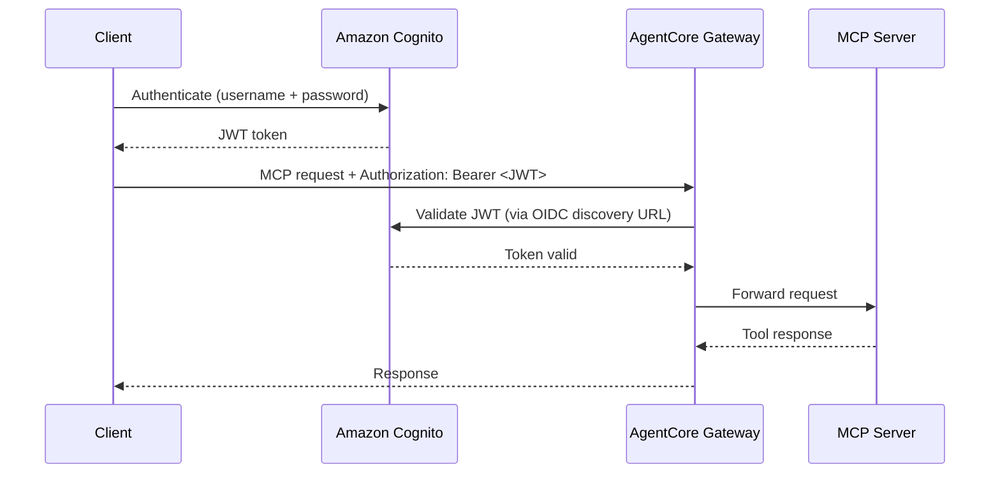
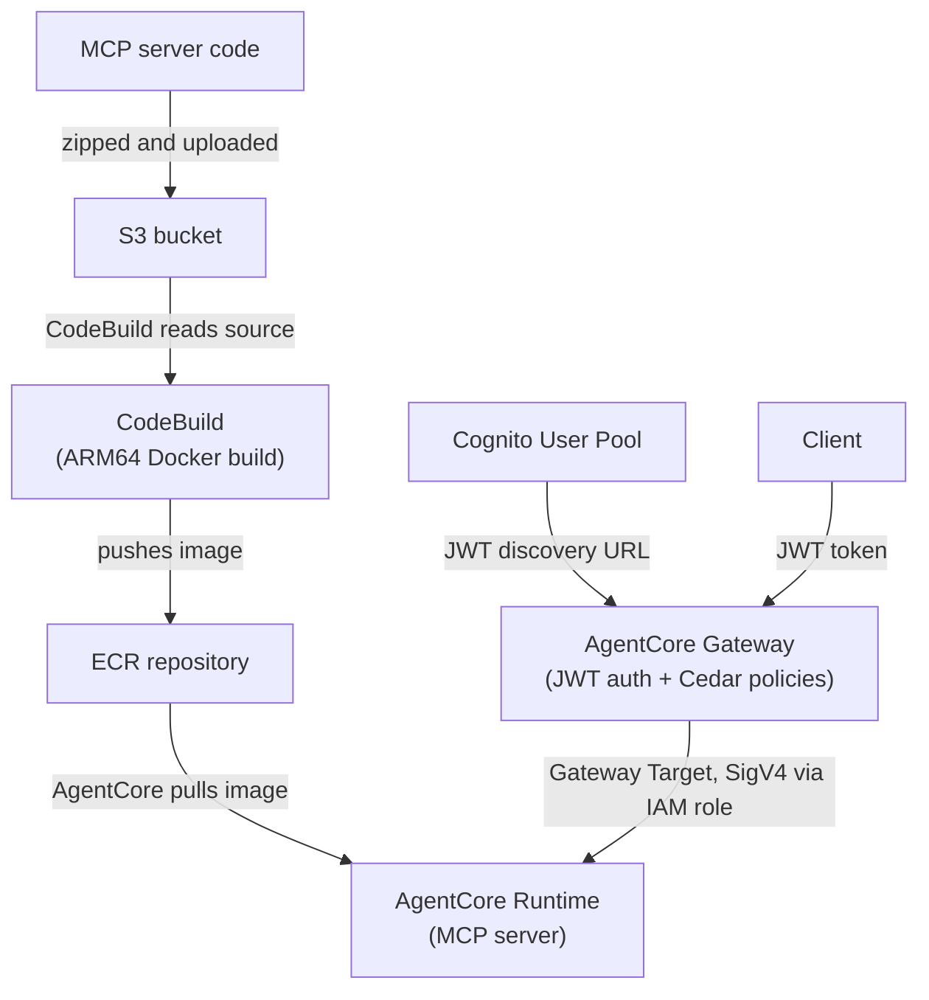
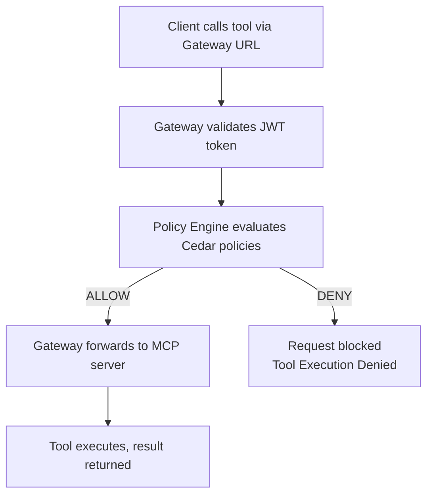

---
---
# Module 2: Hosting an MCP server behind an AgentCore Gateway

**Duration:** ~45 minutes

## What you'll learn

- What the Model Context Protocol (MCP) is and why it matters for agent-tool communication
- How to build an MCP server with FastMCP in Python
- How to deploy an AgentCore Gateway that secures your MCP server with JWT tokens from Cognito
- How to use Pulumi secrets for sensitive config
- How AgentCore's Policy Engine enforces fine-grained access control using Cedar policies

## Key concepts

Before you start coding, let's cover the core technologies this module uses.

### Model Context Protocol (MCP)

[The Model Context Protocol](https://modelcontextprotocol.io/) is an open standard for how agents discover and call tools. Without MCP, every agent framework invents its own way to connect to tools. With MCP, a tool exposes a standard HTTP endpoint, and any MCP-compatible agent can list the available tools and call them.

[AgentCore Gateway](https://docs.aws.amazon.com/bedrock-agentcore/latest/devguide/gateway.html) supports MCP natively. When you set `serverProtocol: "MCP"` on a runtime, AgentCore knows your container speaks MCP and routes requests accordingly.

The transport we use here is Stateless Streamable HTTP. Each request is independent (no persistent WebSocket connection), and the server identifies sessions via an `MCP-Session-Id` header. This makes the server easy to scale since there's no session state to track.

### AgentCore Gateway

The [AgentCore Gateway](https://docs.aws.amazon.com/bedrock-agentcore/latest/devguide/gateway.html) is the front door for clients calling your MCP tools. It handles JWT token validation, routes requests to the correct backend, and enforces Cedar access policies - all before your server code sees a single request. Your MCP server never deals with auth; the Gateway handles it.

A [Gateway Target](https://docs.aws.amazon.com/bedrock-agentcore/latest/devguide/gateway-add-target-api-target-config.html) connects the Gateway to a backend - in our case, an AgentCore-hosted MCP server runtime. The Gateway uses its IAM role to call the runtime via SigV4-signed requests.

The [AgentCore Runtime](https://docs.aws.amazon.com/bedrock-agentcore/latest/devguide/agents-tools-runtime.html) is the containerized service that runs your MCP server. Like Module 1, you point it at a Docker image in ECR and AgentCore manages the rest. The runtime itself has no auth - that's the Gateway's job.

### JWT authentication with Cognito

If you deploy an MCP server without authentication, anyone who knows the URL can call your tools. That's fine for local development, but not for production.

We'll use Amazon Cognito as the identity provider. Cognito issues JWT tokens, and AgentCore validates them at the gateway before forwarding requests to your MCP server. The flow looks like this:



The `authorizerConfiguration` on the AgentCore Gateway ties your Cognito User Pool to the request flow. Only tokens issued for your specific app client are accepted.

### Architecture

The deployment pipeline is the same as Module 1 for the MCP server container. The new pieces are the Cognito User Pool, the AgentCore Gateway, and the Gateway Target that connects them.



## Step 1: Create a new Pulumi project

<div class="lang-tabs" markdown="1">

<div class="lang-tab" data-lang="typescript" markdown="1">

```bash
mkdir 02-mcp-server && cd 02-mcp-server
pulumi new aws-typescript --name mcp-server --yes
```

</div>

<div class="lang-tab" data-lang="python" markdown="1">

```bash
mkdir 02-mcp-server && cd 02-mcp-server
pulumi new aws-python --name mcp-server --yes
```

</div>

</div>

Add the ESC environment to `Pulumi.dev.yaml`:

```yaml
environment:
  - aws-bedrock-workshop/dev
```

The `pulumi new` template already includes the AWS provider. Pin it to the version this workshop uses:

<div class="lang-tabs" markdown="1">

<div class="lang-tab" data-lang="typescript" markdown="1">

```bash
npm install @pulumi/aws@7.23.0
```

</div>

<div class="lang-tab" data-lang="python" markdown="1">

```bash
uv add pulumi-aws>=7.23.0
```

</div>

</div>

Set your unique stack name and store the test password in the shared ESC environment:

```bash
pulumi config set stackName agentcore-mcp-<id>
pulumi env set aws-bedrock-workshop/dev 'pulumiConfig.mcp-server-agentcore-runtime:testPassword' 'TestPassword123' --secret
```

## Step 2: Write the MCP server

Create the server source directory:

```bash
mkdir -p mcp-server-code
```

Create `mcp-server-code/mcp_server.py`:

```python
from mcp.server.fastmcp import FastMCP

mcp = FastMCP(host="0.0.0.0", stateless_http=True)


@mcp.tool()
def add_numbers(a: int, b: int) -> int:
    """Add two numbers together"""
    return a + b


@mcp.tool()
def multiply_numbers(a: int, b: int) -> int:
    """Multiply two numbers together"""
    return a * b


@mcp.tool()
def greet_user(name: str) -> str:
    """Greet a user by name"""
    return f"Hello, {name}! Nice to meet you."


if __name__ == "__main__":
    mcp.run(transport="streamable-http")
```

That's the entire MCP server. Three tools, about 20 lines. The `@mcp.tool()` decorator registers each function as an MCP-callable tool. `stateless_http=True` tells FastMCP to use the Streamable HTTP transport.

Create `mcp-server-code/requirements.txt`:

```text
mcp>=1.10.0
boto3
bedrock-agentcore
```

Create `mcp-server-code/Dockerfile`:

```dockerfile
FROM public.ecr.aws/docker/library/python:3.11-slim
WORKDIR /app

COPY requirements.txt requirements.txt
RUN pip install -r requirements.txt

# Create non-root user
RUN useradd -m -u 1000 bedrock_agentcore
USER bedrock_agentcore

EXPOSE 8000

COPY . .

CMD ["python", "-m", "mcp_server"]
```

This Dockerfile is simpler than the agent one from Module 1. No OpenTelemetry, and it only exposes port 8000 (the MCP HTTP endpoint). The MCP server doesn't need the agent runtime wrapper since it speaks HTTP directly.

## Step 3: Create the Cognito password setter Lambda

Cognito doesn't let you set a permanent password during user creation. A small Lambda function calls `AdminSetUserPassword` after the user is created. Create the directory and the handler:

```bash
mkdir -p lambda/cognito-password-setter
```

Create `lambda/cognito-password-setter/index.py`:

```python
import json
import logging

import boto3


LOGGER = logging.getLogger()
LOGGER.setLevel(logging.INFO)


def handler(event, _context):
    LOGGER.info("Received event: %s", json.dumps(event))

    user_pool_id = event["userPoolId"]
    username = event["username"]
    password = event["password"]
    region = event.get("region")

    cognito = boto3.client("cognito-idp", region_name=region)
    cognito.admin_set_user_password(
        UserPoolId=user_pool_id,
        Username=username,
        Password=password,
        Permanent=True,
    )

    LOGGER.info("Password set successfully for user: %s", username)
    return {"status": "SUCCESS", "username": username}
```

## Step 4: Create the build trigger Lambda

This is identical to Module 1. The Lambda starts a CodeBuild job and polls until it completes. Pulumi calls it during deployment.

```bash
mkdir -p lambda/build-trigger
```

Create `lambda/build-trigger/index.py`:

```python
import json
import logging
import time

import boto3


LOGGER = logging.getLogger()
LOGGER.setLevel(logging.INFO)


def handler(event, _context):
    LOGGER.info("Received event: %s", json.dumps(event))

    project_name = event["projectName"]
    region = event.get("region")
    poll_interval_seconds = int(event.get("pollIntervalSeconds", 15))

    codebuild = boto3.client("codebuild", region_name=region)
    response = codebuild.start_build(projectName=project_name)
    build_id = response["build"]["id"]
    LOGGER.info("Started build %s for project %s", build_id, project_name)

    while True:
        build_response = codebuild.batch_get_builds(ids=[build_id])
        build = build_response["builds"][0]
        status = build["buildStatus"]

        if status == "SUCCEEDED":
            LOGGER.info("Build %s succeeded", build_id)
            return {
                "buildId": build_id,
                "status": status,
                "imageDigest": build.get("resolvedSourceVersion"),
            }

        if status in {"FAILED", "FAULT", "STOPPED", "TIMED_OUT"}:
            LOGGER.error("Build %s failed with status %s", build_id, status)
            raise RuntimeError(f"CodeBuild {build_id} failed with status {status}")

        LOGGER.info("Build %s status: %s", build_id, status)
        time.sleep(poll_interval_seconds)
```

## Step 5: Create the buildspec

Create `buildspec.yml` in the project root:

```yaml
version: 0.2

phases:
  pre_build:
    commands:
      - echo Source code already extracted by CodeBuild
      - cd $CODEBUILD_SRC_DIR
      - echo Logging in to Amazon ECR
      - aws ecr get-login-password --region $AWS_DEFAULT_REGION | docker login --username AWS --password-stdin $AWS_ACCOUNT_ID.dkr.ecr.$AWS_DEFAULT_REGION.amazonaws.com

  build:
    commands:
      - echo Build started on `date`
      - echo Building the Docker image for the basic agent ARM64 image
      - docker build -t $IMAGE_REPO_NAME:$IMAGE_TAG .
      - docker tag $IMAGE_REPO_NAME:$IMAGE_TAG $AWS_ACCOUNT_ID.dkr.ecr.$AWS_DEFAULT_REGION.amazonaws.com/$IMAGE_REPO_NAME:$IMAGE_TAG

  post_build:
    commands:
      - echo Build completed on `date`
      - echo Pushing the Docker image
      - docker push $AWS_ACCOUNT_ID.dkr.ecr.$AWS_DEFAULT_REGION.amazonaws.com/$IMAGE_REPO_NAME:$IMAGE_TAG
      - echo ARM64 Docker image pushed successfully
```

## Step 6: Write the Pulumi infrastructure

Now the infrastructure file. We'll build it step by step. Each section adds resources that depend on what came before.

### Configuration and data sources

<details>
<summary><strong>Want to know more?</strong> - Pulumi Registry</summary>
<p><a href="https://www.pulumi.com/docs/concepts/config/">pulumi.Config</a></p>
</details>

<div class="lang-tabs" markdown="1">

<div class="lang-tab" data-lang="typescript" markdown="1">

```typescript
import * as pulumi from "@pulumi/pulumi";
import * as aws from "@pulumi/aws";
import { createHash } from "crypto";
import * as fs from "fs";
import * as path from "path";

const config = new pulumi.Config();
const agentName = config.get("agentName") || "MCPServerAgent";
const networkMode = config.get("networkMode") || "PUBLIC";
const imageTag = config.get("imageTag") || "latest";
const stackName = config.get("stackName") || "agentcore-mcp-server";
const description =
  config.get("description") || "MCP server runtime with JWT authentication";
const environmentVariables =
  config.getObject<Record<string, string>>("environmentVariables") || {};
const ecrRepositoryName = config.get("ecrRepositoryName") || "mcp-server";
const testUserName = config.get("testUsername") || "testuser";
const testUserPassword = config.requireSecret("testPassword");

const awsConfig = new pulumi.Config("aws");
const awsRegion = awsConfig.require("region");

const currentIdentity = aws.getCallerIdentityOutput({});
const currentRegion = aws.getRegionOutput({});
```

</div>

<div class="lang-tab" data-lang="python" markdown="1">

```python
import hashlib
import json
import os

import pulumi
import pulumi_aws as aws

config = pulumi.Config()
agent_name = config.get("agentName") or "MCPServerAgent"
network_mode = config.get("networkMode") or "PUBLIC"
image_tag = config.get("imageTag") or "latest"
stack_name = config.get("stackName") or "agentcore-mcp-server"
description = (
    config.get("description")
    or "MCP server runtime with JWT authentication"
)
environment_variables = config.get_object("environmentVariables") or {}
ecr_repository_name = config.get("ecrRepositoryName") or "mcp-server"
test_user_name = config.get("testUsername") or "testuser"
test_user_password = config.require_secret("testPassword")

aws_config = pulumi.Config("aws")
aws_region = aws_config.require("region")

current_identity = aws.get_caller_identity_output()
current_region = aws.get_region_output()
```

</div>

</div>

`config.requireSecret("testPassword")` marks the value as a Pulumi secret. Pulumi encrypts it in the state file and masks it in terminal output. The password never appears in plaintext in logs or `pulumi stack output`.

### S3 bucket for MCP server source code

The server code gets zipped and uploaded to S3 so CodeBuild can read it.

<details>
<summary><strong>Want to know more?</strong> - Pulumi Registry</summary>
<p><a href="https://www.pulumi.com/registry/packages/aws/api-docs/s3/bucket/">aws.s3.Bucket</a> &middot; <a href="https://www.pulumi.com/registry/packages/aws/api-docs/s3/bucketpublicaccessblock/">aws.s3.BucketPublicAccessBlock</a> &middot; <a href="https://www.pulumi.com/registry/packages/aws/api-docs/s3/bucketversioning/">aws.s3.BucketVersioning</a> &middot; <a href="https://www.pulumi.com/registry/packages/aws/api-docs/s3/bucketobjectv2/">aws.s3.BucketObjectv2</a></p>
</details>

<div class="lang-tabs" markdown="1">

<div class="lang-tab" data-lang="typescript" markdown="1">

```typescript
const agentSourceBucket = new aws.s3.Bucket("agent_source", {
  bucketPrefix: `${stackName}-source-`,
  forceDestroy: true,
  tags: {
    Name: `${stackName}-mcp-server-source`,
    Purpose: "Store MCP server source code for CodeBuild",
  },
});

new aws.s3.BucketPublicAccessBlock("agent_source", {
  bucket: agentSourceBucket.id,
  blockPublicAcls: true,
  blockPublicPolicy: true,
  ignorePublicAcls: true,
  restrictPublicBuckets: true,
});

new aws.s3.BucketVersioning("agent_source", {
  bucket: agentSourceBucket.id,
  versioningConfiguration: {
    status: "Enabled",
  },
});

const agentSourceObject = new aws.s3.BucketObjectv2("agent_source", {
  bucket: agentSourceBucket.id,
  key: "mcp-server-code.zip",
  source: new pulumi.asset.FileArchive(
    path.resolve(__dirname, "mcp-server-code"),
  ),
  tags: {
    Name: "mcp-server-source-code",
  },
});
```

</div>

<div class="lang-tab" data-lang="python" markdown="1">

```python
agent_source_bucket = aws.s3.Bucket(
    "agent_source",
    bucket_prefix=f"{stack_name}-source-",
    force_destroy=True,
    tags={
        "Name": f"{stack_name}-mcp-server-source",
        "Purpose": "Store MCP server source code for CodeBuild",
    },
)

aws.s3.BucketPublicAccessBlock(
    "agent_source",
    bucket=agent_source_bucket.id,
    block_public_acls=True,
    block_public_policy=True,
    ignore_public_acls=True,
    restrict_public_buckets=True,
)

aws.s3.BucketVersioning(
    "agent_source",
    bucket=agent_source_bucket.id,
    versioning_configuration={"status": "Enabled"},
)

agent_source_object = aws.s3.BucketObjectv2(
    "agent_source",
    bucket=agent_source_bucket.id,
    key="mcp-server-code.zip",
    source=pulumi.FileArchive(
        os.path.join(os.path.dirname(__file__), "mcp-server-code")
    ),
    tags={"Name": "mcp-server-source-code"},
)
```

</div>

</div>

The `FileArchive` automatically zips the `mcp-server-code/` directory. Versioning is enabled so Pulumi can detect when the source changes and trigger a rebuild.

### Cognito User Pool

The User Pool is the identity store. It issues JWT tokens that AgentCore validates.

<details>
<summary><strong>Want to know more?</strong> - Pulumi Registry</summary>
<p><a href="https://www.pulumi.com/registry/packages/aws/api-docs/cognito/userpool/">aws.cognito.UserPool</a></p>
</details>

<div class="lang-tabs" markdown="1">

<div class="lang-tab" data-lang="typescript" markdown="1">

```typescript
const mcpUserPool = new aws.cognito.UserPool("mcp_user_pool", {
  name: `${stackName}-user-pool`,
  passwordPolicy: {
    minimumLength: 8,
    requireUppercase: false,
    requireLowercase: false,
    requireNumbers: false,
    requireSymbols: false,
  },
  schemas: [
    {
      name: "email",
      attributeDataType: "String",
      required: false,
      mutable: true,
    },
  ],
  tags: {
    Name: `${stackName}-user-pool`,
    StackName: stackName,
    Module: "Cognito",
  },
});
```

</div>

<div class="lang-tab" data-lang="python" markdown="1">

```python
mcp_user_pool = aws.cognito.UserPool(
    "mcp_user_pool",
    name=f"{stack_name}-user-pool",
    password_policy={
        "minimum_length": 8,
        "require_uppercase": False,
        "require_lowercase": False,
        "require_numbers": False,
        "require_symbols": False,
    },
    schemas=[
        {
            "name": "email",
            "attribute_data_type": "String",
            "required": False,
            "mutable": True,
        }
    ],
    tags={
        "Name": f"{stack_name}-user-pool",
        "StackName": stack_name,
        "Module": "Cognito",
    },
)
```

</div>

</div>

The relaxed password policy is for the workshop only - in production you'd want stricter requirements. The `email` schema attribute is optional but useful for identifying users.

### Cognito User Pool Client

The app client is what the MCP client presents when requesting tokens. AgentCore's authorizer restricts access to tokens issued for this specific client ID.

<details>
<summary><strong>Want to know more?</strong> - Pulumi Registry</summary>
<p><a href="https://www.pulumi.com/registry/packages/aws/api-docs/cognito/userpoolclient/">aws.cognito.UserPoolClient</a></p>
</details>

<div class="lang-tabs" markdown="1">

<div class="lang-tab" data-lang="typescript" markdown="1">

```typescript
const mcpClient = new aws.cognito.UserPoolClient("mcp_client", {
  name: `${stackName}-client`,
  userPoolId: mcpUserPool.id,
  explicitAuthFlows: ["ALLOW_USER_PASSWORD_AUTH", "ALLOW_REFRESH_TOKEN_AUTH"],
  generateSecret: false,
  preventUserExistenceErrors: "ENABLED",
});
```

</div>

<div class="lang-tab" data-lang="python" markdown="1">

```python
mcp_client = aws.cognito.UserPoolClient(
    "mcp_client",
    name=f"{stack_name}-client",
    user_pool_id=mcp_user_pool.id,
    explicit_auth_flows=["ALLOW_USER_PASSWORD_AUTH", "ALLOW_REFRESH_TOKEN_AUTH"],
    generate_secret=False,
    prevent_user_existence_errors="ENABLED",
)
```

</div>

</div>

`ALLOW_USER_PASSWORD_AUTH` enables the username/password flow used by the `get_token.py` helper script. `preventUserExistenceErrors` prevents attackers from enumerating valid usernames through error messages.

### Test user

This creates a test user in the pool. The user is created in `FORCE_CHANGE_PASSWORD` state - the Lambda in the next step sets a permanent password.

<details>
<summary><strong>Want to know more?</strong> - Pulumi Registry</summary>
<p><a href="https://www.pulumi.com/registry/packages/aws/api-docs/cognito/user/">aws.cognito.User</a></p>
</details>

<div class="lang-tabs" markdown="1">

<div class="lang-tab" data-lang="typescript" markdown="1">

```typescript
const testUser = new aws.cognito.User("test_user", {
  userPoolId: mcpUserPool.id,
  username: testUserName,
  messageAction: "SUPPRESS",
});
```

</div>

<div class="lang-tab" data-lang="python" markdown="1">

```python
test_user = aws.cognito.User(
    "test_user",
    user_pool_id=mcp_user_pool.id,
    username=test_user_name,
    message_action="SUPPRESS",
)
```

</div>

</div>

`messageAction: "SUPPRESS"` prevents Cognito from sending a welcome email - useful for programmatically created test users.

### Cognito password setter Lambda

This follows the same pattern as the build trigger Lambda from Module 1, adapted for the Cognito use case. A Lambda function with its own IAM role calls `AdminSetUserPassword` to set the user's permanent password from the Pulumi secret.

<details>
<summary><strong>Want to know more?</strong> - Pulumi Registry</summary>
<p><a href="https://www.pulumi.com/registry/packages/aws/api-docs/iam/role/">aws.iam.Role</a> &middot; <a href="https://www.pulumi.com/registry/packages/aws/api-docs/iam/rolepolicyattachment/">aws.iam.RolePolicyAttachment</a> &middot; <a href="https://www.pulumi.com/registry/packages/aws/api-docs/lambda/function/">aws.lambda.Function</a> &middot; <a href="https://www.pulumi.com/registry/packages/aws/api-docs/lambda/invocation/">aws.lambda.Invocation</a></p>
</details>

<div class="lang-tabs" markdown="1">

<div class="lang-tab" data-lang="typescript" markdown="1">

```typescript
const cognitoPasswordSetterRole = new aws.iam.Role("cognito_password_setter", {
  name: `${stackName}-cognito-pw-setter-role`,
  assumeRolePolicy: pulumi.jsonStringify({
    Version: "2012-10-17",
    Statement: [
      {
        Effect: "Allow",
        Principal: {
          Service: "lambda.amazonaws.com",
        },
        Action: "sts:AssumeRole",
      },
    ],
  }),
  inlinePolicies: [
    {
      name: "CognitoSetPasswordPolicy",
      policy: pulumi.jsonStringify({
        Version: "2012-10-17",
        Statement: [
          {
            Sid: "SetUserPassword",
            Effect: "Allow",
            Action: ["cognito-idp:AdminSetUserPassword"],
            Resource: mcpUserPool.arn,
          },
        ],
      }),
    },
  ],
  tags: {
    Name: `${stackName}-cognito-pw-setter-role`,
    Module: "Lambda",
  },
});

const cognitoPasswordSetterBasicExecution = new aws.iam.RolePolicyAttachment(
  "cognito_password_setter_basic_execution",
  {
    role: cognitoPasswordSetterRole.name,
    policyArn:
      "arn:aws:iam::aws:policy/service-role/AWSLambdaBasicExecutionRole",
  },
);

const cognitoPasswordSetterFunction = new aws.lambda.Function(
  "cognito_password_setter",
  {
    name: `${stackName}-cognito-pw-setter`,
    role: cognitoPasswordSetterRole.arn,
    runtime: aws.lambda.Runtime.Python3d12,
    handler: "index.handler",
    timeout: 60,
    code: new pulumi.asset.FileArchive(
      path.resolve(__dirname, "lambda/cognito-password-setter"),
    ),
    tags: {
      Name: `${stackName}-cognito-pw-setter`,
      Module: "Lambda",
    },
  },
);

const setCognitoPassword = new aws.lambda.Invocation(
  "set_cognito_password",
  {
    functionName: cognitoPasswordSetterFunction.name,
    input: pulumi
      .all([mcpUserPool.id, currentRegion, testUserPassword])
      .apply(([userPoolId, region, password]) =>
        JSON.stringify({
          userPoolId,
          username: testUserName,
          password,
          region: region.region,
        }),
      ),
  },
  {
    dependsOn: [
      testUser,
      cognitoPasswordSetterBasicExecution,
      cognitoPasswordSetterFunction,
    ],
  },
);
```

</div>

<div class="lang-tab" data-lang="python" markdown="1">

```python
cognito_password_setter_role = aws.iam.Role(
    "cognito_password_setter",
    name=f"{stack_name}-cognito-pw-setter-role",
    assume_role_policy=pulumi.Output.json_dumps(
        {
            "Version": "2012-10-17",
            "Statement": [
                {
                    "Effect": "Allow",
                    "Principal": {"Service": "lambda.amazonaws.com"},
                    "Action": "sts:AssumeRole",
                }
            ],
        }
    ),
    inline_policies=[
        aws.iam.RoleInlinePolicyArgs(
            name="CognitoSetPasswordPolicy",
            policy=pulumi.Output.json_dumps(
                {
                    "Version": "2012-10-17",
                    "Statement": [
                        {
                            "Sid": "SetUserPassword",
                            "Effect": "Allow",
                            "Action": ["cognito-idp:AdminSetUserPassword"],
                            "Resource": mcp_user_pool.arn,
                        }
                    ],
                }
            ),
        )
    ],
    tags={
        "Name": f"{stack_name}-cognito-pw-setter-role",
        "Module": "Lambda",
    },
)

cognito_password_setter_basic_execution = aws.iam.RolePolicyAttachment(
    "cognito_password_setter_basic_execution",
    role=cognito_password_setter_role.name,
    policy_arn="arn:aws:iam::aws:policy/service-role/AWSLambdaBasicExecutionRole",
)

cognito_password_setter_function = aws.lambda_.Function(
    "cognito_password_setter",
    name=f"{stack_name}-cognito-pw-setter",
    role=cognito_password_setter_role.arn,
    runtime=aws.lambda_.Runtime.PYTHON3D12,
    handler="index.handler",
    timeout=60,
    code=pulumi.FileArchive(
        os.path.join(os.path.dirname(__file__), "lambda/cognito-password-setter")
    ),
    tags={
        "Name": f"{stack_name}-cognito-pw-setter",
        "Module": "Lambda",
    },
)

set_cognito_password = aws.lambda_.Invocation(
    "set_cognito_password",
    function_name=cognito_password_setter_function.name,
    input=pulumi.Output.all(
        mcp_user_pool.id, current_region, test_user_password
    ).apply(
        lambda args: json.dumps(
            {
                "userPoolId": args[0],
                "username": test_user_name,
                "password": args[2],
                "region": args[1].region,
            }
        )
    ),
    opts=pulumi.ResourceOptions(
        depends_on=[
            test_user,
            cognito_password_setter_basic_execution,
            cognito_password_setter_function,
        ]
    ),
)
```

</div>

</div>

The `dependsOn` list ensures the user exists and the Lambda function is deployed before Pulumi invokes it. The secret value flows through `pulumi.all` / `pulumi.Output.all` so it's never exposed in plaintext in the state.

### ECR repository

The ECR repository stores the Docker image that CodeBuild produces.

<details>
<summary><strong>Want to know more?</strong> - Pulumi Registry</summary>
<p><a href="https://www.pulumi.com/registry/packages/aws/api-docs/ecr/repository/">aws.ecr.Repository</a> &middot; <a href="https://www.pulumi.com/registry/packages/aws/api-docs/ecr/repositorypolicy/">aws.ecr.RepositoryPolicy</a> &middot; <a href="https://www.pulumi.com/registry/packages/aws/api-docs/ecr/lifecyclepolicy/">aws.ecr.LifecyclePolicy</a></p>
</details>

<div class="lang-tabs" markdown="1">

<div class="lang-tab" data-lang="typescript" markdown="1">

```typescript
const serverEcr = new aws.ecr.Repository("server_ecr", {
  name: `${stackName}-${ecrRepositoryName}`,
  imageTagMutability: "MUTABLE",
  imageScanningConfiguration: {
    scanOnPush: true,
  },
  forceDelete: true,
  tags: {
    Name: `${stackName}-ecr-repository`,
    Module: "ECR",
  },
});

new aws.ecr.RepositoryPolicy("server_ecr", {
  repository: serverEcr.name,
  policy: pulumi.jsonStringify({
    Version: "2012-10-17",
    Statement: [
      {
        Sid: "AllowPullFromAccount",
        Effect: "Allow",
        Principal: {
          AWS: currentIdentity.apply(
            (id) => `arn:aws:iam::${id.accountId}:root`,
          ),
        },
        Action: ["ecr:BatchGetImage", "ecr:GetDownloadUrlForLayer"],
      },
    ],
  }),
});

new aws.ecr.LifecyclePolicy("server_ecr", {
  repository: serverEcr.name,
  policy: JSON.stringify({
    rules: [
      {
        rulePriority: 1,
        description: "Keep last 5 images",
        selection: {
          tagStatus: "any",
          countType: "imageCountMoreThan",
          countNumber: 5,
        },
        action: {
          type: "expire",
        },
      },
    ],
  }),
});
```

</div>

<div class="lang-tab" data-lang="python" markdown="1">

```python
server_ecr = aws.ecr.Repository(
    "server_ecr",
    name=f"{stack_name}-{ecr_repository_name}",
    image_tag_mutability="MUTABLE",
    image_scanning_configuration={"scan_on_push": True},
    force_delete=True,
    tags={
        "Name": f"{stack_name}-ecr-repository",
        "Module": "ECR",
    },
)

aws.ecr.RepositoryPolicy(
    "server_ecr",
    repository=server_ecr.name,
    policy=pulumi.Output.json_dumps(
        {
            "Version": "2012-10-17",
            "Statement": [
                {
                    "Sid": "AllowPullFromAccount",
                    "Effect": "Allow",
                    "Principal": {
                        "AWS": current_identity.apply(
                            lambda id: f"arn:aws:iam::{id.account_id}:root"
                        ),
                    },
                    "Action": ["ecr:BatchGetImage", "ecr:GetDownloadUrlForLayer"],
                }
            ],
        }
    ),
)

aws.ecr.LifecyclePolicy(
    "server_ecr",
    repository=server_ecr.name,
    policy=json.dumps(
        {
            "rules": [
                {
                    "rulePriority": 1,
                    "description": "Keep last 5 images",
                    "selection": {
                        "tagStatus": "any",
                        "countType": "imageCountMoreThan",
                        "countNumber": 5,
                    },
                    "action": {"type": "expire"},
                }
            ]
        }
    ),
)
```

</div>

</div>

The repository policy restricts image pulls to your AWS account. The lifecycle policy keeps only the last 5 images to avoid accumulating old builds. `scanOnPush` enables automatic vulnerability scanning.

### Agent execution role

This IAM role is the identity your running MCP server uses. The trust policy only allows AgentCore to assume it, scoped to your account and region.

This follows the same pattern as Module 1, adapted for the MCP server (the inline policy references `serverEcr` instead of `agentEcr`).

<details>
<summary><strong>Want to know more?</strong> - Pulumi Registry</summary>
<p><a href="https://www.pulumi.com/registry/packages/aws/api-docs/iam/role/">aws.iam.Role</a> &middot; <a href="https://www.pulumi.com/registry/packages/aws/api-docs/iam/rolepolicyattachment/">aws.iam.RolePolicyAttachment</a> &middot; <a href="https://www.pulumi.com/registry/packages/aws/api-docs/iam/rolepolicy/">aws.iam.RolePolicy</a></p>
</details>

<div class="lang-tabs" markdown="1">

<div class="lang-tab" data-lang="typescript" markdown="1">

```typescript
const agentExecution = new aws.iam.Role("agent_execution", {
  name: `${stackName}-agent-execution-role`,
  assumeRolePolicy: pulumi.jsonStringify({
    Version: "2012-10-17",
    Statement: [
      {
        Sid: "AssumeRolePolicy",
        Effect: "Allow",
        Principal: {
          Service: "bedrock-agentcore.amazonaws.com",
        },
        Action: "sts:AssumeRole",
        Condition: {
          StringEquals: {
            "aws:SourceAccount": currentIdentity.apply((id) => id.accountId),
          },
          ArnLike: {
            "aws:SourceArn": pulumi
              .all([currentRegion, currentIdentity])
              .apply(
                ([region, identity]) =>
                  `arn:aws:bedrock-agentcore:${region.region}:${identity.accountId}:*`,
              ),
          },
        },
      },
    ],
  }),
  tags: {
    Name: `${stackName}-agent-execution-role`,
    Module: "IAM",
  },
});

const agentExecutionManaged = new aws.iam.RolePolicyAttachment(
  "agent_execution_managed",
  {
    role: agentExecution.name,
    policyArn: "arn:aws:iam::aws:policy/BedrockAgentCoreFullAccess",
  },
);

const agentExecutionRolePolicy = new aws.iam.RolePolicy("agent_execution", {
  name: "AgentCoreExecutionPolicy",
  role: agentExecution.id,
  policy: pulumi.jsonStringify({
    Version: "2012-10-17",
    Statement: [
      {
        Sid: "ECRImageAccess",
        Effect: "Allow",
        Action: [
          "ecr:BatchGetImage",
          "ecr:GetDownloadUrlForLayer",
          "ecr:BatchCheckLayerAvailability",
        ],
        Resource: serverEcr.arn,
      },
      {
        Sid: "ECRTokenAccess",
        Effect: "Allow",
        Action: ["ecr:GetAuthorizationToken"],
        Resource: "*",
      },
      {
        Sid: "CloudWatchLogs",
        Effect: "Allow",
        Action: [
          "logs:DescribeLogStreams",
          "logs:CreateLogGroup",
          "logs:DescribeLogGroups",
          "logs:CreateLogStream",
          "logs:PutLogEvents",
        ],
        Resource: pulumi
          .all([currentRegion, currentIdentity])
          .apply(
            ([region, identity]) =>
              `arn:aws:logs:${region.region}:${identity.accountId}:log-group:/aws/bedrock-agentcore/runtimes/*`,
          ),
      },
      {
        Sid: "XRayTracing",
        Effect: "Allow",
        Action: [
          "xray:PutTraceSegments",
          "xray:PutTelemetryRecords",
          "xray:GetSamplingRules",
          "xray:GetSamplingTargets",
        ],
        Resource: "*",
      },
      {
        Sid: "CloudWatchMetrics",
        Effect: "Allow",
        Action: ["cloudwatch:PutMetricData"],
        Resource: "*",
        Condition: {
          StringEquals: {
            "cloudwatch:namespace": "bedrock-agentcore",
          },
        },
      },
      {
        Sid: "BedrockModelInvocation",
        Effect: "Allow",
        Action: [
          "bedrock:InvokeModel",
          "bedrock:InvokeModelWithResponseStream",
        ],
        Resource: "*",
      },
      {
        Sid: "GetAgentAccessToken",
        Effect: "Allow",
        Action: [
          "bedrock-agentcore:GetWorkloadAccessToken",
          "bedrock-agentcore:GetWorkloadAccessTokenForJWT",
          "bedrock-agentcore:GetWorkloadAccessTokenForUserId",
        ],
        Resource: [
          pulumi
            .all([currentRegion, currentIdentity])
            .apply(
              ([region, identity]) =>
                `arn:aws:bedrock-agentcore:${region.region}:${identity.accountId}:workload-identity-directory/default`,
            ),
          pulumi
            .all([currentRegion, currentIdentity])
            .apply(
              ([region, identity]) =>
                `arn:aws:bedrock-agentcore:${region.region}:${identity.accountId}:workload-identity-directory/default/workload-identity/*`,
            ),
        ],
      },
    ],
  }),
});
```

</div>

<div class="lang-tab" data-lang="python" markdown="1">

```python
agent_execution = aws.iam.Role(
    "agent_execution",
    name=f"{stack_name}-agent-execution-role",
    assume_role_policy=pulumi.Output.json_dumps(
        {
            "Version": "2012-10-17",
            "Statement": [
                {
                    "Sid": "AssumeRolePolicy",
                    "Effect": "Allow",
                    "Principal": {"Service": "bedrock-agentcore.amazonaws.com"},
                    "Action": "sts:AssumeRole",
                    "Condition": {
                        "StringEquals": {
                            "aws:SourceAccount": current_identity.apply(
                                lambda id: id.account_id
                            ),
                        },
                        "ArnLike": {
                            "aws:SourceArn": pulumi.Output.all(
                                current_region, current_identity
                            ).apply(
                                lambda args: f"arn:aws:bedrock-agentcore:{args[0].region}:{args[1].account_id}:*"
                            ),
                        },
                    },
                }
            ],
        }
    ),
    tags={
        "Name": f"{stack_name}-agent-execution-role",
        "Module": "IAM",
    },
)

agent_execution_managed = aws.iam.RolePolicyAttachment(
    "agent_execution_managed",
    role=agent_execution.name,
    policy_arn="arn:aws:iam::aws:policy/BedrockAgentCoreFullAccess",
)

agent_execution_role_policy = aws.iam.RolePolicy(
    "agent_execution",
    name="AgentCoreExecutionPolicy",
    role=agent_execution.id,
    policy=pulumi.Output.json_dumps(
        {
            "Version": "2012-10-17",
            "Statement": [
                {
                    "Sid": "ECRImageAccess",
                    "Effect": "Allow",
                    "Action": [
                        "ecr:BatchGetImage",
                        "ecr:GetDownloadUrlForLayer",
                        "ecr:BatchCheckLayerAvailability",
                    ],
                    "Resource": server_ecr.arn,
                },
                {
                    "Sid": "ECRTokenAccess",
                    "Effect": "Allow",
                    "Action": ["ecr:GetAuthorizationToken"],
                    "Resource": "*",
                },
                {
                    "Sid": "CloudWatchLogs",
                    "Effect": "Allow",
                    "Action": [
                        "logs:DescribeLogStreams",
                        "logs:CreateLogGroup",
                        "logs:DescribeLogGroups",
                        "logs:CreateLogStream",
                        "logs:PutLogEvents",
                    ],
                    "Resource": pulumi.Output.all(
                        current_region, current_identity
                    ).apply(
                        lambda args: f"arn:aws:logs:{args[0].region}:{args[1].account_id}:log-group:/aws/bedrock-agentcore/runtimes/*"
                    ),
                },
                {
                    "Sid": "XRayTracing",
                    "Effect": "Allow",
                    "Action": [
                        "xray:PutTraceSegments",
                        "xray:PutTelemetryRecords",
                        "xray:GetSamplingRules",
                        "xray:GetSamplingTargets",
                    ],
                    "Resource": "*",
                },
                {
                    "Sid": "CloudWatchMetrics",
                    "Effect": "Allow",
                    "Action": ["cloudwatch:PutMetricData"],
                    "Resource": "*",
                    "Condition": {
                        "StringEquals": {"cloudwatch:namespace": "bedrock-agentcore"}
                    },
                },
                {
                    "Sid": "BedrockModelInvocation",
                    "Effect": "Allow",
                    "Action": [
                        "bedrock:InvokeModel",
                        "bedrock:InvokeModelWithResponseStream",
                    ],
                    "Resource": "*",
                },
                {
                    "Sid": "GetAgentAccessToken",
                    "Effect": "Allow",
                    "Action": [
                        "bedrock-agentcore:GetWorkloadAccessToken",
                        "bedrock-agentcore:GetWorkloadAccessTokenForJWT",
                        "bedrock-agentcore:GetWorkloadAccessTokenForUserId",
                    ],
                    "Resource": [
                        pulumi.Output.all(current_region, current_identity).apply(
                            lambda args: f"arn:aws:bedrock-agentcore:{args[0].region}:{args[1].account_id}:workload-identity-directory/default"
                        ),
                        pulumi.Output.all(current_region, current_identity).apply(
                            lambda args: f"arn:aws:bedrock-agentcore:{args[0].region}:{args[1].account_id}:workload-identity-directory/default/workload-identity/*"
                        ),
                    ],
                },
            ],
        }
    ),
)
```

</div>

</div>

The `ECRImageAccess` statement references `serverEcr.arn` / `server_ecr.arn` - specific to this module's ECR repository. Everything else is identical to Module 1.

### CodeBuild service role

CodeBuild needs its own IAM role with permissions to read from S3, push to ECR, and write build logs.

This follows the same pattern as Module 1, adapted for the MCP server (ECR references use `serverEcr` / `server_ecr`).

<details>
<summary><strong>Want to know more?</strong> - Pulumi Registry</summary>
<p><a href="https://www.pulumi.com/registry/packages/aws/api-docs/iam/role/">aws.iam.Role</a> &middot; <a href="https://www.pulumi.com/registry/packages/aws/api-docs/iam/rolepolicy/">aws.iam.RolePolicy</a></p>
</details>

<div class="lang-tabs" markdown="1">

<div class="lang-tab" data-lang="typescript" markdown="1">

```typescript
const codebuildRole = new aws.iam.Role("codebuild", {
  name: `${stackName}-codebuild-role`,
  assumeRolePolicy: JSON.stringify({
    Version: "2012-10-17",
    Statement: [
      {
        Effect: "Allow",
        Principal: {
          Service: "codebuild.amazonaws.com",
        },
        Action: "sts:AssumeRole",
      },
    ],
  }),
  tags: {
    Name: `${stackName}-codebuild-role`,
    Module: "IAM",
  },
});

const codebuildRolePolicy = new aws.iam.RolePolicy("codebuild", {
  name: "CodeBuildPolicy",
  role: codebuildRole.id,
  policy: pulumi.jsonStringify({
    Version: "2012-10-17",
    Statement: [
      {
        Sid: "CloudWatchLogs",
        Effect: "Allow",
        Action: [
          "logs:CreateLogGroup",
          "logs:CreateLogStream",
          "logs:PutLogEvents",
        ],
        Resource: pulumi
          .all([currentRegion, currentIdentity])
          .apply(
            ([region, identity]) =>
              `arn:aws:logs:${region.region}:${identity.accountId}:log-group:/aws/codebuild/*`,
          ),
      },
      {
        Sid: "ECRAccess",
        Effect: "Allow",
        Action: [
          "ecr:BatchCheckLayerAvailability",
          "ecr:GetDownloadUrlForLayer",
          "ecr:BatchGetImage",
          "ecr:GetAuthorizationToken",
          "ecr:PutImage",
          "ecr:InitiateLayerUpload",
          "ecr:UploadLayerPart",
          "ecr:CompleteLayerUpload",
        ],
        Resource: [serverEcr.arn, "*"],
      },
      {
        Sid: "S3SourceAccess",
        Effect: "Allow",
        Action: ["s3:GetObject", "s3:GetObjectVersion"],
        Resource: pulumi.interpolate`${agentSourceBucket.arn}/*`,
      },
      {
        Sid: "S3BucketAccess",
        Effect: "Allow",
        Action: ["s3:ListBucket", "s3:GetBucketLocation"],
        Resource: agentSourceBucket.arn,
      },
    ],
  }),
});
```

</div>

<div class="lang-tab" data-lang="python" markdown="1">

```python
agent_image_project_name = f"{stack_name}-mcp-server-build"

codebuild_role = aws.iam.Role(
    "codebuild",
    name=f"{stack_name}-codebuild-role",
    assume_role_policy=json.dumps(
        {
            "Version": "2012-10-17",
            "Statement": [
                {
                    "Effect": "Allow",
                    "Principal": {"Service": "codebuild.amazonaws.com"},
                    "Action": "sts:AssumeRole",
                }
            ],
        }
    ),
    tags={
        "Name": f"{stack_name}-codebuild-role",
        "Module": "IAM",
    },
)

codebuild_role_policy = aws.iam.RolePolicy(
    "codebuild",
    name="CodeBuildPolicy",
    role=codebuild_role.id,
    policy=pulumi.Output.json_dumps(
        {
            "Version": "2012-10-17",
            "Statement": [
                {
                    "Sid": "CloudWatchLogs",
                    "Effect": "Allow",
                    "Action": [
                        "logs:CreateLogGroup",
                        "logs:CreateLogStream",
                        "logs:PutLogEvents",
                    ],
                    "Resource": pulumi.Output.all(
                        current_region, current_identity
                    ).apply(
                        lambda args: f"arn:aws:logs:{args[0].region}:{args[1].account_id}:log-group:/aws/codebuild/*"
                    ),
                },
                {
                    "Sid": "ECRAccess",
                    "Effect": "Allow",
                    "Action": [
                        "ecr:BatchCheckLayerAvailability",
                        "ecr:GetDownloadUrlForLayer",
                        "ecr:BatchGetImage",
                        "ecr:GetAuthorizationToken",
                        "ecr:PutImage",
                        "ecr:InitiateLayerUpload",
                        "ecr:UploadLayerPart",
                        "ecr:CompleteLayerUpload",
                    ],
                    "Resource": [server_ecr.arn, "*"],
                },
                {
                    "Sid": "S3SourceAccess",
                    "Effect": "Allow",
                    "Action": ["s3:GetObject", "s3:GetObjectVersion"],
                    "Resource": pulumi.Output.concat(
                        agent_source_bucket.arn, "/*"
                    ),
                },
                {
                    "Sid": "S3BucketAccess",
                    "Effect": "Allow",
                    "Action": ["s3:ListBucket", "s3:GetBucketLocation"],
                    "Resource": agent_source_bucket.arn,
                },
            ],
        }
    ),
)
```

</div>

</div>

### Build trigger Lambda

The Lambda function that bridges Pulumi and CodeBuild. It starts a build and polls until completion, so Pulumi knows when the MCP server image is ready.

This follows the same pattern as Module 1, adapted for the MCP server. The project name is `${stackName}-mcp-server-build`.

<details>
<summary><strong>Want to know more?</strong> - Pulumi Registry</summary>
<p><a href="https://www.pulumi.com/registry/packages/aws/api-docs/iam/role/">aws.iam.Role</a> &middot; <a href="https://www.pulumi.com/registry/packages/aws/api-docs/iam/rolepolicyattachment/">aws.iam.RolePolicyAttachment</a> &middot; <a href="https://www.pulumi.com/registry/packages/aws/api-docs/lambda/function/">aws.lambda.Function</a></p>
</details>

<div class="lang-tabs" markdown="1">

<div class="lang-tab" data-lang="typescript" markdown="1">

```typescript
const agentImageProjectName = `${stackName}-mcp-server-build`;

const buildTriggerRole = new aws.iam.Role("build_trigger", {
  name: `${stackName}-build-trigger-role`,
  assumeRolePolicy: pulumi.jsonStringify({
    Version: "2012-10-17",
    Statement: [
      {
        Effect: "Allow",
        Principal: {
          Service: "lambda.amazonaws.com",
        },
        Action: "sts:AssumeRole",
      },
    ],
  }),
  inlinePolicies: [
    {
      name: "BuildTriggerPolicy",
      policy: pulumi
        .all([currentRegion, currentIdentity])
        .apply(([region, identity]) =>
          JSON.stringify({
            Version: "2012-10-17",
            Statement: [
              {
                Sid: "ManageBuild",
                Effect: "Allow",
                Action: ["codebuild:StartBuild", "codebuild:BatchGetBuilds"],
                Resource: `arn:aws:codebuild:${region.region}:${identity.accountId}:project/${agentImageProjectName}`,
              },
            ],
          }),
        ),
    },
  ],
  tags: {
    Name: `${stackName}-build-trigger-role`,
    Module: "Lambda",
  },
});

const buildTriggerBasicExecution = new aws.iam.RolePolicyAttachment(
  "build_trigger_basic_execution",
  {
    role: buildTriggerRole.name,
    policyArn:
      "arn:aws:iam::aws:policy/service-role/AWSLambdaBasicExecutionRole",
  },
);

const buildTriggerFunction = new aws.lambda.Function("build_trigger", {
  name: `${stackName}-build-trigger`,
  role: buildTriggerRole.arn,
  runtime: aws.lambda.Runtime.Python3d12,
  handler: "index.handler",
  timeout: 900,
  code: new pulumi.asset.FileArchive(
    path.resolve(__dirname, "lambda/build-trigger"),
  ),
  tags: {
    Name: `${stackName}-build-trigger`,
    Module: "Lambda",
  },
});
```

</div>

<div class="lang-tab" data-lang="python" markdown="1">

```python
build_trigger_role = aws.iam.Role(
    "build_trigger",
    name=f"{stack_name}-build-trigger-role",
    assume_role_policy=pulumi.Output.json_dumps(
        {
            "Version": "2012-10-17",
            "Statement": [
                {
                    "Effect": "Allow",
                    "Principal": {"Service": "lambda.amazonaws.com"},
                    "Action": "sts:AssumeRole",
                }
            ],
        }
    ),
    inline_policies=[
        aws.iam.RoleInlinePolicyArgs(
            name="BuildTriggerPolicy",
            policy=pulumi.Output.all(current_region, current_identity).apply(
                lambda args: json.dumps(
                    {
                        "Version": "2012-10-17",
                        "Statement": [
                            {
                                "Sid": "ManageBuild",
                                "Effect": "Allow",
                                "Action": [
                                    "codebuild:StartBuild",
                                    "codebuild:BatchGetBuilds",
                                ],
                                "Resource": f"arn:aws:codebuild:{args[0].region}:{args[1].account_id}:project/{agent_image_project_name}",
                            }
                        ],
                    }
                )
            ),
        )
    ],
    tags={
        "Name": f"{stack_name}-build-trigger-role",
        "Module": "Lambda",
    },
)

build_trigger_basic_execution = aws.iam.RolePolicyAttachment(
    "build_trigger_basic_execution",
    role=build_trigger_role.name,
    policy_arn="arn:aws:iam::aws:policy/service-role/AWSLambdaBasicExecutionRole",
)

build_trigger_function = aws.lambda_.Function(
    "build_trigger",
    name=f"{stack_name}-build-trigger",
    role=build_trigger_role.arn,
    runtime=aws.lambda_.Runtime.PYTHON3D12,
    handler="index.handler",
    timeout=900,
    code=pulumi.FileArchive(
        os.path.join(os.path.dirname(__file__), "lambda/build-trigger")
    ),
    tags={
        "Name": f"{stack_name}-build-trigger",
        "Module": "Lambda",
    },
)
```

</div>

</div>

The timeout is set to 900 seconds (15 minutes) because CodeBuild can take a while for the first build. The inline policy scopes the Lambda's permissions to only the specific CodeBuild project name.

### CodeBuild project

The CodeBuild project defines how the Docker image gets built. It reads source from S3, runs the buildspec on ARM64 hardware, and pushes the image to ECR.

<details>
<summary><strong>Want to know more?</strong> - Pulumi Registry</summary>
<p><a href="https://www.pulumi.com/registry/packages/aws/api-docs/codebuild/project/">aws.codebuild.Project</a></p>
</details>

<div class="lang-tabs" markdown="1">

<div class="lang-tab" data-lang="typescript" markdown="1">

```typescript
const buildspecContent = fs.readFileSync(
  path.resolve(__dirname, "buildspec.yml"),
  "utf-8",
);
const buildspecFingerprint = createHash("sha256")
  .update(buildspecContent)
  .digest("hex");

const agentImage = new aws.codebuild.Project("agent_image", {
  name: agentImageProjectName,
  description: `Build MCP server Docker image for ${stackName}`,
  serviceRole: codebuildRole.arn,
  buildTimeout: 60,
  artifacts: {
    type: "NO_ARTIFACTS",
  },
  environment: {
    computeType: "BUILD_GENERAL1_LARGE",
    image: "aws/codebuild/amazonlinux2-aarch64-standard:3.0",
    type: "ARM_CONTAINER",
    privilegedMode: true,
    imagePullCredentialsType: "CODEBUILD",
    environmentVariables: [
      {
        name: "AWS_DEFAULT_REGION",
        value: currentRegion.apply((r) => r.region),
      },
      {
        name: "AWS_ACCOUNT_ID",
        value: currentIdentity.apply((id) => id.accountId),
      },
      {
        name: "IMAGE_REPO_NAME",
        value: serverEcr.name,
      },
      {
        name: "IMAGE_TAG",
        value: imageTag,
      },
      {
        name: "STACK_NAME",
        value: stackName,
      },
    ],
  },
  source: {
    type: "S3",
    location: pulumi.interpolate`${agentSourceBucket.id}/${agentSourceObject.key}`,
    buildspec: buildspecContent,
  },
  logsConfig: {
    cloudwatchLogs: {
      groupName: `/aws/codebuild/${agentImageProjectName}`,
    },
  },
  tags: {
    Name: agentImageProjectName,
    Module: "CodeBuild",
  },
});
```

</div>

<div class="lang-tab" data-lang="python" markdown="1">

```python
buildspec_path = os.path.join(os.path.dirname(__file__), "buildspec.yml")
with open(buildspec_path) as f:
    buildspec_content = f.read()
buildspec_fingerprint = hashlib.sha256(buildspec_content.encode()).hexdigest()

agent_image = aws.codebuild.Project(
    "agent_image",
    name=agent_image_project_name,
    description=f"Build MCP server Docker image for {stack_name}",
    service_role=codebuild_role.arn,
    build_timeout=60,
    artifacts={"type": "NO_ARTIFACTS"},
    environment={
        "compute_type": "BUILD_GENERAL1_LARGE",
        "image": "aws/codebuild/amazonlinux2-aarch64-standard:3.0",
        "type": "ARM_CONTAINER",
        "privileged_mode": True,
        "image_pull_credentials_type": "CODEBUILD",
        "environment_variables": [
            {
                "name": "AWS_DEFAULT_REGION",
                "value": current_region.apply(lambda r: r.region),
            },
            {
                "name": "AWS_ACCOUNT_ID",
                "value": current_identity.apply(lambda id: id.account_id),
            },
            {"name": "IMAGE_REPO_NAME", "value": server_ecr.name},
            {"name": "IMAGE_TAG", "value": image_tag},
            {"name": "STACK_NAME", "value": stack_name},
        ],
    },
    source={
        "type": "S3",
        "location": pulumi.Output.concat(
            agent_source_bucket.id, "/", agent_source_object.key
        ),
        "buildspec": buildspec_content,
    },
    logs_config={
        "cloudwatch_logs": {
            "group_name": f"/aws/codebuild/{agent_image_project_name}",
        }
    },
    tags={
        "Name": agent_image_project_name,
        "Module": "CodeBuild",
    },
)
```

</div>

</div>

`ARM_CONTAINER` with the `aarch64` image ensures native ARM64 builds. `privilegedMode` is required for Docker-in-Docker builds. `IMAGE_REPO_NAME` points to `serverEcr.name` / `server_ecr.name`.

### Trigger the build

This invocation calls the Lambda function during `pulumi up` to start CodeBuild and wait for the MCP server image to be ready.

<details>
<summary><strong>Want to know more?</strong> - Pulumi Registry</summary>
<p><a href="https://www.pulumi.com/registry/packages/aws/api-docs/lambda/invocation/">aws.lambda.Invocation</a></p>
</details>

<div class="lang-tabs" markdown="1">

<div class="lang-tab" data-lang="typescript" markdown="1">

```typescript
const buildTriggerInvocationInput = pulumi
  .all([agentImage.name, currentRegion])
  .apply(([projectName, region]) =>
    JSON.stringify({
      projectName,
      region: region.region,
      pollIntervalSeconds: 15,
    }),
  );

const triggerBuild = new aws.lambda.Invocation(
  "trigger_build",
  {
    functionName: buildTriggerFunction.name,
    input: buildTriggerInvocationInput,
    triggers: {
      sourceVersion: agentSourceObject.versionId,
      imageTag,
      buildspecSha256: buildspecFingerprint,
    },
  },
  {
    dependsOn: [
      agentImage,
      serverEcr,
      codebuildRolePolicy,
      agentSourceObject,
      buildTriggerBasicExecution,
      buildTriggerFunction,
    ],
  },
);
```

</div>

<div class="lang-tab" data-lang="python" markdown="1">

```python
build_trigger_invocation_input = pulumi.Output.all(
    agent_image.name, current_region
).apply(
    lambda args: json.dumps(
        {
            "projectName": args[0],
            "region": args[1].region,
            "pollIntervalSeconds": 15,
        }
    )
)

trigger_build = aws.lambda_.Invocation(
    "trigger_build",
    function_name=build_trigger_function.name,
    input=build_trigger_invocation_input,
    triggers={
        "sourceVersion": agent_source_object.version_id,
        "imageTag": image_tag,
        "buildspecSha256": buildspec_fingerprint,
    },
    opts=pulumi.ResourceOptions(
        depends_on=[
            agent_image,
            server_ecr,
            codebuild_role_policy,
            agent_source_object,
            build_trigger_basic_execution,
            build_trigger_function,
        ]
    ),
)
```

</div>

</div>

The `triggers` map controls when the build re-runs. If the source code version, image tag, or buildspec changes, Pulumi triggers a new build. The `dependsOn` list includes `serverEcr` / `server_ecr` to ensure the repository exists before the build tries to push.

### MCP server runtime

The runtime is similar to Module 1, with one addition: `protocolConfiguration` declares this is an MCP server. Note that there is **no** `authorizerConfiguration` here - JWT auth is handled by the Gateway (next section), not the runtime.

<details>
<summary><strong>Want to know more?</strong> - Pulumi Registry</summary>
<p><a href="https://www.pulumi.com/registry/packages/aws/api-docs/bedrock/agentcoreagentruntime/">aws.bedrock.AgentcoreAgentRuntime</a></p>
</details>

<div class="lang-tabs" markdown="1">

<div class="lang-tab" data-lang="typescript" markdown="1">

```typescript
const runtimeName = `${stackName}_${agentName}`.replace(/-/g, "_");

const sourceHash = agentSourceObject.versionId.apply((v) => v ?? "initial");

const mergedEnvVars: Record<string, string> = {
  AWS_REGION: awsRegion,
  AWS_DEFAULT_REGION: awsRegion,
  ...environmentVariables,
};

const mcpServer = new aws.bedrock.AgentcoreAgentRuntime(
  "mcp_server",
  {
    agentRuntimeName: runtimeName,
    description: description,
    roleArn: agentExecution.arn,
    agentRuntimeArtifact: {
      containerConfiguration: {
        containerUri: pulumi.interpolate`${serverEcr.repositoryUrl}:${imageTag}`,
      },
    },
    networkConfiguration: {
      networkMode: networkMode,
    },
    protocolConfiguration: {
      serverProtocol: "MCP",
    },
    environmentVariables: {
      ...mergedEnvVars,
      SOURCE_VERSION: sourceHash,
    },
  },
  {
    dependsOn: [
      triggerBuild,
      agentExecutionRolePolicy,
      agentExecutionManaged,
    ],
  },
);
```

</div>

<div class="lang-tab" data-lang="python" markdown="1">

```python
runtime_name = f"{stack_name}_{agent_name}".replace("-", "_")

source_hash = agent_source_object.version_id.apply(lambda v: v if v else "initial")

merged_env_vars = {
    "AWS_REGION": aws_region,
    "AWS_DEFAULT_REGION": aws_region,
    **environment_variables,
}

mcp_server = aws.bedrock.AgentcoreAgentRuntime(
    "mcp_server",
    agent_runtime_name=runtime_name,
    description=description,
    role_arn=agent_execution.arn,
    agent_runtime_artifact={
        "container_configuration": {
            "container_uri": pulumi.Output.concat(
                server_ecr.repository_url, ":", image_tag
            ),
        }
    },
    network_configuration={"network_mode": network_mode},
    protocol_configuration={"server_protocol": "MCP"},
    environment_variables={
        **merged_env_vars,
        "SOURCE_VERSION": source_hash,
    },
    opts=pulumi.ResourceOptions(
        depends_on=[
            trigger_build,
            agent_execution_role_policy,
            agent_execution_managed,
        ]
    ),
)
```

</div>

</div>

`protocolConfiguration.serverProtocol: "MCP"` tells AgentCore this container speaks MCP, not the regular agent invocation protocol.

### AgentCore Gateway

The [Gateway](https://docs.aws.amazon.com/bedrock-agentcore/latest/devguide/gateway.html) is the front door for clients. It validates JWT tokens from Cognito before forwarding requests to the MCP server. This separation means your MCP server code never has to deal with auth - the Gateway handles it. It also enables Cedar policy enforcement (covered later).

<details>
<summary><strong>Want to know more?</strong> - Pulumi Registry</summary>
<p><a href="https://www.pulumi.com/registry/packages/aws/api-docs/bedrock/agentcoregateway/">aws.bedrock.AgentcoreGateway</a></p>
</details>

<div class="lang-tabs" markdown="1">

<div class="lang-tab" data-lang="typescript" markdown="1">

```typescript
const mcpGateway = new aws.bedrock.AgentcoreGateway("mcp_gateway", {
  name: `${stackName}-mcp-gateway`,
  description: `MCP Gateway with JWT auth for ${stackName}`,
  protocolType: "MCP",
  roleArn: agentExecution.arn,
  authorizerType: "CUSTOM_JWT",
  authorizerConfiguration: {
    customJwtAuthorizer: {
      allowedClients: [mcpClient.id],
      discoveryUrl: pulumi
        .all([currentRegion, mcpUserPool.id])
        .apply(
          ([region, userPoolId]) =>
            `https://cognito-idp.${region.region}.amazonaws.com/${userPoolId}/.well-known/openid-configuration`,
        ),
    },
  },
  tags: {
    Name: `${stackName}-mcp-gateway`,
    Module: "Gateway",
  },
});
```

</div>

<div class="lang-tab" data-lang="python" markdown="1">

```python
mcp_gateway = aws.bedrock.AgentcoreGateway(
    "mcp_gateway",
    name=f"{stack_name}-mcp-gateway",
    description=f"MCP Gateway with JWT auth for {stack_name}",
    protocol_type="MCP",
    role_arn=agent_execution.arn,
    authorizer_type="CUSTOM_JWT",
    authorizer_configuration={
        "custom_jwt_authorizer": {
            "allowed_clients": [mcp_client.id],
            "discovery_url": pulumi.Output.all(
                current_region, mcp_user_pool.id
            ).apply(
                lambda args: f"https://cognito-idp.{args[0].region}.amazonaws.com/{args[1]}/.well-known/openid-configuration"
            ),
        }
    },
    tags={
        "Name": f"{stack_name}-mcp-gateway",
        "Module": "Gateway",
    },
)
```

</div>

</div>

The `authorizerConfiguration.customJwtAuthorizer` ties the Gateway to your Cognito User Pool. `discoveryUrl` is the OIDC discovery endpoint and `allowedClients` restricts access to tokens issued for your app client ID. The Gateway exposes a URL (`gatewayUrl`) that clients use instead of calling the runtime directly.

### Outputs

<div class="lang-tabs" markdown="1">

<div class="lang-tab" data-lang="typescript" markdown="1">

```typescript
export const agentRuntimeId = mcpServer.agentRuntimeId;
export const agentRuntimeArn = mcpServer.agentRuntimeArn;
export const agentRuntimeVersion = mcpServer.agentRuntimeVersion;
export const ecrRepositoryUrl = serverEcr.repositoryUrl;
export const ecrRepositoryArn = serverEcr.arn;
export const agentExecutionRoleArn = agentExecution.arn;
export const codebuildProjectName = agentImage.name;
export const codebuildProjectArn = agentImage.arn;
export const sourceBucketName = agentSourceBucket.id;
export const sourceBucketArn = agentSourceBucket.arn;
export const sourceObjectKey = agentSourceObject.key;
export const cognitoUserPoolId = mcpUserPool.id;
export const cognitoUserPoolArn = mcpUserPool.arn;
export const cognitoUserPoolClientId = mcpClient.id;
export const cognitoDiscoveryUrl = pulumi
  .all([currentRegion, mcpUserPool.id])
  .apply(
    ([region, userPoolId]) =>
      `https://cognito-idp.${region.region}.amazonaws.com/${userPoolId}/.well-known/openid-configuration`,
  );
export const testUsername = testUserName;
export const testPassword = testUserPassword;
export const getTokenCommand = pulumi
  .all([mcpClient.id, currentRegion, testUserPassword])
  .apply(
    ([clientId, region, password]) =>
      `python get_token.py ${clientId} ${testUserName} '${password}' ${region.region}`,
  );
export const gatewayId = mcpGateway.gatewayId;
export const gatewayArn = mcpGateway.gatewayArn;
export const gatewayUrl = mcpGateway.gatewayUrl;
```

</div>

<div class="lang-tab" data-lang="python" markdown="1">

```python
pulumi.export("agentRuntimeId", mcp_server.agent_runtime_id)
pulumi.export("agentRuntimeArn", mcp_server.agent_runtime_arn)
pulumi.export("agentRuntimeVersion", mcp_server.agent_runtime_version)
pulumi.export("ecrRepositoryUrl", server_ecr.repository_url)
pulumi.export("ecrRepositoryArn", server_ecr.arn)
pulumi.export("agentExecutionRoleArn", agent_execution.arn)
pulumi.export("codebuildProjectName", agent_image.name)
pulumi.export("codebuildProjectArn", agent_image.arn)
pulumi.export("sourceBucketName", agent_source_bucket.id)
pulumi.export("sourceBucketArn", agent_source_bucket.arn)
pulumi.export("sourceObjectKey", agent_source_object.key)
pulumi.export("cognitoUserPoolId", mcp_user_pool.id)
pulumi.export("cognitoUserPoolArn", mcp_user_pool.arn)
pulumi.export("cognitoUserPoolClientId", mcp_client.id)
pulumi.export(
    "cognitoDiscoveryUrl",
    pulumi.Output.all(current_region, mcp_user_pool.id).apply(
        lambda args: f"https://cognito-idp.{args[0].region}.amazonaws.com/{args[1]}/.well-known/openid-configuration"
    ),
)
pulumi.export("testUsername", test_user_name)
pulumi.export("testPassword", test_user_password)
pulumi.export(
    "getTokenCommand",
    pulumi.Output.all(mcp_client.id, current_region, test_user_password).apply(
        lambda args: f"python get_token.py {args[0]} {test_user_name} '{args[2]}' {args[1].region}"
    ),
)
pulumi.export("gatewayId", mcp_gateway.gateway_id)
pulumi.export("gatewayArn", mcp_gateway.gateway_arn)
pulumi.export("gatewayUrl", mcp_gateway.gateway_url)
```

</div>

</div>

`testPassword` is a secret output - Pulumi will mask it in terminal output. Use `pulumi stack output testPassword --show-secrets` to reveal it. The `getTokenCommand` output gives you a ready-to-run command for getting a JWT token.

## Step 7: Deploy

```bash
pulumi up
```

Same 5-10 minute wait for CodeBuild. At the end, Pulumi outputs the runtime ARN, gateway URL, Cognito client ID, and a handy `getTokenCommand`.

## Step 8: Connect the Gateway to the MCP runtime

The Gateway is deployed, but it doesn't know about the MCP server yet. You need to create a **Gateway Target** that points the Gateway to the runtime's invocation endpoint. This step uses the AWS SDK because the Pulumi providers don't yet support the `iamCredentialProvider` field required for AgentCore runtime targets.

```bash
pulumi env run aws-bedrock-workshop/dev -- python3 -c "
import boto3, json, urllib.parse
client = boto3.client('bedrock-agentcore-control', region_name='$(pulumi stack output cognitoDiscoveryUrl | grep -oP \"(?<=cognito-idp\.)[^.]+\")')
agent_arn = '$(pulumi stack output agentRuntimeArn)'
encoded_arn = urllib.parse.quote(agent_arn, safe='')
endpoint = f'https://bedrock-agentcore.us-east-1.amazonaws.com/runtimes/{encoded_arn}/invocations?qualifier=DEFAULT'
r = client.create_gateway_target(
    gatewayIdentifier='$(pulumi stack output gatewayId)',
    name='mcp-server-target',
    description='Target for AgentCore-hosted MCP server',
    targetConfiguration={'mcp': {'mcpServer': {'endpoint': endpoint}}},
    credentialProviderConfigurations=[{
        'credentialProviderType': 'GATEWAY_IAM_ROLE',
        'credentialProvider': {'iamCredentialProvider': {'service': 'bedrock-agentcore'}}
    }]
)
print(json.dumps({'targetId': r['targetId'], 'status': r['status']}, default=str))
"
```

The `GATEWAY_IAM_ROLE` credential provider tells the Gateway to sign requests to the runtime using SigV4 with `service: "bedrock-agentcore"`. Wait about 20 seconds for the target status to become `READY`.

## Step 9: Get a JWT token and test

First, get a token from Cognito. Pulumi outputs a ready-to-run command:

```bash
pulumi stack output getTokenCommand --show-secrets
```

Copy and run the printed command. It calls `get_token.py` (copy from the solution folder) and prints a JWT token. Export it:

```bash
export JWT_TOKEN="<paste the token here>"
```

Now test the MCP server through the Gateway. Copy `test_mcp_server.py` from the solution folder and run:

```bash
export GATEWAY_URL=$(pulumi stack output gatewayUrl)
python test_mcp_server.py $GATEWAY_URL $JWT_TOKEN
```

You should see the three tools listed (prefixed with the target name) and their results:

- `mcp-server-target___add_numbers(5, 3)` returns `8`
- `mcp-server-target___multiply_numbers(4, 7)` returns `28`
- `mcp-server-target___greet_user('Alice')` returns `Hello, Alice! Nice to meet you.`

Try calling without the token (or with a fake one) and you'll get an authorization error. The Gateway's JWT authorizer is doing its job.

## Try it yourself

**Add a new tool.** Open `mcp-server-code/mcp_server.py` and add a fourth tool. Something like:

```python
@mcp.tool()
def reverse_string(text: str) -> str:
    """Reverse a string"""
    return text[::-1]
```

Redeploy with `pulumi up`, get a fresh token, and call your new tool with the test script. MCP auto-discovers tools, so the client picks it up without any config changes.

**Break the auth on purpose.** Grab a token, wait for it to expire (1 hour), and try again. Or tamper with the token by changing a character in the middle. See what error AgentCore returns. Understanding the failure modes helps when debugging real deployments.

## Policy enforcement with Cedar

Now that your MCP server is secured with JWT via the Gateway, let's add another layer: a **Policy Engine** that controls which tools each user can call.

### What is the Policy Engine?

The AgentCore [Policy Engine](https://docs.aws.amazon.com/bedrock-agentcore/latest/devguide/policy.html) sits inside the Gateway. It evaluates every tool call against a set of [Cedar](https://www.cedarpolicy.com/) policies and decides whether to allow or deny the request. Cedar is an open-source policy language developed by AWS, originally used in Amazon Verified Permissions.

The key idea is **default-deny**. If no policy explicitly permits a request, it's denied. You define what's allowed, and everything else is blocked.

### How it works



Policies have three components:

- **Principal**: Who is making the request (type `AgentCore::OAuthUser` for JWT-authenticated users)
- **Action**: Which tool is being called (e.g., `AgentCore::Action::"mcp-server-target___add_numbers"`)
- **Resource**: Which Gateway the request targets (e.g., `AgentCore::Gateway::"<GATEWAY_ARN>"`)

Note that the Gateway prefixes tool names with the target name and `___` (three underscores).

### Step 10: Create a Policy Engine

Policy Engine and Policy resources are not yet available as Pulumi resources, so we use the AWS CLI via `pulumi env run`:

```bash
pulumi env run aws-bedrock-workshop/dev -- aws bedrock-agentcore-control create-policy-engine \
  --name workshop_policy_engine \
  --description "Policy engine for MCP workshop" \
  --region us-east-1
```

Note the `policyEngineId` from the response. Wait a few seconds for the status to become `ACTIVE`.

### Step 11: Add a Cedar policy

Create a policy that allows `add_numbers` and `greet_user` but implicitly denies `multiply_numbers`. First, store your gateway ARN:

```bash
export GATEWAY_ARN=$(pulumi stack output gatewayArn)
export POLICY_ENGINE_ID=<paste policyEngineId from previous step>
```

Create a JSON file with the Cedar policy statement:

```bash
cat > /tmp/cedar-policy.json << EOF
{
  "cedar": {
    "statement": "permit(principal is AgentCore::OAuthUser, action in [AgentCore::Action::\"mcp-server-target___add_numbers\", AgentCore::Action::\"mcp-server-target___greet_user\"], resource == AgentCore::Gateway::\"${GATEWAY_ARN}\");"
  }
}
EOF
```

Then create the policy:

```bash
pulumi env run aws-bedrock-workshop/dev -- aws bedrock-agentcore-control create-policy \
  --policy-engine-id $POLICY_ENGINE_ID \
  --name allow_add_and_greet \
  --description "Allow add_numbers and greet_user only - deny multiply_numbers" \
  --definition "file:///tmp/cedar-policy.json" \
  --region us-east-1
```

This Cedar policy reads: "Allow any authenticated OAuth user to call `add_numbers` and `greet_user` on this specific Gateway." Since Cedar is default-deny, `multiply_numbers` is implicitly blocked.

### Step 12: Attach the Policy Engine to the Gateway

Attach the policy engine to your Gateway in `ENFORCE` mode:

```bash
export GATEWAY_ID=$(pulumi stack output gatewayId)
export POLICY_ENGINE_ARN=<paste policyEngineArn from step 10>

pulumi env run aws-bedrock-workshop/dev -- python3 -c "
import boto3
client = boto3.client('bedrock-agentcore-control', region_name='us-east-1')
client.update_gateway(
    gatewayIdentifier='${GATEWAY_ID}',
    name='$(pulumi stack output gatewayId | sed "s/-[^-]*$//")',
    roleArn='$(pulumi stack output agentExecutionRoleArn)',
    protocolType='MCP',
    authorizerType='CUSTOM_JWT',
    authorizerConfiguration={
        'customJWTAuthorizer': {
            'discoveryUrl': '$(pulumi stack output cognitoDiscoveryUrl)',
            'allowedClients': ['$(pulumi stack output cognitoUserPoolClientId)']
        }
    },
    policyEngineConfiguration={
        'arn': '${POLICY_ENGINE_ARN}',
        'mode': 'ENFORCE'
    }
)
print('Policy engine attached in ENFORCE mode')
"
```

Wait about 15 seconds for the Gateway to update.

### Step 13: Test policy enforcement

Get a fresh JWT token and run the test script again:

```bash
export GATEWAY_URL=$(pulumi stack output gatewayUrl)
export JWT_TOKEN="<get a fresh token>"
python test_mcp_server.py $GATEWAY_URL $JWT_TOKEN
```

This time, `add_numbers` and `greet_user` work as before, but `multiply_numbers` returns:

```text
Tool Execution Denied: Tool call not allowed due to policy enforcement
[No policy applies to the request (denied by default).]
```

That's Cedar in action - default-deny blocks any tool not explicitly permitted.

### Clean up Cedar resources

When you're done experimenting, remove the policy engine from the Gateway and delete the resources:

```bash
# Detach policy engine (re-run the update_gateway without policyEngineConfiguration)
# Delete policy, then policy engine
pulumi env run aws-bedrock-workshop/dev -- aws bedrock-agentcore-control delete-policy \
  --policy-engine-id $POLICY_ENGINE_ID \
  --policy-id <YOUR_POLICY_ID> \
  --region us-east-1

pulumi env run aws-bedrock-workshop/dev -- aws bedrock-agentcore-control delete-policy-engine \
  --policy-engine-id $POLICY_ENGINE_ID \
  --region us-east-1
```

## What you learned

- [MCP](https://modelcontextprotocol.io/) is a standard protocol for agent-tool communication over HTTP
- [AgentCore Runtime](https://docs.aws.amazon.com/bedrock-agentcore/latest/devguide/agents-tools-runtime.html) with `serverProtocol: "MCP"` hosts the MCP server container
- [AgentCore Gateway](https://docs.aws.amazon.com/bedrock-agentcore/latest/devguide/gateway.html) sits in front of the runtime, handling JWT validation and policy enforcement
- The Gateway connects to the runtime via a Gateway Target with `GATEWAY_IAM_ROLE` credential provider (SigV4 auth)
- Cognito provides JWT tokens; the Gateway validates them before any request reaches your MCP server code
- Pulumi secrets encrypt sensitive config values like passwords - they're masked in output and encrypted in state
- [Cedar](https://www.cedarpolicy.com/) policies use a default-deny model: everything is blocked unless explicitly permitted
- The Policy Engine workflow is: create engine, add policies, attach to Gateway in ENFORCE mode

Next up: [Module 3 - Multi-agent orchestration](03-multi-agent-orchestration.md)
