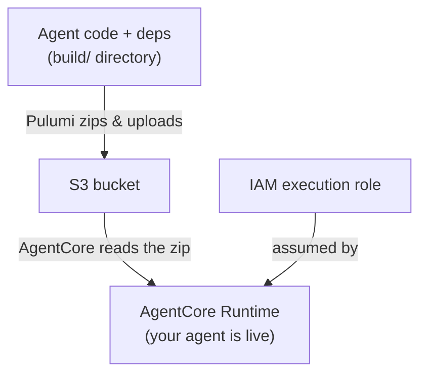

---
---
# Module 2: Your first agent on AgentCore

**Duration:** ~30 minutes

## What you'll learn

- How AgentCore *direct code* deployment works (ship a `.zip`, no Docker)
- How to package an agent and its dependencies for AgentCore's ARM64 runtime
- How to define the deployment in Pulumi (TypeScript or Python)
- How to deploy, invoke, and tear down the agent

## From local to deployed

In Module 1 you ran `basic_agent.py` on your laptop and called it on
`localhost:8080`. Nothing about that agent changes now - we're going to ship the
*exact same file* to Amazon Bedrock AgentCore so it runs in the cloud and you can
invoke it from anywhere.

## Key concepts

### Direct code deployment

AgentCore can run your agent two ways: from a **container image**, or from a
**`.zip` of your code** (called *direct code deployment*). We use direct code
here because it's much simpler: no Dockerfile, no image registry, no build
pipeline. You hand AgentCore a zip in S3 and it runs it - think AWS Lambda, but for
agents.

The deployment is just four resources:



Compare that to a container deployment, which would also need an ECR repository, a
Docker build, and somewhere to run that build. Direct code skips all of it.

### One wrinkle: ARM64

AgentCore runs on ARM64 (Graviton) hardware. Pure-Python packages don't care, but
anything with compiled code (here, `pydantic-core`, a dependency of Strands) ships
as architecture-specific wheels. So when we build the deployment package we
explicitly ask for **Linux ARM64** wheels. A small `build.sh` script handles this -
and the Pulumi program runs it for you during `pulumi up`, so there's no separate
build step to remember.

## Step 1: Create a new Pulumi project

If you're still inside the Module 1 folder, hop back to the workshop root first
(`cd -` returns to wherever you were before; adjust if needed):

```bash
cd -
```

<div class="lang-tabs" markdown="1">

<div class="lang-tab" data-lang="typescript" markdown="1">

```bash
mkdir 02-my-first-agent && cd 02-my-first-agent
pulumi new aws-typescript --name basic-runtime --yes
```

</div>

<div class="lang-tab" data-lang="python" markdown="1">

```bash
mkdir 02-my-first-agent && cd 02-my-first-agent
pulumi new aws-python --name basic-runtime --yes
```

</div>

</div>

Add the ESC environment reference to `Pulumi.dev.yaml`:

```bash
cat >> Pulumi.dev.yaml <<'EOF'
environment:
  - aws-bedrock-workshop/dev
EOF
```

Pin the AWS provider to a version that supports direct code deployment
(`codeConfiguration` landed in `pulumi-aws` 7.30), and add the `command` provider -
we'll use it to run the packaging build during `pulumi up`:

<div class="lang-tabs" markdown="1">

<div class="lang-tab" data-lang="typescript" markdown="1">

```bash
npm install @pulumi/aws@^7.30.0 @pulumi/command
```

</div>

<div class="lang-tab" data-lang="python" markdown="1">

The `pulumi new` template writes a `requirements.txt`. Replace it with the pinned
dependencies, then install:

```bash
cat > requirements.txt <<'EOF'
pulumi>=3.0.0,<4.0.0
pulumi-aws>=7.30.0
pulumi-command>=1.0.0
EOF
pulumi install
```

</div>

</div>

Set your unique stack name (replace `<id>` with the identifier you picked in Module 0):

```bash
pulumi config set stackName agentcore-basic-<id>
```

> Forgot your `<id>`? It's the 2-5 character identifier from [Module 0, Step 4](00-setup-and-orientation.md#step-4-pick-your-unique-identifier). Use the same one in every module so your resources don't collide with other participants'.

## Step 2: Add the agent code

Create an `agent-code` folder inside your project to hold the agent and its
dependencies:

```bash
mkdir agent-code
```

This is the agent from Module 1, unchanged. Create `basic_agent.py` inside
`agent-code` and copy the content in:

```python
from strands import Agent
from bedrock_agentcore.runtime import BedrockAgentCoreApp

app = BedrockAgentCoreApp()


def create_basic_agent() -> Agent:
    """Create a basic agent with a simple system prompt."""
    system_prompt = "You are a helpful assistant. Answer questions clearly and concisely."
    return Agent(system_prompt=system_prompt, name="BasicAgent")


@app.entrypoint
async def invoke(payload=None):
    """Entrypoint AgentCore calls for every invocation."""
    try:
        query = (
            payload.get("prompt", "Hello, how are you?")
            if payload
            else "Hello, how are you?"
        )
        agent = create_basic_agent()
        response = agent(query)
        return {"status": "success", "response": response.message["content"][0]["text"]}
    except Exception as e:
        return {"status": "error", "error": str(e)}


if __name__ == "__main__":
    app.run()
```

Create `requirements.txt` inside `agent-code` as well, with the agent's runtime
dependencies:

```text
strands-agents
bedrock-agentcore
boto3
```

## Step 3: Add the build script

Create a file called `build.sh` in your project root, next to `__main__.py` (or
`index.ts`) and the `agent-code` folder:

```bash
#!/usr/bin/env bash
set -euo pipefail
cd "$(dirname "$0")"

RUNTIME_PY_VERSION="${RUNTIME_PY_VERSION:-3.13}"

rm -rf build && mkdir -p build

# AgentCore Runtime is ARM64 on Amazon Linux 2023 (glibc 2.34), so target the
# manylinux_2_28 aarch64 wheel tag. --only-binary keeps the build host-agnostic.
uv pip install \
  --python-platform aarch64-manylinux_2_28 \
  --python-version "${RUNTIME_PY_VERSION}" \
  --target build \
  --only-binary=:all: \
  -r agent-code/requirements.txt

cp agent-code/basic_agent.py build/

# Bytecode compiled here may not match the runtime; drop it.
find build -name '__pycache__' -type d -prune -exec rm -rf {} +
```

You won't run this yourself. The Pulumi program calls it during `pulumi up` (next
step), and the `cd "$(dirname "$0")"` line means it always builds relative to its
own location, creating the `build/` directory in the project root.

`build/` is generated output, so keep it out of git:

```bash
echo "build/" >> .gitignore
```

## Step 4: Write the Pulumi program

Now the deployment. The program does five things: run `build.sh` to package the
agent, then create an S3 bucket, the zipped code object, an IAM execution role, and
the AgentCore Runtime itself.

The packaging runs through a `command.local.Command` resource. Its `triggers` are a
hash of the agent code and its dependencies, so the build re-runs only when one of
those changes - not on every `pulumi up`. The S3 code object then `dependsOn` the
build, so the zip is always fresh before it's uploaded.

<div class="lang-tabs" markdown="1">

<div class="lang-tab" data-lang="typescript" markdown="1">

Replace `index.ts` with:

```typescript
import * as pulumi from "@pulumi/pulumi";
import * as aws from "@pulumi/aws";
import * as command from "@pulumi/command";
import { createHash } from "crypto";
import * as fs from "fs";
import * as path from "path";

const config = new pulumi.Config();
const agentName = config.get("agentName") || "BasicAgent";
const stackName = config.get("stackName") || "agentcore-basic";
const runtimeVersion = config.get("runtime") || "PYTHON_3_13";

const awsConfig = new pulumi.Config("aws");
const awsRegion = awsConfig.require("region");

const currentIdentity = aws.getCallerIdentityOutput({});
const currentRegion = aws.getRegionOutput({});

const agentCodeDir = path.resolve(__dirname, "agent-code");
const buildDir = path.resolve(__dirname, "build");

// Hash of the inputs that should trigger a repackage: the agent and its deps.
const sourceHash = createHash("sha256")
  .update(fs.readFileSync(path.join(agentCodeDir, "basic_agent.py")))
  .update(fs.readFileSync(path.join(agentCodeDir, "requirements.txt")))
  .digest("hex");

// --- Build the ARM64 deployment package during `pulumi up` ---
// build.sh installs Linux ARM64 wheels into build/ and copies the agent in.
// triggers means it only re-runs when the agent or its deps change.
const build = new command.local.Command("build_package", {
  create: `bash ${path.join(__dirname, "build.sh")}`,
  dir: __dirname,
  triggers: [sourceHash],
});

// --- S3 bucket holding the zipped agent package ---
const codeBucket = new aws.s3.Bucket("agent_code", {
  bucketPrefix: `${stackName}-code-`,
  forceDestroy: true,
});

new aws.s3.BucketPublicAccessBlock("agent_code", {
  bucket: codeBucket.id,
  blockPublicAcls: true,
  blockPublicPolicy: true,
  ignorePublicAcls: true,
  restrictPublicBuckets: true,
});

new aws.s3.BucketVersioning("agent_code", {
  bucket: codeBucket.id,
  versioningConfiguration: { status: "Enabled" },
});

// Pulumi zips build/ (produced by the build command above) and uploads it.
const codeObject = new aws.s3.BucketObjectv2(
  "agent_code",
  {
    bucket: codeBucket.id,
    key: "agent-code.zip",
    source: new pulumi.asset.FileArchive(buildDir),
  },
  { dependsOn: [build] },
);

// --- IAM execution role ---
const agentExecution = new aws.iam.Role("agent_execution", {
  name: `${stackName}-agent-execution-role`,
  assumeRolePolicy: pulumi.jsonStringify({
    Version: "2012-10-17",
    Statement: [
      {
        Effect: "Allow",
        Principal: { Service: "bedrock-agentcore.amazonaws.com" },
        Action: "sts:AssumeRole",
        Condition: {
          StringEquals: {
            "aws:SourceAccount": currentIdentity.apply((id) => id.accountId),
          },
          ArnLike: {
            "aws:SourceArn": pulumi
              .all([currentRegion, currentIdentity])
              .apply(
                ([r, id]) =>
                  `arn:aws:bedrock-agentcore:${r.region}:${id.accountId}:*`,
              ),
          },
        },
      },
    ],
  }),
});

new aws.iam.RolePolicyAttachment("agent_execution_managed", {
  role: agentExecution.name,
  policyArn: "arn:aws:iam::aws:policy/BedrockAgentCoreFullAccess",
});

const agentExecutionPolicy = new aws.iam.RolePolicy("agent_execution", {
  name: "AgentCoreExecutionPolicy",
  role: agentExecution.id,
  policy: pulumi.jsonStringify({
    Version: "2012-10-17",
    Statement: [
      {
        Sid: "S3CodeAccess",
        Effect: "Allow",
        Action: ["s3:GetObject", "s3:GetObjectVersion"],
        Resource: pulumi.interpolate`${codeBucket.arn}/*`,
      },
      {
        Sid: "CloudWatchLogs",
        Effect: "Allow",
        Action: [
          "logs:CreateLogGroup",
          "logs:CreateLogStream",
          "logs:PutLogEvents",
          "logs:DescribeLogStreams",
          "logs:DescribeLogGroups",
        ],
        Resource: pulumi
          .all([currentRegion, currentIdentity])
          .apply(
            ([r, id]) =>
              `arn:aws:logs:${r.region}:${id.accountId}:log-group:/aws/bedrock-agentcore/runtimes/*`,
          ),
      },
      {
        Sid: "XRayTracing",
        Effect: "Allow",
        Action: [
          "xray:PutTraceSegments",
          "xray:PutTelemetryRecords",
          "xray:GetSamplingRules",
          "xray:GetSamplingTargets",
        ],
        Resource: "*",
      },
      {
        Sid: "BedrockModelInvocation",
        Effect: "Allow",
        Action: ["bedrock:InvokeModel", "bedrock:InvokeModelWithResponseStream"],
        Resource: "*",
      },
      {
        Sid: "GetAgentAccessToken",
        Effect: "Allow",
        Action: [
          "bedrock-agentcore:GetWorkloadAccessToken",
          "bedrock-agentcore:GetWorkloadAccessTokenForJWT",
          "bedrock-agentcore:GetWorkloadAccessTokenForUserId",
        ],
        Resource: [
          pulumi
            .all([currentRegion, currentIdentity])
            .apply(
              ([r, id]) =>
                `arn:aws:bedrock-agentcore:${r.region}:${id.accountId}:workload-identity-directory/default`,
            ),
          pulumi
            .all([currentRegion, currentIdentity])
            .apply(
              ([r, id]) =>
                `arn:aws:bedrock-agentcore:${r.region}:${id.accountId}:workload-identity-directory/default/workload-identity/*`,
            ),
        ],
      },
    ],
  }),
});

// --- AgentCore Runtime (direct code) ---
const runtimeName = `${stackName}_${agentName}`.replace(/-/g, "_");

const basicAgent = new aws.bedrock.AgentcoreAgentRuntime(
  "basic_agent",
  {
    agentRuntimeName: runtimeName,
    roleArn: agentExecution.arn,
    agentRuntimeArtifact: {
      codeConfiguration: {
        entryPoints: ["basic_agent.py"],
        runtime: runtimeVersion,
        code: {
          s3: {
            bucket: codeBucket.id,
            prefix: codeObject.key,
            versionId: codeObject.versionId, // redeploy when the zip changes
          },
        },
      },
    },
    networkConfiguration: { networkMode: "PUBLIC" },
    environmentVariables: {
      AWS_REGION: awsRegion,
      AWS_DEFAULT_REGION: awsRegion,
    },
  },
  { dependsOn: [agentExecutionPolicy] },
);

export const agentRuntimeArn = basicAgent.agentRuntimeArn;
export const agentRuntimeId = basicAgent.agentRuntimeId;
```

</div>

<div class="lang-tab" data-lang="python" markdown="1">

Replace `__main__.py` with:

```python
import hashlib
import os

import pulumi
import pulumi_aws as aws
import pulumi_command as command

config = pulumi.Config()
agent_name = config.get("agentName") or "BasicAgent"
stack_name = config.get("stackName") or "agentcore-basic"
runtime_version = config.get("runtime") or "PYTHON_3_13"

aws_config = pulumi.Config("aws")
aws_region = aws_config.require("region")

current_identity = aws.get_caller_identity_output()
current_region = aws.get_region_output()

here = os.path.dirname(__file__)
agent_code_dir = os.path.join(here, "agent-code")
build_dir = os.path.join(here, "build")


def _sha256(path: str) -> str:
    with open(path, "rb") as f:
        return hashlib.sha256(f.read()).hexdigest()


# Hash of the inputs that should trigger a repackage: the agent and its deps.
source_hash = hashlib.sha256(
    (
        _sha256(os.path.join(agent_code_dir, "basic_agent.py"))
        + _sha256(os.path.join(agent_code_dir, "requirements.txt"))
    ).encode()
).hexdigest()

# --- Build the ARM64 deployment package during `pulumi up` ---
# build.sh installs Linux ARM64 wheels into build/ and copies the agent in.
# triggers means it only re-runs when the agent or its deps change.
build = command.local.Command(
    "build_package",
    create=f"bash {os.path.join(here, 'build.sh')}",
    dir=here,
    triggers=[source_hash],
)

# --- S3 bucket holding the zipped agent package ---
code_bucket = aws.s3.Bucket(
    "agent_code",
    bucket_prefix=f"{stack_name}-code-",
    force_destroy=True,
)

aws.s3.BucketPublicAccessBlock(
    "agent_code",
    bucket=code_bucket.id,
    block_public_acls=True,
    block_public_policy=True,
    ignore_public_acls=True,
    restrict_public_buckets=True,
)

aws.s3.BucketVersioning(
    "agent_code",
    bucket=code_bucket.id,
    versioning_configuration={"status": "Enabled"},
)

# Pulumi zips build/ (produced by the build command above) and uploads it.
code_object = aws.s3.BucketObjectv2(
    "agent_code",
    bucket=code_bucket.id,
    key="agent-code.zip",
    source=pulumi.FileArchive(build_dir),
    opts=pulumi.ResourceOptions(depends_on=[build]),
)

# --- IAM execution role ---
agent_execution = aws.iam.Role(
    "agent_execution",
    name=f"{stack_name}-agent-execution-role",
    assume_role_policy=pulumi.Output.json_dumps(
        {
            "Version": "2012-10-17",
            "Statement": [
                {
                    "Effect": "Allow",
                    "Principal": {"Service": "bedrock-agentcore.amazonaws.com"},
                    "Action": "sts:AssumeRole",
                    "Condition": {
                        "StringEquals": {
                            "aws:SourceAccount": current_identity.apply(
                                lambda id: id.account_id
                            ),
                        },
                        "ArnLike": {
                            "aws:SourceArn": pulumi.Output.all(
                                current_region, current_identity
                            ).apply(
                                lambda a: f"arn:aws:bedrock-agentcore:{a[0].region}:{a[1].account_id}:*"
                            ),
                        },
                    },
                }
            ],
        }
    ),
)

aws.iam.RolePolicyAttachment(
    "agent_execution_managed",
    role=agent_execution.name,
    policy_arn="arn:aws:iam::aws:policy/BedrockAgentCoreFullAccess",
)

agent_execution_policy = aws.iam.RolePolicy(
    "agent_execution",
    name="AgentCoreExecutionPolicy",
    role=agent_execution.id,
    policy=pulumi.Output.json_dumps(
        {
            "Version": "2012-10-17",
            "Statement": [
                {
                    "Sid": "S3CodeAccess",
                    "Effect": "Allow",
                    "Action": ["s3:GetObject", "s3:GetObjectVersion"],
                    "Resource": pulumi.Output.concat(code_bucket.arn, "/*"),
                },
                {
                    "Sid": "CloudWatchLogs",
                    "Effect": "Allow",
                    "Action": [
                        "logs:CreateLogGroup",
                        "logs:CreateLogStream",
                        "logs:PutLogEvents",
                        "logs:DescribeLogStreams",
                        "logs:DescribeLogGroups",
                    ],
                    "Resource": pulumi.Output.all(
                        current_region, current_identity
                    ).apply(
                        lambda a: f"arn:aws:logs:{a[0].region}:{a[1].account_id}:log-group:/aws/bedrock-agentcore/runtimes/*"
                    ),
                },
                {
                    "Sid": "XRayTracing",
                    "Effect": "Allow",
                    "Action": [
                        "xray:PutTraceSegments",
                        "xray:PutTelemetryRecords",
                        "xray:GetSamplingRules",
                        "xray:GetSamplingTargets",
                    ],
                    "Resource": "*",
                },
                {
                    "Sid": "BedrockModelInvocation",
                    "Effect": "Allow",
                    "Action": [
                        "bedrock:InvokeModel",
                        "bedrock:InvokeModelWithResponseStream",
                    ],
                    "Resource": "*",
                },
                {
                    "Sid": "GetAgentAccessToken",
                    "Effect": "Allow",
                    "Action": [
                        "bedrock-agentcore:GetWorkloadAccessToken",
                        "bedrock-agentcore:GetWorkloadAccessTokenForJWT",
                        "bedrock-agentcore:GetWorkloadAccessTokenForUserId",
                    ],
                    "Resource": [
                        pulumi.Output.all(current_region, current_identity).apply(
                            lambda a: f"arn:aws:bedrock-agentcore:{a[0].region}:{a[1].account_id}:workload-identity-directory/default"
                        ),
                        pulumi.Output.all(current_region, current_identity).apply(
                            lambda a: f"arn:aws:bedrock-agentcore:{a[0].region}:{a[1].account_id}:workload-identity-directory/default/workload-identity/*"
                        ),
                    ],
                },
            ],
        }
    ),
)

# --- AgentCore Runtime (direct code) ---
runtime_name = f"{stack_name}_{agent_name}".replace("-", "_")

basic_agent = aws.bedrock.AgentcoreAgentRuntime(
    "basic_agent",
    agent_runtime_name=runtime_name,
    role_arn=agent_execution.arn,
    agent_runtime_artifact={
        "code_configuration": {
            "entry_points": ["basic_agent.py"],
            "runtime": runtime_version,
            "code": {
                "s3": {
                    "bucket": code_bucket.id,
                    "prefix": code_object.key,
                    "version_id": code_object.version_id,  # redeploy on change
                },
            },
        },
    },
    network_configuration={"network_mode": "PUBLIC"},
    environment_variables={
        "AWS_REGION": aws_region,
        "AWS_DEFAULT_REGION": aws_region,
    },
    opts=pulumi.ResourceOptions(depends_on=[agent_execution_policy]),
)

pulumi.export("agentRuntimeArn", basic_agent.agent_runtime_arn)
pulumi.export("agentRuntimeId", basic_agent.agent_runtime_id)
```

</div>

</div>

A few things worth noticing:

- The execution role trusts only `bedrock-agentcore.amazonaws.com`, and its inline
  policy grants exactly what the agent needs: read the code zip from S3, write
  CloudWatch logs, emit X-Ray traces, call Bedrock models, and fetch workload
  identity tokens. No ECR permissions - there's no container.
- `codeConfiguration` is what makes this a direct-code deployment.
  `entryPoints: ["basic_agent.py"]` tells AgentCore which file to run, and
  `runtime` selects the managed Python version.
- Passing `versionId` of the S3 object means a new build (a new zip) produces a new
  object version, which forces AgentCore to redeploy. Without it, AgentCore would
  keep running the old code.

## Step 5: Deploy

```bash
pulumi up
```

That single command does everything: it runs `build.sh` to package your agent for
ARM64, uploads the zip to S3, creates the IAM role, and provisions the runtime. The
first run takes about a minute - most of it is downloading wheels and AgentCore
provisioning the runtime. Watch for `agentRuntimeArn` at the end.

## Step 6: Invoke your agent

A small script sends a prompt to the deployed runtime and prints the reply. Create
`test_basic_agent.py` in your project root and copy the content in:

```python
#!/usr/bin/env python3
"""Invoke a deployed AgentCore runtime and print its response.

Usage:
    python test_basic_agent.py <agent_runtime_arn>
"""
import json
import sys

import boto3


def main():
    if len(sys.argv) < 2:
        print("Usage: python test_basic_agent.py <agent_runtime_arn>")
        sys.exit(1)

    agent_arn = sys.argv[1]
    region = agent_arn.split(":")[3]

    client = boto3.client("bedrock-agentcore", region_name=region)

    print("Invoking agent...")
    response = client.invoke_agent_runtime(
        agentRuntimeArn=agent_arn,
        qualifier="DEFAULT",
        payload=json.dumps({"prompt": "What is Amazon Bedrock AgentCore?"}),
    )

    status = response["ResponseMetadata"]["HTTPStatusCode"]
    body = response["response"].read().decode("utf-8")
    result = json.loads(body)

    print(f"Status: {status}")
    print(f"Response: {result.get('response', result.get('error'))}")


if __name__ == "__main__":
    main()
```

The script needs `boto3`. Install it if you haven't already (Codespaces has it
preinstalled, so you can skip this there):

```bash
pip install boto3
```

Grab the runtime ARN from the stack output and run the script. `pulumi env run`
injects the AWS credentials it needs:

```bash
export AGENT_ARN=$(pulumi stack output agentRuntimeArn)
pulumi env run aws-bedrock-workshop/dev -- python test_basic_agent.py $AGENT_ARN
```

You should see a `Status: 200` and a response from your agent - the same agent you
ran locally in Module 1, now answering from AgentCore.

## Try it yourself

- **Change the system prompt.** Edit `agent-code/basic_agent.py`, then `pulumi up`.
  The edited file changes the build hash, so Pulumi repackages and redeploys
  automatically - no manual build needed.
- **Send your own prompts.** Edit the prompts in `test_basic_agent.py`, or call
  `invoke_agent_runtime` directly with boto3.

## What you learned

- AgentCore direct code deployment ships a `.zip`, not a container - no Dockerfile,
  no ECR, no build pipeline
- The runtime is ARM64, so dependencies are packaged as Linux ARM64 wheels
- A `command.local.Command` runs the packaging build during `pulumi up`, so one
  command does everything - no separate build step to remember
- The deployment is a build step plus four resources: an S3 bucket, the code object,
  an IAM execution role, and the AgentCore Runtime
- The agent you ran locally in Module 1 runs unchanged in the cloud

Next up: [Module 3: Multi-agent orchestration](03-multi-agent-orchestration.md)
