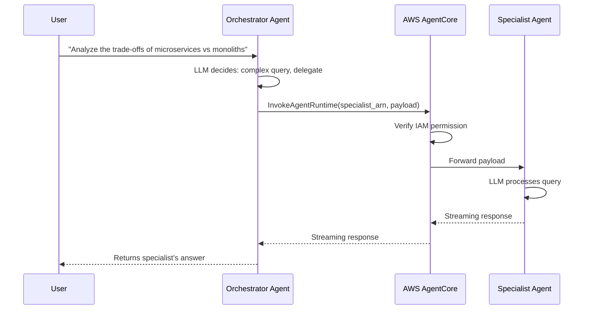
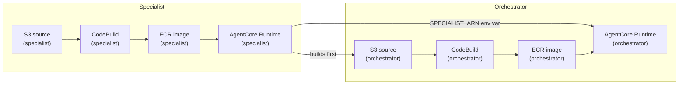

---
---
# Module 3: Multi-agent orchestration

**Duration:** ~40 minutes

## What you'll learn

- Why you'd split work across multiple agents instead of building one monolithic agent
- How Agent-to-Agent (A2A) communication works on AgentCore
- How IAM permissions gate which agents can invoke which
- How to handle streaming responses between agents
- How sequential build dependencies work in Pulumi

## Key concepts

### Agent-to-Agent (A2A) communication on AgentCore

A single agent with a dozen tools and a long system prompt can work, but it gets unwieldy fast. The LLM has to decide between too many options on every turn, and the system prompt becomes a wall of instructions competing for attention.

The [AgentCore Runtime](https://docs.aws.amazon.com/bedrock-agentcore/latest/devguide/agents-tools-runtime.html) supports native Agent-to-Agent communication. One agent can invoke another agent runtime directly over the AWS API using `bedrock-agentcore:InvokeAgentRuntime`. AgentCore manages the routing and lifecycle - you just need the target agent's ARN and the right IAM permissions.

### Orchestrator/specialist pattern

The alternative to one large agent is splitting work by specialty. An **orchestrator** handles incoming requests and decides whether to answer directly or hand off to a specialist. The **specialist** has a focused system prompt and can go deep on a narrow domain.

In this module, you'll build two agents:

- **Orchestrator**: Handles simple queries (greetings, basic questions) directly. Delegates complex analytical tasks to the specialist.
- **Specialist**: An analytical agent that gives thorough, detailed answers. It doesn't know about the orchestrator - it just answers whatever it's asked.

### IAM-based access control for agent invocation

The IAM permission that makes A2A work is `bedrock-agentcore:InvokeAgentRuntime`. The orchestrator's execution role gets this permission; the specialist's role does not. This is intentional: the specialist cannot call back to the orchestrator, which prevents accidental cycles and keeps the dependency graph clear.

When the orchestrator calls `InvokeAgentRuntime`, AgentCore verifies the caller's role has this permission before forwarding the payload to the specialist container.

### How the request flows



### Build dependency chain

Because the orchestrator needs the specialist's ARN as an environment variable, the builds must run in order: specialist first, then orchestrator.



## Step 1: Create a new Pulumi project

<div class="lang-tabs" markdown="1">

<div class="lang-tab" data-lang="typescript" markdown="1">

```bash
mkdir 03-multi-agent && cd 03-multi-agent
pulumi new aws-typescript --name multi-agent --yes
```

</div>

<div class="lang-tab" data-lang="python" markdown="1">

```bash
mkdir 03-multi-agent && cd 03-multi-agent
pulumi new aws-python --name multi-agent --yes
```

</div>

</div>

Add the ESC environment to `Pulumi.dev.yaml`:

```yaml
environment:
  - aws-bedrock-workshop/dev
```

The `pulumi new` template already includes the AWS provider. Pin it to the version this workshop uses:

<div class="lang-tabs" markdown="1">

<div class="lang-tab" data-lang="typescript" markdown="1">

```bash
npm install @pulumi/aws@7.23.0
```

</div>

<div class="lang-tab" data-lang="python" markdown="1">

```bash
uv add pulumi-aws>=7.23.0
```

</div>

</div>

Set your unique stack name:

```bash
pulumi config set stackName agentcore-multi-<id>
```

## Step 2: Write the specialist agent

The specialist is a plain Strands agent with no special tools. Its only job is to give detailed answers. The response includes `"agent": "specialist"` so you can tell where the answer came from when testing.

Create the specialist source directory:

```bash
mkdir -p agent-specialist-code
```

Create `agent-specialist-code/agent.py`:

```python
from strands import Agent
from bedrock_agentcore.runtime import BedrockAgentCoreApp

app = BedrockAgentCoreApp()


def create_specialist_agent() -> Agent:
    """Create a specialist agent that handles specific analytical tasks"""
    system_prompt = """You are a specialist analytical agent.
    You are an expert at analyzing data and providing detailed insights.
    When asked questions, provide thorough, well-reasoned responses with specific details.
    Focus on accuracy and completeness in your answers."""

    return Agent(system_prompt=system_prompt, name="SpecialistAgent")


@app.entrypoint
async def invoke(payload=None):
    """Main entrypoint for specialist agent"""
    try:
        # Get the query from payload
        query = payload.get("prompt", "Hello") if payload else "Hello"

        # Create and use the specialist agent
        agent = create_specialist_agent()
        response = agent(query)

        return {
            "status": "success",
            "agent": "specialist",
            "response": response.message["content"][0]["text"],
        }

    except Exception as e:
        return {"status": "error", "agent": "specialist", "error": str(e)}


if __name__ == "__main__":
    app.run()
```

Create `agent-specialist-code/requirements.txt`:

```text
strands-agents
boto3>=1.40.0
botocore>=1.40.0
bedrock-agentcore
```

Create `agent-specialist-code/Dockerfile`:

```dockerfile
FROM public.ecr.aws/docker/library/python:3.11-slim
WORKDIR /app

COPY requirements.txt requirements.txt
RUN pip install -r requirements.txt
RUN pip install aws-opentelemetry-distro>=0.10.1

RUN useradd -m -u 1000 bedrock_agentcore
USER bedrock_agentcore

EXPOSE 8080
EXPOSE 8000

COPY . .

CMD ["opentelemetry-instrument", "python", "-m", "agent"]
```

## Step 3: Write the orchestrator agent

The orchestrator reads `SPECIALIST_ARN` from an environment variable set by Pulumi at deploy time. The `@tool` decorator on `call_specialist_agent` makes it available to the Strands agent as a callable tool. When the LLM decides a question is complex, it calls this tool, which triggers the A2A invocation.

The response handling has three branches because AgentCore can return different content types: event streams, JSON, or raw bytes. In practice, you'll usually get the streaming format.

Create the orchestrator source directory:

```bash
mkdir -p agent-orchestrator-code
```

Create `agent-orchestrator-code/agent.py`:

```python
from strands import Agent, tool
from typing import Dict, Any
import boto3
from botocore.config import Config
import json
import os
from bedrock_agentcore.runtime import BedrockAgentCoreApp

app = BedrockAgentCoreApp()

# Environment variable for Specialist Agent ARN (required - set by Pulumi)
SPECIALIST_ARN = os.getenv("SPECIALIST_ARN")
if not SPECIALIST_ARN:
    raise EnvironmentError("SPECIALIST_ARN environment variable is required")


def invoke_specialist(query: str) -> str:
    """Helper function to invoke specialist agent using boto3"""
    try:
        # Get region from environment (set by AgentCore runtime)
        region = os.getenv("AWS_REGION")
        if not region:
            raise EnvironmentError("AWS_REGION environment variable is required")
        # Long read_timeout: the specialist may take minutes on complex
        # queries. boto3's default 60s would surface as a hang on the test
        # client because the orchestrator's tool call would keep retrying.
        agentcore_client = boto3.client(
            "bedrock-agentcore",
            region_name=region,
            config=Config(
                read_timeout=900,
                connect_timeout=30,
                retries={"max_attempts": 0},
            ),
        )

        # Invoke specialist agent runtime (using AWS sample format)
        response = agentcore_client.invoke_agent_runtime(
            agentRuntimeArn=SPECIALIST_ARN,
            qualifier="DEFAULT",
            payload=json.dumps({"prompt": query}),
        )

        # Handle streaming response (text/event-stream)
        if "text/event-stream" in response.get("contentType", ""):
            result = ""
            for line in response["response"].iter_lines(chunk_size=10):
                if line:
                    line = line.decode("utf-8")
                    # Remove 'data: ' prefix if present
                    if line.startswith("data: "):
                        line = line[6:]
                    result += line
            return result

        # Handle JSON response
        elif response.get("contentType") == "application/json":
            content = []
            for chunk in response.get("response", []):
                content.append(chunk.decode("utf-8"))
            response_data = json.loads("".join(content))
            return json.dumps(response_data)

        # Handle other response types
        else:
            response_body = response["response"].read()
            return response_body.decode("utf-8")

    except Exception as e:
        import traceback

        error_details = traceback.format_exc()
        return f"Error invoking specialist agent: {str(e)}\nDetails: {error_details}"


@tool
def call_specialist_agent(query: str) -> Dict[str, Any]:
    """
    Call the specialist agent for detailed analysis or complex tasks.
    Use this tool when you need expert analysis or detailed information.

    Args:
        query: The question or task to send to the specialist agent

    Returns:
        The specialist agent's response
    """
    result = invoke_specialist(query)
    return {"status": "success", "content": [{"text": result}]}


def create_orchestrator_agent() -> Agent:
    """Create the orchestrator agent with the tool to call specialist agent"""
    system_prompt = """You are an orchestrator agent.
    You can handle simple queries directly, but for complex analytical tasks,
    you should delegate to the specialist agent using the call_specialist_agent tool.

    Use the specialist agent when:
    - The query requires detailed analysis
    - The query is about complex topics
    - The user explicitly asks for expert analysis

    Handle simple queries (greetings, basic questions) yourself."""

    return Agent(
        tools=[call_specialist_agent],
        system_prompt=system_prompt,
        name="OrchestratorAgent",
    )


@app.entrypoint
async def invoke(payload=None):
    """Main entrypoint for orchestrator agent"""
    try:
        # Get the query from payload
        query = (
            payload.get("prompt", "Hello, how are you?")
            if payload
            else "Hello, how are you?"
        )

        # Create and use the orchestrator agent
        agent = create_orchestrator_agent()
        response = agent(query)

        return {
            "status": "success",
            "agent": "orchestrator",
            "response": response.message["content"][0]["text"],
        }

    except Exception as e:
        return {"status": "error", "agent": "orchestrator", "error": str(e)}


if __name__ == "__main__":
    app.run()
```

The orchestrator uses the same `requirements.txt` and `Dockerfile` as the specialist - copy them into `agent-orchestrator-code/`.

## Step 4: Create the buildspecs

Each agent has its own CodeBuild buildspec. Both follow the same pattern: authenticate to ECR, build the Docker image for ARM64, and push it. Create `buildspec-specialist.yml`:

```yaml
version: 0.2

phases:
  pre_build:
    commands:
      - echo Source code already extracted by CodeBuild
      - cd $CODEBUILD_SRC_DIR
      - echo Logging in to Amazon ECR
      - aws ecr get-login-password --region $AWS_DEFAULT_REGION | docker login --username AWS --password-stdin $AWS_ACCOUNT_ID.dkr.ecr.$AWS_DEFAULT_REGION.amazonaws.com

  build:
    commands:
      - echo Build started on `date`
      - echo Building the Docker image for Specialist Agent ARM64
      - docker build -t $IMAGE_REPO_NAME:$IMAGE_TAG .
      - docker tag $IMAGE_REPO_NAME:$IMAGE_TAG $AWS_ACCOUNT_ID.dkr.ecr.$AWS_DEFAULT_REGION.amazonaws.com/$IMAGE_REPO_NAME:$IMAGE_TAG

  post_build:
    commands:
      - echo Build completed on `date`
      - echo Pushing the Specialist Docker image
      - docker push $AWS_ACCOUNT_ID.dkr.ecr.$AWS_DEFAULT_REGION.amazonaws.com/$IMAGE_REPO_NAME:$IMAGE_TAG
      - echo Specialist Agent ARM64 Docker image pushed successfully
```

Create `buildspec-orchestrator.yml`:

```yaml
version: 0.2

phases:
  pre_build:
    commands:
      - echo Source code already extracted by CodeBuild
      - cd $CODEBUILD_SRC_DIR
      - echo Logging in to Amazon ECR
      - aws ecr get-login-password --region $AWS_DEFAULT_REGION | docker login --username AWS --password-stdin $AWS_ACCOUNT_ID.dkr.ecr.$AWS_DEFAULT_REGION.amazonaws.com

  build:
    commands:
      - echo Build started on `date`
      - echo Building the Docker image for Orchestrator Agent ARM64
      - docker build -t $IMAGE_REPO_NAME:$IMAGE_TAG .
      - docker tag $IMAGE_REPO_NAME:$IMAGE_TAG $AWS_ACCOUNT_ID.dkr.ecr.$AWS_DEFAULT_REGION.amazonaws.com/$IMAGE_REPO_NAME:$IMAGE_TAG

  post_build:
    commands:
      - echo Build completed on `date`
      - echo Pushing the Orchestrator Docker image
      - docker push $AWS_ACCOUNT_ID.dkr.ecr.$AWS_DEFAULT_REGION.amazonaws.com/$IMAGE_REPO_NAME:$IMAGE_TAG
      - echo Orchestrator Agent ARM64 Docker image pushed successfully
```

## Step 5: Create the build trigger Lambda

Copy the build trigger Lambda from Module 1. The function is reused here without modification - create the directory and copy the code:

```bash
mkdir -p lambda/build-trigger
# copy index.py from 01-my-first-agent/lambda/build-trigger/
```

The Lambda starts a CodeBuild job and polls until the build finishes, then returns. Pulumi waits for the Lambda invocation to complete before moving on to the next resource.

## Step 6: Write the Pulumi infrastructure

The infrastructure doubles everything from Module 1: two S3 buckets, two ECR repos, two IAM roles, two CodeBuild projects, two Lambda invocations, and two AgentCore Runtimes.

### Configuration and data sources

<details>
<summary><strong>Want to know more?</strong> - Pulumi Registry</summary>
<p><a href="https://www.pulumi.com/docs/concepts/config/">pulumi.Config</a></p>
</details>

Start with configuration values and the AWS account/region data sources. The `stackName` config value is used as a prefix for every resource name so multiple stacks don't collide.

<div class="lang-tabs" markdown="1">

<div class="lang-tab" data-lang="typescript" markdown="1">

```typescript
import * as pulumi from "@pulumi/pulumi";
import * as aws from "@pulumi/aws";
import { createHash } from "crypto";
import * as fs from "fs";
import * as path from "path";

const config = new pulumi.Config();
const orchestratorName = config.get("orchestratorName") || "OrchestratorAgent";
const specialistName = config.get("specialistName") || "SpecialistAgent";
const networkMode = config.get("networkMode") || "PUBLIC";
const imageTag = config.get("imageTag") || "latest";
const stackName = config.get("stackName") || "agentcore-multi-agent";
const ecrRepositoryName = config.get("ecrRepositoryName") || "multi-agent";

const awsConfig = new pulumi.Config("aws");
const awsRegion = awsConfig.require("region");

const currentIdentity = aws.getCallerIdentityOutput({});
const currentRegion = aws.getRegionOutput({});
```

</div>

<div class="lang-tab" data-lang="python" markdown="1">

```python
import hashlib
import json
import os

import pulumi
import pulumi_aws as aws

config = pulumi.Config()
orchestrator_name = config.get("orchestratorName") or "OrchestratorAgent"
specialist_name = config.get("specialistName") or "SpecialistAgent"
network_mode = config.get("networkMode") or "PUBLIC"
image_tag = config.get("imageTag") or "latest"
stack_name = config.get("stackName") or "agentcore-multi-agent"
ecr_repository_name = config.get("ecrRepositoryName") or "multi-agent"

aws_config = pulumi.Config("aws")
aws_region = aws_config.require("region")

current_identity = aws.get_caller_identity_output()
current_region = aws.get_region_output()
```

</div>

</div>

### Dual S3 buckets

<details>
<summary><strong>Want to know more?</strong> - Pulumi Registry</summary>
<p><a href="https://www.pulumi.com/registry/packages/aws/api-docs/s3/bucket/">aws.s3.Bucket</a></p>
</details>

Each agent gets its own S3 bucket to store its source code archive. Keeping them separate makes it easy to trigger only the affected build when a single agent changes.

<div class="lang-tabs" markdown="1">

<div class="lang-tab" data-lang="typescript" markdown="1">

```typescript
const orchestratorSourceBucket = new aws.s3.Bucket("orchestrator_source", {
  bucketPrefix: `${stackName}-orch-src-`,
  forceDestroy: true,
  tags: {
    Name: `${stackName}-orchestrator-source`,
    Purpose: "Store Orchestrator agent source code for CodeBuild",
  },
});

const specialistSourceBucket = new aws.s3.Bucket("specialist_source", {
  bucketPrefix: `${stackName}-spec-src-`,
  forceDestroy: true,
  tags: {
    Name: `${stackName}-specialist-source`,
    Purpose: "Store Specialist agent source code for CodeBuild",
  },
});

new aws.s3.BucketPublicAccessBlock("orchestrator_source", {
  bucket: orchestratorSourceBucket.id,
  blockPublicAcls: true,
  blockPublicPolicy: true,
  ignorePublicAcls: true,
  restrictPublicBuckets: true,
});

new aws.s3.BucketPublicAccessBlock("specialist_source", {
  bucket: specialistSourceBucket.id,
  blockPublicAcls: true,
  blockPublicPolicy: true,
  ignorePublicAcls: true,
  restrictPublicBuckets: true,
});

new aws.s3.BucketVersioning("orchestrator_source", {
  bucket: orchestratorSourceBucket.id,
  versioningConfiguration: {
    status: "Enabled",
  },
});

new aws.s3.BucketVersioning("specialist_source", {
  bucket: specialistSourceBucket.id,
  versioningConfiguration: {
    status: "Enabled",
  },
});
```

</div>

<div class="lang-tab" data-lang="python" markdown="1">

```python
orchestrator_source_bucket = aws.s3.Bucket(
    "orchestrator_source",
    bucket_prefix=f"{stack_name}-orch-src-",
    force_destroy=True,
    tags={
        "Name": f"{stack_name}-orchestrator-source",
        "Purpose": "Store Orchestrator agent source code for CodeBuild",
    },
)

specialist_source_bucket = aws.s3.Bucket(
    "specialist_source",
    bucket_prefix=f"{stack_name}-spec-src-",
    force_destroy=True,
    tags={
        "Name": f"{stack_name}-specialist-source",
        "Purpose": "Store Specialist agent source code for CodeBuild",
    },
)

aws.s3.BucketPublicAccessBlock(
    "orchestrator_source",
    bucket=orchestrator_source_bucket.id,
    block_public_acls=True,
    block_public_policy=True,
    ignore_public_acls=True,
    restrict_public_buckets=True,
)

aws.s3.BucketPublicAccessBlock(
    "specialist_source",
    bucket=specialist_source_bucket.id,
    block_public_acls=True,
    block_public_policy=True,
    ignore_public_acls=True,
    restrict_public_buckets=True,
)

aws.s3.BucketVersioning(
    "orchestrator_source",
    bucket=orchestrator_source_bucket.id,
    versioning_configuration={"status": "Enabled"},
)

aws.s3.BucketVersioning(
    "specialist_source",
    bucket=specialist_source_bucket.id,
    versioning_configuration={"status": "Enabled"},
)
```

</div>

</div>

### Upload source code to S3

Pulumi zips the local agent directories and uploads them to S3. The `versionId` output of each object is used later as a trigger to detect when the source changes and a rebuild is needed.

<div class="lang-tabs" markdown="1">

<div class="lang-tab" data-lang="typescript" markdown="1">

```typescript
const orchestratorSourceObject = new aws.s3.BucketObjectv2(
  "orchestrator_source",
  {
    bucket: orchestratorSourceBucket.id,
    key: "agent-orchestrator-code.zip",
    source: new pulumi.asset.FileArchive(
      path.resolve(__dirname, "agent-orchestrator-code"),
    ),
    tags: {
      Name: "agent-orchestrator-source-code",
    },
  },
);

const specialistSourceObject = new aws.s3.BucketObjectv2("specialist_source", {
  bucket: specialistSourceBucket.id,
  key: "agent-specialist-code.zip",
  source: new pulumi.asset.FileArchive(
    path.resolve(__dirname, "agent-specialist-code"),
  ),
  tags: {
    Name: "agent-specialist-source-code",
  },
});
```

</div>

<div class="lang-tab" data-lang="python" markdown="1">

```python
orchestrator_source_object = aws.s3.BucketObjectv2(
    "orchestrator_source",
    bucket=orchestrator_source_bucket.id,
    key="agent-orchestrator-code.zip",
    source=pulumi.FileArchive(
        os.path.join(os.path.dirname(__file__), "agent-orchestrator-code")
    ),
    tags={"Name": "agent-orchestrator-source-code"},
)

specialist_source_object = aws.s3.BucketObjectv2(
    "specialist_source",
    bucket=specialist_source_bucket.id,
    key="agent-specialist-code.zip",
    source=pulumi.FileArchive(
        os.path.join(os.path.dirname(__file__), "agent-specialist-code")
    ),
    tags={"Name": "agent-specialist-source-code"},
)
```

</div>

</div>

### Dual ECR repositories

<details>
<summary><strong>Want to know more?</strong> - Pulumi Registry</summary>
<p><a href="https://www.pulumi.com/registry/packages/aws/api-docs/ecr/repository/">aws.ecr.Repository</a></p>
</details>

Each agent image lives in its own ECR repository. The lifecycle policy keeps storage costs down by expiring old images beyond the last 5.

<div class="lang-tabs" markdown="1">

<div class="lang-tab" data-lang="typescript" markdown="1">

```typescript
const orchestratorEcr = new aws.ecr.Repository("orchestrator", {
  name: `${stackName}-${ecrRepositoryName}-orchestrator`,
  imageTagMutability: "MUTABLE",
  imageScanningConfiguration: {
    scanOnPush: true,
  },
  forceDelete: true,
  tags: {
    Name: `${stackName}-orchestrator-ecr-repository`,
    Module: "ECR",
  },
});

const specialistEcr = new aws.ecr.Repository("specialist", {
  name: `${stackName}-${ecrRepositoryName}-specialist`,
  imageTagMutability: "MUTABLE",
  imageScanningConfiguration: {
    scanOnPush: true,
  },
  forceDelete: true,
  tags: {
    Name: `${stackName}-specialist-ecr-repository`,
    Module: "ECR",
  },
});

new aws.ecr.RepositoryPolicy("orchestrator", {
  repository: orchestratorEcr.name,
  policy: pulumi.jsonStringify({
    Version: "2012-10-17",
    Statement: [
      {
        Sid: "AllowPullFromAccount",
        Effect: "Allow",
        Principal: {
          AWS: currentIdentity.apply(
            (id) => `arn:aws:iam::${id.accountId}:root`,
          ),
        },
        Action: ["ecr:BatchGetImage", "ecr:GetDownloadUrlForLayer"],
      },
    ],
  }),
});

new aws.ecr.RepositoryPolicy("specialist", {
  repository: specialistEcr.name,
  policy: pulumi.jsonStringify({
    Version: "2012-10-17",
    Statement: [
      {
        Sid: "AllowPullFromAccount",
        Effect: "Allow",
        Principal: {
          AWS: currentIdentity.apply(
            (id) => `arn:aws:iam::${id.accountId}:root`,
          ),
        },
        Action: ["ecr:BatchGetImage", "ecr:GetDownloadUrlForLayer"],
      },
    ],
  }),
});

new aws.ecr.LifecyclePolicy("orchestrator", {
  repository: orchestratorEcr.name,
  policy: JSON.stringify({
    rules: [
      {
        rulePriority: 1,
        description: "Keep last 5 images",
        selection: {
          tagStatus: "any",
          countType: "imageCountMoreThan",
          countNumber: 5,
        },
        action: {
          type: "expire",
        },
      },
    ],
  }),
});

new aws.ecr.LifecyclePolicy("specialist", {
  repository: specialistEcr.name,
  policy: JSON.stringify({
    rules: [
      {
        rulePriority: 1,
        description: "Keep last 5 images",
        selection: {
          tagStatus: "any",
          countType: "imageCountMoreThan",
          countNumber: 5,
        },
        action: {
          type: "expire",
        },
      },
    ],
  }),
});
```

</div>

<div class="lang-tab" data-lang="python" markdown="1">

```python
orchestrator_ecr = aws.ecr.Repository(
    "orchestrator",
    name=f"{stack_name}-{ecr_repository_name}-orchestrator",
    image_tag_mutability="MUTABLE",
    image_scanning_configuration={"scan_on_push": True},
    force_delete=True,
    tags={
        "Name": f"{stack_name}-orchestrator-ecr-repository",
        "Module": "ECR",
    },
)

specialist_ecr = aws.ecr.Repository(
    "specialist",
    name=f"{stack_name}-{ecr_repository_name}-specialist",
    image_tag_mutability="MUTABLE",
    image_scanning_configuration={"scan_on_push": True},
    force_delete=True,
    tags={
        "Name": f"{stack_name}-specialist-ecr-repository",
        "Module": "ECR",
    },
)

aws.ecr.RepositoryPolicy(
    "orchestrator",
    repository=orchestrator_ecr.name,
    policy=pulumi.Output.json_dumps(
        {
            "Version": "2012-10-17",
            "Statement": [
                {
                    "Sid": "AllowPullFromAccount",
                    "Effect": "Allow",
                    "Principal": {
                        "AWS": current_identity.apply(
                            lambda id: f"arn:aws:iam::{id.account_id}:root"
                        ),
                    },
                    "Action": ["ecr:BatchGetImage", "ecr:GetDownloadUrlForLayer"],
                }
            ],
        }
    ),
)

aws.ecr.RepositoryPolicy(
    "specialist",
    repository=specialist_ecr.name,
    policy=pulumi.Output.json_dumps(
        {
            "Version": "2012-10-17",
            "Statement": [
                {
                    "Sid": "AllowPullFromAccount",
                    "Effect": "Allow",
                    "Principal": {
                        "AWS": current_identity.apply(
                            lambda id: f"arn:aws:iam::{id.account_id}:root"
                        ),
                    },
                    "Action": ["ecr:BatchGetImage", "ecr:GetDownloadUrlForLayer"],
                }
            ],
        }
    ),
)

aws.ecr.LifecyclePolicy(
    "orchestrator",
    repository=orchestrator_ecr.name,
    policy=json.dumps(
        {
            "rules": [
                {
                    "rulePriority": 1,
                    "description": "Keep last 5 images",
                    "selection": {
                        "tagStatus": "any",
                        "countType": "imageCountMoreThan",
                        "countNumber": 5,
                    },
                    "action": {"type": "expire"},
                }
            ]
        }
    ),
)

aws.ecr.LifecyclePolicy(
    "specialist",
    repository=specialist_ecr.name,
    policy=json.dumps(
        {
            "rules": [
                {
                    "rulePriority": 1,
                    "description": "Keep last 5 images",
                    "selection": {
                        "tagStatus": "any",
                        "countType": "imageCountMoreThan",
                        "countNumber": 5,
                    },
                    "action": {"type": "expire"},
                }
            ]
        }
    ),
)
```

</div>

</div>

### Orchestrator execution role

<details>
<summary><strong>Want to know more?</strong> - Pulumi Registry</summary>
<p><a href="https://www.pulumi.com/registry/packages/aws/api-docs/iam/role/">aws.iam.Role</a> &middot; <a href="https://www.pulumi.com/registry/packages/aws/api-docs/iam/rolepolicyattachment/">aws.iam.RolePolicyAttachment</a> &middot; <a href="https://www.pulumi.com/registry/packages/aws/api-docs/iam/rolepolicy/">aws.iam.RolePolicy</a></p>
</details>

The orchestrator execution role is the IAM identity that AgentCore uses when running the orchestrator container. The trust policy restricts assumption to `bedrock-agentcore.amazonaws.com` with source account and ARN conditions to prevent confused deputy attacks. The inline policy grants the permissions the container needs: ECR image pull, CloudWatch logging, X-Ray tracing, Bedrock model invocation, and the workload access token APIs.

<div class="lang-tabs" markdown="1">

<div class="lang-tab" data-lang="typescript" markdown="1">

```typescript
const orchestratorExecution = new aws.iam.Role("orchestrator_execution", {
  name: `${stackName}-orchestrator-execution-role`,
  assumeRolePolicy: pulumi.jsonStringify({
    Version: "2012-10-17",
    Statement: [
      {
        Sid: "AssumeRolePolicy",
        Effect: "Allow",
        Principal: {
          Service: "bedrock-agentcore.amazonaws.com",
        },
        Action: "sts:AssumeRole",
        Condition: {
          StringEquals: {
            "aws:SourceAccount": currentIdentity.apply((id) => id.accountId),
          },
          ArnLike: {
            "aws:SourceArn": pulumi
              .all([currentRegion, currentIdentity])
              .apply(
                ([region, identity]) =>
                  `arn:aws:bedrock-agentcore:${region.region}:${identity.accountId}:*`,
              ),
          },
        },
      },
    ],
  }),
  tags: {
    Name: `${stackName}-orchestrator-execution-role`,
    Module: "IAM",
  },
});

const orchestratorExecutionManaged = new aws.iam.RolePolicyAttachment(
  "orchestrator_execution_managed",
  {
    role: orchestratorExecution.name,
    policyArn: "arn:aws:iam::aws:policy/BedrockAgentCoreFullAccess",
  },
);

const orchestratorExecutionRolePolicy = new aws.iam.RolePolicy(
  "orchestrator_execution",
  {
    name: "OrchestratorCoreExecutionPolicy",
    role: orchestratorExecution.id,
    policy: pulumi.jsonStringify({
      Version: "2012-10-17",
      Statement: [
        {
          Sid: "ECRImageAccess",
          Effect: "Allow",
          Action: [
            "ecr:BatchGetImage",
            "ecr:GetDownloadUrlForLayer",
            "ecr:BatchCheckLayerAvailability",
          ],
          Resource: orchestratorEcr.arn,
        },
        {
          Sid: "ECRTokenAccess",
          Effect: "Allow",
          Action: ["ecr:GetAuthorizationToken"],
          Resource: "*",
        },
        {
          Sid: "CloudWatchLogs",
          Effect: "Allow",
          Action: [
            "logs:DescribeLogStreams",
            "logs:CreateLogGroup",
            "logs:DescribeLogGroups",
            "logs:CreateLogStream",
            "logs:PutLogEvents",
          ],
          Resource: pulumi
            .all([currentRegion, currentIdentity])
            .apply(
              ([region, identity]) =>
                `arn:aws:logs:${region.region}:${identity.accountId}:log-group:/aws/bedrock-agentcore/runtimes/*`,
            ),
        },
        {
          Sid: "XRayTracing",
          Effect: "Allow",
          Action: [
            "xray:PutTraceSegments",
            "xray:PutTelemetryRecords",
            "xray:GetSamplingRules",
            "xray:GetSamplingTargets",
          ],
          Resource: "*",
        },
        {
          Sid: "CloudWatchMetrics",
          Effect: "Allow",
          Action: ["cloudwatch:PutMetricData"],
          Resource: "*",
          Condition: {
            StringEquals: {
              "cloudwatch:namespace": "bedrock-agentcore",
            },
          },
        },
        {
          Sid: "BedrockModelInvocation",
          Effect: "Allow",
          Action: [
            "bedrock:InvokeModel",
            "bedrock:InvokeModelWithResponseStream",
          ],
          Resource: "*",
        },
        {
          Sid: "GetAgentAccessToken",
          Effect: "Allow",
          Action: [
            "bedrock-agentcore:GetWorkloadAccessToken",
            "bedrock-agentcore:GetWorkloadAccessTokenForJWT",
            "bedrock-agentcore:GetWorkloadAccessTokenForUserId",
          ],
          Resource: [
            pulumi
              .all([currentRegion, currentIdentity])
              .apply(
                ([region, identity]) =>
                  `arn:aws:bedrock-agentcore:${region.region}:${identity.accountId}:workload-identity-directory/default`,
              ),
            pulumi
              .all([currentRegion, currentIdentity])
              .apply(
                ([region, identity]) =>
                  `arn:aws:bedrock-agentcore:${region.region}:${identity.accountId}:workload-identity-directory/default/workload-identity/*`,
              ),
          ],
        },
      ],
    }),
  },
);
```

</div>

<div class="lang-tab" data-lang="python" markdown="1">

```python
orchestrator_execution = aws.iam.Role(
    "orchestrator_execution",
    name=f"{stack_name}-orchestrator-execution-role",
    assume_role_policy=pulumi.Output.json_dumps(
        {
            "Version": "2012-10-17",
            "Statement": [
                {
                    "Sid": "AssumeRolePolicy",
                    "Effect": "Allow",
                    "Principal": {"Service": "bedrock-agentcore.amazonaws.com"},
                    "Action": "sts:AssumeRole",
                    "Condition": {
                        "StringEquals": {
                            "aws:SourceAccount": current_identity.apply(
                                lambda id: id.account_id
                            ),
                        },
                        "ArnLike": {
                            "aws:SourceArn": pulumi.Output.all(
                                current_region, current_identity
                            ).apply(
                                lambda args: f"arn:aws:bedrock-agentcore:{args[0].region}:{args[1].account_id}:*"
                            ),
                        },
                    },
                }
            ],
        }
    ),
    tags={
        "Name": f"{stack_name}-orchestrator-execution-role",
        "Module": "IAM",
    },
)

orchestrator_execution_managed = aws.iam.RolePolicyAttachment(
    "orchestrator_execution_managed",
    role=orchestrator_execution.name,
    policy_arn="arn:aws:iam::aws:policy/BedrockAgentCoreFullAccess",
)

orchestrator_execution_role_policy = aws.iam.RolePolicy(
    "orchestrator_execution",
    name="OrchestratorCoreExecutionPolicy",
    role=orchestrator_execution.id,
    policy=pulumi.Output.json_dumps(
        {
            "Version": "2012-10-17",
            "Statement": [
                {
                    "Sid": "ECRImageAccess",
                    "Effect": "Allow",
                    "Action": [
                        "ecr:BatchGetImage",
                        "ecr:GetDownloadUrlForLayer",
                        "ecr:BatchCheckLayerAvailability",
                    ],
                    "Resource": orchestrator_ecr.arn,
                },
                {
                    "Sid": "ECRTokenAccess",
                    "Effect": "Allow",
                    "Action": ["ecr:GetAuthorizationToken"],
                    "Resource": "*",
                },
                {
                    "Sid": "CloudWatchLogs",
                    "Effect": "Allow",
                    "Action": [
                        "logs:DescribeLogStreams",
                        "logs:CreateLogGroup",
                        "logs:DescribeLogGroups",
                        "logs:CreateLogStream",
                        "logs:PutLogEvents",
                    ],
                    "Resource": pulumi.Output.all(
                        current_region, current_identity
                    ).apply(
                        lambda args: f"arn:aws:logs:{args[0].region}:{args[1].account_id}:log-group:/aws/bedrock-agentcore/runtimes/*"
                    ),
                },
                {
                    "Sid": "XRayTracing",
                    "Effect": "Allow",
                    "Action": [
                        "xray:PutTraceSegments",
                        "xray:PutTelemetryRecords",
                        "xray:GetSamplingRules",
                        "xray:GetSamplingTargets",
                    ],
                    "Resource": "*",
                },
                {
                    "Sid": "CloudWatchMetrics",
                    "Effect": "Allow",
                    "Action": ["cloudwatch:PutMetricData"],
                    "Resource": "*",
                    "Condition": {
                        "StringEquals": {"cloudwatch:namespace": "bedrock-agentcore"}
                    },
                },
                {
                    "Sid": "BedrockModelInvocation",
                    "Effect": "Allow",
                    "Action": [
                        "bedrock:InvokeModel",
                        "bedrock:InvokeModelWithResponseStream",
                    ],
                    "Resource": "*",
                },
                {
                    "Sid": "GetAgentAccessToken",
                    "Effect": "Allow",
                    "Action": [
                        "bedrock-agentcore:GetWorkloadAccessToken",
                        "bedrock-agentcore:GetWorkloadAccessTokenForJWT",
                        "bedrock-agentcore:GetWorkloadAccessTokenForUserId",
                    ],
                    "Resource": [
                        pulumi.Output.all(current_region, current_identity).apply(
                            lambda args: f"arn:aws:bedrock-agentcore:{args[0].region}:{args[1].account_id}:workload-identity-directory/default"
                        ),
                        pulumi.Output.all(current_region, current_identity).apply(
                            lambda args: f"arn:aws:bedrock-agentcore:{args[0].region}:{args[1].account_id}:workload-identity-directory/default/workload-identity/*"
                        ),
                    ],
                },
            ],
        }
    ),
)
```

</div>

</div>

### A2A policy (orchestrator invokes specialist)

<details>
<summary><strong>Want to know more?</strong> - Pulumi Registry</summary>
<p><a href="https://www.pulumi.com/registry/packages/aws/api-docs/iam/rolepolicy/">aws.iam.RolePolicy</a></p>
</details>

This is the policy that enables A2A communication. It grants `bedrock-agentcore:InvokeAgentRuntime` to the orchestrator's execution role, scoped to all runtimes in the account. The specialist's role does not get this permission - the flow is one-directional only.

<div class="lang-tabs" markdown="1">

<div class="lang-tab" data-lang="typescript" markdown="1">

```typescript
const orchestratorInvokeSpecialist = new aws.iam.RolePolicy(
  "orchestrator_invoke_specialist",
  {
    name: "OrchestratorInvokeSpecialistPolicy",
    role: orchestratorExecution.id,
    policy: pulumi.jsonStringify({
      Version: "2012-10-17",
      Statement: [
        {
          Sid: "InvokeSpecialistRuntime",
          Effect: "Allow",
          Action: ["bedrock-agentcore:InvokeAgentRuntime"],
          Resource: pulumi
            .all([currentRegion, currentIdentity])
            .apply(
              ([region, identity]) =>
                `arn:aws:bedrock-agentcore:${region.region}:${identity.accountId}:runtime/*`,
            ),
        },
      ],
    }),
  },
);
```

</div>

<div class="lang-tab" data-lang="python" markdown="1">

```python
orchestrator_invoke_specialist = aws.iam.RolePolicy(
    "orchestrator_invoke_specialist",
    name="OrchestratorInvokeSpecialistPolicy",
    role=orchestrator_execution.id,
    policy=pulumi.Output.json_dumps(
        {
            "Version": "2012-10-17",
            "Statement": [
                {
                    "Sid": "InvokeSpecialistRuntime",
                    "Effect": "Allow",
                    "Action": ["bedrock-agentcore:InvokeAgentRuntime"],
                    "Resource": pulumi.Output.all(
                        current_region, current_identity
                    ).apply(
                        lambda args: f"arn:aws:bedrock-agentcore:{args[0].region}:{args[1].account_id}:runtime/*"
                    ),
                }
            ],
        }
    ),
)
```

</div>

</div>

### Specialist execution role

<details>
<summary><strong>Want to know more?</strong> - Pulumi Registry</summary>
<p><a href="https://www.pulumi.com/registry/packages/aws/api-docs/iam/role/">aws.iam.Role</a> &middot; <a href="https://www.pulumi.com/registry/packages/aws/api-docs/iam/rolepolicyattachment/">aws.iam.RolePolicyAttachment</a> &middot; <a href="https://www.pulumi.com/registry/packages/aws/api-docs/iam/rolepolicy/">aws.iam.RolePolicy</a></p>
</details>

The specialist execution role follows the same pattern as the orchestrator - same trust policy, same managed policy attachment, same inline permissions - but scoped to the specialist's ECR repository. Critically, it does not include the `InvokeAgentRuntime` permission.

<div class="lang-tabs" markdown="1">

<div class="lang-tab" data-lang="typescript" markdown="1">

```typescript
const specialistExecution = new aws.iam.Role("specialist_execution", {
  name: `${stackName}-specialist-execution-role`,
  assumeRolePolicy: pulumi.jsonStringify({
    Version: "2012-10-17",
    Statement: [
      {
        Sid: "AssumeRolePolicy",
        Effect: "Allow",
        Principal: {
          Service: "bedrock-agentcore.amazonaws.com",
        },
        Action: "sts:AssumeRole",
        Condition: {
          StringEquals: {
            "aws:SourceAccount": currentIdentity.apply((id) => id.accountId),
          },
          ArnLike: {
            "aws:SourceArn": pulumi
              .all([currentRegion, currentIdentity])
              .apply(
                ([region, identity]) =>
                  `arn:aws:bedrock-agentcore:${region.region}:${identity.accountId}:*`,
              ),
          },
        },
      },
    ],
  }),
  tags: {
    Name: `${stackName}-specialist-execution-role`,
    Module: "IAM",
  },
});

const specialistExecutionManaged = new aws.iam.RolePolicyAttachment(
  "specialist_execution_managed",
  {
    role: specialistExecution.name,
    policyArn: "arn:aws:iam::aws:policy/BedrockAgentCoreFullAccess",
  },
);

const specialistExecutionRolePolicy = new aws.iam.RolePolicy(
  "specialist_execution",
  {
    name: "SpecialistCoreExecutionPolicy",
    role: specialistExecution.id,
    policy: pulumi.jsonStringify({
      Version: "2012-10-17",
      Statement: [
        {
          Sid: "ECRImageAccess",
          Effect: "Allow",
          Action: [
            "ecr:BatchGetImage",
            "ecr:GetDownloadUrlForLayer",
            "ecr:BatchCheckLayerAvailability",
          ],
          Resource: specialistEcr.arn,
        },
        {
          Sid: "ECRTokenAccess",
          Effect: "Allow",
          Action: ["ecr:GetAuthorizationToken"],
          Resource: "*",
        },
        {
          Sid: "CloudWatchLogs",
          Effect: "Allow",
          Action: [
            "logs:DescribeLogStreams",
            "logs:CreateLogGroup",
            "logs:DescribeLogGroups",
            "logs:CreateLogStream",
            "logs:PutLogEvents",
          ],
          Resource: pulumi
            .all([currentRegion, currentIdentity])
            .apply(
              ([region, identity]) =>
                `arn:aws:logs:${region.region}:${identity.accountId}:log-group:/aws/bedrock-agentcore/runtimes/*`,
            ),
        },
        {
          Sid: "XRayTracing",
          Effect: "Allow",
          Action: [
            "xray:PutTraceSegments",
            "xray:PutTelemetryRecords",
            "xray:GetSamplingRules",
            "xray:GetSamplingTargets",
          ],
          Resource: "*",
        },
        {
          Sid: "CloudWatchMetrics",
          Effect: "Allow",
          Action: ["cloudwatch:PutMetricData"],
          Resource: "*",
          Condition: {
            StringEquals: {
              "cloudwatch:namespace": "bedrock-agentcore",
            },
          },
        },
        {
          Sid: "BedrockModelInvocation",
          Effect: "Allow",
          Action: [
            "bedrock:InvokeModel",
            "bedrock:InvokeModelWithResponseStream",
          ],
          Resource: "*",
        },
        {
          Sid: "GetAgentAccessToken",
          Effect: "Allow",
          Action: [
            "bedrock-agentcore:GetWorkloadAccessToken",
            "bedrock-agentcore:GetWorkloadAccessTokenForJWT",
            "bedrock-agentcore:GetWorkloadAccessTokenForUserId",
          ],
          Resource: [
            pulumi
              .all([currentRegion, currentIdentity])
              .apply(
                ([region, identity]) =>
                  `arn:aws:bedrock-agentcore:${region.region}:${identity.accountId}:workload-identity-directory/default`,
              ),
            pulumi
              .all([currentRegion, currentIdentity])
              .apply(
                ([region, identity]) =>
                  `arn:aws:bedrock-agentcore:${region.region}:${identity.accountId}:workload-identity-directory/default/workload-identity/*`,
              ),
          ],
        },
      ],
    }),
  },
);
```

</div>

<div class="lang-tab" data-lang="python" markdown="1">

```python
specialist_execution = aws.iam.Role(
    "specialist_execution",
    name=f"{stack_name}-specialist-execution-role",
    assume_role_policy=pulumi.Output.json_dumps(
        {
            "Version": "2012-10-17",
            "Statement": [
                {
                    "Sid": "AssumeRolePolicy",
                    "Effect": "Allow",
                    "Principal": {"Service": "bedrock-agentcore.amazonaws.com"},
                    "Action": "sts:AssumeRole",
                    "Condition": {
                        "StringEquals": {
                            "aws:SourceAccount": current_identity.apply(
                                lambda id: id.account_id
                            ),
                        },
                        "ArnLike": {
                            "aws:SourceArn": pulumi.Output.all(
                                current_region, current_identity
                            ).apply(
                                lambda args: f"arn:aws:bedrock-agentcore:{args[0].region}:{args[1].account_id}:*"
                            ),
                        },
                    },
                }
            ],
        }
    ),
    tags={
        "Name": f"{stack_name}-specialist-execution-role",
        "Module": "IAM",
    },
)

specialist_execution_managed = aws.iam.RolePolicyAttachment(
    "specialist_execution_managed",
    role=specialist_execution.name,
    policy_arn="arn:aws:iam::aws:policy/BedrockAgentCoreFullAccess",
)

specialist_execution_role_policy = aws.iam.RolePolicy(
    "specialist_execution",
    name="SpecialistCoreExecutionPolicy",
    role=specialist_execution.id,
    policy=pulumi.Output.json_dumps(
        {
            "Version": "2012-10-17",
            "Statement": [
                {
                    "Sid": "ECRImageAccess",
                    "Effect": "Allow",
                    "Action": [
                        "ecr:BatchGetImage",
                        "ecr:GetDownloadUrlForLayer",
                        "ecr:BatchCheckLayerAvailability",
                    ],
                    "Resource": specialist_ecr.arn,
                },
                {
                    "Sid": "ECRTokenAccess",
                    "Effect": "Allow",
                    "Action": ["ecr:GetAuthorizationToken"],
                    "Resource": "*",
                },
                {
                    "Sid": "CloudWatchLogs",
                    "Effect": "Allow",
                    "Action": [
                        "logs:DescribeLogStreams",
                        "logs:CreateLogGroup",
                        "logs:DescribeLogGroups",
                        "logs:CreateLogStream",
                        "logs:PutLogEvents",
                    ],
                    "Resource": pulumi.Output.all(
                        current_region, current_identity
                    ).apply(
                        lambda args: f"arn:aws:logs:{args[0].region}:{args[1].account_id}:log-group:/aws/bedrock-agentcore/runtimes/*"
                    ),
                },
                {
                    "Sid": "XRayTracing",
                    "Effect": "Allow",
                    "Action": [
                        "xray:PutTraceSegments",
                        "xray:PutTelemetryRecords",
                        "xray:GetSamplingRules",
                        "xray:GetSamplingTargets",
                    ],
                    "Resource": "*",
                },
                {
                    "Sid": "CloudWatchMetrics",
                    "Effect": "Allow",
                    "Action": ["cloudwatch:PutMetricData"],
                    "Resource": "*",
                    "Condition": {
                        "StringEquals": {"cloudwatch:namespace": "bedrock-agentcore"}
                    },
                },
                {
                    "Sid": "BedrockModelInvocation",
                    "Effect": "Allow",
                    "Action": [
                        "bedrock:InvokeModel",
                        "bedrock:InvokeModelWithResponseStream",
                    ],
                    "Resource": "*",
                },
                {
                    "Sid": "GetAgentAccessToken",
                    "Effect": "Allow",
                    "Action": [
                        "bedrock-agentcore:GetWorkloadAccessToken",
                        "bedrock-agentcore:GetWorkloadAccessTokenForJWT",
                        "bedrock-agentcore:GetWorkloadAccessTokenForUserId",
                    ],
                    "Resource": [
                        pulumi.Output.all(current_region, current_identity).apply(
                            lambda args: f"arn:aws:bedrock-agentcore:{args[0].region}:{args[1].account_id}:workload-identity-directory/default"
                        ),
                        pulumi.Output.all(current_region, current_identity).apply(
                            lambda args: f"arn:aws:bedrock-agentcore:{args[0].region}:{args[1].account_id}:workload-identity-directory/default/workload-identity/*"
                        ),
                    ],
                },
            ],
        }
    ),
)
```

</div>

</div>

### Shared CodeBuild role and policy

<details>
<summary><strong>Want to know more?</strong> - Pulumi Registry</summary>
<p><a href="https://www.pulumi.com/registry/packages/aws/api-docs/iam/role/">aws.iam.Role</a> &middot; <a href="https://www.pulumi.com/registry/packages/aws/api-docs/iam/rolepolicy/">aws.iam.RolePolicy</a></p>
</details>

A single CodeBuild IAM role is shared by both build projects. Its policy grants access to CloudWatch Logs for build output, both ECR repositories for image push/pull, and both S3 buckets for reading source archives.

<div class="lang-tabs" markdown="1">

<div class="lang-tab" data-lang="typescript" markdown="1">

```typescript
const codebuildRole = new aws.iam.Role("codebuild", {
  name: `${stackName}-codebuild-role`,
  assumeRolePolicy: JSON.stringify({
    Version: "2012-10-17",
    Statement: [
      {
        Effect: "Allow",
        Principal: {
          Service: "codebuild.amazonaws.com",
        },
        Action: "sts:AssumeRole",
      },
    ],
  }),
  tags: {
    Name: `${stackName}-codebuild-role`,
    Module: "IAM",
  },
});

const codebuildRolePolicy = new aws.iam.RolePolicy("codebuild", {
  name: "CodeBuildPolicy",
  role: codebuildRole.id,
  policy: pulumi.jsonStringify({
    Version: "2012-10-17",
    Statement: [
      {
        Sid: "CloudWatchLogs",
        Effect: "Allow",
        Action: [
          "logs:CreateLogGroup",
          "logs:CreateLogStream",
          "logs:PutLogEvents",
        ],
        Resource: pulumi
          .all([currentRegion, currentIdentity])
          .apply(
            ([region, identity]) =>
              `arn:aws:logs:${region.region}:${identity.accountId}:log-group:/aws/codebuild/*`,
          ),
      },
      {
        Sid: "ECRAccess",
        Effect: "Allow",
        Action: [
          "ecr:BatchCheckLayerAvailability",
          "ecr:GetDownloadUrlForLayer",
          "ecr:BatchGetImage",
          "ecr:GetAuthorizationToken",
          "ecr:PutImage",
          "ecr:InitiateLayerUpload",
          "ecr:UploadLayerPart",
          "ecr:CompleteLayerUpload",
        ],
        Resource: [orchestratorEcr.arn, specialistEcr.arn, "*"],
      },
      {
        Sid: "S3SourceAccess",
        Effect: "Allow",
        Action: ["s3:GetObject", "s3:GetObjectVersion"],
        Resource: [
          pulumi.interpolate`${orchestratorSourceBucket.arn}/*`,
          pulumi.interpolate`${specialistSourceBucket.arn}/*`,
        ],
      },
      {
        Sid: "S3BucketAccess",
        Effect: "Allow",
        Action: ["s3:ListBucket", "s3:GetBucketLocation"],
        Resource: [orchestratorSourceBucket.arn, specialistSourceBucket.arn],
      },
    ],
  }),
});
```

</div>

<div class="lang-tab" data-lang="python" markdown="1">

```python
codebuild_role = aws.iam.Role(
    "codebuild",
    name=f"{stack_name}-codebuild-role",
    assume_role_policy=json.dumps(
        {
            "Version": "2012-10-17",
            "Statement": [
                {
                    "Effect": "Allow",
                    "Principal": {"Service": "codebuild.amazonaws.com"},
                    "Action": "sts:AssumeRole",
                }
            ],
        }
    ),
    tags={
        "Name": f"{stack_name}-codebuild-role",
        "Module": "IAM",
    },
)

codebuild_role_policy = aws.iam.RolePolicy(
    "codebuild",
    name="CodeBuildPolicy",
    role=codebuild_role.id,
    policy=pulumi.Output.json_dumps(
        {
            "Version": "2012-10-17",
            "Statement": [
                {
                    "Sid": "CloudWatchLogs",
                    "Effect": "Allow",
                    "Action": [
                        "logs:CreateLogGroup",
                        "logs:CreateLogStream",
                        "logs:PutLogEvents",
                    ],
                    "Resource": pulumi.Output.all(
                        current_region, current_identity
                    ).apply(
                        lambda args: f"arn:aws:logs:{args[0].region}:{args[1].account_id}:log-group:/aws/codebuild/*"
                    ),
                },
                {
                    "Sid": "ECRAccess",
                    "Effect": "Allow",
                    "Action": [
                        "ecr:BatchCheckLayerAvailability",
                        "ecr:GetDownloadUrlForLayer",
                        "ecr:BatchGetImage",
                        "ecr:GetAuthorizationToken",
                        "ecr:PutImage",
                        "ecr:InitiateLayerUpload",
                        "ecr:UploadLayerPart",
                        "ecr:CompleteLayerUpload",
                    ],
                    "Resource": [orchestrator_ecr.arn, specialist_ecr.arn, "*"],
                },
                {
                    "Sid": "S3SourceAccess",
                    "Effect": "Allow",
                    "Action": ["s3:GetObject", "s3:GetObjectVersion"],
                    "Resource": [
                        pulumi.Output.concat(
                            orchestrator_source_bucket.arn, "/*"
                        ),
                        pulumi.Output.concat(
                            specialist_source_bucket.arn, "/*"
                        ),
                    ],
                },
                {
                    "Sid": "S3BucketAccess",
                    "Effect": "Allow",
                    "Action": ["s3:ListBucket", "s3:GetBucketLocation"],
                    "Resource": [
                        orchestrator_source_bucket.arn,
                        specialist_source_bucket.arn,
                    ],
                },
            ],
        }
    ),
)
```

</div>

</div>

### Build trigger Lambda

<details>
<summary><strong>Want to know more?</strong> - Pulumi Registry</summary>
<p><a href="https://www.pulumi.com/registry/packages/aws/api-docs/iam/role/">aws.iam.Role</a> &middot; <a href="https://www.pulumi.com/registry/packages/aws/api-docs/iam/rolepolicyattachment/">aws.iam.RolePolicyAttachment</a> &middot; <a href="https://www.pulumi.com/registry/packages/aws/api-docs/lambda/function/">aws.lambda.Function</a></p>
</details>

The Lambda function starts a CodeBuild job and polls until the build finishes before returning. Pulumi waits for each Lambda invocation to complete before moving to the next resource, which is how the sequential build order is enforced. The inline policy grants `StartBuild` and `BatchGetBuilds` for both project ARNs.

<div class="lang-tabs" markdown="1">

<div class="lang-tab" data-lang="typescript" markdown="1">

```typescript
const orchestratorProjectName = `${stackName}-orchestrator-build`;
const specialistProjectName = `${stackName}-specialist-build`;

const buildTriggerRole = new aws.iam.Role("build_trigger", {
  name: `${stackName}-build-trigger-role`,
  assumeRolePolicy: pulumi.jsonStringify({
    Version: "2012-10-17",
    Statement: [
      {
        Effect: "Allow",
        Principal: {
          Service: "lambda.amazonaws.com",
        },
        Action: "sts:AssumeRole",
      },
    ],
  }),
  inlinePolicies: [
    {
      name: "BuildTriggerPolicy",
      policy: pulumi
        .all([currentRegion, currentIdentity])
        .apply(([region, identity]) =>
          JSON.stringify({
            Version: "2012-10-17",
            Statement: [
              {
                Sid: "ManageBuild",
                Effect: "Allow",
                Action: ["codebuild:StartBuild", "codebuild:BatchGetBuilds"],
                Resource: [
                  `arn:aws:codebuild:${region.region}:${identity.accountId}:project/${orchestratorProjectName}`,
                  `arn:aws:codebuild:${region.region}:${identity.accountId}:project/${specialistProjectName}`,
                ],
              },
            ],
          }),
        ),
    },
  ],
  tags: {
    Name: `${stackName}-build-trigger-role`,
    Module: "Lambda",
  },
});

const buildTriggerBasicExecution = new aws.iam.RolePolicyAttachment(
  "build_trigger_basic_execution",
  {
    role: buildTriggerRole.name,
    policyArn:
      "arn:aws:iam::aws:policy/service-role/AWSLambdaBasicExecutionRole",
  },
);

const buildTriggerFunction = new aws.lambda.Function("build_trigger", {
  name: `${stackName}-build-trigger`,
  role: buildTriggerRole.arn,
  runtime: aws.lambda.Runtime.Python3d12,
  handler: "index.handler",
  timeout: 900,
  code: new pulumi.asset.FileArchive(
    path.resolve(__dirname, "lambda/build-trigger"),
  ),
  tags: {
    Name: `${stackName}-build-trigger`,
    Module: "Lambda",
  },
});
```

</div>

<div class="lang-tab" data-lang="python" markdown="1">

```python
orchestrator_project_name = f"{stack_name}-orchestrator-build"
specialist_project_name = f"{stack_name}-specialist-build"

build_trigger_role = aws.iam.Role(
    "build_trigger",
    name=f"{stack_name}-build-trigger-role",
    assume_role_policy=pulumi.Output.json_dumps(
        {
            "Version": "2012-10-17",
            "Statement": [
                {
                    "Effect": "Allow",
                    "Principal": {"Service": "lambda.amazonaws.com"},
                    "Action": "sts:AssumeRole",
                }
            ],
        }
    ),
    inline_policies=[
        aws.iam.RoleInlinePolicyArgs(
            name="BuildTriggerPolicy",
            policy=pulumi.Output.all(current_region, current_identity).apply(
                lambda args: json.dumps(
                    {
                        "Version": "2012-10-17",
                        "Statement": [
                            {
                                "Sid": "ManageBuild",
                                "Effect": "Allow",
                                "Action": [
                                    "codebuild:StartBuild",
                                    "codebuild:BatchGetBuilds",
                                ],
                                "Resource": [
                                    f"arn:aws:codebuild:{args[0].region}:{args[1].account_id}:project/{orchestrator_project_name}",
                                    f"arn:aws:codebuild:{args[0].region}:{args[1].account_id}:project/{specialist_project_name}",
                                ],
                            }
                        ],
                    }
                )
            ),
        )
    ],
    tags={
        "Name": f"{stack_name}-build-trigger-role",
        "Module": "Lambda",
    },
)

build_trigger_basic_execution = aws.iam.RolePolicyAttachment(
    "build_trigger_basic_execution",
    role=build_trigger_role.name,
    policy_arn="arn:aws:iam::aws:policy/service-role/AWSLambdaBasicExecutionRole",
)

build_trigger_function = aws.lambda_.Function(
    "build_trigger",
    name=f"{stack_name}-build-trigger",
    role=build_trigger_role.arn,
    runtime=aws.lambda_.Runtime.PYTHON3D12,
    handler="index.handler",
    timeout=900,
    code=pulumi.FileArchive(
        os.path.join(os.path.dirname(__file__), "lambda/build-trigger")
    ),
    tags={
        "Name": f"{stack_name}-build-trigger",
        "Module": "Lambda",
    },
)
```

</div>

</div>

### Dual CodeBuild projects

<details>
<summary><strong>Want to know more?</strong> - Pulumi Registry</summary>
<p><a href="https://www.pulumi.com/registry/packages/aws/api-docs/codebuild/project/">aws.codebuild.Project</a></p>
</details>

Each agent has its own CodeBuild project. The buildspec content is read from disk at deploy time and embedded into the project definition - a SHA-256 fingerprint of the buildspec is used as a change trigger so that updating the buildspec triggers a rebuild.

<div class="lang-tabs" markdown="1">

<div class="lang-tab" data-lang="typescript" markdown="1">

```typescript
const orchestratorBuildspecContent = fs.readFileSync(
  path.resolve(__dirname, "buildspec-orchestrator.yml"),
  "utf-8",
);
const orchestratorBuildspecFingerprint = createHash("sha256")
  .update(orchestratorBuildspecContent)
  .digest("hex");

const specialistBuildspecContent = fs.readFileSync(
  path.resolve(__dirname, "buildspec-specialist.yml"),
  "utf-8",
);
const specialistBuildspecFingerprint = createHash("sha256")
  .update(specialistBuildspecContent)
  .digest("hex");

const orchestratorImage = new aws.codebuild.Project("orchestrator_image", {
  name: orchestratorProjectName,
  description: `Build Orchestrator agent Docker image for ${stackName}`,
  serviceRole: codebuildRole.arn,
  buildTimeout: 60,
  artifacts: {
    type: "NO_ARTIFACTS",
  },
  environment: {
    computeType: "BUILD_GENERAL1_LARGE",
    image: "aws/codebuild/amazonlinux2-aarch64-standard:3.0",
    type: "ARM_CONTAINER",
    privilegedMode: true,
    imagePullCredentialsType: "CODEBUILD",
    environmentVariables: [
      {
        name: "AWS_DEFAULT_REGION",
        value: currentRegion.apply((r) => r.region),
      },
      {
        name: "AWS_ACCOUNT_ID",
        value: currentIdentity.apply((id) => id.accountId),
      },
      {
        name: "IMAGE_REPO_NAME",
        value: orchestratorEcr.name,
      },
      {
        name: "IMAGE_TAG",
        value: imageTag,
      },
      {
        name: "STACK_NAME",
        value: stackName,
      },
    ],
  },
  source: {
    type: "S3",
    location: pulumi.interpolate`${orchestratorSourceBucket.id}/${orchestratorSourceObject.key}`,
    buildspec: orchestratorBuildspecContent,
  },
  logsConfig: {
    cloudwatchLogs: {
      groupName: `/aws/codebuild/${orchestratorProjectName}`,
    },
  },
  tags: {
    Name: `${stackName}-orchestrator-build`,
    Module: "CodeBuild",
  },
});

const specialistImage = new aws.codebuild.Project("specialist_image", {
  name: specialistProjectName,
  description: `Build Specialist agent Docker image for ${stackName}`,
  serviceRole: codebuildRole.arn,
  buildTimeout: 60,
  artifacts: {
    type: "NO_ARTIFACTS",
  },
  environment: {
    computeType: "BUILD_GENERAL1_LARGE",
    image: "aws/codebuild/amazonlinux2-aarch64-standard:3.0",
    type: "ARM_CONTAINER",
    privilegedMode: true,
    imagePullCredentialsType: "CODEBUILD",
    environmentVariables: [
      {
        name: "AWS_DEFAULT_REGION",
        value: currentRegion.apply((r) => r.region),
      },
      {
        name: "AWS_ACCOUNT_ID",
        value: currentIdentity.apply((id) => id.accountId),
      },
      {
        name: "IMAGE_REPO_NAME",
        value: specialistEcr.name,
      },
      {
        name: "IMAGE_TAG",
        value: imageTag,
      },
      {
        name: "STACK_NAME",
        value: stackName,
      },
    ],
  },
  source: {
    type: "S3",
    location: pulumi.interpolate`${specialistSourceBucket.id}/${specialistSourceObject.key}`,
    buildspec: specialistBuildspecContent,
  },
  logsConfig: {
    cloudwatchLogs: {
      groupName: `/aws/codebuild/${specialistProjectName}`,
    },
  },
  tags: {
    Name: `${stackName}-specialist-build`,
    Module: "CodeBuild",
  },
});
```

</div>

<div class="lang-tab" data-lang="python" markdown="1">

```python
orchestrator_buildspec_path = os.path.join(
    os.path.dirname(__file__), "buildspec-orchestrator.yml"
)
with open(orchestrator_buildspec_path) as f:
    orchestrator_buildspec_content = f.read()
orchestrator_buildspec_fingerprint = hashlib.sha256(
    orchestrator_buildspec_content.encode()
).hexdigest()

specialist_buildspec_path = os.path.join(
    os.path.dirname(__file__), "buildspec-specialist.yml"
)
with open(specialist_buildspec_path) as f:
    specialist_buildspec_content = f.read()
specialist_buildspec_fingerprint = hashlib.sha256(
    specialist_buildspec_content.encode()
).hexdigest()

orchestrator_image = aws.codebuild.Project(
    "orchestrator_image",
    name=orchestrator_project_name,
    description=f"Build Orchestrator agent Docker image for {stack_name}",
    service_role=codebuild_role.arn,
    build_timeout=60,
    artifacts={"type": "NO_ARTIFACTS"},
    environment={
        "compute_type": "BUILD_GENERAL1_LARGE",
        "image": "aws/codebuild/amazonlinux2-aarch64-standard:3.0",
        "type": "ARM_CONTAINER",
        "privileged_mode": True,
        "image_pull_credentials_type": "CODEBUILD",
        "environment_variables": [
            {
                "name": "AWS_DEFAULT_REGION",
                "value": current_region.apply(lambda r: r.region),
            },
            {
                "name": "AWS_ACCOUNT_ID",
                "value": current_identity.apply(lambda id: id.account_id),
            },
            {"name": "IMAGE_REPO_NAME", "value": orchestrator_ecr.name},
            {"name": "IMAGE_TAG", "value": image_tag},
            {"name": "STACK_NAME", "value": stack_name},
        ],
    },
    source={
        "type": "S3",
        "location": pulumi.Output.concat(
            orchestrator_source_bucket.id, "/", orchestrator_source_object.key
        ),
        "buildspec": orchestrator_buildspec_content,
    },
    logs_config={
        "cloudwatch_logs": {
            "group_name": f"/aws/codebuild/{orchestrator_project_name}",
        }
    },
    tags={
        "Name": f"{stack_name}-orchestrator-build",
        "Module": "CodeBuild",
    },
)

specialist_image = aws.codebuild.Project(
    "specialist_image",
    name=specialist_project_name,
    description=f"Build Specialist agent Docker image for {stack_name}",
    service_role=codebuild_role.arn,
    build_timeout=60,
    artifacts={"type": "NO_ARTIFACTS"},
    environment={
        "compute_type": "BUILD_GENERAL1_LARGE",
        "image": "aws/codebuild/amazonlinux2-aarch64-standard:3.0",
        "type": "ARM_CONTAINER",
        "privileged_mode": True,
        "image_pull_credentials_type": "CODEBUILD",
        "environment_variables": [
            {
                "name": "AWS_DEFAULT_REGION",
                "value": current_region.apply(lambda r: r.region),
            },
            {
                "name": "AWS_ACCOUNT_ID",
                "value": current_identity.apply(lambda id: id.account_id),
            },
            {"name": "IMAGE_REPO_NAME", "value": specialist_ecr.name},
            {"name": "IMAGE_TAG", "value": image_tag},
            {"name": "STACK_NAME", "value": stack_name},
        ],
    },
    source={
        "type": "S3",
        "location": pulumi.Output.concat(
            specialist_source_bucket.id, "/", specialist_source_object.key
        ),
        "buildspec": specialist_buildspec_content,
    },
    logs_config={
        "cloudwatch_logs": {
            "group_name": f"/aws/codebuild/{specialist_project_name}",
        }
    },
    tags={
        "Name": f"{stack_name}-specialist-build",
        "Module": "CodeBuild",
    },
)
```

</div>

</div>

### Sequential build triggers

<details>
<summary><strong>Want to know more?</strong> - Pulumi Registry</summary>
<p><a href="https://www.pulumi.com/registry/packages/aws/api-docs/lambda/invocation/">aws.lambda.Invocation</a></p>
</details>

The specialist build fires first. The orchestrator build declares `dependsOn: [triggerBuildSpecialist]` (TypeScript) or `depends_on=[trigger_build_specialist]` (Python), which tells Pulumi not to start the orchestrator build until the specialist build Lambda invocation has returned successfully. This is the mechanism that enforces build order.

<div class="lang-tabs" markdown="1">

<div class="lang-tab" data-lang="typescript" markdown="1">

```typescript
const triggerBuildSpecialist = new aws.lambda.Invocation(
  "trigger_build_specialist",
  {
    functionName: buildTriggerFunction.name,
    input: pulumi
      .all([specialistImage.name, currentRegion])
      .apply(([projectName, region]) =>
        JSON.stringify({
          projectName,
          region: region.region,
          pollIntervalSeconds: 15,
        }),
      ),
    triggers: {
      sourceVersion: specialistSourceObject.versionId,
      imageTag,
      buildspecSha256: specialistBuildspecFingerprint,
    },
  },
  {
    dependsOn: [
      specialistImage,
      specialistEcr,
      codebuildRolePolicy,
      specialistSourceObject,
      buildTriggerBasicExecution,
      buildTriggerFunction,
    ],
  },
);

const triggerBuildOrchestrator = new aws.lambda.Invocation(
  "trigger_build_orchestrator",
  {
    functionName: buildTriggerFunction.name,
    input: pulumi
      .all([orchestratorImage.name, currentRegion])
      .apply(([projectName, region]) =>
        JSON.stringify({
          projectName,
          region: region.region,
          pollIntervalSeconds: 15,
        }),
      ),
    triggers: {
      sourceVersion: orchestratorSourceObject.versionId,
      imageTag,
      buildspecSha256: orchestratorBuildspecFingerprint,
    },
  },
  {
    dependsOn: [
      orchestratorImage,
      orchestratorEcr,
      codebuildRolePolicy,
      orchestratorSourceObject,
      buildTriggerBasicExecution,
      buildTriggerFunction,
      triggerBuildSpecialist,
    ],
  },
);
```

</div>

<div class="lang-tab" data-lang="python" markdown="1">

```python
trigger_build_specialist = aws.lambda_.Invocation(
    "trigger_build_specialist",
    function_name=build_trigger_function.name,
    input=pulumi.Output.all(specialist_image.name, current_region).apply(
        lambda args: json.dumps(
            {
                "projectName": args[0],
                "region": args[1].region,
                "pollIntervalSeconds": 15,
            }
        )
    ),
    triggers={
        "sourceVersion": specialist_source_object.version_id,
        "imageTag": image_tag,
        "buildspecSha256": specialist_buildspec_fingerprint,
    },
    opts=pulumi.ResourceOptions(
        depends_on=[
            specialist_image,
            specialist_ecr,
            codebuild_role_policy,
            specialist_source_object,
            build_trigger_basic_execution,
            build_trigger_function,
        ]
    ),
)

trigger_build_orchestrator = aws.lambda_.Invocation(
    "trigger_build_orchestrator",
    function_name=build_trigger_function.name,
    input=pulumi.Output.all(orchestrator_image.name, current_region).apply(
        lambda args: json.dumps(
            {
                "projectName": args[0],
                "region": args[1].region,
                "pollIntervalSeconds": 15,
            }
        )
    ),
    triggers={
        "sourceVersion": orchestrator_source_object.version_id,
        "imageTag": image_tag,
        "buildspecSha256": orchestrator_buildspec_fingerprint,
    },
    opts=pulumi.ResourceOptions(
        depends_on=[
            orchestrator_image,
            orchestrator_ecr,
            codebuild_role_policy,
            orchestrator_source_object,
            build_trigger_basic_execution,
            build_trigger_function,
            trigger_build_specialist,
        ]
    ),
)
```

</div>

</div>

### Specialist AgentCore Runtime

<details>
<summary><strong>Want to know more?</strong> - Pulumi Registry</summary>
<p><a href="https://www.pulumi.com/registry/packages/aws/api-docs/bedrock/agentcoreagentruntime/">aws.bedrock.AgentcoreAgentRuntime</a></p>
</details>

The specialist runtime is created first and is independent. Its `SOURCE_VERSION` environment variable is derived from the S3 object version ID so that changing the source code triggers an update to the runtime.

<div class="lang-tabs" markdown="1">

<div class="lang-tab" data-lang="typescript" markdown="1">

```typescript
const specialistSourceHash = specialistSourceObject.versionId.apply((v) => v ?? "initial");
const orchestratorSourceHash = orchestratorSourceObject.versionId.apply((v) => v ?? "initial");

const specialistRuntimeName = `${stackName.replace(/-/g, "_")}_${specialistName}`;

const specialistAgent = new aws.bedrock.AgentcoreAgentRuntime(
  "specialist",
  {
    agentRuntimeName: specialistRuntimeName,
    description: `Specialist agent runtime for ${stackName}`,
    roleArn: specialistExecution.arn,
    agentRuntimeArtifact: {
      containerConfiguration: {
        containerUri: pulumi.interpolate`${specialistEcr.repositoryUrl}:${imageTag}`,
      },
    },
    networkConfiguration: {
      networkMode: networkMode,
    },
    environmentVariables: {
      AWS_REGION: awsRegion,
      AWS_DEFAULT_REGION: awsRegion,
      SOURCE_VERSION: specialistSourceHash,
    },
  },
  {
    dependsOn: [
      triggerBuildSpecialist,
      specialistExecutionRolePolicy,
      specialistExecutionManaged,
    ],
  },
);
```

</div>

<div class="lang-tab" data-lang="python" markdown="1">

```python
specialist_source_hash = specialist_source_object.version_id.apply(
    lambda v: v if v else "initial"
)
orchestrator_source_hash = orchestrator_source_object.version_id.apply(
    lambda v: v if v else "initial"
)

specialist_runtime_name = f"{stack_name}_{specialist_name}".replace("-", "_")

specialist_agent = aws.bedrock.AgentcoreAgentRuntime(
    "specialist",
    agent_runtime_name=specialist_runtime_name,
    description=f"Specialist agent runtime for {stack_name}",
    role_arn=specialist_execution.arn,
    agent_runtime_artifact={
        "container_configuration": {
            "container_uri": pulumi.Output.concat(
                specialist_ecr.repository_url, ":", image_tag
            ),
        }
    },
    network_configuration={"network_mode": network_mode},
    environment_variables={
        "AWS_REGION": aws_region,
        "AWS_DEFAULT_REGION": aws_region,
        "SOURCE_VERSION": specialist_source_hash,
    },
    opts=pulumi.ResourceOptions(
        depends_on=[
            trigger_build_specialist,
            specialist_execution_role_policy,
            specialist_execution_managed,
        ]
    ),
)
```

</div>

</div>

### Orchestrator AgentCore Runtime

The orchestrator runtime depends on `specialistAgent` being fully created first. Pulumi resolves `specialistAgent.agentRuntimeArn` automatically once the specialist runtime exists and passes it as the `SPECIALIST_ARN` environment variable, which the orchestrator's container reads at startup.

<div class="lang-tabs" markdown="1">

<div class="lang-tab" data-lang="typescript" markdown="1">

```typescript
const orchestratorRuntimeName = `${stackName.replace(/-/g, "_")}_${orchestratorName}`;

const orchestratorAgent = new aws.bedrock.AgentcoreAgentRuntime(
  "orchestrator",
  {
    agentRuntimeName: orchestratorRuntimeName,
    description: `Orchestrator agent runtime for ${stackName}`,
    roleArn: orchestratorExecution.arn,
    agentRuntimeArtifact: {
      containerConfiguration: {
        containerUri: pulumi.interpolate`${orchestratorEcr.repositoryUrl}:${imageTag}`,
      },
    },
    networkConfiguration: {
      networkMode: networkMode,
    },
    environmentVariables: {
      AWS_REGION: awsRegion,
      AWS_DEFAULT_REGION: awsRegion,
      SPECIALIST_ARN: specialistAgent.agentRuntimeArn,
      SOURCE_VERSION: orchestratorSourceHash,
    },
  },
  {
    dependsOn: [
      specialistAgent,
      triggerBuildOrchestrator,
      orchestratorExecutionRolePolicy,
      orchestratorInvokeSpecialist,
      orchestratorExecutionManaged,
    ],
  },
);
```

</div>

<div class="lang-tab" data-lang="python" markdown="1">

```python
orchestrator_runtime_name = f"{stack_name}_{orchestrator_name}".replace("-", "_")

orchestrator_agent = aws.bedrock.AgentcoreAgentRuntime(
    "orchestrator",
    agent_runtime_name=orchestrator_runtime_name,
    description=f"Orchestrator agent runtime for {stack_name}",
    role_arn=orchestrator_execution.arn,
    agent_runtime_artifact={
        "container_configuration": {
            "container_uri": pulumi.Output.concat(
                orchestrator_ecr.repository_url, ":", image_tag
            ),
        }
    },
    network_configuration={"network_mode": network_mode},
    environment_variables={
        "AWS_REGION": aws_region,
        "AWS_DEFAULT_REGION": aws_region,
        "SPECIALIST_ARN": specialist_agent.agent_runtime_arn,
        "SOURCE_VERSION": orchestrator_source_hash,
    },
    opts=pulumi.ResourceOptions(
        depends_on=[
            specialist_agent,
            trigger_build_orchestrator,
            orchestrator_execution_role_policy,
            orchestrator_invoke_specialist,
            orchestrator_execution_managed,
        ]
    ),
)
```

</div>

</div>

### Outputs

Export the ARNs and IDs for both runtimes so you can reference them when testing. The `testScriptCommand` output gives you the exact command to run after deploy.

<div class="lang-tabs" markdown="1">

<div class="lang-tab" data-lang="typescript" markdown="1">

```typescript
export const orchestratorRuntimeId = orchestratorAgent.agentRuntimeId;
export const orchestratorRuntimeArn = orchestratorAgent.agentRuntimeArn;
export const orchestratorRuntimeVersion = orchestratorAgent.agentRuntimeVersion;
export const orchestratorEcrRepositoryUrl = orchestratorEcr.repositoryUrl;
export const orchestratorExecutionRoleArn = orchestratorExecution.arn;

export const specialistRuntimeId = specialistAgent.agentRuntimeId;
export const specialistRuntimeArn = specialistAgent.agentRuntimeArn;
export const specialistRuntimeVersion = specialistAgent.agentRuntimeVersion;
export const specialistEcrRepositoryUrl = specialistEcr.repositoryUrl;
export const specialistExecutionRoleArn = specialistExecution.arn;

export const orchestratorCodebuildProjectName = orchestratorImage.name;
export const specialistCodebuildProjectName = specialistImage.name;
export const orchestratorSourceBucketName = orchestratorSourceBucket.id;
export const specialistSourceBucketName = specialistSourceBucket.id;

export const testScriptCommand = pulumi.interpolate`python test_multi_agent.py ${orchestratorAgent.agentRuntimeArn}`;
```

</div>

<div class="lang-tab" data-lang="python" markdown="1">

```python
pulumi.export("orchestratorRuntimeId", orchestrator_agent.agent_runtime_id)
pulumi.export("orchestratorRuntimeArn", orchestrator_agent.agent_runtime_arn)
pulumi.export("orchestratorRuntimeVersion", orchestrator_agent.agent_runtime_version)
pulumi.export("orchestratorEcrRepositoryUrl", orchestrator_ecr.repository_url)
pulumi.export("orchestratorExecutionRoleArn", orchestrator_execution.arn)

pulumi.export("specialistRuntimeId", specialist_agent.agent_runtime_id)
pulumi.export("specialistRuntimeArn", specialist_agent.agent_runtime_arn)
pulumi.export("specialistRuntimeVersion", specialist_agent.agent_runtime_version)
pulumi.export("specialistEcrRepositoryUrl", specialist_ecr.repository_url)
pulumi.export("specialistExecutionRoleArn", specialist_execution.arn)

pulumi.export("orchestratorCodebuildProjectName", orchestrator_image.name)
pulumi.export("specialistCodebuildProjectName", specialist_image.name)
pulumi.export("orchestratorSourceBucketName", orchestrator_source_bucket.id)
pulumi.export("specialistSourceBucketName", specialist_source_bucket.id)

pulumi.export(
    "testScriptCommand",
    pulumi.Output.concat(
        "python test_multi_agent.py ", orchestrator_agent.agent_runtime_arn
    ),
)
```

</div>

</div>

## Step 7: Deploy

```bash
pulumi up
```

This takes longer than Module 1 since two Docker images are being built sequentially. Expect 10-15 minutes. You'll see the specialist build start and complete before the orchestrator build begins.

## Step 8: Test

Grab the orchestrator ARN and run the test script:

```bash
export ORCH_ARN=$(pulumi stack output orchestratorRuntimeArn)
python test_multi_agent.py $ORCH_ARN
```

Try two types of queries to verify the routing logic:

1. A simple greeting: `"Hello, how are you?"` - the orchestrator handles this directly without calling the specialist
2. A complex question: `"Analyze the trade-offs between microservices and monolithic architectures"` - the orchestrator delegates to the specialist

You can tell which agent answered by checking the `"agent"` field in the response JSON. When the orchestrator delegates, you'll see `"agent": "specialist"` in the specialist's sub-response, wrapped in the orchestrator's response.

You can also invoke the specialist directly to verify it works independently:

```bash
export SPEC_ARN=$(pulumi stack output specialistRuntimeArn)
python3 -c "
import boto3, json
client = boto3.client('bedrock-agentcore', region_name='us-east-1')
r = client.invoke_agent_runtime(
    agentRuntimeArn='$SPEC_ARN',
    qualifier='DEFAULT',
    payload=json.dumps({'prompt': 'What are the pros and cons of event-driven architecture?'}),
)
print(r['response'].read().decode())
"
```

## Try it yourself

**Rewrite the delegation logic.** Open `agent-orchestrator-code/agent.py` and change the system prompt. For example, make the orchestrator always delegate math questions but handle history questions itself. Redeploy and test with prompts that probe the new boundary. How reliably does the LLM follow your routing instructions?

**Change the specialist's personality.** Edit `agent-specialist-code/agent.py` and change the system prompt to be more opinionated, shorter, or domain-specific (e.g., "You are a cybersecurity expert"). Redeploy and send complex queries through the orchestrator. The specialist's new tone should come through in the orchestrator's final response.

**Test the one-way IAM boundary.** The specialist cannot call the orchestrator because it lacks the `InvokeAgentRuntime` IAM permission. Invoke the specialist directly as shown above and confirm it responds independently. Then look at the specialist's execution role in the IAM console and verify the `OrchestratorInvokeSpecialistPolicy` is absent.

**Add a second specialist.** Extend the infrastructure to create a third agent - for example, a math specialist or a code review specialist. Update the orchestrator's system prompt to route queries to the appropriate specialist. You'll need a third S3 bucket, ECR repository, execution role, and CodeBuild project, plus an update to the A2A policy to allow invoking the new runtime.

## What you learned

- Splitting agents by specialty keeps system prompts focused and LLM decisions cleaner
- A2A communication uses `bedrock-agentcore:InvokeAgentRuntime` with standard IAM permissions
- The orchestrator discovers the specialist through an environment variable containing its ARN, which Pulumi resolves automatically from the specialist runtime resource
- Pulumi's `dependsOn` enforces the build and deploy order: specialist first, then orchestrator
- IAM permissions are one-directional - only the orchestrator's execution role holds the `InvokeAgentRuntime` permission
- AgentCore handles streaming responses between agents; the orchestrator's response handler must account for multiple content-type formats

Next up: [Module 4 - The full stack: weather agent with tools and memory](04-full-stack-weather-agent.md)
