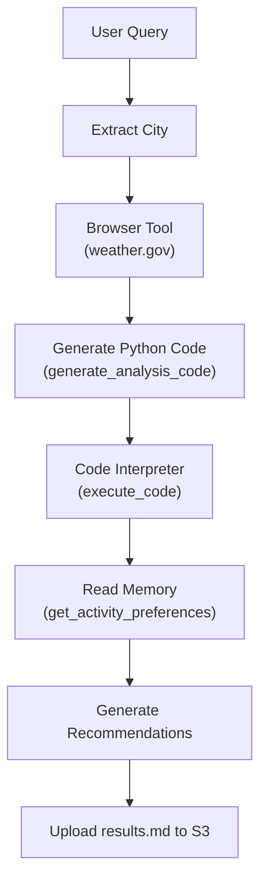
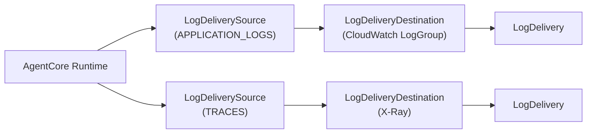

---
---
# Module 4: The full stack - weather agent with tools and memory

**Duration:** ~40 minutes

## What you'll learn

- What AgentCore's managed tools are (Browser, Code Interpreter, Memory) and why they exist
- How to wire multiple tools into a single agent
- How the async task pattern works (return immediately, process in background)
- How to set up observability with CloudWatch vended logs and X-Ray traces
- How the Memory API stores and retrieves structured data

## Key concepts

### AgentCore managed tools

[Amazon Bedrock AgentCore](https://docs.aws.amazon.com/bedrock-agentcore/latest/devguide/what-is-bedrock-agentcore.html) provides three managed tools as first-class AWS resources that your agent connects to at runtime. These are not libraries bundled into your container - Pulumi creates them as standalone resources, and your agent finds them using IDs passed in as environment variables.

**[Browser](https://www.pulumi.com/registry/packages/aws/api-docs/bedrock/agentcorebrowser/)** is a headless Chrome instance running inside AWS. Your agent connects to it via WebSocket using the `BrowserClient` from the AgentCore SDK, then drives it with the `browser-use` library. Because it runs in AWS (not on your laptop), it has consistent network access to public URLs and you don't need to package a browser binary into your container.

**[Code Interpreter](https://www.pulumi.com/registry/packages/aws/api-docs/bedrock/agentcoreinterpreter/)** is a sandboxed Python runtime. Your agent generates Python code, sends it to Code Interpreter via the `CodeInterpreter` client, and gets stdout/stderr back. This is useful for calculations, data transformation, or anything where running code is more reliable than asking the LLM to compute an answer from text alone.

**[Memory](https://www.pulumi.com/registry/packages/aws/api-docs/bedrock/agentcorememory/)** is a persistent event store. You write events with JSON blob payloads tagged with `actorId` and `sessionId`, and read them back later. Events expire after a configurable TTL. In this module the agent uses it to store activity preferences (what to do in good vs. poor weather) that survive between invocations.

### Weather agent workflow

Here is what the agent does end-to-end when you send the query "What should I do this weekend in Richmond VA?":



The entrypoint returns immediately with a "processing started" message while the real work runs as a background async task. This avoids long-running HTTP connections and is the standard pattern for agents with multi-minute workloads.

### Observability pipeline

AgentCore emits vended logs and traces through a delivery pipeline that you configure explicitly:



Unlike regular CloudWatch logs written directly by your code, vended logs go through this three-resource pipeline: source → destination → delivery. You need all three resources for each channel.

## Step 1: Create a new Pulumi project

<div class="lang-tabs" markdown="1">

<div class="lang-tab" data-lang="typescript" markdown="1">

```bash
mkdir 04-weather-agent && cd 04-weather-agent
pulumi new aws-typescript --name weather-agent --yes
```

</div>

<div class="lang-tab" data-lang="python" markdown="1">

```bash
mkdir 04-weather-agent && cd 04-weather-agent
pulumi new aws-python --name weather-agent --yes
```

</div>

</div>

Add the ESC environment to `Pulumi.dev.yaml`:

```yaml
environment:
  - aws-bedrock-workshop/dev
```

The `pulumi new` template already includes the AWS provider. Pin it to the version this workshop uses:

<div class="lang-tabs" markdown="1">

<div class="lang-tab" data-lang="typescript" markdown="1">

```bash
npm install @pulumi/aws@7.23.0
```

</div>

<div class="lang-tab" data-lang="python" markdown="1">

```bash
uv add pulumi-aws>=7.23.0
```

</div>

</div>

Set your unique stack name (replace `<id>` with the identifier you picked in Module 0):

```bash
pulumi config set stackName agentcore-weather-<id>
```

## Step 2: Write the weather agent code

Create the agent source directory:

```bash
mkdir -p agent-code
```

Create `agent-code/weather_agent.py`. This is the full agent - every section is explained below.

### Imports and environment variables

The agent pulls tool IDs and bucket name from environment variables. Missing values raise at startup rather than failing silently at runtime.

```python
from strands import Agent, tool
from strands_tools import use_aws
from typing import Dict, Any
import json
import os
import asyncio
from contextlib import suppress

from bedrock_agentcore.tools.browser_client import BrowserClient
from browser_use import Agent as BrowserAgent
from browser_use.browser.session import BrowserSession
from browser_use.browser import BrowserProfile
from langchain_aws import ChatBedrockConverse
from bedrock_agentcore.tools.code_interpreter_client import CodeInterpreter
from bedrock_agentcore.memory import MemoryClient
from rich.console import Console
import re

from bedrock_agentcore.runtime import BedrockAgentCoreApp

app = BedrockAgentCoreApp()

console = Console()

# Configuration - All required, no defaults
BROWSER_ID = os.getenv("BROWSER_ID")
CODE_INTERPRETER_ID = os.getenv("CODE_INTERPRETER_ID")
MEMORY_ID = os.getenv("MEMORY_ID")
RESULTS_BUCKET = os.getenv("RESULTS_BUCKET")
AWS_REGION = os.getenv("AWS_REGION")

# Validate required environment variables
required_vars = {
    "BROWSER_ID": BROWSER_ID,
    "CODE_INTERPRETER_ID": CODE_INTERPRETER_ID,
    "MEMORY_ID": MEMORY_ID,
    "RESULTS_BUCKET": RESULTS_BUCKET,
    "AWS_REGION": AWS_REGION,
}
missing = [k for k, v in required_vars.items() if not v]
if missing:
    raise EnvironmentError(
        f"Required environment variables not set: {', '.join(missing)}"
    )
```

### Browser tool (get_weather_data)

`initialize_browser_session` connects to the managed Browser resource using `BrowserClient`, gets a WebSocket URL back, and creates a `BrowserSession` that the `browser-use` library drives. A separate Claude Sonnet LLM call handles the browser automation decisions.


```python
# Async helper functions
async def run_browser_task(browser_session, bedrock_chat, task: str) -> str:
    """Run a browser automation task using browser_use"""
    try:
        console.print(f"[blue]🤖 Executing browser task:[/blue] {task[:100]}...")

        agent = BrowserAgent(task=task, llm=bedrock_chat, browser=browser_session)

        result = await agent.run()
        console.print("[green]✅ Browser task completed successfully![/green]")

        if "done" in result.last_action() and "text" in result.last_action()["done"]:
            return result.last_action()["done"]["text"]
        else:
            raise ValueError("NO Data")

    except Exception as e:
        console.print(f"[red]❌ Browser task error: {e}[/red]")
        raise


async def initialize_browser_session():
    """Initialize Browser-use session with AgentCore WebSocket connection"""
    try:
        client = BrowserClient(AWS_REGION)
        client.start(identifier=BROWSER_ID)

        ws_url, headers = client.generate_ws_headers()
        console.print(f"[cyan]🔗 Browser WebSocket URL: {ws_url[:50]}...[/cyan]")

        browser_profile = BrowserProfile(
            headers=headers,
            timeout=150000,
        )

        browser_session = BrowserSession(
            cdp_url=ws_url, browser_profile=browser_profile, keep_alive=True
        )

        console.print("[cyan]🔄 Initializing browser session...[/cyan]")
        await browser_session.start()

        bedrock_chat = ChatBedrockConverse(
            model_id="us.anthropic.claude-sonnet-4-5-20250929-v1:0",
            region_name=AWS_REGION,
        )

        console.print("[green]✅ Browser session initialized and ready[/green]")
        return browser_session, bedrock_chat, client

    except Exception as e:
        console.print(f"[red]❌ Failed to initialize browser session: {e}[/red]")
        raise


# Tools for Strands Agent
@tool
async def get_weather_data(city: str) -> Dict[str, Any]:
    """Get weather data for a city using browser automation"""
    browser_session = None

    try:
        console.print(f"[cyan]🌐 Getting weather data for {city}[/cyan]")

        (
            browser_session,
            bedrock_chat,
            browser_client,
        ) = await initialize_browser_session()

        task = f"""Instruction: Extract 8-Day Weather Forecast for {city} from weather.gov
            Steps:
                - Go to https://weather.gov.
                - Enter "{city}" into the search box and Click on `GO` to execute the search.
                - On the local forecast page, click the "Printable Forecast" link.
                - Wait for the printable forecast page to load completely.
                - For each day in the forecast, extract these fields:
                    - date (format YYYY-MM-DD) 
                    - high (highest temperature)
                    - low (lowest temperature)
                    - conditions (short weather summary, e.g., "Clear")
                    - wind (wind speed as an integer; use mph or km/h as consistent)
                    - precip (precipitation chance or amount, zero if none)
                - Format the extracted data as a JSON array of daily forecast objects, e.g.:
                    ```json
                    [
                    {{
                        "date": "2025-09-17",
                        "high": 78,
                        "low": 62,
                        "conditions": "Clear",
                        "wind": 10,
                        "precip": 80
                    }},
                    {{
                        "date": "2025-09-18",
                        "high": 82,
                        "low": 65,
                        "conditions": "Partly Cloudy",
                        "wind": 10,
                        "precip": 80

                    }}
                    // ... Repeat for each day ...
                    ]```

                - Return only this JSON array as the final output.

            Additional Notes:
                Use null or 0 if any numeric value is missing.
                Avoid scraping ads, navigation, or unrelated page elements.
                If "Printable Forecast" is missing, fallback to the main forecast page.
                Include error handling (e.g., return an empty array if forecast data isn't found).
                Confirm the city name matches the requested location before returning results. 
        """

        result = await run_browser_task(browser_session, bedrock_chat, task)

        if browser_client:
            browser_client.stop()

        return {"status": "success", "content": [{"text": result}]}

    except Exception as e:
        console.print(f"[red]❌ Error getting weather data: {e}[/red]")
        return {
            "status": "error",
            "content": [{"text": f"Error getting weather data: {str(e)}"}],
        }

    finally:
        if browser_session:
            console.print("[yellow]🔌 Closing browser session...[/yellow]")
            with suppress(Exception):
                await browser_session.close()
            console.print("[green]✅ Browser session closed[/green]")
```


### Code generation tool (generate_analysis_code)

This tool uses a nested Strands `Agent` call to generate the classification code. The agent is given the weather data and rules and returns Python code as a string. The `re.search` extracts the code block from the LLM's response.

```python
@tool
def generate_analysis_code(weather_data: str) -> Dict[str, Any]:
    """Generate Python code for weather classification"""
    try:
        query = f"""Create Python code to classify weather days as GOOD/OK/POOR:
        
        Rules: 
        - GOOD: 65-80°F, clear conditions, no rain
        - OK: 55-85°F, partly cloudy, slight rain chance  
        - POOR: <55°F or >85°F, cloudy/rainy
        
        Weather data: 
        {weather_data} 

        Store weather data stored in python variable for using it in python code 

        Return code that outputs list of tuples: [('2025-09-16', 'GOOD'), ('2025-09-17', 'OK'), ...]"""

        agent = Agent()
        result = agent(query)

        pattern = r"```(?:json|python)\n(.*?)\n```"
        match = re.search(pattern, result.message["content"][0]["text"], re.DOTALL)
        python_code = (
            match.group(1).strip() if match else result.message["content"][0]["text"]
        )

        return {"status": "success", "content": [{"text": python_code}]}
    except Exception as e:
        return {"status": "error", "content": [{"text": f"Error: {str(e)}"}]}
```

### Code execution tool (execute_code)

`CodeInterpreter` is the client for the managed Code Interpreter resource. It takes the generated Python code, executes it in a sandboxed runtime, and streams results back.

```python
@tool
def execute_code(python_code: str) -> Dict[str, Any]:
    """Execute Python code using AgentCore Code Interpreter"""
    try:
        code_client = CodeInterpreter(AWS_REGION)
        code_client.start(identifier=CODE_INTERPRETER_ID)

        response = code_client.invoke(
            "executeCode",
            {"code": python_code, "language": "python", "clearContext": True},
        )

        for event in response["stream"]:
            code_execute_result = json.dumps(event["result"])

        analysis_results = json.loads(code_execute_result)
        console.print("Analysis results:", analysis_results)

        return {"status": "success", "content": [{"text": str(analysis_results)}]}

    except Exception as e:
        return {"status": "error", "content": [{"text": f"Error: {str(e)}"}]}
```

### Memory tool (get_activity_preferences)

`MemoryClient.list_events` reads back events previously written to the Memory resource. The `actor_id` and `session_id` must match what the init Lambda used when seeding the preferences.

```python
@tool
def get_activity_preferences() -> Dict[str, Any]:
    """Get activity preferences from memory"""
    try:
        client = MemoryClient(region_name=AWS_REGION)
        response = client.list_events(
            memory_id=MEMORY_ID,
            actor_id="user123",
            session_id="session456",
            max_results=50,
            include_payload=True,
        )

        preferences = (
            response[0]["payload"][0]["blob"] if response else "No preferences found"
        )
        return {"status": "success", "content": [{"text": preferences}]}
    except Exception as e:
        return {"status": "error", "content": [{"text": f"Error: {str(e)}"}]}
```

### Agent creation and system prompt

The system prompt instructs the agent to follow the 7-step workflow in order. The `IMPORTANT` line at the end prevents the agent from asking follow-up questions - essential for a background async task where there is no human waiting to respond.

```python
def create_weather_agent() -> Agent:
    """Create the weather agent with all tools"""
    system_prompt = f"""You are a Weather-Based Activity Planning Assistant.

    When a user asks about activities for a location, follow below stepes Sequentially:
    1. Extract city from user query
    2. Call get_weather_data(city) to get weather information
    3. Call generate_analysis_code(weather_data) to create classification code
    4. Call execute_code(python_code) to get Day Type ( GOOD, OK , POOR ) for forecasting dates. 
    5. Call get_activity_preferences() to get user preferences
    6. Generate Activity Recommendations based on weather and preferences that you have recieved from previous steps
    7. Generate the comprehensive Markdown file (results.md) and store it in S3 Bucket :  {RESULTS_BUCKET} through use_aws tool. 
    
    IMPORTANT: Provide complete recommendations and end your response. Do NOT ask follow-up questions or wait for additional input."""

    return Agent(
        tools=[
            get_weather_data,
            generate_analysis_code,
            execute_code,
            get_activity_preferences,
            use_aws,
        ],
        system_prompt=system_prompt,
        name="WeatherActivityPlanner",
    )
```

### Async entrypoint

The entrypoint returns a "Started" response immediately and fires off the real work as a background task using `asyncio.create_task`. The caller does not wait for the scraping, code execution, or S3 write to finish.

```python
@app.async_task
async def async_main(query=None):
    """Async main function"""
    console.print("🌤️ Weather-Based Activity Planner - Async Version")
    console.print("=" * 30)

    agent = create_weather_agent()

    query = query or "What should I do this weekend in Richmond VA?"
    console.print(f"\n[bold blue]🔍 Query:[/bold blue] {query}")
    console.print("-" * 50)

    try:
        os.environ["BYPASS_TOOL_CONSENT"] = "True"
        result = agent(query)

        return {"status": "completed", "result": result.message["content"][0]["text"]}

    except Exception as e:
        console.print(f"[red]❌ Error: {e}[/red]")
        import traceback

        traceback.print_exc()
        return {"status": "error", "error": str(e)}


@app.entrypoint
async def invoke(payload=None):
    try:
        # change
        query = payload.get("prompt")

        asyncio.create_task(async_main(query))

        msg = (
            "Processing started ... "
            f"You can monitor status in CloudWatch logs at /aws/bedrock-agentcore/runtimes/<agent-runtime-id> ....."
            f"You can see the result at {RESULTS_BUCKET} ...."
        )

        return {"status": "Started", "message": msg}

    except Exception as e:
        return {"error": str(e)}


if __name__ == "__main__":
    app.run()
```

## Step 3: Create requirements.txt and Dockerfile

Create `agent-code/requirements.txt`:

```text
strands-agents
strands-agents-tools
uv
boto3
bedrock-agentcore
bedrock-agentcore-starter-toolkit
browser-use==0.3.2
langchain-aws>=0.1.0
rich
```

Create `agent-code/Dockerfile`:

```dockerfile
FROM public.ecr.aws/docker/library/python:3.11-slim

WORKDIR /app

COPY requirements.txt requirements.txt
RUN pip install --no-cache-dir -r requirements.txt && \
    pip install --no-cache-dir aws-opentelemetry-distro==0.10.1

RUN useradd -m -u 1000 bedrock_agentcore
USER bedrock_agentcore

EXPOSE 8080
EXPOSE 8000

COPY . .

HEALTHCHECK --interval=30s --timeout=3s --start-period=5s --retries=3 \
  CMD curl -f http://localhost:8080/ping || exit 1

CMD ["opentelemetry-instrument", "python", "-m", "weather_agent"]
```

The container runs as a non-root user (`bedrock_agentcore`) because AgentCore requires it. The OpenTelemetry instrumentation wires up distributed tracing automatically.

## Step 4: Create the memory initialization Lambda

The Memory resource starts empty. This Lambda seeds it with activity preferences during deployment so the agent has data to work with from the first invocation.

```bash
mkdir -p lambda/init-memory
```

Create `lambda/init-memory/index.py`:

```python
import json
import logging
from datetime import datetime, timezone

import boto3


LOGGER = logging.getLogger()
LOGGER.setLevel(logging.INFO)


def handler(event, _context):
    LOGGER.info("Received event: %s", json.dumps(event))

    memory_id = event["memoryId"]
    region = event.get("region")

    client = boto3.client("bedrock-agentcore", region_name=region)

    activity_preferences = {
        "good_weather": [
            "hiking",
            "beach volleyball",
            "outdoor picnic",
            "farmers market",
            "gardening",
            "photography",
            "bird watching",
        ],
        "ok_weather": ["walking tours", "outdoor dining", "park visits", "museums"],
        "poor_weather": ["indoor museums", "shopping", "restaurants", "movies"],
    }

    timestamp = datetime.now(timezone.utc).strftime("%Y-%m-%dT%H:%M:%SZ")

    response = client.create_event(
        memoryId=memory_id,
        actorId="user123",
        sessionId="session456",
        eventTimestamp=timestamp,
        payload=[{"blob": json.dumps(activity_preferences)}],
    )

    event_id = response.get("eventId", "unknown")
    LOGGER.info("Memory initialized with event %s", event_id)

    return {
        "memoryId": memory_id,
        "eventId": event_id,
        "status": "initialized",
    }
```

Pulumi invokes this Lambda once after the Memory resource is created. The `actorId` and `sessionId` values here must match those used in the agent's `get_activity_preferences` tool - that's how the agent finds the correct event when it calls `MemoryClient.list_events`.

## Step 5: Create the build trigger Lambda

This Lambda starts a CodeBuild job and polls until it completes, giving Pulumi a synchronous way to wait for the Docker image to be ready before creating the AgentCore Runtime.

```bash
mkdir -p lambda/build-trigger
```

Create `lambda/build-trigger/index.py`:

```python
import json
import logging
import time

import boto3


LOGGER = logging.getLogger()
LOGGER.setLevel(logging.INFO)


def handler(event, _context):
    LOGGER.info("Received event: %s", json.dumps(event))

    project_name = event["projectName"]
    region = event.get("region")
    poll_interval_seconds = int(event.get("pollIntervalSeconds", 15))

    codebuild = boto3.client("codebuild", region_name=region)
    response = codebuild.start_build(projectName=project_name)
    build_id = response["build"]["id"]
    LOGGER.info("Started build %s for project %s", build_id, project_name)

    while True:
        build_response = codebuild.batch_get_builds(ids=[build_id])
        build = build_response["builds"][0]
        status = build["buildStatus"]

        if status == "SUCCEEDED":
            LOGGER.info("Build %s succeeded", build_id)
            return {
                "buildId": build_id,
                "status": status,
                "imageDigest": build.get("resolvedSourceVersion"),
            }

        if status in {"FAILED", "FAULT", "STOPPED", "TIMED_OUT"}:
            LOGGER.error("Build %s failed with status %s", build_id, status)
            raise RuntimeError(f"CodeBuild {build_id} failed with status {status}")

        LOGGER.info("Build %s status: %s", build_id, status)
        time.sleep(poll_interval_seconds)
```

## Step 6: Create the buildspec

Create `buildspec.yml` in the project root:

```yaml
version: 0.2

phases:
  pre_build:
    commands:
      - echo Source code already extracted by CodeBuild
      - cd $CODEBUILD_SRC_DIR
      - echo Logging in to Amazon ECR
      - aws ecr get-login-password --region $AWS_DEFAULT_REGION | docker login --username AWS --password-stdin $AWS_ACCOUNT_ID.dkr.ecr.$AWS_DEFAULT_REGION.amazonaws.com

  build:
    commands:
      - echo Build started on `date`
      - echo Building the Docker image for the weather agent ARM64 image
      - docker build -t $IMAGE_REPO_NAME:$IMAGE_TAG .
      - docker tag $IMAGE_REPO_NAME:$IMAGE_TAG $AWS_ACCOUNT_ID.dkr.ecr.$AWS_DEFAULT_REGION.amazonaws.com/$IMAGE_REPO_NAME:$IMAGE_TAG

  post_build:
    commands:
      - echo Build completed on `date`
      - echo Pushing the Docker image
      - docker push $AWS_ACCOUNT_ID.dkr.ecr.$AWS_DEFAULT_REGION.amazonaws.com/$IMAGE_REPO_NAME:$IMAGE_TAG
      - echo ARM64 Docker image pushed successfully
```

## Step 7: Write the Pulumi infrastructure

Now for the infrastructure. We'll walk through it section by section. Each snippet is a direct excerpt from the solution files.

### Configuration and data sources

<details>
<summary><strong>Want to know more?</strong> - Pulumi Registry</summary>
<p><a href="https://www.pulumi.com/docs/concepts/config/">pulumi.Config</a></p>
</details>

The configuration block defines all tuneable parameters. `stackName` is used as a prefix for every resource name to avoid collisions between workshop participants.

<div class="lang-tabs" markdown="1">

<div class="lang-tab" data-lang="typescript" markdown="1">

```typescript
import * as pulumi from "@pulumi/pulumi";
import * as aws from "@pulumi/aws";
import { createHash } from "crypto";
import * as fs from "fs";
import * as path from "path";

const config = new pulumi.Config();
const agentName = config.get("agentName") || "WeatherAgent";
const memoryName = config.get("memoryName") || "WeatherAgentMemory";
const networkMode = config.get("networkMode") || "PUBLIC";
const imageTag = config.get("imageTag") || "latest";
const stackName = config.get("stackName") || "agentcore-weather";
const description =
  config.get("description") ||
  "End-to-end Weather Agent with AgentCore tools (Browser, Code Interpreter, Memory)";
const ecrRepositoryName = config.get("ecrRepositoryName") || "weather-agent";

const awsConfig = new pulumi.Config("aws");
const awsRegion = awsConfig.require("region");

const currentIdentity = aws.getCallerIdentityOutput({});
const currentRegion = aws.getRegionOutput({});
```

</div>

<div class="lang-tab" data-lang="python" markdown="1">

```python
import hashlib
import json
import os

import pulumi
import pulumi_aws as aws

config = pulumi.Config()
agent_name = config.get("agentName") or "WeatherAgent"
memory_name = config.get("memoryName") or "WeatherAgentMemory"
network_mode = config.get("networkMode") or "PUBLIC"
image_tag = config.get("imageTag") or "latest"
stack_name = config.get("stackName") or "agentcore-weather"
description = (
    config.get("description")
    or "End-to-end Weather Agent with AgentCore tools (Browser, Code Interpreter, Memory)"
)
ecr_repository_name = config.get("ecrRepositoryName") or "weather-agent"

aws_config = pulumi.Config("aws")
aws_region = aws_config.require("region")

current_identity = aws.get_caller_identity_output()
current_region = aws.get_region_output()
```

</div>

</div>

### Browser Tool

<details>
<summary><strong>Want to know more?</strong> - Pulumi Registry</summary>
<p><a href="https://www.pulumi.com/registry/packages/aws/api-docs/bedrock/agentcorebrowser/">aws.bedrock.AgentcoreBrowser</a></p>
</details>

The Browser resource is a standalone AWS resource. `networkMode: "PUBLIC"` means the browser can reach public internet URLs - needed to scrape weather.gov. The resource ID (`browser.browserId` / `browser.browser_id`) is passed to the agent as an environment variable at runtime.

<div class="lang-tabs" markdown="1">

<div class="lang-tab" data-lang="typescript" markdown="1">

```typescript
const browser = new aws.bedrock.AgentcoreBrowser("browser", {
  name: `${stackName.replace(/-/g, "_")}_browser`,
  description: `Browser tool for ${stackName} weather agent to access weather websites`,
  networkConfiguration: {
    networkMode: networkMode,
  },
  tags: {
    Name: `${stackName}-browser-tool`,
    Module: "AgentCore-Tools",
  },
});
```

</div>

<div class="lang-tab" data-lang="python" markdown="1">

```python
browser = aws.bedrock.AgentcoreBrowser(
    "browser",
    name=f"{stack_name.replace('-', '_')}_browser",
    description=f"Browser tool for {stack_name} weather agent to access weather websites",
    network_configuration={"network_mode": network_mode},
    tags={
        "Name": f"{stack_name}-browser-tool",
        "Module": "AgentCore-Tools",
    },
)
```

</div>

</div>

### Code Interpreter Tool

<details>
<summary><strong>Want to know more?</strong> - Pulumi Registry</summary>
<p><a href="https://www.pulumi.com/registry/packages/aws/api-docs/bedrock/agentcoreinterpreter/">aws.bedrock.AgentcoreCodeInterpreter</a></p>
</details>

The Code Interpreter is also a standalone resource. Your agent sends Python code to it via the `CodeInterpreter` client and gets execution results back over a streaming response.

<div class="lang-tabs" markdown="1">

<div class="lang-tab" data-lang="typescript" markdown="1">

```typescript
const codeInterpreter = new aws.bedrock.AgentcoreCodeInterpreter(
  "code_interpreter",
  {
    name: `${stackName.replace(/-/g, "_")}_code_interpreter`,
    description: `Code interpreter tool for ${stackName} weather agent to analyze weather data`,
    networkConfiguration: {
      networkMode: networkMode,
    },
    tags: {
      Name: `${stackName}-code-interpreter-tool`,
      Module: "AgentCore-Tools",
    },
  },
);
```

</div>

<div class="lang-tab" data-lang="python" markdown="1">

```python
code_interpreter = aws.bedrock.AgentcoreCodeInterpreter(
    "code_interpreter",
    name=f"{stack_name.replace('-', '_')}_code_interpreter",
    description=f"Code interpreter tool for {stack_name} weather agent to analyze weather data",
    network_configuration={"network_mode": network_mode},
    tags={
        "Name": f"{stack_name}-code-interpreter-tool",
        "Module": "AgentCore-Tools",
    },
)
```

</div>

</div>

### Memory

<details>
<summary><strong>Want to know more?</strong> - Pulumi Registry</summary>
<p><a href="https://www.pulumi.com/registry/packages/aws/api-docs/bedrock/agentcorememory/">aws.bedrock.AgentcoreMemory</a></p>
</details>

The Memory resource stores events with a 30-day expiry. Events are tagged with actor IDs and session IDs so different users or sessions can have separate preferences.

<div class="lang-tabs" markdown="1">

<div class="lang-tab" data-lang="typescript" markdown="1">

```typescript
const memory = new aws.bedrock.AgentcoreMemory("memory", {
  name: `${stackName.replace(/-/g, "_")}_${memoryName}`,
  description: `Memory for ${stackName} weather agent to maintain conversation context`,
  eventExpiryDuration: 30,
  tags: {
    Name: `${stackName}-memory`,
    Module: "AgentCore-Tools",
  },
});
```

</div>

<div class="lang-tab" data-lang="python" markdown="1">

```python
memory = aws.bedrock.AgentcoreMemory(
    "memory",
    name=f"{stack_name.replace('-', '_')}_{memory_name}",
    description=f"Memory for {stack_name} weather agent to maintain conversation context",
    event_expiry_duration=30,
    tags={
        "Name": f"{stack_name}-memory",
        "Module": "AgentCore-Tools",
    },
)
```

</div>

</div>

### S3 Buckets

<details>
<summary><strong>Want to know more?</strong> - Pulumi Registry</summary>
<p><a href="https://www.pulumi.com/registry/packages/aws/api-docs/s3/bucket/">aws.s3.Bucket</a></p>
</details>

This module needs two buckets: one for agent source code (input to CodeBuild) and one for results (where the agent writes its Markdown report). Both have versioning enabled and all public access blocked.

<div class="lang-tabs" markdown="1">

<div class="lang-tab" data-lang="typescript" markdown="1">

```typescript
const agentSourceBucket = new aws.s3.Bucket("agent_source", {
  bucketPrefix: `${stackName}-source-`,
  forceDestroy: true,
  tags: {
    Name: `${stackName}-agent-source`,
    Purpose: "Store agent source code for CodeBuild",
  },
});

const results = new aws.s3.Bucket("results", {
  bucketPrefix: `${stackName}-results-`,
  forceDestroy: true,
  tags: {
    Name: `${stackName}-results`,
    Purpose: "Store weather agent generated artifacts",
  },
});

new aws.s3.BucketPublicAccessBlock("agent_source", {
  bucket: agentSourceBucket.id,
  blockPublicAcls: true,
  blockPublicPolicy: true,
  ignorePublicAcls: true,
  restrictPublicBuckets: true,
});

new aws.s3.BucketPublicAccessBlock("results", {
  bucket: results.id,
  blockPublicAcls: true,
  blockPublicPolicy: true,
  ignorePublicAcls: true,
  restrictPublicBuckets: true,
});

new aws.s3.BucketVersioning("agent_source", {
  bucket: agentSourceBucket.id,
  versioningConfiguration: {
    status: "Enabled",
  },
});

new aws.s3.BucketVersioning("results", {
  bucket: results.id,
  versioningConfiguration: {
    status: "Enabled",
  },
});
```

</div>

<div class="lang-tab" data-lang="python" markdown="1">

```python
agent_source_bucket = aws.s3.Bucket(
    "agent_source",
    bucket_prefix=f"{stack_name}-source-",
    force_destroy=True,
    tags={
        "Name": f"{stack_name}-agent-source",
        "Purpose": "Store agent source code for CodeBuild",
    },
)

results = aws.s3.Bucket(
    "results",
    bucket_prefix=f"{stack_name}-results-",
    force_destroy=True,
    tags={
        "Name": f"{stack_name}-results",
        "Purpose": "Store weather agent generated artifacts",
    },
)

aws.s3.BucketPublicAccessBlock(
    "agent_source",
    bucket=agent_source_bucket.id,
    block_public_acls=True,
    block_public_policy=True,
    ignore_public_acls=True,
    restrict_public_buckets=True,
)

aws.s3.BucketPublicAccessBlock(
    "results",
    bucket=results.id,
    block_public_acls=True,
    block_public_policy=True,
    ignore_public_acls=True,
    restrict_public_buckets=True,
)

aws.s3.BucketVersioning(
    "agent_source",
    bucket=agent_source_bucket.id,
    versioning_configuration={"status": "Enabled"},
)

aws.s3.BucketVersioning(
    "results",
    bucket=results.id,
    versioning_configuration={"status": "Enabled"},
)
```

</div>

</div>

### Upload source code to S3

Pulumi's `FileArchive` zips the `agent-code` directory at deploy time and uploads it. The object's `versionId` is used later as a trigger to re-run CodeBuild when the source changes.

<div class="lang-tabs" markdown="1">

<div class="lang-tab" data-lang="typescript" markdown="1">

```typescript
const agentSourceObject = new aws.s3.BucketObjectv2("agent_source", {
  bucket: agentSourceBucket.id,
  key: "agent-code.zip",
  source: new pulumi.asset.FileArchive(path.resolve(__dirname, "agent-code")),
  tags: {
    Name: "agent-source-code",
  },
});
```

</div>

<div class="lang-tab" data-lang="python" markdown="1">

```python
agent_source_object = aws.s3.BucketObjectv2(
    "agent_source",
    bucket=agent_source_bucket.id,
    key="agent-code.zip",
    source=pulumi.FileArchive(os.path.join(os.path.dirname(__file__), "agent-code")),
    tags={"Name": "agent-source-code"},
)
```

</div>

</div>

### ECR Repository

<details>
<summary><strong>Want to know more?</strong> - Pulumi Registry</summary>
<p><a href="https://www.pulumi.com/registry/packages/aws/api-docs/ecr/repository/">aws.ecr.Repository</a></p>
</details>

The ECR repository stores the Docker images that CodeBuild produces. The lifecycle policy keeps only the last 5 images to avoid accumulating storage costs.

<div class="lang-tabs" markdown="1">

<div class="lang-tab" data-lang="typescript" markdown="1">

```typescript
const weatherEcr = new aws.ecr.Repository("weather_ecr", {
  name: `${stackName}-${ecrRepositoryName}`,
  imageTagMutability: "MUTABLE",
  imageScanningConfiguration: {
    scanOnPush: true,
  },
  forceDelete: true,
  tags: {
    Name: `${stackName}-ecr-repository`,
    Module: "ECR",
  },
});

new aws.ecr.RepositoryPolicy("weather_ecr", {
  repository: weatherEcr.name,
  policy: pulumi.jsonStringify({
    Version: "2012-10-17",
    Statement: [
      {
        Sid: "AllowPullFromAccount",
        Effect: "Allow",
        Principal: {
          AWS: currentIdentity.apply(
            (id) => `arn:aws:iam::${id.accountId}:root`,
          ),
        },
        Action: ["ecr:BatchGetImage", "ecr:GetDownloadUrlForLayer"],
      },
    ],
  }),
});

new aws.ecr.LifecyclePolicy("weather_ecr", {
  repository: weatherEcr.name,
  policy: JSON.stringify({
    rules: [
      {
        rulePriority: 1,
        description: "Keep last 5 images",
        selection: {
          tagStatus: "any",
          countType: "imageCountMoreThan",
          countNumber: 5,
        },
        action: {
          type: "expire",
        },
      },
    ],
  }),
});
```

</div>

<div class="lang-tab" data-lang="python" markdown="1">

```python
weather_ecr = aws.ecr.Repository(
    "weather_ecr",
    name=f"{stack_name}-{ecr_repository_name}",
    image_tag_mutability="MUTABLE",
    image_scanning_configuration={"scan_on_push": True},
    force_delete=True,
    tags={
        "Name": f"{stack_name}-ecr-repository",
        "Module": "ECR",
    },
)

aws.ecr.RepositoryPolicy(
    "weather_ecr",
    repository=weather_ecr.name,
    policy=pulumi.Output.json_dumps(
        {
            "Version": "2012-10-17",
            "Statement": [
                {
                    "Sid": "AllowPullFromAccount",
                    "Effect": "Allow",
                    "Principal": {
                        "AWS": current_identity.apply(
                            lambda id: f"arn:aws:iam::{id.account_id}:root"
                        ),
                    },
                    "Action": ["ecr:BatchGetImage", "ecr:GetDownloadUrlForLayer"],
                }
            ],
        }
    ),
)

aws.ecr.LifecyclePolicy(
    "weather_ecr",
    repository=weather_ecr.name,
    policy=json.dumps(
        {
            "rules": [
                {
                    "rulePriority": 1,
                    "description": "Keep last 5 images",
                    "selection": {
                        "tagStatus": "any",
                        "countType": "imageCountMoreThan",
                        "countNumber": 5,
                    },
                    "action": {"type": "expire"},
                }
            ]
        }
    ),
)
```

</div>

</div>

### Agent Execution Role

<details>
<summary><strong>Want to know more?</strong> - Pulumi Registry</summary>
<p><a href="https://www.pulumi.com/registry/packages/aws/api-docs/iam/role/">aws.iam.Role</a> &middot; <a href="https://www.pulumi.com/registry/packages/aws/api-docs/iam/rolepolicyattachment/">aws.iam.RolePolicyAttachment</a> &middot; <a href="https://www.pulumi.com/registry/packages/aws/api-docs/iam/rolepolicy/">aws.iam.RolePolicy</a></p>
</details>

The agent execution role is the identity AgentCore uses to run your container. The trust relationship restricts assumption to `bedrock-agentcore.amazonaws.com` from your account only. In addition to ECR, CloudWatch, X-Ray, and Bedrock permissions, this role also has `S3ResultsAccess` so the agent can write the Markdown report to the results bucket.

<div class="lang-tabs" markdown="1">

<div class="lang-tab" data-lang="typescript" markdown="1">

```typescript
const agentExecution = new aws.iam.Role("agent_execution", {
  name: `${stackName}-agent-execution-role`,
  assumeRolePolicy: pulumi.jsonStringify({
    Version: "2012-10-17",
    Statement: [
      {
        Sid: "AssumeRolePolicy",
        Effect: "Allow",
        Principal: {
          Service: "bedrock-agentcore.amazonaws.com",
        },
        Action: "sts:AssumeRole",
        Condition: {
          StringEquals: {
            "aws:SourceAccount": currentIdentity.apply((id) => id.accountId),
          },
          ArnLike: {
            "aws:SourceArn": pulumi
              .all([currentRegion, currentIdentity])
              .apply(
                ([region, identity]) =>
                  `arn:aws:bedrock-agentcore:${region.region}:${identity.accountId}:*`,
              ),
          },
        },
      },
    ],
  }),
  tags: {
    Name: `${stackName}-agent-execution-role`,
    Module: "IAM",
  },
});

const agentExecutionManaged = new aws.iam.RolePolicyAttachment(
  "agent_execution_managed",
  {
    role: agentExecution.name,
    policyArn: "arn:aws:iam::aws:policy/BedrockAgentCoreFullAccess",
  },
);

const agentExecutionRolePolicy = new aws.iam.RolePolicy("agent_execution", {
  name: "AgentCoreExecutionPolicy",
  role: agentExecution.id,
  policy: pulumi.jsonStringify({
    Version: "2012-10-17",
    Statement: [
      {
        Sid: "ECRImageAccess",
        Effect: "Allow",
        Action: [
          "ecr:BatchGetImage",
          "ecr:GetDownloadUrlForLayer",
          "ecr:BatchCheckLayerAvailability",
        ],
        Resource: weatherEcr.arn,
      },
      {
        Sid: "ECRTokenAccess",
        Effect: "Allow",
        Action: ["ecr:GetAuthorizationToken"],
        Resource: "*",
      },
      {
        Sid: "CloudWatchLogs",
        Effect: "Allow",
        Action: [
          "logs:DescribeLogStreams",
          "logs:CreateLogGroup",
          "logs:DescribeLogGroups",
          "logs:CreateLogStream",
          "logs:PutLogEvents",
        ],
        Resource: pulumi
          .all([currentRegion, currentIdentity])
          .apply(
            ([region, identity]) =>
              `arn:aws:logs:${region.region}:${identity.accountId}:log-group:/aws/bedrock-agentcore/runtimes/*`,
          ),
      },
      {
        Sid: "XRayTracing",
        Effect: "Allow",
        Action: [
          "xray:PutTraceSegments",
          "xray:PutTelemetryRecords",
          "xray:GetSamplingRules",
          "xray:GetSamplingTargets",
        ],
        Resource: "*",
      },
      {
        Sid: "CloudWatchMetrics",
        Effect: "Allow",
        Action: ["cloudwatch:PutMetricData"],
        Resource: "*",
        Condition: {
          StringEquals: {
            "cloudwatch:namespace": "bedrock-agentcore",
          },
        },
      },
      {
        Sid: "BedrockModelInvocation",
        Effect: "Allow",
        Action: [
          "bedrock:InvokeModel",
          "bedrock:InvokeModelWithResponseStream",
        ],
        Resource: "*",
      },
      {
        Sid: "GetAgentAccessToken",
        Effect: "Allow",
        Action: [
          "bedrock-agentcore:GetWorkloadAccessToken",
          "bedrock-agentcore:GetWorkloadAccessTokenForJWT",
          "bedrock-agentcore:GetWorkloadAccessTokenForUserId",
        ],
        Resource: [
          pulumi
            .all([currentRegion, currentIdentity])
            .apply(
              ([region, identity]) =>
                `arn:aws:bedrock-agentcore:${region.region}:${identity.accountId}:workload-identity-directory/default`,
            ),
          pulumi
            .all([currentRegion, currentIdentity])
            .apply(
              ([region, identity]) =>
                `arn:aws:bedrock-agentcore:${region.region}:${identity.accountId}:workload-identity-directory/default/workload-identity/*`,
            ),
        ],
      },
      {
        Sid: "S3ResultsAccess",
        Effect: "Allow",
        Action: [
          "s3:PutObject",
          "s3:GetObject",
          "s3:DeleteObject",
          "s3:ListBucket",
        ],
        Resource: [results.arn, pulumi.interpolate`${results.arn}/*`],
      },
    ],
  }),
});
```

</div>

<div class="lang-tab" data-lang="python" markdown="1">

```python
agent_execution = aws.iam.Role(
    "agent_execution",
    name=f"{stack_name}-agent-execution-role",
    assume_role_policy=pulumi.Output.json_dumps(
        {
            "Version": "2012-10-17",
            "Statement": [
                {
                    "Sid": "AssumeRolePolicy",
                    "Effect": "Allow",
                    "Principal": {"Service": "bedrock-agentcore.amazonaws.com"},
                    "Action": "sts:AssumeRole",
                    "Condition": {
                        "StringEquals": {
                            "aws:SourceAccount": current_identity.apply(
                                lambda id: id.account_id
                            ),
                        },
                        "ArnLike": {
                            "aws:SourceArn": pulumi.Output.all(
                                current_region, current_identity
                            ).apply(
                                lambda args: f"arn:aws:bedrock-agentcore:{args[0].region}:{args[1].account_id}:*"
                            ),
                        },
                    },
                }
            ],
        }
    ),
    tags={
        "Name": f"{stack_name}-agent-execution-role",
        "Module": "IAM",
    },
)

agent_execution_managed = aws.iam.RolePolicyAttachment(
    "agent_execution_managed",
    role=agent_execution.name,
    policy_arn="arn:aws:iam::aws:policy/BedrockAgentCoreFullAccess",
)

agent_execution_role_policy = aws.iam.RolePolicy(
    "agent_execution",
    name="AgentCoreExecutionPolicy",
    role=agent_execution.id,
    policy=pulumi.Output.json_dumps(
        {
            "Version": "2012-10-17",
            "Statement": [
                {
                    "Sid": "ECRImageAccess",
                    "Effect": "Allow",
                    "Action": [
                        "ecr:BatchGetImage",
                        "ecr:GetDownloadUrlForLayer",
                        "ecr:BatchCheckLayerAvailability",
                    ],
                    "Resource": weather_ecr.arn,
                },
                {
                    "Sid": "ECRTokenAccess",
                    "Effect": "Allow",
                    "Action": ["ecr:GetAuthorizationToken"],
                    "Resource": "*",
                },
                {
                    "Sid": "CloudWatchLogs",
                    "Effect": "Allow",
                    "Action": [
                        "logs:DescribeLogStreams",
                        "logs:CreateLogGroup",
                        "logs:DescribeLogGroups",
                        "logs:CreateLogStream",
                        "logs:PutLogEvents",
                    ],
                    "Resource": pulumi.Output.all(
                        current_region, current_identity
                    ).apply(
                        lambda args: f"arn:aws:logs:{args[0].region}:{args[1].account_id}:log-group:/aws/bedrock-agentcore/runtimes/*"
                    ),
                },
                {
                    "Sid": "XRayTracing",
                    "Effect": "Allow",
                    "Action": [
                        "xray:PutTraceSegments",
                        "xray:PutTelemetryRecords",
                        "xray:GetSamplingRules",
                        "xray:GetSamplingTargets",
                    ],
                    "Resource": "*",
                },
                {
                    "Sid": "CloudWatchMetrics",
                    "Effect": "Allow",
                    "Action": ["cloudwatch:PutMetricData"],
                    "Resource": "*",
                    "Condition": {
                        "StringEquals": {"cloudwatch:namespace": "bedrock-agentcore"}
                    },
                },
                {
                    "Sid": "BedrockModelInvocation",
                    "Effect": "Allow",
                    "Action": [
                        "bedrock:InvokeModel",
                        "bedrock:InvokeModelWithResponseStream",
                    ],
                    "Resource": "*",
                },
                {
                    "Sid": "GetAgentAccessToken",
                    "Effect": "Allow",
                    "Action": [
                        "bedrock-agentcore:GetWorkloadAccessToken",
                        "bedrock-agentcore:GetWorkloadAccessTokenForJWT",
                        "bedrock-agentcore:GetWorkloadAccessTokenForUserId",
                    ],
                    "Resource": [
                        pulumi.Output.all(current_region, current_identity).apply(
                            lambda args: f"arn:aws:bedrock-agentcore:{args[0].region}:{args[1].account_id}:workload-identity-directory/default"
                        ),
                        pulumi.Output.all(current_region, current_identity).apply(
                            lambda args: f"arn:aws:bedrock-agentcore:{args[0].region}:{args[1].account_id}:workload-identity-directory/default/workload-identity/*"
                        ),
                    ],
                },
                {
                    "Sid": "S3ResultsAccess",
                    "Effect": "Allow",
                    "Action": [
                        "s3:PutObject",
                        "s3:GetObject",
                        "s3:DeleteObject",
                        "s3:ListBucket",
                    ],
                    "Resource": [
                        results.arn,
                        pulumi.Output.concat(results.arn, "/*"),
                    ],
                },
            ],
        }
    ),
)
```

</div>

</div>

### CodeBuild Role and policy

<details>
<summary><strong>Want to know more?</strong> - Pulumi Registry</summary>
<p><a href="https://www.pulumi.com/registry/packages/aws/api-docs/iam/role/">aws.iam.Role</a> &middot; <a href="https://www.pulumi.com/registry/packages/aws/api-docs/iam/rolepolicy/">aws.iam.RolePolicy</a></p>
</details>

CodeBuild needs permissions to write logs, push to ECR, and read source code from S3.

<div class="lang-tabs" markdown="1">

<div class="lang-tab" data-lang="typescript" markdown="1">

```typescript
const codebuildRole = new aws.iam.Role("codebuild", {
  name: `${stackName}-codebuild-role`,
  assumeRolePolicy: JSON.stringify({
    Version: "2012-10-17",
    Statement: [
      {
        Effect: "Allow",
        Principal: {
          Service: "codebuild.amazonaws.com",
        },
        Action: "sts:AssumeRole",
      },
    ],
  }),
  tags: {
    Name: `${stackName}-codebuild-role`,
    Module: "IAM",
  },
});

const codebuildRolePolicy = new aws.iam.RolePolicy("codebuild", {
  name: "CodeBuildPolicy",
  role: codebuildRole.id,
  policy: pulumi.jsonStringify({
    Version: "2012-10-17",
    Statement: [
      {
        Sid: "CloudWatchLogs",
        Effect: "Allow",
        Action: [
          "logs:CreateLogGroup",
          "logs:CreateLogStream",
          "logs:PutLogEvents",
        ],
        Resource: pulumi
          .all([currentRegion, currentIdentity])
          .apply(
            ([region, identity]) =>
              `arn:aws:logs:${region.region}:${identity.accountId}:log-group:/aws/codebuild/*`,
          ),
      },
      {
        Sid: "ECRAccess",
        Effect: "Allow",
        Action: [
          "ecr:BatchCheckLayerAvailability",
          "ecr:GetDownloadUrlForLayer",
          "ecr:BatchGetImage",
          "ecr:GetAuthorizationToken",
          "ecr:PutImage",
          "ecr:InitiateLayerUpload",
          "ecr:UploadLayerPart",
          "ecr:CompleteLayerUpload",
        ],
        Resource: [weatherEcr.arn, "*"],
      },
      {
        Sid: "S3SourceAccess",
        Effect: "Allow",
        Action: ["s3:GetObject", "s3:GetObjectVersion"],
        Resource: pulumi.interpolate`${agentSourceBucket.arn}/*`,
      },
      {
        Sid: "S3BucketAccess",
        Effect: "Allow",
        Action: ["s3:ListBucket", "s3:GetBucketLocation"],
        Resource: agentSourceBucket.arn,
      },
    ],
  }),
});
```

</div>

<div class="lang-tab" data-lang="python" markdown="1">

```python
agent_image_project_name = f"{stack_name}-agent-build"

codebuild_role = aws.iam.Role(
    "codebuild",
    name=f"{stack_name}-codebuild-role",
    assume_role_policy=json.dumps(
        {
            "Version": "2012-10-17",
            "Statement": [
                {
                    "Effect": "Allow",
                    "Principal": {"Service": "codebuild.amazonaws.com"},
                    "Action": "sts:AssumeRole",
                }
            ],
        }
    ),
    tags={
        "Name": f"{stack_name}-codebuild-role",
        "Module": "IAM",
    },
)

codebuild_role_policy = aws.iam.RolePolicy(
    "codebuild",
    name="CodeBuildPolicy",
    role=codebuild_role.id,
    policy=pulumi.Output.json_dumps(
        {
            "Version": "2012-10-17",
            "Statement": [
                {
                    "Sid": "CloudWatchLogs",
                    "Effect": "Allow",
                    "Action": [
                        "logs:CreateLogGroup",
                        "logs:CreateLogStream",
                        "logs:PutLogEvents",
                    ],
                    "Resource": pulumi.Output.all(
                        current_region, current_identity
                    ).apply(
                        lambda args: f"arn:aws:logs:{args[0].region}:{args[1].account_id}:log-group:/aws/codebuild/*"
                    ),
                },
                {
                    "Sid": "ECRAccess",
                    "Effect": "Allow",
                    "Action": [
                        "ecr:BatchCheckLayerAvailability",
                        "ecr:GetDownloadUrlForLayer",
                        "ecr:BatchGetImage",
                        "ecr:GetAuthorizationToken",
                        "ecr:PutImage",
                        "ecr:InitiateLayerUpload",
                        "ecr:UploadLayerPart",
                        "ecr:CompleteLayerUpload",
                    ],
                    "Resource": [weather_ecr.arn, "*"],
                },
                {
                    "Sid": "S3SourceAccess",
                    "Effect": "Allow",
                    "Action": ["s3:GetObject", "s3:GetObjectVersion"],
                    "Resource": pulumi.Output.concat(
                        agent_source_bucket.arn, "/*"
                    ),
                },
                {
                    "Sid": "S3BucketAccess",
                    "Effect": "Allow",
                    "Action": ["s3:ListBucket", "s3:GetBucketLocation"],
                    "Resource": agent_source_bucket.arn,
                },
            ],
        }
    ),
)
```

</div>

</div>

### Build Trigger Lambda

<details>
<summary><strong>Want to know more?</strong> - Pulumi Registry</summary>
<p><a href="https://www.pulumi.com/registry/packages/aws/api-docs/iam/role/">aws.iam.Role</a> &middot; <a href="https://www.pulumi.com/registry/packages/aws/api-docs/iam/rolepolicyattachment/">aws.iam.RolePolicyAttachment</a> &middot; <a href="https://www.pulumi.com/registry/packages/aws/api-docs/lambda/function/">aws.lambda.Function</a></p>
</details>

This Lambda role uses an inline policy scoped exactly to the one CodeBuild project it needs to start and poll. The Lambda timeout is 900 seconds (15 minutes) to accommodate slow builds.

<div class="lang-tabs" markdown="1">

<div class="lang-tab" data-lang="typescript" markdown="1">

```typescript
const agentImageProjectName = `${stackName}-agent-build`;

const buildTriggerRole = new aws.iam.Role("build_trigger", {
  name: `${stackName}-build-trigger-role`,
  assumeRolePolicy: pulumi.jsonStringify({
    Version: "2012-10-17",
    Statement: [
      {
        Effect: "Allow",
        Principal: {
          Service: "lambda.amazonaws.com",
        },
        Action: "sts:AssumeRole",
      },
    ],
  }),
  inlinePolicies: [
    {
      name: "BuildTriggerPolicy",
      policy: pulumi
        .all([currentRegion, currentIdentity])
        .apply(([region, identity]) =>
          JSON.stringify({
            Version: "2012-10-17",
            Statement: [
              {
                Sid: "ManageBuild",
                Effect: "Allow",
                Action: ["codebuild:StartBuild", "codebuild:BatchGetBuilds"],
                Resource: `arn:aws:codebuild:${region.region}:${identity.accountId}:project/${agentImageProjectName}`,
              },
            ],
          }),
        ),
    },
  ],
  tags: {
    Name: `${stackName}-build-trigger-role`,
    Module: "Lambda",
  },
});

const buildTriggerBasicExecution = new aws.iam.RolePolicyAttachment(
  "build_trigger_basic_execution",
  {
    role: buildTriggerRole.name,
    policyArn:
      "arn:aws:iam::aws:policy/service-role/AWSLambdaBasicExecutionRole",
  },
);

const buildTriggerFunction = new aws.lambda.Function("build_trigger", {
  name: `${stackName}-build-trigger`,
  role: buildTriggerRole.arn,
  runtime: aws.lambda.Runtime.Python3d12,
  handler: "index.handler",
  timeout: 900,
  code: new pulumi.asset.FileArchive(
    path.resolve(__dirname, "lambda/build-trigger"),
  ),
  tags: {
    Name: `${stackName}-build-trigger`,
    Module: "Lambda",
  },
});
```

</div>

<div class="lang-tab" data-lang="python" markdown="1">

```python
build_trigger_role = aws.iam.Role(
    "build_trigger",
    name=f"{stack_name}-build-trigger-role",
    assume_role_policy=pulumi.Output.json_dumps(
        {
            "Version": "2012-10-17",
            "Statement": [
                {
                    "Effect": "Allow",
                    "Principal": {"Service": "lambda.amazonaws.com"},
                    "Action": "sts:AssumeRole",
                }
            ],
        }
    ),
    inline_policies=[
        aws.iam.RoleInlinePolicyArgs(
            name="BuildTriggerPolicy",
            policy=pulumi.Output.all(current_region, current_identity).apply(
                lambda args: json.dumps(
                    {
                        "Version": "2012-10-17",
                        "Statement": [
                            {
                                "Sid": "ManageBuild",
                                "Effect": "Allow",
                                "Action": [
                                    "codebuild:StartBuild",
                                    "codebuild:BatchGetBuilds",
                                ],
                                "Resource": f"arn:aws:codebuild:{args[0].region}:{args[1].account_id}:project/{agent_image_project_name}",
                            }
                        ],
                    }
                )
            ),
        )
    ],
    tags={
        "Name": f"{stack_name}-build-trigger-role",
        "Module": "Lambda",
    },
)

build_trigger_basic_execution = aws.iam.RolePolicyAttachment(
    "build_trigger_basic_execution",
    role=build_trigger_role.name,
    policy_arn="arn:aws:iam::aws:policy/service-role/AWSLambdaBasicExecutionRole",
)

build_trigger_function = aws.lambda_.Function(
    "build_trigger",
    name=f"{stack_name}-build-trigger",
    role=build_trigger_role.arn,
    runtime=aws.lambda_.Runtime.PYTHON3D12,
    handler="index.handler",
    timeout=900,
    code=pulumi.FileArchive(
        os.path.join(os.path.dirname(__file__), "lambda/build-trigger")
    ),
    tags={
        "Name": f"{stack_name}-build-trigger",
        "Module": "Lambda",
    },
)
```

</div>

</div>

### CodeBuild Project

<details>
<summary><strong>Want to know more?</strong> - Pulumi Registry</summary>
<p><a href="https://www.pulumi.com/registry/packages/aws/api-docs/codebuild/project/">aws.codebuild.Project</a></p>
</details>

The CodeBuild project uses `ARM_CONTAINER` type with the `amazonlinux2-aarch64-standard:3.0` image to produce native ARM64 Docker images. The buildspec content is read from disk and its SHA-256 fingerprint is used as a trigger for the build Lambda.

<div class="lang-tabs" markdown="1">

<div class="lang-tab" data-lang="typescript" markdown="1">

```typescript
const buildspecContent = fs.readFileSync(
  path.resolve(__dirname, "buildspec.yml"),
  "utf-8",
);
const buildspecFingerprint = createHash("sha256")
  .update(buildspecContent)
  .digest("hex");

const agentImage = new aws.codebuild.Project("agent_image", {
  name: agentImageProjectName,
  description: `Build Weather Agent Docker image for ${stackName}`,
  serviceRole: codebuildRole.arn,
  buildTimeout: 60,
  artifacts: {
    type: "NO_ARTIFACTS",
  },
  environment: {
    computeType: "BUILD_GENERAL1_LARGE",
    image: "aws/codebuild/amazonlinux2-aarch64-standard:3.0",
    type: "ARM_CONTAINER",
    privilegedMode: true,
    imagePullCredentialsType: "CODEBUILD",
    environmentVariables: [
      {
        name: "AWS_DEFAULT_REGION",
        value: currentRegion.apply((r) => r.region),
      },
      {
        name: "AWS_ACCOUNT_ID",
        value: currentIdentity.apply((id) => id.accountId),
      },
      {
        name: "IMAGE_REPO_NAME",
        value: weatherEcr.name,
      },
      {
        name: "IMAGE_TAG",
        value: imageTag,
      },
      {
        name: "STACK_NAME",
        value: stackName,
      },
    ],
  },
  source: {
    type: "S3",
    location: pulumi.interpolate`${agentSourceBucket.id}/${agentSourceObject.key}`,
    buildspec: buildspecContent,
  },
  logsConfig: {
    cloudwatchLogs: {
      groupName: `/aws/codebuild/${agentImageProjectName}`,
    },
  },
  tags: {
    Name: `${stackName}-agent-build`,
    Module: "CodeBuild",
  },
});
```

</div>

<div class="lang-tab" data-lang="python" markdown="1">

```python
buildspec_path = os.path.join(os.path.dirname(__file__), "buildspec.yml")
with open(buildspec_path) as f:
    buildspec_content = f.read()
buildspec_fingerprint = hashlib.sha256(buildspec_content.encode()).hexdigest()

agent_image = aws.codebuild.Project(
    "agent_image",
    name=agent_image_project_name,
    description=f"Build Weather Agent Docker image for {stack_name}",
    service_role=codebuild_role.arn,
    build_timeout=60,
    artifacts={"type": "NO_ARTIFACTS"},
    environment={
        "compute_type": "BUILD_GENERAL1_LARGE",
        "image": "aws/codebuild/amazonlinux2-aarch64-standard:3.0",
        "type": "ARM_CONTAINER",
        "privileged_mode": True,
        "image_pull_credentials_type": "CODEBUILD",
        "environment_variables": [
            {
                "name": "AWS_DEFAULT_REGION",
                "value": current_region.apply(lambda r: r.region),
            },
            {
                "name": "AWS_ACCOUNT_ID",
                "value": current_identity.apply(lambda id: id.account_id),
            },
            {"name": "IMAGE_REPO_NAME", "value": weather_ecr.name},
            {"name": "IMAGE_TAG", "value": image_tag},
            {"name": "STACK_NAME", "value": stack_name},
        ],
    },
    source={
        "type": "S3",
        "location": pulumi.Output.concat(
            agent_source_bucket.id, "/", agent_source_object.key
        ),
        "buildspec": buildspec_content,
    },
    logs_config={
        "cloudwatch_logs": {
            "group_name": f"/aws/codebuild/{agent_image_project_name}",
        }
    },
    tags={
        "Name": f"{stack_name}-agent-build",
        "Module": "CodeBuild",
    },
)
```

</div>

</div>

### Trigger Build

<details>
<summary><strong>Want to know more?</strong> - Pulumi Registry</summary>
<p><a href="https://www.pulumi.com/registry/packages/aws/api-docs/lambda/invocation/">aws.lambda.Invocation</a></p>
</details>

`aws.lambda.Invocation` calls the build trigger Lambda synchronously during deployment. The `triggers` map causes Pulumi to re-invoke it whenever the source version, image tag, or buildspec SHA changes.

<div class="lang-tabs" markdown="1">

<div class="lang-tab" data-lang="typescript" markdown="1">

```typescript
const buildTriggerInvocationInput = pulumi
  .all([agentImage.name, currentRegion])
  .apply(([projectName, region]) =>
    JSON.stringify({
      projectName,
      region: region.region,
      pollIntervalSeconds: 15,
    }),
  );

const triggerBuild = new aws.lambda.Invocation(
  "trigger_build",
  {
    functionName: buildTriggerFunction.name,
    input: buildTriggerInvocationInput,
    triggers: {
      sourceVersion: agentSourceObject.versionId,
      imageTag,
      buildspecSha256: buildspecFingerprint,
    },
  },
  {
    dependsOn: [
      agentImage,
      weatherEcr,
      codebuildRolePolicy,
      agentSourceObject,
      buildTriggerBasicExecution,
      buildTriggerFunction,
    ],
  },
);
```

</div>

<div class="lang-tab" data-lang="python" markdown="1">

```python
build_trigger_invocation_input = pulumi.Output.all(
    agent_image.name, current_region
).apply(
    lambda args: json.dumps(
        {
            "projectName": args[0],
            "region": args[1].region,
            "pollIntervalSeconds": 15,
        }
    )
)

trigger_build = aws.lambda_.Invocation(
    "trigger_build",
    function_name=build_trigger_function.name,
    input=build_trigger_invocation_input,
    triggers={
        "sourceVersion": agent_source_object.version_id,
        "imageTag": image_tag,
        "buildspecSha256": buildspec_fingerprint,
    },
    opts=pulumi.ResourceOptions(
        depends_on=[
            agent_image,
            weather_ecr,
            codebuild_role_policy,
            agent_source_object,
            build_trigger_basic_execution,
            build_trigger_function,
        ]
    ),
)
```

</div>

</div>

### Memory Initialization Lambda

<details>
<summary><strong>Want to know more?</strong> - Pulumi Registry</summary>
<p><a href="https://www.pulumi.com/registry/packages/aws/api-docs/iam/role/">aws.iam.Role</a> &middot; <a href="https://www.pulumi.com/registry/packages/aws/api-docs/iam/rolepolicyattachment/">aws.iam.RolePolicyAttachment</a> &middot; <a href="https://www.pulumi.com/registry/packages/aws/api-docs/lambda/function/">aws.lambda.Function</a> &middot; <a href="https://www.pulumi.com/registry/packages/aws/api-docs/lambda/invocation/">aws.lambda.Invocation</a></p>
</details>

This Lambda's inline policy grants only `bedrock-agentcore:CreateEvent` on the specific Memory resource ARN. Pulumi invokes it once after the Memory is created. The `triggers` map re-invokes it if the memory ID or the Lambda code changes.

<div class="lang-tabs" markdown="1">

<div class="lang-tab" data-lang="typescript" markdown="1">

```typescript
const memoryInitRole = new aws.iam.Role("memory_init", {
  name: `${stackName}-memory-init-role`,
  assumeRolePolicy: pulumi.jsonStringify({
    Version: "2012-10-17",
    Statement: [
      {
        Effect: "Allow",
        Principal: {
          Service: "lambda.amazonaws.com",
        },
        Action: "sts:AssumeRole",
      },
    ],
  }),
  inlinePolicies: [
    {
      name: "MemoryInitPolicy",
      policy: memory.arn.apply((memoryArn) =>
        JSON.stringify({
          Version: "2012-10-17",
          Statement: [
            {
              Sid: "CreateMemoryEvent",
              Effect: "Allow",
              Action: ["bedrock-agentcore:CreateEvent"],
              Resource: memoryArn,
            },
          ],
        }),
      ),
    },
  ],
  tags: {
    Name: `${stackName}-memory-init-role`,
    Module: "Lambda",
  },
});

const memoryInitBasicExecution = new aws.iam.RolePolicyAttachment(
  "memory_init_basic_execution",
  {
    role: memoryInitRole.name,
    policyArn:
      "arn:aws:iam::aws:policy/service-role/AWSLambdaBasicExecutionRole",
  },
);

const memoryInitFunction = new aws.lambda.Function("memory_init", {
  name: `${stackName}-memory-init`,
  role: memoryInitRole.arn,
  runtime: aws.lambda.Runtime.Python3d12,
  handler: "index.handler",
  timeout: 60,
  code: new pulumi.asset.FileArchive(
    path.resolve(__dirname, "lambda/init-memory"),
  ),
  tags: {
    Name: `${stackName}-memory-init`,
    Module: "Lambda",
  },
});

new aws.lambda.Invocation(
  "initialize_memory",
  {
    functionName: memoryInitFunction.name,
    input: pulumi.all([memory.id, currentRegion]).apply(([memoryId, region]) =>
      JSON.stringify({
        memoryId,
        region: region.region,
      }),
    ),
    triggers: {
      memoryId: memory.id,
      lambdaCodeHash: createHash("sha256")
        .update(
          fs.readFileSync(
            path.resolve(__dirname, "lambda/init-memory/index.py"),
            "utf-8",
          ),
        )
        .digest("hex"),
    },
  },
  {
    dependsOn: [memory, memoryInitFunction, memoryInitBasicExecution],
  },
);
```

</div>

<div class="lang-tab" data-lang="python" markdown="1">

```python
memory_init_role = aws.iam.Role(
    "memory_init",
    name=f"{stack_name}-memory-init-role",
    assume_role_policy=pulumi.Output.json_dumps(
        {
            "Version": "2012-10-17",
            "Statement": [
                {
                    "Effect": "Allow",
                    "Principal": {"Service": "lambda.amazonaws.com"},
                    "Action": "sts:AssumeRole",
                }
            ],
        }
    ),
    inline_policies=[
        aws.iam.RoleInlinePolicyArgs(
            name="MemoryInitPolicy",
            policy=memory.arn.apply(
                lambda memory_arn: json.dumps(
                    {
                        "Version": "2012-10-17",
                        "Statement": [
                            {
                                "Sid": "CreateMemoryEvent",
                                "Effect": "Allow",
                                "Action": ["bedrock-agentcore:CreateEvent"],
                                "Resource": memory_arn,
                            }
                        ],
                    }
                )
            ),
        )
    ],
    tags={
        "Name": f"{stack_name}-memory-init-role",
        "Module": "Lambda",
    },
)

memory_init_basic_execution = aws.iam.RolePolicyAttachment(
    "memory_init_basic_execution",
    role=memory_init_role.name,
    policy_arn="arn:aws:iam::aws:policy/service-role/AWSLambdaBasicExecutionRole",
)

memory_init_function = aws.lambda_.Function(
    "memory_init",
    name=f"{stack_name}-memory-init",
    role=memory_init_role.arn,
    runtime=aws.lambda_.Runtime.PYTHON3D12,
    handler="index.handler",
    timeout=60,
    code=pulumi.FileArchive(
        os.path.join(os.path.dirname(__file__), "lambda/init-memory")
    ),
    tags={
        "Name": f"{stack_name}-memory-init",
        "Module": "Lambda",
    },
)

memory_init_lambda_path = os.path.join(
    os.path.dirname(__file__), "lambda/init-memory/index.py"
)
with open(memory_init_lambda_path) as f:
    memory_init_code_content = f.read()
memory_init_code_hash = hashlib.sha256(memory_init_code_content.encode()).hexdigest()

aws.lambda_.Invocation(
    "initialize_memory",
    function_name=memory_init_function.name,
    input=pulumi.Output.all(memory.id, current_region).apply(
        lambda args: json.dumps(
            {
                "memoryId": args[0],
                "region": args[1].region,
            }
        )
    ),
    triggers={
        "memoryId": memory.id,
        "lambdaCodeHash": memory_init_code_hash,
    },
    opts=pulumi.ResourceOptions(
        depends_on=[memory, memory_init_function, memory_init_basic_execution]
    ),
)
```

</div>

</div>

### Weather Agent Runtime

<details>
<summary><strong>Want to know more?</strong> - Pulumi Registry</summary>
<p><a href="https://www.pulumi.com/registry/packages/aws/api-docs/bedrock/agentcoreagentruntime/">aws.bedrock.AgentcoreAgentRuntime</a></p>
</details>

The `environmentVariables` block is how the agent code discovers its tool IDs and results bucket at runtime. `BROWSER_ID`, `CODE_INTERPRETER_ID`, and `MEMORY_ID` are all Pulumi outputs resolved at deploy time. The `dependsOn` list ensures the Docker image exists in ECR and all IAM policies are in place before the runtime is created.

<div class="lang-tabs" markdown="1">

<div class="lang-tab" data-lang="typescript" markdown="1">

```typescript
const runtimeName = `${stackName}_${agentName}`.replace(/-/g, "_");
const sourceHash = agentSourceObject.versionId.apply((v) => v ?? "initial");

const weatherAgent = new aws.bedrock.AgentcoreAgentRuntime(
  "weather_agent",
  {
    agentRuntimeName: runtimeName,
    description: description,
    roleArn: agentExecution.arn,
    agentRuntimeArtifact: {
      containerConfiguration: {
        containerUri: pulumi.interpolate`${weatherEcr.repositoryUrl}:${imageTag}`,
      },
    },
    networkConfiguration: {
      networkMode: networkMode,
    },
    environmentVariables: {
      AWS_REGION: awsRegion,
      AWS_DEFAULT_REGION: awsRegion,
      RESULTS_BUCKET: results.id,
      BROWSER_ID: browser.browserId,
      CODE_INTERPRETER_ID: codeInterpreter.codeInterpreterId,
      MEMORY_ID: memory.id,
      SOURCE_VERSION: sourceHash,
    },
  },
  {
    dependsOn: [
      triggerBuild,
      agentExecutionRolePolicy,
      agentExecutionManaged,
      browser,
      codeInterpreter,
      memory,
    ],
  },
);
```

</div>

<div class="lang-tab" data-lang="python" markdown="1">

```python
runtime_name = f"{stack_name}_{agent_name}".replace("-", "_")

source_hash = agent_source_object.version_id.apply(lambda v: v if v else "initial")

weather_agent = aws.bedrock.AgentcoreAgentRuntime(
    "weather_agent",
    agent_runtime_name=runtime_name,
    description=description,
    role_arn=agent_execution.arn,
    agent_runtime_artifact={
        "container_configuration": {
            "container_uri": pulumi.Output.concat(
                weather_ecr.repository_url, ":", image_tag
            ),
        }
    },
    network_configuration={"network_mode": network_mode},
    environment_variables={
        "AWS_REGION": aws_region,
        "AWS_DEFAULT_REGION": aws_region,
        "RESULTS_BUCKET": results.id,
        "BROWSER_ID": browser.browser_id,
        "CODE_INTERPRETER_ID": code_interpreter.code_interpreter_id,
        "MEMORY_ID": memory.id,
        "SOURCE_VERSION": source_hash,
    },
    opts=pulumi.ResourceOptions(
        depends_on=[
            trigger_build,
            agent_execution_role_policy,
            agent_execution_managed,
            browser,
            code_interpreter,
            memory,
        ]
    ),
)
```

</div>

</div>

### Observability - CloudWatch logs and X-Ray traces

<details>
<summary><strong>Want to know more?</strong> - Pulumi Registry</summary>
<p><a href="https://www.pulumi.com/registry/packages/aws/api-docs/cloudwatch/loggroup/">aws.cloudwatch.LogGroup</a> &middot; <a href="https://www.pulumi.com/registry/packages/aws/api-docs/cloudwatch/logdeliverysource/">aws.cloudwatch.LogDeliverySource</a> &middot; <a href="https://www.pulumi.com/registry/packages/aws/api-docs/cloudwatch/logdeliverydestination/">aws.cloudwatch.LogDeliveryDestination</a> &middot; <a href="https://www.pulumi.com/registry/packages/aws/api-docs/cloudwatch/logdelivery/">aws.cloudwatch.LogDelivery</a></p>
</details>

AgentCore emits logs and traces through the CloudWatch vended logs delivery system. Each channel requires three resources: a `LogDeliverySource` (what to deliver), a `LogDeliveryDestination` (where to send it), and a `LogDelivery` that links the two. Application logs go to a CloudWatch log group; traces go directly to X-Ray.

> **One-time account prerequisite:** the X-Ray trace `LogDelivery` only works if the account's X-Ray **trace segment destination** is set to `CloudWatchLogs`. Otherwise `pulumi up` fails with `ValidationException: X-Ray Delivery Destination is supported with CloudWatch Logs as a Trace Segment Destination`. Run this once per account/region before the first deploy:
>
> ```bash
> aws xray update-trace-segment-destination --destination CloudWatchLogs --region us-east-1
> ```
>
> **Using the workshop-provided AWS account?** Skip this step — the trace segment destination is already configured for you.

<div class="lang-tabs" markdown="1">

<div class="lang-tab" data-lang="typescript" markdown="1">

```typescript
const agentRuntimeLogs = new aws.cloudwatch.LogGroup(
  "agent_runtime_logs",
  {
    name: pulumi.interpolate`/aws/vendedlogs/bedrock-agentcore/${weatherAgent.agentRuntimeId}`,
    retentionInDays: 14,
    tags: {
      Name: `${stackName}-agent-logs`,
      Purpose: "Agent runtime application logs",
      Module: "Observability",
    },
  },
  {
    dependsOn: [weatherAgent],
  },
);

const logs = new aws.cloudwatch.LogDeliverySource(
  "logs",
  {
    name: pulumi.interpolate`${weatherAgent.agentRuntimeId}-logs-src`,
    logType: "APPLICATION_LOGS",
    resourceArn: weatherAgent.agentRuntimeArn,
  },
  {
    dependsOn: [weatherAgent],
  },
);

const logsLogDeliveryDestination = new aws.cloudwatch.LogDeliveryDestination(
  "logs",
  {
    name: pulumi.interpolate`${weatherAgent.agentRuntimeId}-logs-dst`,
    deliveryDestinationConfiguration: {
      destinationResourceArn: agentRuntimeLogs.arn,
    },
    tags: {
      Name: `${stackName}-logs-dst`,
      Module: "Observability",
    },
  },
  {
    dependsOn: [agentRuntimeLogs],
  },
);

const logsLogDelivery = new aws.cloudwatch.LogDelivery(
  "logs",
  {
    deliverySourceName: logs.name,
    deliveryDestinationArn: logsLogDeliveryDestination.arn,
    tags: {
      Name: `${stackName}-logs-delivery`,
      Module: "Observability",
    },
  },
  {
    dependsOn: [logs, logsLogDeliveryDestination],
  },
);

const traces = new aws.cloudwatch.LogDeliverySource(
  "traces",
  {
    name: pulumi.interpolate`${weatherAgent.agentRuntimeId}-traces-src`,
    logType: "TRACES",
    resourceArn: weatherAgent.agentRuntimeArn,
  },
  {
    dependsOn: [weatherAgent],
  },
);

const tracesLogDeliveryDestination = new aws.cloudwatch.LogDeliveryDestination(
  "traces",
  {
    name: pulumi.interpolate`${weatherAgent.agentRuntimeId}-traces-dst`,
    deliveryDestinationType: "XRAY",
    tags: {
      Name: `${stackName}-traces-dst`,
      Module: "Observability",
    },
  },
);

const tracesLogDelivery = new aws.cloudwatch.LogDelivery(
  "traces",
  {
    deliverySourceName: traces.name,
    deliveryDestinationArn: tracesLogDeliveryDestination.arn,
    tags: {
      Name: `${stackName}-traces-delivery`,
      Module: "Observability",
    },
  },
  {
    dependsOn: [traces, tracesLogDeliveryDestination],
  },
);
```

</div>

<div class="lang-tab" data-lang="python" markdown="1">

```python
agent_runtime_logs = aws.cloudwatch.LogGroup(
    "agent_runtime_logs",
    name=pulumi.Output.concat(
        "/aws/vendedlogs/bedrock-agentcore/", weather_agent.agent_runtime_id
    ),
    retention_in_days=14,
    tags={
        "Name": f"{stack_name}-agent-logs",
        "Purpose": "Agent runtime application logs",
        "Module": "Observability",
    },
    opts=pulumi.ResourceOptions(depends_on=[weather_agent]),
)

logs = aws.cloudwatch.LogDeliverySource(
    "logs",
    name=pulumi.Output.concat(weather_agent.agent_runtime_id, "-logs-src"),
    log_type="APPLICATION_LOGS",
    resource_arn=weather_agent.agent_runtime_arn,
    opts=pulumi.ResourceOptions(depends_on=[weather_agent]),
)

logs_log_delivery_destination = aws.cloudwatch.LogDeliveryDestination(
    "logs",
    name=pulumi.Output.concat(weather_agent.agent_runtime_id, "-logs-dst"),
    delivery_destination_configuration={
        "destination_resource_arn": agent_runtime_logs.arn,
    },
    tags={
        "Name": f"{stack_name}-logs-dst",
        "Module": "Observability",
    },
    opts=pulumi.ResourceOptions(depends_on=[agent_runtime_logs]),
)

logs_log_delivery = aws.cloudwatch.LogDelivery(
    "logs",
    delivery_source_name=logs.name,
    delivery_destination_arn=logs_log_delivery_destination.arn,
    tags={
        "Name": f"{stack_name}-logs-delivery",
        "Module": "Observability",
    },
    opts=pulumi.ResourceOptions(depends_on=[logs, logs_log_delivery_destination]),
)

traces = aws.cloudwatch.LogDeliverySource(
    "traces",
    name=pulumi.Output.concat(weather_agent.agent_runtime_id, "-traces-src"),
    log_type="TRACES",
    resource_arn=weather_agent.agent_runtime_arn,
    opts=pulumi.ResourceOptions(depends_on=[weather_agent]),
)

traces_log_delivery_destination = aws.cloudwatch.LogDeliveryDestination(
    "traces",
    name=pulumi.Output.concat(weather_agent.agent_runtime_id, "-traces-dst"),
    delivery_destination_type="XRAY",
    tags={
        "Name": f"{stack_name}-traces-dst",
        "Module": "Observability",
    },
)

traces_log_delivery = aws.cloudwatch.LogDelivery(
    "traces",
    delivery_source_name=traces.name,
    delivery_destination_arn=traces_log_delivery_destination.arn,
    tags={
        "Name": f"{stack_name}-traces-delivery",
        "Module": "Observability",
    },
    opts=pulumi.ResourceOptions(
        depends_on=[traces, traces_log_delivery_destination]
    ),
)
```

</div>

</div>

### Outputs

Export the resource IDs and ARNs that you'll need for testing and monitoring:

<div class="lang-tabs" markdown="1">

<div class="lang-tab" data-lang="typescript" markdown="1">

```typescript
export const agentRuntimeId = weatherAgent.agentRuntimeId;
export const agentRuntimeArn = weatherAgent.agentRuntimeArn;
export const agentRuntimeVersion = weatherAgent.agentRuntimeVersion;
export const agentEcrRepositoryUrl = weatherEcr.repositoryUrl;
export const agentExecutionRoleArn = agentExecution.arn;
export const codebuildProjectName = agentImage.name;
export const sourceBucketName = agentSourceBucket.id;
export const resultsBucketName = results.id;
export const browserId = browser.browserId;
export const browserArn = browser.browserArn;
export const codeInterpreterId = codeInterpreter.codeInterpreterId;
export const codeInterpreterArn = codeInterpreter.codeInterpreterArn;
export const memoryId = memory.id;
export const memoryArn = memory.arn;
export const logGroupName = agentRuntimeLogs.name;
export const logGroupArn = agentRuntimeLogs.arn;
export const logsDeliveryId = logsLogDelivery.id;
export const tracesDeliveryId = tracesLogDelivery.id;
export const testScriptCommand = pulumi.interpolate`python test_weather_agent.py ${weatherAgent.agentRuntimeArn}`;
```

</div>

<div class="lang-tab" data-lang="python" markdown="1">

```python
pulumi.export("agentRuntimeId", weather_agent.agent_runtime_id)
pulumi.export("agentRuntimeArn", weather_agent.agent_runtime_arn)
pulumi.export("agentRuntimeVersion", weather_agent.agent_runtime_version)
pulumi.export("agentEcrRepositoryUrl", weather_ecr.repository_url)
pulumi.export("agentExecutionRoleArn", agent_execution.arn)
pulumi.export("codebuildProjectName", agent_image.name)
pulumi.export("sourceBucketName", agent_source_bucket.id)
pulumi.export("resultsBucketName", results.id)
pulumi.export("browserId", browser.browser_id)
pulumi.export("browserArn", browser.browser_arn)
pulumi.export("codeInterpreterId", code_interpreter.code_interpreter_id)
pulumi.export("codeInterpreterArn", code_interpreter.code_interpreter_arn)
pulumi.export("memoryId", memory.id)
pulumi.export("memoryArn", memory.arn)
pulumi.export("logGroupName", agent_runtime_logs.name)
pulumi.export("logGroupArn", agent_runtime_logs.arn)
pulumi.export("logsDeliveryId", logs_log_delivery.id)
pulumi.export("tracesDeliveryId", traces_log_delivery.id)
pulumi.export(
    "testScriptCommand",
    pulumi.Output.concat(
        "python test_weather_agent.py ", weather_agent.agent_runtime_arn
    ),
)
```

</div>

</div>

## Step 8: Deploy

```bash
pulumi up
```

This takes 5-10 minutes. Pulumi creates the Browser, Code Interpreter, and Memory resources first, then uploads the agent source to S3, triggers CodeBuild to build and push the Docker image, seeds Memory with activity preferences, and finally creates the AgentCore Runtime. You'll see all of these resources appear in the update output.

## Step 9: Test your deployment

Copy `test_weather_agent.py` from the solution folder. The script uses `boto3` to call the AgentCore runtime and to poll S3, so add it to the project first:

<div class="lang-tabs" markdown="1">

<div class="lang-tab" data-lang="typescript" markdown="1">

```bash
pip install boto3
```

</div>

<div class="lang-tab" data-lang="python" markdown="1">

```bash
uv add boto3
```

</div>

</div>

Then run the test:

```bash
export AGENT_ARN=$(pulumi stack output agentRuntimeArn)
python test_weather_agent.py $AGENT_ARN
```

The test script runs through the full pipeline:

1. **Runtime status** - is the AgentCore runtime READY?
2. **Agent invocation** - does the agent accept a request? (first call may take 1-2 min for cold start)
3. **S3 results** - waits for the Markdown report to appear in S3 (3-5 min)

When everything works, you'll see:

```text
[1/3] Checking runtime status...
      PASS - Runtime is READY
[2/3] Invoking agent (first call may take 1-2 min for cold start)...
      PASS - Agent responded: status=Started
[3/3] Waiting for Markdown report in S3...
      (The agent scrapes weather.gov, classifies days,
       reads memory, and writes a report. ~3-5 min.)
      ...1m00s elapsed, still processing
      ...2m30s elapsed, still processing
      PASS - Markdown report found: results.md

      --- Report preview ---
      # Weekend Activity Recommendations for Richmond, VA
      ...

ALL CHECKS PASSED (3/3)
```

The report contains weather forecasts, day classifications (GOOD/OK/POOR), and activity recommendations matched to the preferences stored in Memory.

You can also watch the agent work in real time via CloudWatch Logs:

```bash
export RUNTIME_ID=$(pulumi stack output agentRuntimeId)
aws logs tail "/aws/vendedlogs/bedrock-agentcore/${RUNTIME_ID}" --follow --region us-east-1
```

You'll see each step logged: browser session connecting, weather data scraped, Python code generated and executed, memory read, and the S3 write.

## Try it yourself

**Ask about a different city.** Invoke the agent again with a different location:

```bash
python3 -c "
import boto3, json
from botocore.config import Config
client = boto3.client('bedrock-agentcore', region_name='us-east-1',
    config=Config(read_timeout=180, retries={'max_attempts': 0}))
r = client.invoke_agent_runtime(
    agentRuntimeArn='$(pulumi stack output agentRuntimeArn)',
    qualifier='DEFAULT',
    payload=json.dumps({'prompt': 'What should I do this weekend in Seattle WA?'}),
)
print(json.loads(r['response'].read().decode()))
"
```

Wait a few minutes and check S3 again. The new report should appear in the results bucket.

**Change the activity preferences.** The preferences live in Memory, seeded by the init Lambda. Open `lambda/init-memory/index.py` and change the activity lists - add "surfing" to good weather, or "escape rooms" to poor weather. Redeploy with `pulumi up` to re-seed Memory, then invoke the agent again. The recommendations should reflect your new preferences.

**Tweak the classification thresholds.** Open `agent-code/weather_agent.py` and find the `generate_analysis_code` tool. Edit the classification rules in the prompt (e.g., change the GOOD range from 65-80 to 55-90). Redeploy and see how the day classifications change.

**Read the S3 report as Markdown.** Download the report and view it:

```bash
aws s3 cp s3://$(pulumi stack output resultsBucketName)/results.md - | less
```

## What you learned

- AgentCore's Browser, Code Interpreter, and Memory are managed AWS resources, not libraries bundled into your container
- Tool IDs are discovered as Pulumi outputs and passed to the agent as environment variables at deploy time
- The async task pattern (`asyncio.create_task`) returns immediately and processes work in the background
- CloudWatch vended logs and X-Ray traces require a three-resource delivery pipeline: source, destination, and delivery
- The Memory API stores events tagged with actor IDs and session IDs, with configurable TTL
- A Lambda invocation can seed Memory with initial data during deployment, so the agent has preferences from the very first invocation

Next up: [Module 5 - Housekeeping](05-housekeeping.md)
