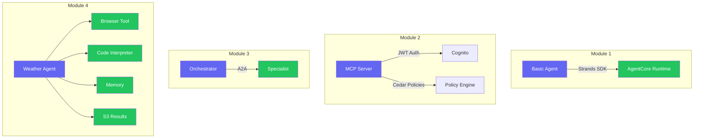

# Deploying AI Agents on AWS with Pulumi and Amazon Bedrock AgentCore

## Workshop details

| | |
|---|---|
| **Duration** | 3 hours (180 minutes) |
| **Format** | Instructor-led, hands-on |
| **Cloud** | AWS (Amazon Bedrock AgentCore) |
| **IaC** | Pulumi (TypeScript) |
| **Agent framework** | Strands SDK (Python) |

## What you'll build

Over three hours you'll go from zero to a production-style multi-tool AI agent running on AWS. Each module adds a new capability on top of the previous one.

You start with a basic agent, add authentication and policy enforcement, wire up multi-agent orchestration, and finish with a weather agent that browses the web, runs Python code, remembers user preferences, and writes reports to S3.

## Speakers

| Name | Role | Company |
|------|------|---------|
| Engin Diri | Senior Solutions Architect | Pulumi |
| Adam Gordon Bell | Community Engineer | Pulumi |

## Prerequisites

- Laptop with internet access
- AWS account with Bedrock model access enabled (provided for the workshop)
- [Pulumi account](https://app.pulumi.com/signup) (free tier works)
- GitHub account
- Node.js 18+ and Python 3.11+ installed
- Python packages for testing: `pip install boto3 mcp`
- Basic terminal familiarity

We recommend **GitHub Codespaces** for a zero-install experience. Click the badge above or go to **Code > Codespaces > Create codespace on main**.

| Machine type | Cores | RAM | Recommended |
|-------------|-------|-----|-------------|
| Standard | 4-core | 16 GB | Yes |

## Workshop content

| # | Module | Duration |
|---|--------|----------|
| 00 | [Setup and orientation](00-setup-and-orientation.md) | 15 min |
| 01 | [Your first agent on AgentCore](01-your-first-agent.md) | 30 min |
| 02 | [Hosting an MCP server with JWT auth](02-mcp-server-jwt-auth.md) | 45 min |
| 03 | [Multi-agent orchestration](03-multi-agent-orchestration.md) | 40 min |
| 04 | [The full stack: weather agent with tools and memory](04-full-stack-weather-agent.md) | 40 min |
| 05 | [Cleanup](05-housekeeping.md) | 10 min |
| | **Total** | **180 min** |

## Troubleshooting

**`pulumi up` hangs during CodeBuild**: The first build takes 5-10 minutes while Docker images are built and pushed to ECR. This is normal.

**AWS credentials expired**: Run `pulumi env open pulumi-idp/auth` to refresh your OIDC token, then retry.

**Agent invocation returns 500**: Check CloudWatch Logs at `/aws/bedrock-agentcore/runtimes/` for your runtime. Common causes are missing IAM permissions or environment variables.

**CodeBuild fails**: Check the build logs in the AWS Console under CodeBuild > Build projects. The most common issue is ECR permission errors during docker push.

**Weather agent test hangs**: The first invocation triggers a cold start (1-2 min). The test script handles this. If it times out, run it again.

## Want to know more?

- [Pulumi Documentation](https://www.pulumi.com/docs/)
- [Pulumi AI & MCP](https://www.pulumi.com/blog/pulumi-mcp-server/)
- [Amazon Bedrock AgentCore](https://docs.aws.amazon.com/bedrock-agentcore/latest/devguide/)
- [Strands Agents SDK](https://github.com/strands-agents/sdk-python)
- [Model Context Protocol](https://modelcontextprotocol.io/)
- [Pulumi Community Slack](https://slack.pulumi.com)
