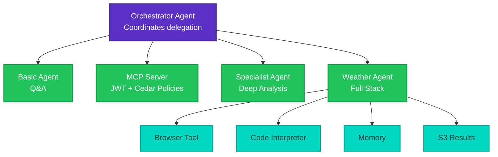

Welcome to the Deploying AI Agents on AWS workshop.

In this hands-on workshop, you'll learn how to build, deploy, and connect AI agents on AWS using Pulumi and Amazon Bedrock AgentCore. By the end, you'll have a multi-tool agent that browses the web, runs Python code, remembers user preferences, and writes reports to S3.

## What you'll build

Your agents will deploy as containerized services on AgentCore Runtime, authenticate with JWT tokens via Cognito, enforce access control with Cedar policies, and communicate agent-to-agent using IAM-scoped invocations.

## Workshop chapters

| Chapter | Title | Duration |
|---------|-------|----------|
| [00](00-setup-and-orientation.md) | Setup and orientation | 15 min |
| [01](01-your-first-agent.md) | Your first agent on AgentCore | 30 min |
| [02](02-mcp-server-jwt-auth.md) | Hosting an MCP server behind an AgentCore Gateway | 45 min |
| [03](03-multi-agent-orchestration.md) | Multi-agent orchestration | 40 min |
| [04](04-full-stack-weather-agent.md) | The full stack: weather agent with tools and memory | 40 min |
| [05](05-housekeeping.md) | Cleanup | 10 min |
| | **Total** | **180 min** |

## Prerequisites

- Laptop with internet access
- AWS account with Bedrock model access enabled (provided for the workshop)
- [Pulumi account](https://app.pulumi.com/signup) (free tier works)
- GitHub account
- **TypeScript path**: Node.js 18+ installed
- **Python path**: Python 3.11+ and [uv](https://docs.astral.sh/uv/) installed
- Python 3.11+ for agent code and testing (both paths): `pip install boto3 mcp`
- Basic terminal familiarity

We recommend **GitHub Codespaces** for a zero-install experience. Click the badge at the top of this page.

| Machine type | Cores | RAM | Recommended |
|-------------|-------|-----|-------------|
| Standard | 4-core | 16 GB | Yes |

## Troubleshooting

**`pulumi up` hangs during CodeBuild**: The first build takes 5-10 minutes while Docker images are built and pushed to ECR. This is normal.

**AWS credentials expired**: Run `pulumi env open aws-bedrock-workshop/dev` to verify your credentials are configured correctly, then retry.

**Agent invocation returns 500**: Check CloudWatch Logs at `/aws/bedrock-agentcore/runtimes/` for your runtime. Common causes are missing IAM permissions or environment variables.

**CodeBuild fails**: Check the build logs in the AWS Console under CodeBuild > Build projects. The most common issue is ECR permission errors during docker push.

**Weather agent test hangs**: The first invocation triggers a cold start (1-2 min). The test script handles this. If it times out, run it again.

## Want to know more?

- [Pulumi Documentation](https://www.pulumi.com/docs/)
- [Pulumi AI & MCP](https://www.pulumi.com/blog/pulumi-mcp-server/)
- [Amazon Bedrock AgentCore](https://docs.aws.amazon.com/bedrock-agentcore/latest/devguide/)
- [Strands Agents SDK](https://github.com/strands-agents/sdk-python)
- [Model Context Protocol](https://modelcontextprotocol.io/)
- [Pulumi Community Slack](https://slack.pulumi.com)
