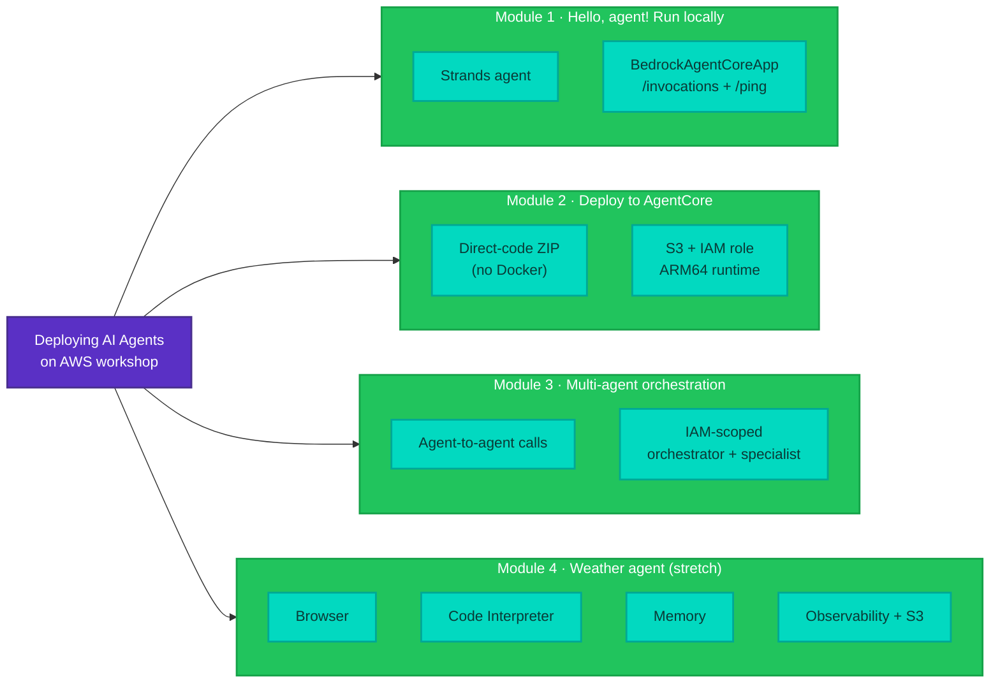

Welcome to the Deploying AI Agents on AWS workshop.

In this hands-on workshop, you'll build, deploy, and connect AI agents on AWS using Pulumi and Amazon Bedrock AgentCore. You start by running an agent on your own laptop, deploy that same agent to the cloud, then have agents call each other. If you take the stretch goal, you'll also build an agent that browses the web, runs Python, and remembers what you tell it.

## What you'll build

You'll start by running an agent locally, then deploy it to AgentCore Runtime with Pulumi. From there you'll have agents communicate agent-to-agent using IAM (Identity and Access Management)-scoped invocations, and finish with a full-stack agent that wires in Browser, Code Interpreter, and Memory tools.

## Workshop chapters

| Chapter | Title | Duration |
|---------|-------|----------|
| [00](00-setup-and-orientation.md) | Setup, orientation and intro | 20 min |
| [01](01-hello-agent.md) | Hello, agent! Run locally | 30 min |
| [02](02-your-first-agent.md) | Your first agent on AgentCore | 30 min |
| [03](03-multi-agent-orchestration.md) | Multi-agent orchestration | 40 min |
| [04](04-full-stack-weather-agent.md) | The full stack: weather agent with tools and memory _(Stretch goal)_ | 40 min |
| [05](05-housekeeping.md) | Cleanup | 10 min |
| | **Core path** | **130 min** |
| | **With stretch goal** | **170 min** |

New to the terminology? The [Glossary](glossary.md) lists every acronym used in the workshop.

## Prerequisites

- Laptop with internet access
- AWS account with Bedrock model access enabled (provided for the workshop)
- [Pulumi account](https://app.pulumi.com/signup) (free tier works)
- GitHub account
- **TypeScript path**: Node.js 18+ installed
- **Python path**: Python 3.11+ and [uv](https://docs.astral.sh/uv/) installed
- Python 3.11+ for agent code and testing (both paths): `pip install boto3`
- Basic terminal familiarity

We recommend **GitHub Codespaces** for a zero-install experience. Click the badge at the top of this page.

| Machine type | Cores | RAM | Recommended |
|-------------|-------|-----|-------------|
| Standard | 4-core | 16 GB | Yes |

### Core path vs. stretch goals

The workshop fits the time slot if you stick to the **core path**: Modules 0, 1, 2, 3, and 5. Module 4 is a **stretch goal**, extra material for anyone who races through the core and wants more:

- **Module 4 _(Stretch goal)_**: Full-stack weather agent with Browser, Code Interpreter, and Memory tools

The stretch module is its own Pulumi stack, so skipping it doesn't break anything later. You can always come back to it after the workshop.

## Troubleshooting

**`pulumi up` hangs during CodeBuild**: The first build takes 5-10 minutes while Docker images are built and pushed to ECR (Elastic Container Registry). This is normal.

**AWS credentials expired**: Run `pulumi env open aws-bedrock-workshop/dev` to verify your credentials are configured correctly, then retry.

**Agent invocation returns 500**: Check CloudWatch Logs at `/aws/bedrock-agentcore/runtimes/` for your runtime. Common causes are missing IAM permissions or environment variables.

**CodeBuild fails**: Check the build logs in the AWS Console under CodeBuild > Build projects. The most common issue is ECR permission errors during docker push.

**Weather agent test hangs**: The first invocation triggers a cold start (1-2 min). The test script handles this. If it times out, run it again.

## Want to know more?

- [Pulumi Documentation](https://www.pulumi.com/docs/)
- [Pulumi AI & MCP](https://www.pulumi.com/blog/pulumi-mcp-server/)
- [Amazon Bedrock AgentCore](https://docs.aws.amazon.com/bedrock-agentcore/latest/devguide/)
- [Strands Agents SDK](https://github.com/strands-agents/sdk-python)
- [Model Context Protocol](https://modelcontextprotocol.io/)
- [Pulumi Community Slack](https://slack.pulumi.com)
